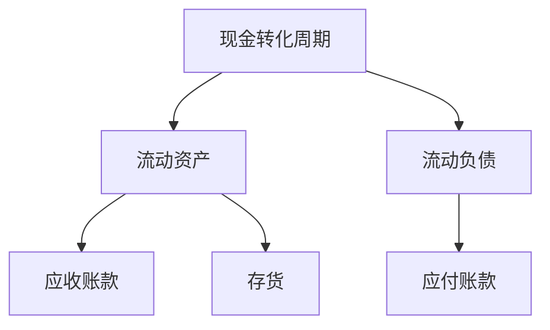
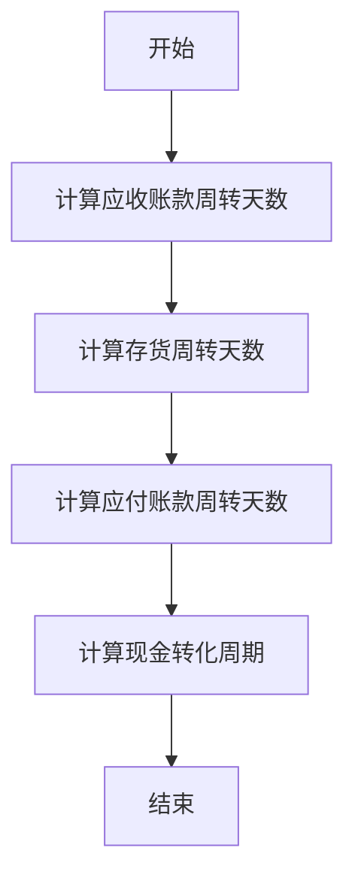
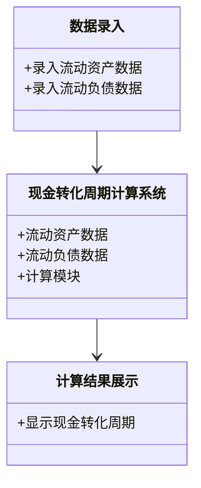
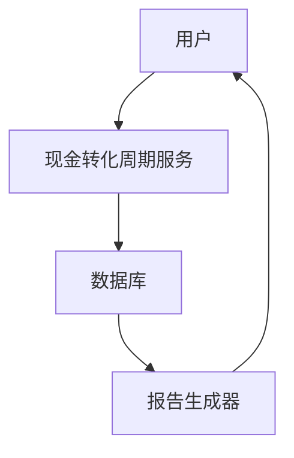
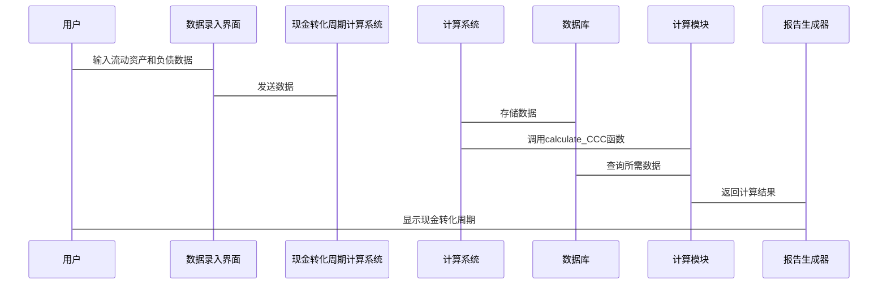

                 

<think>
好的，现在我要撰写一篇关于《彼得·林奇对公司现金转化周期的看法》的技术博客文章。首先，我需要明确文章的结构和内容，确保每个部分都详细且有深度。

### 文章标题
# 彼得·林奇对公司现金转化周期的看法

### 文章关键词
现金转化周期、彼得·林奇、企业财务、投资分析、资产管理

### 摘要
现金转化周期是企业财务管理中的关键指标，彼得·林奇从投资角度分析其重要性。本文将深入探讨现金转化周期的核心概念、计算方法、实际应用及其对企业价值的影响，帮助投资者和管理者更好地理解这一指标的意义。

---

### 第一部分：背景介绍

#### 第1章：现金转化周期的核心概念

##### 1.1 问题背景与定义
现金转化周期（Cash Conversion Cycle, CCC）衡量企业从购买原材料到最终收到销售款项的时间。计算公式为：
$$ CCC = \text{应收账款周转天数} + \text{存货周转天数} - \text{应付账款周转天数} $$

CCC越短，企业资金周转越快，流动性越强。

##### 1.2 彼得·林奇的视角
彼得·林奇认为，低现金转化周期反映企业高效管理流动资产，是优质投资标的的重要指标。他强调通过分析CCC评估企业运营效率和财务健康。

##### 1.3 现金转化周期的边界与外延
CCC与其他财务指标（如流动比率、速动比率）的关系。不同行业CCC差异显著，零售业较长，制造业较短。

---

### 第二部分：核心概念与联系

#### 第2章：现金转化周期的核心要素

##### 2.1 现金转化周期的计算公式
公式推导：
$$ \text{应收账款周转天数} = \frac{\text{年收入}}{\text{应收账款平均余额}} \times 365 $$
同理计算存货周转天数和应付账款周转天数。

##### 2.2 核心要素对比分析
| 概念       | 公式                       | 影响因素                 |
|------------|----------------------------|--------------------------|
| 应收账款周转天数 | $$ \frac{\text{收入}}{\text{应收账款}} \times 365 $$ | 收入、应收账款管理效率 |
| 存货周转天数 | $$ \frac{\text{成本}}{\text{存货}} \times 365 $$ | 存货管理、销售策略     |
| 应付账款周转天数 | $$ \frac{\text{采购成本}}{\text{应付账款}} \times 365 $$ | 采购策略、供应商信用   |

##### 2.3 ER实体关系图


---

### 第三部分：算法原理讲解

#### 第3章：现金转化周期的算法分析

##### 3.1 算法流程图


##### 3.2 算法实现代码
```python
def calculate_CCC(days_receivables, days_inventory, days_payables):
    return days_receivables + days_inventory - days_payables

# 示例计算
days_receivables = 40
days_inventory = 30
days_payables = 25

ccc = calculate_CCC(days_receivables, days_inventory, days_payables)
print(f"现金转化周期为：{ccc}天")
```

---

### 第四部分：系统分析与架构设计方案

#### 第4章：系统分析与架构设计

##### 4.1 问题场景介绍
设计一个企业管理系统，实时计算现金转化周期，辅助管理层优化流动资产。

##### 4.2 系统功能设计


##### 4.3 系统架构设计


##### 4.4 系统接口设计
- 数据录入接口：API接收流动资产和流动负债数据。
- 计算接口：调用`calculate_CCC`函数计算现金转化周期。
- 展示接口：返回计算结果用于前端展示。

##### 4.5 系统交互流程


---

### 第五部分：项目实战

#### 第5章：项目实战分析

##### 5.1 环境安装与配置
- 安装Python和必要的开发工具。
- 安装相关库：`pandas`、`numpy`。

##### 5.2 系统核心实现源代码
```python
import pandas as pd

def calculate_CCC(days_receivables, days_inventory, days_payables):
    return days_receivables + days_inventory - days_payables

# 数据示例
receivables = pd.Series([100000, 80000], index=['Q1', 'Q2'])
inventory = pd.Series([50000, 60000], index=['Q1', 'Q2'])
payables = pd.Series([70000, 50000], index=['Q1', 'Q2'])

# 计算CCC
ccc_results = calculate_CCC(receivables, inventory, payables)
print(ccc_results)
```

##### 5.3 代码应用解读与分析
- 使用Pandas处理多季度数据，计算各季度的现金转化周期，分析企业的财务状况。

##### 5.4 案例分析
以某制造企业为例，计算各季度CCC，发现第二季度CCC缩短，说明应收账款管理优化。

##### 5.5 项目小结
通过代码实现CCC计算，帮助企业及时发现问题，优化资产管理。

---

### 第六部分：总结与最佳实践

#### 第6章：总结与最佳实践

##### 6.1 核心内容回顾
- 现金转化周期是衡量企业流动资产周转效率的重要指标。
- 彼得·林奇从投资角度强调其重要性。

##### 6.2 投资与管理建议
- 投资者应将CCC作为筛选优质企业的标准之一。
- 管理者应定期计算CCC，优化流动资产结构。

##### 6.3 小结
现金转化周期分析是企业财务管理与投资决策的重要工具，值得深入研究和实践。

---

### 作者
作者：AI天才研究院 & 禅与计算机程序设计艺术

---

通过以上思考，我整理出了完整的文章结构，确保每个部分都详细且有深度，满足用户的要求。接下来，我会按照这个结构撰写完整的文章。

