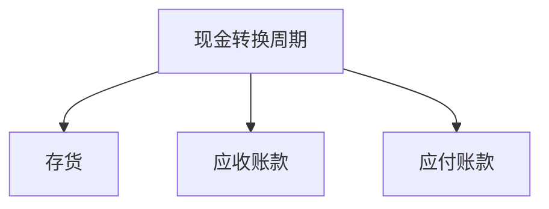
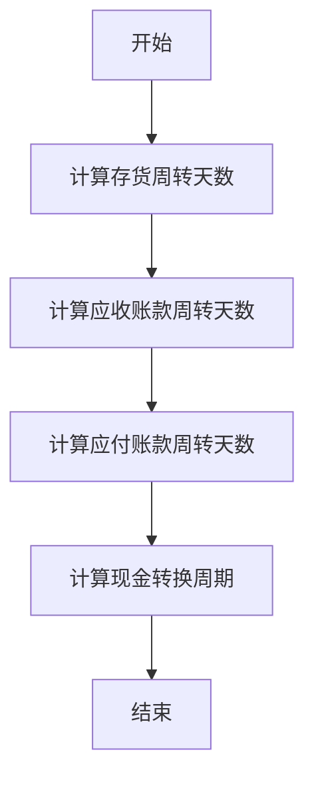
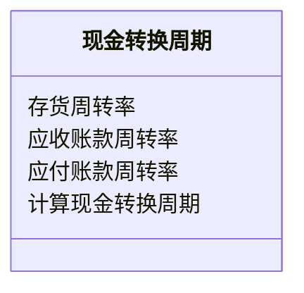
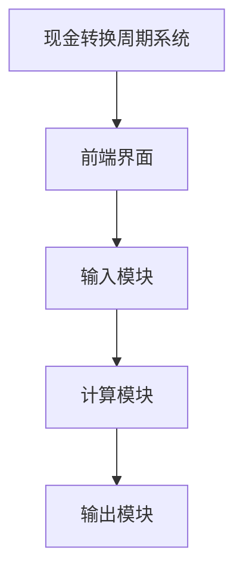
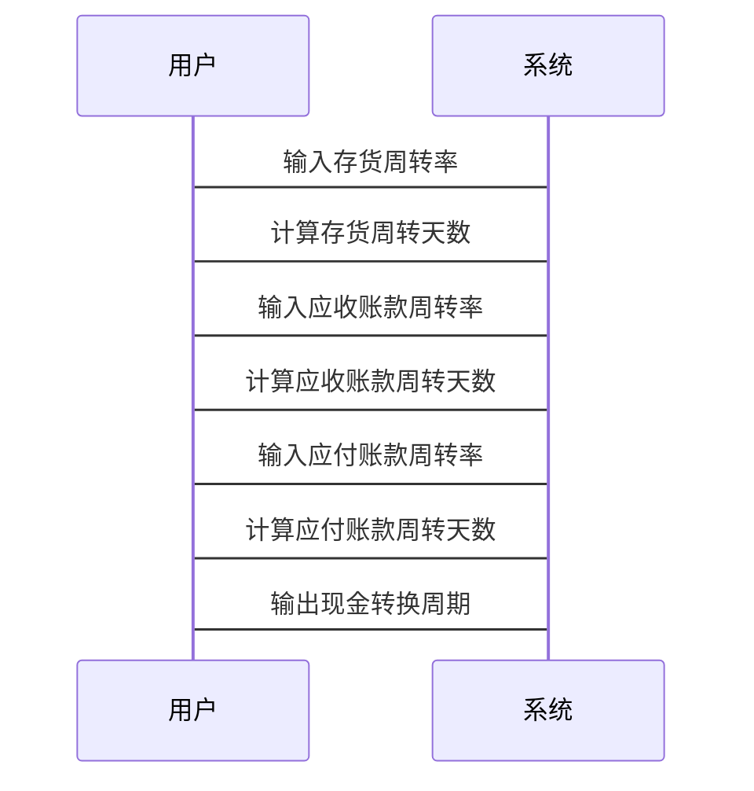

                 


# 彼得林奇对公司现金转换周期的分析

## 关键词
- 现金转换周期
- 彼得·林奇
- 投资分析
- 财务指标
- 企业运营

## 摘要
本文详细分析了彼得·林奇对公司现金转换周期的分析方法及其在投资决策中的应用。通过定义现金转换周期的核心概念，探讨其与存货周转率、应收账款周转率和应付账款周转率的关系，结合数学模型和实际案例，深入解读现金转换周期对企业财务健康和投资价值的影响。文章还提供了详细的公式推导、系统架构设计和项目实战案例，帮助读者全面理解并掌握这一关键财务指标的分析方法。

---

# 第1章: 现金转换周期的背景与概念

## 1.1 现金转换周期的定义与背景
### 1.1.1 现金转换周期的基本概念
现金转换周期（Cash Conversion Cycle, CCC）是衡量企业将原材料转换为最终产品并收回现金所需的时间。它是企业运营效率的重要指标，反映了企业在生产、销售和收款过程中的资金流动性。

### 1.1.2 现金转换周期在企业运营中的重要性
现金转换周期越短，企业的资金周转效率越高，盈利能力越强。短周期意味着企业能够更快地将投入转化为收入，减少资金占用，降低财务风险。

### 1.1.3 彼得·林奇对现金转换周期的关注
彼得·林奇在其投资分析中，特别关注企业的现金转换周期。他认为，一个高效的现金转换周期是企业盈利的关键因素之一，能够帮助投资者识别企业的运营效率和管理能力。

## 1.2 现金转换周期的核心要素
### 1.2.1 存货周转率的计算与影响
存货周转率 = 销售成本 / 平均存货
存货周转天数 = 365 / 存货周转率

### 1.2.2 应收账款周转率的分析
应收账款周转率 = 销售收入 / 平均应收账款
应收账款周转天数 = 365 / 应收账款周转率

### 1.2.3 应付账款周转率的作用
应付账款周转率 = 采购成本 / 平均应付账款
应付账款周转天数 = 365 / 应付账款周转率

## 1.3 现金转换周期与企业利润的关系
### 1.3.1 现金转换周期对企业利润率的影响
现金转换周期与企业利润率呈负相关关系。短周期意味着企业能够更快地收回资金，降低库存成本，从而提高利润率。

### 1.3.2 高效率现金转换周期的特征
高效率的现金转换周期表现为存货周转快、应收账款周转率高、应付账款周转率合理。

### 1.3.3 低效率现金转换周期的后果
低效率的现金转换周期会导致资金积压、库存膨胀、应收账款过多，增加企业的财务负担，降低盈利能力。

## 1.4 彼得·林奇的现金转换周期分析方法
### 1.4.1 林奇的现金转换周期公式
现金转换周期 = 存货周转天数 + 应收账款周转天数 - 应付账款周转天数

### 1.4.2 林奇分析方法的核心思想
林奇认为，现金转换周期越短，企业的资金利用效率越高，投资价值越大。

### 1.4.3 林奇分析方法的实际应用案例
通过具体案例分析，展示如何使用林奇的现金转换周期公式评估企业的运营效率。

## 1.5 本章小结
本章详细介绍了现金转换周期的定义、核心要素及其与企业利润的关系，重点阐述了彼得·林奇的分析方法，并通过实际案例进行了说明。

---

# 第2章: 现金转换周期的核心概念与联系

## 2.1 现金转换周期的属性特征对比
### 2.1.1 现金转换周期与存货周转率的对比
| 指标 | 存货周转率 | 现金转换周期 |
|------|------------|--------------|
| 定义 | 存货的销售速度 | 整个现金转换过程所需的时间 |
| 影响 | 企业的库存管理效率 | 企业的资金周转效率 |

### 2.1.2 现金转换周期与应收账款周转率的对比
| 指标 | 应收账款周转率 | 现金转换周期 |
|------|--------------|--------------|
| 定义 | 应收账款的回收速度 | 整个现金转换过程所需的时间 |
| 影响 | 企业的收款效率 | 企业的资金周转效率 |

### 2.1.3 现金转换周期与应付账款周转率的对比
| 指标 | 应付账款周转率 | 现金转换周期 |
|------|--------------|--------------|
| 定义 | 应付账款的支付速度 | 整个现金转换过程所需的时间 |
| 影响 | 企业的付款效率 | 企业的资金周转效率 |

## 2.2 现金转换周期的ER实体关系图
```mermaid
entity 现金转换周期
entity 存货
entity 应收账款
entity 应付账款
```

## 2.3 现金转换周期的数学模型与公式
### 2.3.1 现金转换周期的计算公式
$$ \text{现金转换周期} = \text{存货周转天数} + \text{应收账款周转天数} - \text{应付账款周转天数} $$

### 2.3.2 存货周转天数的计算
$$ \text{存货周转天数} = \frac{365}{\text{存货周转率}} $$

### 2.3.3 应收账款周转天数的计算
$$ \text{应收账款周转天数} = \frac{365}{\text{应收账款周转率}} $$

### 2.3.4 应付账款周转天数的计算
$$ \text{应付账款周转天数} = \frac{365}{\text{应付账款周转率}} $$

## 2.4 现金转换周期的系统架构图


## 2.5 现金转换周期的流程图


---

# 第3章: 现金转换周期的算法原理

## 3.1 现金转换周期的计算算法
### 3.1.1 算法输入
- 存货周转率
- 应收账款周转率
- 应付账款周转率

### 3.1.2 算法步骤
1. 计算存货周转天数：365 / 存货周转率
2. 计算应收账款周转天数：365 / 应收账款周转率
3. 计算应付账款周转天数：365 / 应付账款周转率
4. 现金转换周期 = 存货周转天数 + 应收账款周转天数 - 应付账款周转天数

### 3.1.3 算法输出
- 现金转换周期

## 3.2 现金转换周期的优化算法
### 3.2.1 优化目标
缩短现金转换周期，提高资金周转效率。

### 3.2.2 优化策略
- 提高存货周转率
- 加快应收账款回收速度
- 延长应付账款支付周期

## 3.3 现金转换周期的数学模型
### 3.3.1 基本模型
$$ \text{CCC} = \frac{365}{\text{存货周转率}} + \frac{365}{\text{应收账款周转率}} - \frac{365}{\text{应付账款周转率}} $$

### 3.3.2 优化模型
$$ \text{CCC}_{\text{优化}} = \frac{365}{\text{存货周转率}_{\text{优化}}} + \frac{365}{\text{应收账款周转率}_{\text{优化}}} - \frac{365}{\text{应付账款周转率}_{\text{优化}}} $$

## 3.4 现金转换周期的算法流程图


---

# 第4章: 现金转换周期的系统分析

## 4.1 系统功能设计
### 4.1.1 领域模型类图


### 4.1.2 系统架构设计


## 4.2 系统接口设计
### 4.2.1 输入接口
- 存货周转率
- 应收账款周转率
- 应付账款周转率

### 4.2.2 输出接口
- 现金转换周期

## 4.3 系统交互序列图


---

# 第5章: 现金转换周期的项目实战

## 5.1 项目环境安装
### 5.1.1 环境需求
- Python 3.8 或更高版本
- Mermaid 图表工具
- 数据分析库（如Pandas、NumPy）

## 5.2 系统核心实现源代码
```python
def calculate_cash_conversion_cycle(inventory_turnover, receivables_turnover, payables_turnover):
    inventory_days = 365 / inventory_turnover
    receivables_days = 365 / receivables_turnover
    payables_days = 365 / payables_turnover
    ccc = inventory_days + receivables_days - payables_days
    return ccc

# 示例数据
inventory_turnover = 5
receivables_turnover = 4
payables_turnover = 6

ccc = calculate_cash_conversion_cycle(inventory_turnover, receivables_turnover, payables_turnover)
print(f"现金转换周期为: {ccc} 天")
```

## 5.3 代码应用解读与分析
### 5.3.1 代码功能
该代码实现计算现金转换周期的功能，输入存货周转率、应收账款周转率和应付账款周转率，输出现金转换周期。

### 5.3.2 代码分析
通过公式计算，代码能够快速得出企业的现金转换周期，帮助投资者评估企业的资金周转效率。

## 5.4 实际案例分析
### 5.4.1 案例背景
某制造企业，存货周转率为5，应收账款周转率为4，应付账款周转率为6。

### 5.4.2 计算过程
inventory_days = 365 / 5 = 73 天
receivables_days = 365 / 4 = 91.25 天
payables_days = 365 / 6 ≈ 60.83 天
ccc = 73 + 91.25 - 60.83 ≈ 103.42 天

### 5.4.3 分析结论
该企业的现金转换周期为103.42天，属于合理范围内，显示出较高的资金周转效率。

---

# 第6章: 现金转换周期的最佳实践

## 6.1 小结
现金转换周期是衡量企业运营效率的重要指标，彼得·林奇的分析方法为我们提供了有效的工具。

## 6.2 注意事项
- 数据的准确性是关键
- 结合行业特点进行分析
- 定期监控和优化现金转换周期

## 6.3 拓展阅读
- 《彼得·林奇的投资策略》
- 《财务报表分析》
- 《现金流管理》

---

# 作者
作者：AI天才研究院/AI Genius Institute  
联系邮箱：[contact@ai-genius-institute.com](mailto:contact@ai-genius-institute.com)

