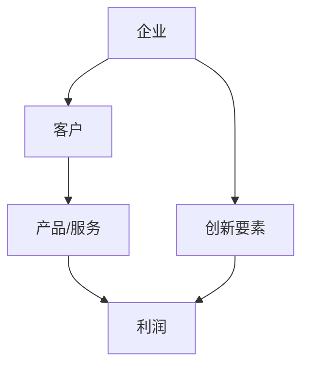
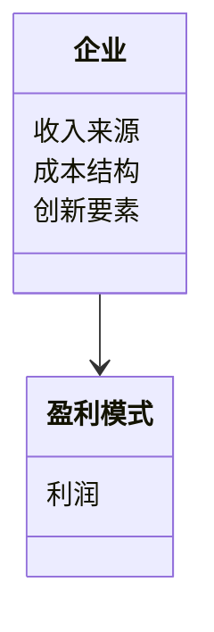
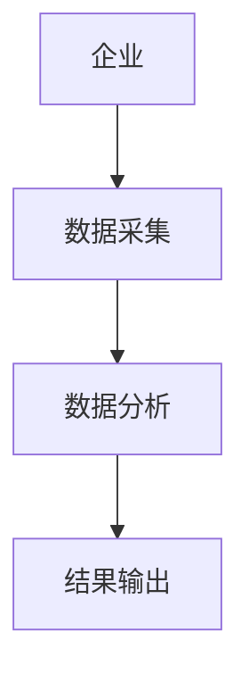
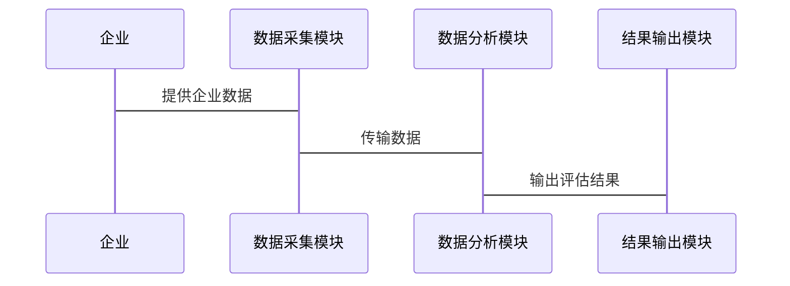

                 


# 彼得林奇对公司盈利模式创新的判断

**关键词**：彼得林奇、盈利模式创新、投资分析、企业价值、创新要素

**摘要**：本文深入探讨了彼得林奇如何通过盈利模式创新来判断公司价值。文章从盈利模式创新的背景、核心概念、分析方法、系统架构、项目实战等多个维度展开，结合理论与实际案例，详细分析了盈利模式创新对企业投资价值的影响。通过本文，读者可以全面了解如何利用盈利模式创新的视角，来评估企业的长期发展潜力。

---

# 第一部分：盈利模式创新的背景与重要性

## 第1章：盈利模式创新的背景与核心概念

### 1.1 盈利模式创新的背景

#### 1.1.1 经济环境的变化与企业盈利模式的演变

随着全球经济的快速发展和技术的进步，企业的盈利模式也在不断演变。传统的盈利模式往往依赖于单一的产品或服务，而在数字化时代，企业需要通过创新来适应市场变化，提升竞争力。彼得林奇作为投资专家，深刻认识到盈利模式创新对企业价值的重要性。

#### 1.1.2 数字化时代对企业盈利模式的影响

在数字化时代，企业可以通过技术创新、业务模式创新等方式实现盈利模式的升级。例如，互联网企业的盈利模式通常依赖于用户数量和用户粘性，而非单一的产品销售。这种模式的创新使得企业能够在快速变化的市场中保持竞争优势。

#### 1.1.3 创新在企业持续发展中的关键作用

企业如果不能及时调整盈利模式，可能会在竞争中被淘汰。通过创新，企业可以发现新的市场机会，降低成本，提高效率，从而实现可持续发展。彼得林奇的投资理念也强调了这一点，他倾向于投资那些能够持续创新的企业。

### 1.2 盈利模式的定义与核心要素

#### 1.2.1 盈利模式的定义

盈利模式是企业通过提供产品或服务，获取收入和利润的方式。它涵盖了企业的收入来源、成本结构、利润分配等多个方面。

#### 1.2.2 盈利模式的核心要素分析

- **收入来源**：企业通过哪些渠道获得收入，例如产品销售、订阅服务等。
- **成本结构**：企业为实现收入所需投入的成本，包括固定成本和变动成本。
- **利润分配**：企业如何将收入分配到各个部门，以及如何通过优化资源配置来提高利润。

#### 1.2.3 盈利模式与企业战略的关系

盈利模式是企业战略的重要组成部分。通过合理设计盈利模式，企业可以实现战略目标，提升市场地位。

### 1.3 彼得林奇投资理念与盈利模式创新的联系

#### 1.3.1 彼得林奇投资理念概述

彼得林奇是美国著名投资专家，他强调长期投资和价值投资。他认为，投资的核心是选择那些具有持续盈利能力的企业。

#### 1.3.2 盈利模式创新在投资分析中的重要性

在投资分析中，盈利模式创新是判断企业价值的关键因素。创新的盈利模式能够为企业带来持续的收入增长和竞争优势。

#### 1.3.3 彼得林奇如何通过盈利模式创新判断企业价值

彼得林奇通过分析企业的盈利模式创新，判断其未来的盈利能力和发展潜力。他认为，具有创新能力的企业更有可能实现长期价值增长。

### 1.4 本章小结

本章从背景、核心概念和彼得林奇的投资理念三个方面，阐述了盈利模式创新的重要性。通过分析盈利模式的定义和核心要素，以及彼得林奇如何通过盈利模式创新判断企业价值，为后续的分析奠定了基础。

---

# 第二部分：盈利模式创新的核心概念与分析框架

## 第2章：盈利模式创新的核心概念与联系

### 2.1 盈利模式创新的核心概念

#### 2.1.1 盈利模式的构成要素

- **收入来源**：企业通过哪些方式获得收入。
- **成本结构**：企业为实现收入所需投入的成本。
- **利润分配**：企业如何分配收入和利润。

#### 2.1.2 创新在盈利模式中的作用

创新可以为企业带来新的收入来源，降低成本，提高效率，从而增强企业的盈利能力。

#### 2.1.3 盈利模式创新与企业竞争力的关系

盈利模式创新是企业竞争力的重要组成部分。通过创新，企业可以实现差异化竞争，提高市场占有率。

### 2.2 盈利模式创新的核心要素对比

#### 2.2.1 盈利模式创新与传统盈利模式的对比

- **传统盈利模式**：依赖于单一的产品或服务，利润来源有限。
- **创新盈利模式**：通过技术创新、业务模式创新等方式，实现多元化收入来源。

#### 2.2.2 创新要素的特征分析

- **创新性**：与传统模式相比，具有新的思路和方法。
- **可扩展性**：能够快速复制和推广。
- **可持续性**：能够长期为企业带来利润。

#### 2.2.3 创新要素对企业价值的影响

创新要素能够提升企业的市场竞争力，增强企业的盈利能力，从而提高企业价值。

### 2.3 盈利模式创新的ER实体关系图



### 2.4 本章小结

本章通过分析盈利模式创新的核心概念和要素，结合ER实体关系图，进一步明确了创新要素对企业价值的影响。通过对比传统盈利模式和创新盈利模式的差异，为后续的分析提供了理论基础。

---

# 第三部分：盈利模式创新的分析方法与算法原理

## 第3章：盈利模式创新的分析方法

### 3.1 盈利模式创新的分析框架

#### 3.1.1 问题场景介绍

本文通过分析企业的盈利模式创新，判断其投资价值。分析框架包括数据输入、特征提取、模型分析和结果输出等步骤。

#### 3.1.2 分析框架的设计

分析框架包括以下几个步骤：
1. **数据输入**：获取企业的财务数据和市场数据。
2. **特征提取**：提取企业的创新要素和盈利能力相关特征。
3. **模型分析**：利用数学模型和算法对企业的盈利模式创新进行评估。
4. **结果输出**：输出企业的盈利模式创新评估结果。

#### 3.1.3 分析框架的适用性

本文的分析框架适用于各种类型的企业，尤其适用于那些希望通过创新提升盈利能力的企业。

### 3.2 盈利模式创新的算法原理

#### 3.2.1 算法实现与代码示例

以下是一个简单的盈利模式创新评估算法示例：

```python
def analyze_profit_model(data):
    # 数据预处理
    processed_data = preprocess(data)
    # 特征提取
    features = extract_features(processed_data)
    # 模型分析
    result = model_analysis(features)
    return result
```

#### 3.2.2 数学模型与公式

##### 利润预测模型

$$ 利润 = a \times 收入 - b \times 成本 $$

##### 创新价值评估公式

$$ 价值 = c \times 创新要素 + d \times 利润能力 $$

### 3.3 算法实现与代码示例

以下是一个简单的盈利模式创新评估算法示例：

```python
def analyze_profit_model(data):
    # 数据预处理
    processed_data = preprocess(data)
    # 特征提取
    features = extract_features(processed_data)
    # 模型分析
    result = model_analysis(features)
    return result
```

### 3.4 本章小结

本章通过设计分析框架和算法原理，详细阐述了如何通过数学模型和算法来评估企业的盈利模式创新。通过代码示例和数学公式的结合，进一步明确了盈利模式创新的评估方法。

---

# 第四部分：系统分析与架构设计方案

## 第4章：系统分析与架构设计方案

### 4.1 问题场景介绍

本文通过分析企业的盈利模式创新，判断其投资价值。系统分析包括企业数据采集、数据分析和结果输出等步骤。

### 4.2 系统功能设计

#### 4.2.1 领域模型



#### 4.2.2 系统架构设计



### 4.3 系统接口设计

#### 4.3.1 接口描述

- **输入接口**：企业数据采集接口。
- **输出接口**：盈利模式创新评估结果输出接口。

### 4.4 系统交互设计



### 4.5 本章小结

本章通过系统分析和架构设计，进一步明确了盈利模式创新的评估过程。通过领域模型和系统架构图的结合，为后续的项目实施提供了指导。

---

# 第五部分：项目实战与案例分析

## 第5章：项目实战与案例分析

### 5.1 项目介绍

本文通过分析亚马逊和特斯拉的盈利模式创新，判断其投资价值。

### 5.2 亚马逊的盈利模式创新分析

#### 5.2.1 亚马逊的创新要素

- **收入来源**：线上零售、云计算服务。
- **成本结构**：物流成本、研发投入。
- **利润分配**：通过规模效应降低成本，提高利润。

#### 5.2.2 亚马逊的创新价值评估

亚马逊通过创新的盈利模式，实现了持续的收入增长和利润提升。

### 5.3 特斯拉的盈利模式创新分析

#### 5.3.1 特斯拉的创新要素

- **收入来源**：电动汽车销售、充电服务。
- **成本结构**：制造成本、研发成本。
- **利润分配**：通过技术创新降低成本，提高利润率。

#### 5.3.2 特斯拉的创新价值评估

特斯拉通过创新的盈利模式，成为全球领先的电动汽车制造商。

### 5.4 本章小结

本章通过亚马逊和特斯拉的案例分析，展示了如何通过盈利模式创新来判断企业的投资价值。通过实际案例的分析，进一步验证了本文的理论分析。

---

# 第六部分：结论与展望

## 第6章：结论与展望

### 6.1 本文总结

本文通过分析彼得林奇如何通过盈利模式创新来判断企业价值，提出了盈利模式创新的分析框架和评估方法。通过实际案例的分析，验证了本文的理论分析。

### 6.2 未来研究方向

未来的研究可以进一步探讨盈利模式创新的动态变化，以及如何通过技术手段实现盈利模式的智能化分析。

### 6.3 最佳实践 Tips

- 投资者应关注企业的盈利模式创新，选择具有持续创新能力的企业。
- 企业应通过创新提升自身的竞争力，实现可持续发展。

### 6.4 本章小结

本章总结了本文的主要观点，并展望了未来的研究方向。通过本文的分析，读者可以更好地理解盈利模式创新对企业投资价值的影响。

---

**作者：AI天才研究院/AI Genius Institute & 禅与计算机程序设计艺术 /Zen And The Art of Computer Programming**

