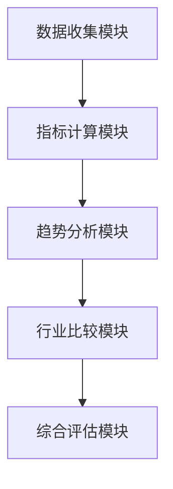

                 


# 彼得林奇对公司盈利质量的分析

> 关键词：彼得·林奇，盈利质量，投资分析，财务指标，公司估值

> 摘要：本文详细探讨了彼得·林奇对公司盈利质量的分析方法，通过背景介绍、核心概念、数学模型、系统架构以及实际案例分析，全面解读了如何通过盈利质量分析来评估公司的投资价值。文章结合理论与实践，为投资者提供了深入的分析工具和方法。

---

## 第一部分: 彼得·林奇的投资理念与方法

### 第1章: 彼得·林奇的生平与投资风格

#### 1.1 彼得·林奇的生平简介

彼得·林奇（Peter Lynch）是美国著名的投资专家，被誉为“股市投资之父”。他于1947年出生于美国波士顿，1970年毕业于波士顿大学，随后加入富达投资集团（Fidelity Investments），担任基金经理，管理麦哲伦基金（Fidelity Magellan Fund）。在他的管理下，该基金取得了令人瞩目的成绩，年平均回报率超过29%，远超市场平均水平。

#### 1.2 林奇的投资哲学与理念

林奇的投资理念以“长期投资”和“深入研究”为核心。他认为，投资者应该选择那些具有持续增长潜力、管理良好、财务健康的企业进行投资。他强调，投资成功的秘诀在于对公司的深入了解和对市场趋势的准确把握。

#### 1.3 林奇的盈利质量分析核心思想

林奇认为，公司的盈利能力是决定其投资价值的关键因素。他提出了“盈利质量”的概念，即公司利润的来源是否可靠、持续且具有增长潜力。通过分析公司的财务报表和经营状况，林奇能够准确评估公司的盈利质量，从而做出明智的投资决策。

---

### 第2章: 盈利质量分析的定义与重要性

#### 2.1 盈利质量的定义

盈利质量是指公司利润的来源和质量，具体包括利润的可持续性、稳定性以及增长潜力。林奇认为，仅仅关注利润的多少是不够的，更重要的是利润的来源是否可靠，是否能够持续增长。

#### 2.2 盈利质量分析在投资中的作用

盈利质量分析是投资决策的核心工具之一。通过分析公司的盈利质量，投资者可以判断公司的财务健康状况、管理能力以及未来的增长潜力。林奇认为，只有那些具有高质量利润的公司，才能为投资者带来长期的超额收益。

#### 2.3 盈利质量与企业长期价值的关系

盈利质量直接关系到企业的长期价值。一家公司如果能够保持稳定的高盈利质量，其股票价值将得到市场的高度认可，从而为投资者带来丰厚的回报。反之，如果公司的盈利质量不佳，股票价值将难以维持，投资者可能会面临亏损的风险。

---

### 第3章: 盈利质量分析的核心概念与框架

#### 3.1 盈利质量的核心要素

盈利质量分析的核心要素包括以下几个方面：

- **收入质量**：收入的来源是否稳定、可持续，收入的增长是否合理。
- **利润质量**：利润的来源是否可靠，利润的增长是否具有持续性。
- **现金流质量**：现金流的状况是否健康，现金流的增长是否与利润增长同步。

#### 3.2 盈利质量的评估标准

林奇提出了以下几个评估盈利质量的标准：

- **净利润与收入匹配性**：净利润是否与收入增长同步，是否存在虚增收入的情况。
- **盈利的可持续性**：利润的增长是否具有持续性，是否受到行业周期的影响。
- **盈利的稳定性**：利润的波动性是否较小，是否能够在经济 downturn 时期保持稳定。

#### 3.3 盈利质量分析的框架

林奇的盈利质量分析框架包括以下几个步骤：

1. **分析公司的财务报表**：重点分析收入、利润和现金流的状况。
2. **评估收入质量**：检查收入的增长是否合理，是否存在虚构收入的情况。
3. **评估利润质量**：分析利润的来源，判断利润的可持续性。
4. **评估现金流质量**：检查现金流的健康状况，确保现金流的增长与利润增长同步。
5. **综合评估**：结合以上分析，综合评估公司的盈利质量。

---

### 第4章: 盈利质量分析的数学模型与公式

#### 4.1 盈利质量的核心指标

林奇的盈利质量分析中，以下几个核心指标尤为重要：

- **净利润率（Net Profit Margin）**：$$净利润率 = \frac{净利润}{营业收入} \times 100\%$$
- **毛利率（Gross Profit Margin）**：$$毛利率 = \frac{营业收入 - 营业成本}{营业收入} \times 100\%$$
- **净资产收益率（ROE）**：$$ROE = \frac{净利润}{股东权益} \times 100\%$$

#### 4.2 盈利质量分析的数学模型

林奇的盈利质量分析模型可以通过以下步骤进行：

1. **计算核心财务指标**：包括净利润率、毛利率、ROE等。
2. **分析指标的变化趋势**：观察这些指标在不同年份的变化趋势，判断公司的盈利质量是否稳定。
3. **比较行业平均水平**：将公司的财务指标与行业平均水平进行比较，判断公司的盈利能力是否具有竞争力。
4. **综合评估**：结合以上分析，综合评估公司的盈利质量。

#### 4.3 案例分析：XYZ公司的盈利质量分析

假设我们有一家XYZ公司，其最近三年的财务数据如下：

| 年份 | 营业收入（百万美元） | 净利润（百万美元） | 股东权益（百万美元） |
|------|-----------------------|--------------------|-----------------------|
| 2020 | 500                   | 50                 | 200                   |
| 2021 | 550                   | 60                 | 220                   |
| 2022 | 600                   | 70                 | 240                   |

计算核心指标：

- 2020年：$$净利润率 = \frac{50}{500} \times 100\% = 10\%$$
- 2021年：$$净利润率 = \frac{60}{550} \times 100\% \approx 10.91\%$$
- 2022年：$$净利润率 = \frac{70}{600} \times 100\% \approx 11.67\%$$

从以上数据可以看出，XYZ公司的净利润率逐年上升，且ROE也呈现增长趋势，说明公司的盈利质量在不断提高。

---

### 第5章: 盈利质量分析的系统架构与工具

#### 5.1 盈利质量分析的系统架构

为了更好地进行盈利质量分析，我们可以构建一个系统化的分析框架，包括以下几个模块：

- **数据收集模块**：收集公司的财务报表数据，包括收入、利润、现金流等。
- **指标计算模块**：计算各项核心财务指标，如净利润率、毛利率等。
- **趋势分析模块**：分析各项指标的变化趋势，判断盈利质量的稳定性。
- **行业比较模块**：将公司的财务指标与行业平均水平进行比较，评估公司的竞争力。
- **综合评估模块**：结合以上分析，综合评估公司的盈利质量。

#### 5.2 系统架构设计图（Mermaid）



---

## 第六部分: 项目实战与最佳实践

### 第6章: 项目实战

#### 6.1 环境安装与工具配置

为了进行盈利质量分析，我们需要安装以下工具：

- **Python**：用于数据分析和计算。
- **Pandas**：用于处理财务数据。
- **Matplotlib**：用于绘制财务指标的变化趋势图。
- **Jupyter Notebook**：用于数据分析和可视化。

#### 6.2 核心代码实现

以下是一个盈利质量分析的Python代码示例：

```python
import pandas as pd
import matplotlib.pyplot as plt

# 假设我们已经读取了XYZ公司的财务数据到一个DataFrame中
df = pd.DataFrame({
    'Year': ['2020', '2021', '2022'],
    'Revenue': [500, 550, 600],
    'Net Profit': [50, 60, 70],
    'Equity': [200, 220, 240]
})

# 计算净利润率
df['Net Profit Margin'] = df['Net Profit'] / df['Revenue'] * 100

# 计算ROE
df['ROE'] = df['Net Profit'] / df['Equity'] * 100

# 绘制净利润率的变化趋势图
plt.figure(figsize=(10, 6))
plt.plot(df['Year'], df['Net Profit Margin'], label='Net Profit Margin')
plt.plot(df['Year'], df['ROE'], label='ROE')
plt.title('Profit Quality Analysis')
plt.xlabel('Year')
plt.ylabel('Percentage (%)')
plt.legend()
plt.show()
```

#### 6.3 案例分析与解读

以上代码计算了XYZ公司的净利润率和ROE，并绘制了它们的变化趋势图。从图中可以看出，XYZ公司的净利润率和ROE均呈上升趋势，说明公司的盈利质量在不断提高。

---

### 第7章: 最佳实践与小结

#### 7.1 小结

通过本文的分析，我们可以得出以下结论：

- 盈利质量是决定公司投资价值的关键因素。
- 林奇的盈利质量分析方法为我们提供了一个系统化的分析框架。
- 通过计算核心财务指标和绘制趋势图，我们可以更好地评估公司的盈利质量。

#### 7.2 注意事项

在进行盈利质量分析时，需要注意以下几点：

- 数据的准确性和完整性：确保财务数据的来源可靠。
- 行业特性：不同行业的盈利质量分析标准可能有所不同。
- 综合分析：不能仅依赖单一指标，需要综合考虑多个因素。

#### 7.3 拓展阅读

对于感兴趣的研究者，可以进一步阅读以下书籍：

- 《彼得·林奇的成功投资》
- 《巴菲特的选股智慧》
- 《财务报表分析与股票估值》

---

## 作者：AI天才研究院/AI Genius Institute & 禅与计算机程序设计艺术 /Zen And The Art of Computer Programming

---

本文通过详细的背景介绍、核心概念、数学模型、系统架构以及实际案例分析，全面解读了彼得·林奇的盈利质量分析方法。希望本文能够为投资者提供实用的分析工具和方法，帮助他们在复杂的市场环境中做出明智的投资决策。

