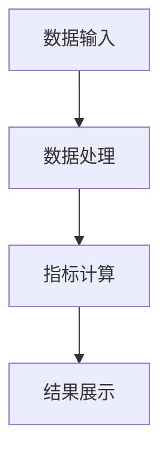

                 

<think>
好，我现在要撰写一篇关于《彼得·林奇对公司盈利质量的分析方法》的技术博客文章。首先，我需要明确文章的结构和每个部分的内容，以确保逻辑清晰、结构紧凑且易于理解。

### 第一部分：背景与基础

**第1章：盈利质量分析的背景与重要性**

#### 1.1 盈利质量的核心概念
- **定义与内涵**：盈利质量指的是公司在一定时期内实现的利润的质量，不仅仅是利润的多少，更重要的是利润的来源、构成和可持续性。
- **与企业价值的关系**：盈利质量高的公司，其利润来源稳定，能够在不同经济环境下持续盈利，从而为企业创造更大的价值。
- **林奇的分析框架**：彼得·林奇提出了通过分析财务报表中的各项指标，结合行业特点和公司具体情况，评估公司盈利质量的方法。

#### 1.2 盈利质量分析的背景
- **现金流与利润的关系**：现金流是企业实际获得的现金，而利润则可能包括一些非现金项目，如应收账款。现金流更能反映企业的实际财务健康状况。
- **传统盈利指标的局限性**：传统的盈利指标如净利润率虽然重要，但无法全面反映盈利的质量，因为它们可能掩盖了一些潜在的问题。
- **林奇分析方法的创新性**：林奇的方法注重从多个维度分析盈利质量，包括利润来源、成本控制、资产周转率等，以更全面地评估公司的盈利能力。

**第2章：彼得·林奇的盈利质量分析框架**

#### 2.1 林奇分析方法的核心要素
- **盈利来源分析**：分析公司利润的主要来源，如销售收入、投资收益等，以确定利润的可持续性。
- **盈利可持续性评估**：通过分析公司的财务状况、行业地位和市场前景，评估公司的盈利能力是否能够持续。
- **多维度指标**：包括毛利率、营业利润率、净利率、现金流等指标，从多个角度评估公司的盈利质量。

#### 2.2 核心步骤
- **数据收集与整理**：收集公司的财务报表数据，包括收入、成本、利润等。
- **财务指标计算与对比**：计算各项盈利指标，并与行业平均水平或公司历史数据进行对比。
- **综合评价**：根据各项指标的结果，综合评估公司的盈利质量。

**第3章：数学模型与公式**

#### 3.1 核心指标
- **净利润**：净利润是公司税后利润，计算公式为：净利润 = 营业收入 - 营业成本 - 税金及附加 - 期间费用。
- **毛利率**：毛利率 = (营业收入 - 营业成本) / 营业收入 × 100%。
- **营业利润率**：营业利润率 = 营业利润 / 营业收入 × 100%。
- **净利率**：净利率 = 净利润 / 营业收入 × 100%。

#### 3.2 数学模型
- **净利润计算公式**
  $$ \text{净利润} = \text{营业收入} - \text{营业成本} - \text{税金及附加} - \text{期间费用} $$
- **毛利率计算公式**
  $$ \text{毛利率} = \frac{\text{营业收入} - \text{营业成本}}{\text{营业收入}} \times 100\% $$

### 第二部分：系统分析与实现

**第4章：系统分析与架构设计**

#### 4.1 系统功能模块划分
- 数据采集模块：负责收集公司的财务数据。
- 数据处理模块：对收集到的数据进行清洗和预处理。
- 指标计算模块：计算各项盈利指标。
- 结果展示模块：将计算结果以图表或报告的形式展示出来。

#### 4.2 系统架构图


#### 4.3 算法实现与代码
- **Python代码实现**
  ```python
  import pandas as pd

  def calculate_profitability_metrics(df):
      df['毛利率'] = (df['营业收入'] - df['营业成本']) / df['营业收入'] * 100
      df['净利率'] = df['净利润'] / df['营业收入'] * 100
      return df

  # 示例数据
  data = {
      '营业收入': [1000, 1200, 1500],
      '营业成本': [600, 700, 800],
      '净利润': [200, 300, 400]
  }
  df = pd.DataFrame(data)
  result = calculate_profitability_metrics(df)
  print(result)
  ```

### 第三部分：项目实战与应用

**第5章：项目实战与应用分析**

#### 5.1 项目背景
假设我们有一家制造公司，需要对其盈利质量进行分析，以评估公司的财务健康状况。

#### 5.2 数据收集与处理
收集公司过去三年的财务报表数据，包括营业收入、营业成本、净利润等。

#### 5.3 盈利指标计算
使用Python代码计算毛利率、净利率等指标，并生成可视化图表。

#### 5.4 案例分析
通过分析计算出的指标，评估公司的盈利质量，并与行业平均水平进行对比。

### 第四部分：最佳实践与总结

**第6章：最佳实践与总结**

#### 6.1 小结
- 本文详细介绍了彼得·林奇的盈利质量分析方法，包括核心概念、数学模型和系统实现。
- 通过实际案例分析，展示了如何将理论应用于实践。

#### 6.2 注意事项
- 数据的准确性和完整性是分析的基础。
- 分析时需要结合行业特点和公司具体情况，避免单一指标误导。

#### 6.3 拓展阅读
- 推荐阅读彼得·林奇的其他著作，深入了解他的投资理念。
- 学习其他盈利质量分析方法，如杜邦分析法。

### 结语

通过本文的学习，读者可以掌握彼得·林奇的盈利质量分析方法，并能够将其应用于实际的财务分析中，为企业价值评估和投资决策提供有力支持。

---

作者：AI天才研究院 & 禅与计算机程序设计艺术

