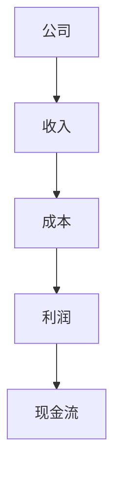
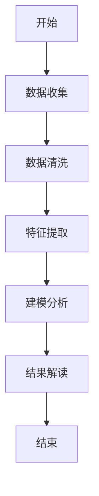
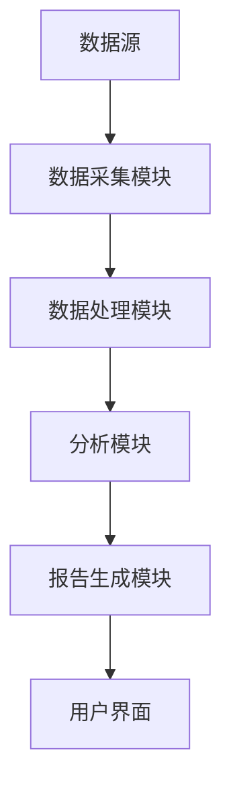

                 


# 彼得林奇对公司盈利质量的深度分析

## 关键词
- 彼得林奇
- 盈利质量
- 财务分析
- 投资策略
- 公司估值

## 摘要
本文深入探讨了彼得林奇的盈利质量分析方法，分析了其核心概念、算法原理、数学模型、系统架构和实际案例，帮助读者掌握如何通过盈利质量分析筛选优质公司，提升投资决策的准确性。

## 第一部分: 盈利质量分析的背景与重要性

### 第1章: 公司盈利质量分析的背景与重要性

#### 1.1 盈利质量分析的定义与核心概念
- **盈利质量的定义**: 公司赚取利润的能力和质量，包括收入、利润和现金流的质量。
- **核心要素**: 收入的真实性、利润的可持续性、现金流的健康性。
- **与企业价值的关系**: 盈利质量高的公司通常具有较高的市场价值。

#### 1.2 彼得林奇的投资理念与盈利质量分析
- **彼得林奇的背景**: 著名的价值投资者，强调基本面分析。
- **分析方法**: 通过财务报表和行业数据评估公司的盈利质量，筛选具有竞争优势的公司。
- **投资决策中的作用**: 盈利质量分析帮助投资者识别优质公司，降低投资风险。

#### 1.3 盈利质量分析的行业背景
- **行业差异**: 不同行业的盈利质量标准不同，需结合行业特点分析。
- **经济周期影响**: 盈利质量在不同经济周期的表现不同，需动态调整分析方法。
- **全球化挑战**: 全球化背景下，需考虑国际市场的波动和政策变化。

### 第2章: 盈利质量分析的核心概念与联系

#### 2.1 盈利质量的核心概念
- **收入质量**: 收入的真实性、持续性和稳定性。
- **利润质量**: 利润的来源、结构和可持续性。
- **现金流质量**: 现金流的健康状况，包括经营活动、投资活动和筹资活动的现金流。

#### 2.2 盈利质量与财务报表的关系
- **利润表**: 收入、成本、利润的详细数据，反映盈利能力。
- **资产负债表**: 资产、负债和所有者权益，反映财务健康状况。
- **现金流量表**: 现金流入和流出，反映现金流质量。

#### 2.3 盈利质量分析的属性特征对比表
| 指标 | 收入质量 | 利润质量 | 现金流质量 |
|------|----------|----------|------------|
| 关注点 | 收入来源和结构 | 利润来源和构成 | 现金流来源和用途 |
| 重要性 | 判断收入的可持续性 | 判断利润的含金量 | 判断财务健康状况 |
| 示例指标 | 收入增长率、应收账款周转率 | 净利润率、研发投入占比 | 经营活动现金流净额 |

#### 2.4 盈利质量分析的ER实体关系图


### 第3章: 盈利质量分析的算法原理

#### 3.1 盈利质量分析的步骤
- **数据收集与清洗**: 收集财务数据，清洗异常值和缺失值。
- **数据预处理与特征提取**: 标准化处理，提取关键特征。
- **数据建模与分析**: 使用回归模型或聚类模型分析。
- **结果解读与优化**: 解读模型结果，优化分析方法。

#### 3.2 盈利质量分析的算法流程图


#### 3.3 盈利质量分析的Python实现
- **数据处理代码**
```python
import pandas as pd
import numpy as np

# 示例数据加载
data = pd.read_csv('financial_data.csv')

# 数据清洗
data.dropna(inplace=True)
data = data[~data['收入'].isin([0])]

# 特征提取
features = ['收入', '成本', '利润']
data_features = data[features]

# 建模分析
from sklearn.linear_model import LinearRegression
model = LinearRegression()
model.fit(data_features[['收入', '成本']], data_features['利润'])
```

### 第4章: 盈利质量分析的数学模型

#### 4.1 盈利质量的关键指标
- **ROE（净资产收益率）**: $$ ROE = \frac{净利润}{所有者权益} $$
- **ROS（销售利润率）**: $$ ROS = \frac{净利润}{营业收入} $$
- **现金流健康性**: $$ 现金流净额 = 经营活动现金流净额 + 投资活动现金流净额 + 筹资活动现金流净额 $$

#### 4.2 盈利质量分析的数学模型
- **线性回归模型**: 预测未来利润
  $$ 利润 = \beta_0 + \beta_1 \times 收入 + \beta_2 \times 成本 + \epsilon $$
- **聚类分析模型**: 将公司按盈利质量分组

### 第5章: 盈利质量分析的系统架构设计

#### 5.1 系统功能设计
- **数据采集模块**: 从数据库获取财务数据。
- **数据处理模块**: 清洗和预处理数据。
- **分析模块**: 运行分析算法，生成结果。
- **报告生成模块**: 输出分析报告。

#### 5.2 系统架构设计


#### 5.3 系统接口设计
- **数据接口**: REST API，提供数据查询服务。
- **分析接口**: 提供分析结果的API，供其他系统调用。

### 第6章: 盈利质量分析的项目实战

#### 6.1 项目背景
- **行业选择**: 选择高科技行业进行分析。
- **目标**: 分析行业内的盈利质量，寻找优质公司。

#### 6.2 核心代码实现
```python
import pandas as pd
from sklearn.metrics import accuracy_score

# 加载数据
data = pd.read_csv('tech_industry.csv')

# 数据预处理
data.dropna(inplace=True)
data = data[~data['收入'].isin([0])]

# 模型训练
from sklearn.tree import DecisionTreeClassifier
model = DecisionTreeClassifier()
model.fit(data[['收入', '成本']], data['利润质量'])

# 预测与评估
predictions = model.predict(data[['收入', '成本']])
print(accuracy_score(data['利润质量'], predictions))
```

#### 6.3 案例分析
- **公司A**: 收入增长快，利润质量高。
- **公司B**: 现金流健康，但利润来源单一。

### 第7章: 盈利质量分析的最佳实践

#### 7.1 关键小结
- **数据质量**: 数据准确性是分析的基础。
- **模型选择**: 根据具体情况选择合适模型。
- **行业分析**: 结合行业特点进行分析。

#### 7.2 注意事项
- **数据更新**: 定期更新数据，保持分析的时效性。
- **模型优化**: 根据新数据不断优化模型。
- **风险管理**: 量化风险，制定应对策略。

#### 7.3 拓展阅读
- 推荐书籍：《彼得·林奇的投资哲学》。
- 进阶学习：深入研究其他投资分析方法。

## 作者
作者：AI天才研究院 & 禅与计算机程序设计艺术

---

通过以上内容，我们系统地分析了彼得林奇的盈利质量分析方法，从理论到实践，帮助投资者和分析师更好地理解和应用这些方法。希望本文能为您提供有价值的见解和实用的指导。

