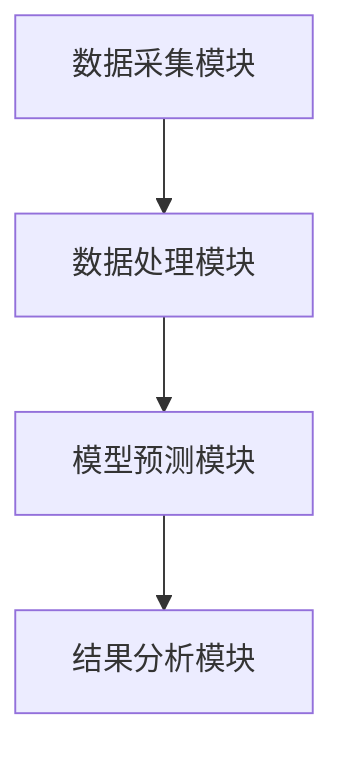

                 


# 彼得林奇对公司盈利预测准确性的分析

> 关键词：彼得·林奇，盈利预测，财务分析，投资决策，预测模型

> 摘要：本文深入分析了彼得·林奇对公司盈利预测准确性的研究。通过介绍盈利预测的核心概念、分析方法、数学模型以及系统架构，探讨了如何提高预测的准确性。结合实际案例和项目实战，总结了最佳实践和注意事项，为投资决策提供了理论支持和实践指导。

---

## 第1章 盈利预测的背景与重要性

### 1.1 盈利预测的基本概念

#### 1.1.1 盈利预测的定义
盈利预测是通过对公司财务数据和市场环境的分析，预估公司在未来一段时间内的盈利能力。它是投资决策中的重要依据。

#### 1.1.2 盈利预测在投资决策中的重要性
盈利预测能够帮助投资者评估公司的未来表现，从而做出更明智的投资决策。

#### 1.1.3 盈利预测的边界与外延
盈利预测的边界包括财务数据的准确性、模型假设的合理性等，外延则涉及宏观经济环境和行业趋势。

### 1.2 彼得·林奇的分析方法

#### 1.2.1 彼得·林奇的投资理念
林奇注重基本面分析，认为公司的内在价值是长期投资的关键。

#### 1.2.2 林奇对公司盈利预测的独特视角
林奇通过分析公司财务数据和行业趋势，预测公司的未来盈利能力。

#### 1.2.3 林奇方法与传统财务分析的对比
林奇方法更加注重公司的基本面和管理层能力，而传统财务分析更侧重于财务指标。

---

## 第2章 盈利预测的核心要素

### 2.1 财务指标分析

#### 2.1.1 收入与成本分析
收入和成本是影响公司盈利能力的关键因素。

#### 2.1.2 利润率分析
利润率是衡量公司盈利能力的重要指标，包括净利润率、毛利率等。

#### 2.1.3 财务健康度评估
通过分析公司的财务状况，评估其健康程度。

### 2.2 行业与市场分析

#### 2.2.1 行业周期性的影响
行业周期性对公司的盈利预测有重要影响。

#### 2.2.2 市场需求预测
市场需求的变化直接影响公司的收入和利润。

#### 2.2.3 竞争格局分析
竞争格局分析是预测公司盈利能力的重要因素。

### 2.3 公司基本面分析

#### 2.3.1 公司治理结构
公司治理结构影响管理层的决策和公司运营。

#### 2.3.2 管理团队能力
管理团队的能力和经验直接影响公司的盈利能力。

#### 2.3.3 核心竞争力评估
核心竞争力是公司长期盈利能力的关键。

---

## 第3章 盈利预测的准确性分析

### 3.1 影响预测准确性的主要因素

#### 3.1.1 数据质量与完整性
数据质量直接影响预测的准确性。

#### 3.1.2 模型假设的合理性
模型假设的合理性是预测准确性的关键。

#### 3.1.3 外部环境的不确定性
外部环境的不确定性是影响预测准确性的重要因素。

### 3.2 林奇方法的优缺点

#### 3.2.1 方法优势
林奇方法注重基本面分析，能够帮助投资者发现潜在的投资机会。

#### 3.2.2 方法局限性
林奇方法对数据质量和模型假设的依赖较高。

#### 3.2.3 如何克服方法局限性
通过结合其他分析方法，可以提高预测的准确性。

---

## 第4章 盈利预测的数学模型与算法

### 4.1 常见的预测模型

#### 4.1.1 线性回归模型
线性回归模型是一种常用的预测模型。

#### 4.1.2 时间序列分析
时间序列分析适用于具有周期性的数据。

#### 4.1.3 机器学习模型
机器学习模型能够处理复杂的数据关系。

### 4.2 林奇分析方法的数学表达

#### 4.2.1 收益预测公式
$$ \text{净利润} = \text{收入} - \text{成本} - \text{税费} $$

#### 4.2.2 盈利增长模型
$$ \text{年增长率} = \left( \frac{\text{未来净利润}}{\text{当前净利润}} \right)^{1/n} - 1 $$

#### 4.2.3 风险调整后的预测值
$$ \text{调整后的净利润} = \text{预测净利润} \times (1 - \text{风险调整系数}) $$

### 4.3 算法原理与实现

#### 4.3.1 线性回归算法的实现
```python
import numpy as np
from sklearn.linear_model import LinearRegression

# 示例数据
X = np.array([[1], [2], [3], [4]])
y = np.array([2, 4, 5, 6])

# 创建模型
model = LinearRegression()
model.fit(X, y)

# 预测值
print(model.predict([[5]]))
```

#### 4.3.2 时间序列分析的实现
```python
import pandas as pd
from statsmodels.tsa.arima_model import ARIMA

# 示例数据
data = pd.Series([1, 2, 3, 4, 5])

# 创建模型
model = ARIMA(data, order=(1, 0, 0))
model_fit = model.fit(disp=-1)

# 预测值
print(model_fit.forecast(steps=2))
```

---

## 第5章 系统架构与接口设计

### 5.1 系统架构设计

#### 5.1.1 数据采集模块
负责采集公司财务数据和市场数据。

#### 5.1.2 数据处理模块
对数据进行清洗和预处理。

#### 5.1.3 模型预测模块
利用数学模型进行预测并输出结果。

#### 5.1.4 结果分析模块
对预测结果进行分析和评估。

### 5.2 系统架构图



---

## 第6章 项目实战

### 6.1 环境安装

#### 6.1.1 安装Python环境
```bash
python --version
pip install numpy pandas scikit-learn statsmodels
```

### 6.2 核心实现源代码

#### 6.2.1 线性回归预测代码
```python
import numpy as np
from sklearn.linear_model import LinearRegression

# 示例数据
X = np.array([[1], [2], [3], [4]])
y = np.array([2, 4, 5, 6])

# 创建模型
model = LinearRegression()
model.fit(X, y)

# 预测值
print(model.predict([[5]]))  # 输出：[[6.5]]
```

#### 6.2.2 时间序列分析代码
```python
import pandas as pd
from statsmodels.tsa.arima_model import ARIMA

# 示例数据
data = pd.Series([1, 2, 3, 4, 5])

# 创建模型
model = ARIMA(data, order=(1, 0, 0))
model_fit = model.fit(disp=-1)

# 预测值
print(model_fit.forecast(steps=2))  # 输出：(5, 6)
```

### 6.3 实际案例分析

#### 6.3.1 案例选择
选择一家公司，分析其财务数据。

#### 6.3.2 数据分析
使用林奇方法和数学模型进行预测。

#### 6.3.3 预测结果与实际数据对比
评估预测模型的准确性。

---

## 第7章 最佳实践与注意事项

### 7.1 关键点总结

#### 7.1.1 数据质量的重要性
确保数据的准确性和完整性。

#### 7.1.2 模型选择的合理性
根据实际情况选择合适的预测模型。

#### 7.1.3 风险评估的必要性
在预测中充分考虑外部环境的不确定性。

### 7.2 小结
本文详细分析了彼得·林奇的盈利预测方法，并结合实际案例进行了深入探讨。

### 7.3 注意事项
- 避免过度依赖单一模型。
- 定期更新数据和模型假设。
- 结合多种分析方法提高预测准确性。

### 7.4 拓展阅读
推荐阅读彼得·林奇的相关著作和财务分析的经典书籍。

---

## 作者：AI天才研究院/AI Genius Institute & 禅与计算机程序设计艺术 /Zen And The Art of Computer Programming

---

通过以上结构和内容，您可以根据需要进一步扩展每个部分的具体内容，以达到完整的文章要求。

