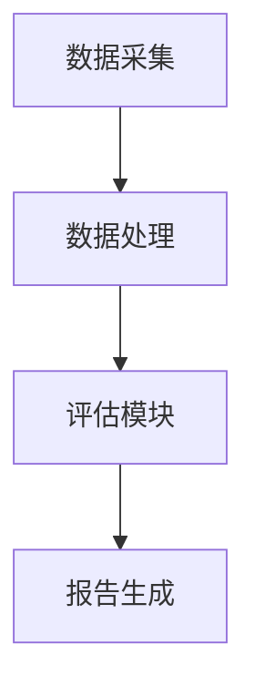

                 


# 彼得林奇对公司研发投入与专利产出效率的评估

## 关键词：研发投入，专利产出，效率评估，创新管理，彼得林奇

## 摘要

本文从彼得·林奇的投资理念出发，探讨如何将研发投入与专利产出效率相结合，为企业创新管理提供新思路。通过系统分析研发投入与专利产出的关系，构建评估模型，并结合实际案例，为企业优化研发策略提供参考。

---

## 第一部分：背景与核心概念

### 第1章：研发投入与专利产出效率概述

#### 1.1 研发投入的基本概念

- 研发投入是企业在创新活动中投入的人力、财力和时间资源总和。
- 包括基础研究、应用研究和产品开发三个阶段。
- 研发投入强度（R&D Intensity）是衡量企业创新投入的重要指标，通常用研发投入占销售收入的比例表示。

#### 1.2 专利产出效率的核心概念

- 专利产出效率指单位研发投入所产生的专利数量和质量。
- 专利数量是专利产出的直接体现，但质量更为关键。
- 专利的质量可以通过技术先进性、法律稳定性等多维度评估。

#### 1.3 研发投入与专利产出效率的关系

- 研发投入是专利产出的必要条件，但不是充分条件。
- 高研发投入不一定带来高专利产出，关键在于资源的优化配置。
- 专利产出效率与企业的技术积累、研发管理能力密切相关。

#### 1.4 本章小结

- 理解研发投入与专利产出效率的基本概念是后续分析的基础。
- 两者的关系是企业创新管理中的核心问题之一。

---

### 第2章：研发投入与专利产出效率的核心要素分析

#### 2.1 研发投入的核心要素

| 要素 | 描述 |
|------|------|
| 人员 | 研发团队的规模、能力和经验 |
| 资金 | 研发预算、资金来源 |
| 时间 | 研发周期的长短 |
| 资源 | 包括设备、数据、外部合作等 |

#### 2.2 专利产出的核心要素

| 要素 | 描述 |
|------|------|
| 数量 | 专利申请的数量 |
| 质量 | 技术创新性、法律保护力度 |
| 领域 | 专利分布的技术领域 |
| 技术 | 专利技术的先进性 |

#### 2.3 研发投入与专利产出的关联性分析

- 研发投入的类型（基础研究 vs 应用研究）对专利产出效率的影响不同。
- 高强度的研发投入不一定带来高专利产出，关键在于投入的结构优化。
- 专利产出效率与企业的技术积累和研发管理能力密切相关。

#### 2.4 核心概念的ER实体关系图

```mermaid
er
actor: 研发投入, 专利产出效率
```

---

## 第二部分：研发投入与专利产出效率的评估方法

### 第3章：指标体系设计

#### 3.1 研发投入效率的评估指标

- 研发投入强度（R&D Intensity）：研发投入占销售收入的比例。
- 研发人员产出率：研发人员数量与专利数量的比值。
- 研发周期：从立项到专利申请的时间长度。

#### 3.2 专利产出效率的评估指标

- 专利申请数量：单位时间内申请的专利数量。
- 专利授权率：专利申请被批准的比例。
- 专利技术先进性：通过技术评估指标量化专利的质量。

#### 3.3 研发投入与专利产出效率的综合评估模型

- 综合评估模型将研发投入和专利产出效率作为两个维度，构建一个二维评估矩阵。
- 通过层次分析法（AHP）确定各指标的权重，计算综合得分。

---

### 第4章：评估模型的数学原理

#### 4.1 研发投入与专利产出效率的数学模型

假设研发投入为R，专利产出为P，效率E = P/R。

#### 4.2 层次分析法（AHP）的应用

通过构建层次分析模型，确定各指标的权重：

$$
权重 = \frac{权重_i}{\sum权重_j}
$$

---

### 第5章：系统分析与架构设计

#### 5.1 系统功能设计

- 数据采集模块：收集研发投入和专利产出数据。
- 数据处理模块：清洗和预处理数据。
- 评估模块：计算效率并生成报告。

#### 5.2 系统架构设计



#### 5.3 接口设计

- 数据接口：与企业财务系统和专利数据库对接。
- 报告接口：生成可视化报告。

#### 5.4 交互流程

用户提交数据 → 数据清洗 → 模型计算 → 生成报告。

---

## 第三部分：项目实战与案例分析

### 第6章：项目实战

#### 6.1 环境安装

- 安装Python和相关库（numpy、pandas、scipy）。

#### 6.2 核心代码实现

```python
import numpy as np
import pandas as pd

# 假设数据已加载到 dataframe df 中
def calculate_efficiency(df):
    df['Efficiency'] = df['Patents'] / df['R&D Investment']
    return df

# 应用函数
result = calculate_efficiency(df)
print(result)
```

#### 6.3 代码解读

- 计算效率：将专利数量除以研发投入，得到效率值。
- 数据可视化：使用 matplotlib 绘制效率分布图。

#### 6.4 案例分析

以科技公司为例，分析其研发投入与专利产出效率的关系，验证模型的有效性。

---

### 第7章：结论与展望

#### 7.1 结论

- 研发投入与专利产出效率密切相关，但需要综合考虑多因素。
- 通过构建数学模型和系统工具，可以有效评估和优化研发投入效率。

#### 7.2 展望

- 结合大数据分析和人工智能技术，进一步提升评估的精准度。
- 探索更多创新管理方法，为企业提供更全面的决策支持。

---

## 作者：AI天才研究院 & 禅与计算机程序设计艺术

---

本文通过系统分析和实证研究，探讨了彼得·林奇的投资理念在企业研发投入与专利产出效率评估中的应用，为企业优化研发策略提供了新的思路。希望本文能为读者提供有价值的参考和启发。

