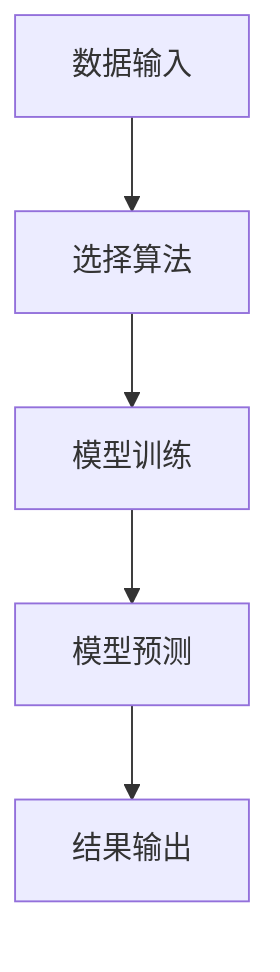
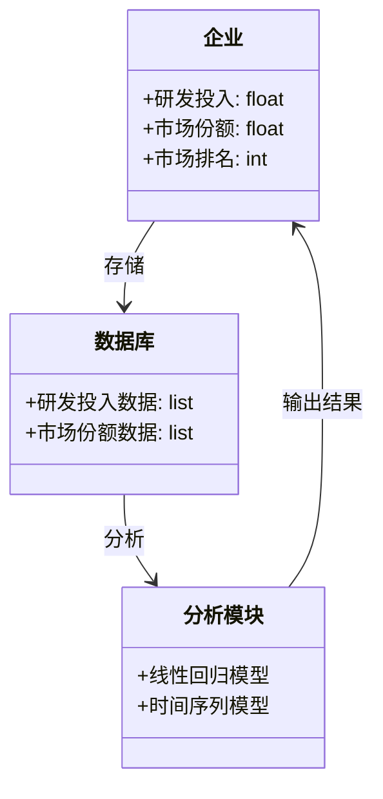
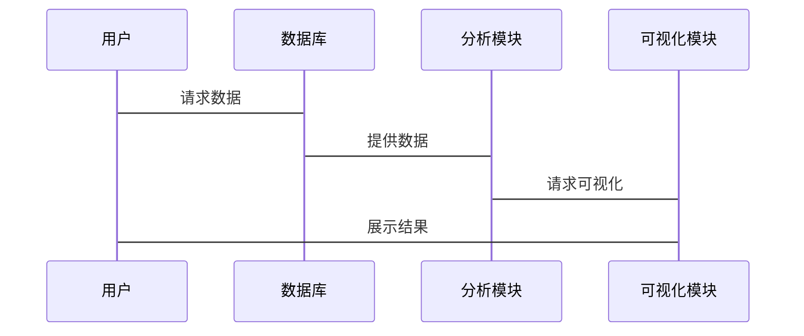

                 


# 彼得林奇对公司研发投入与市场份额关系的长期追踪分析

> 关键词：彼得林奇，研发投入，市场份额，长期追踪，投资分析

> 摘要：本文通过分析彼得林奇对研发投入与市场份额关系的长期追踪，探讨研发投入如何影响企业市场份额的变化，并结合实际案例，提出优化研发投入以提升市场份额的策略。

---

# 第一部分：公司研发投入与市场份额关系的背景介绍

## 第1章：研发投入与市场份额的概述

### 1.1 研发投入的定义与核心要素

#### 1.1.1 研发投入的定义
研发投入（R&D Investment）是指企业在研究与开发活动中投入的资金、资源和人力资源。这些投入旨在通过创新和技术进步来提升企业的竞争力。

#### 1.1.2 研发投入的核心要素分析
- **资金投入**：企业每年用于研发的资金比例。
- **人力资源**：研发团队的规模和能力。
- **技术方向**：研发投入的具体领域和方向。
- **创新产出**：研发成果的数量和质量。

#### 1.1.3 研发投入与企业竞争力的关系
研发投入是企业技术创新的核心驱动力，能够提升企业的核心竞争力和市场地位。

### 1.2 市场份额的定义与影响因素

#### 1.2.1 市场份额的定义
市场份额是指企业在某个市场或产品领域所占的销售比例。它是企业市场地位的直接体现。

#### 1.2.2 市场份额的影响因素
- **产品竞争力**：产品的质量、价格和创新能力。
- **品牌影响力**：品牌的知名度和美誉度。
- **市场策略**：定价策略、营销策略和渠道管理。
- **行业竞争格局**：行业的竞争程度和市场集中度。

#### 1.2.3 市场份额与企业发展的关系
市场份额的大小直接影响企业的收入和利润，同时也反映了企业的市场地位和发展潜力。

### 1.3 研发投入与市场份额的关联性分析

#### 1.3.1 研发投入对市场份额的直接影响
- **技术创新**：通过研发投入，企业能够推出更具竞争力的产品，从而扩大市场份额。
- **成本优势**：通过技术创新降低成本，提高产品性价比，吸引更多客户。

#### 1.3.2 市场份额对研发投入的反向影响
- **规模效应**：市场份额的扩大可以带来规模效应，降低单位产品的研发成本。
- **反馈机制**：市场份额的变化能够反馈到研发方向和策略的调整上。

#### 1.3.3 两者关系的复杂性与动态性
研发投入与市场份额的关系并非线性关系，而是受到多种因素的综合影响，包括行业特性、市场环境和企业战略等。

## 1.4 本章小结
本章通过定义和分析研发投入与市场份额的核心要素，探讨了两者之间的复杂关系，为后续分析奠定了基础。

---

## 第2章：彼得林奇投资理念与研发投入的长期视角

### 2.1 彼得林奇投资理念概述

#### 2.1.1 彼得林奇的长期投资哲学
彼得林奇强调长期投资和价值投资，注重企业的基本面分析和竞争优势。

#### 2.1.2 价值投资的核心要素
- **企业基本面**：收入、利润、现金流等财务指标。
- **竞争优势**：企业的核心竞争力和市场地位。
- **管理团队**：管理团队的能力和稳定性。

#### 2.1.3 研发投入在价值投资中的重要性
研发投入是企业技术创新和持续发展的关键因素，是价值投资的重要考量。

### 2.2 彼得林奇对研发投入的长期追踪方法

#### 2.2.1 长期追踪的定义与意义
长期追踪是指对企业的研发投入和市场份额变化进行持续观察和分析，以发现投资机会和风险。

#### 2.2.2 彼得林奇的长期追踪策略
- **数据收集**：收集企业的研发投入和市场份额数据。
- **趋势分析**：分析研发投入和市场份额的变化趋势。
- **行业比较**：将企业的表现与行业平均水平进行比较。

#### 2.2.3 研发投入的长期追踪指标
- **研发投入强度**：研发投入占销售收入的比例。
- **研发产出**：研发成果的数量和质量。
- **市场份额变化**：市场份额的波动情况。

### 2.3 彼得林奇对研发投入与市场份额关系的分析框架

#### 2.3.1 分析框架的构建
- **数据收集与整理**：收集企业的研发投入和市场份额数据。
- **数据分析与建模**：使用统计方法分析两者的关系。
- **案例分析**：通过具体案例验证分析结果。

#### 2.3.2 分析框架的实施步骤
1. 数据收集：收集企业的研发投入和市场份额数据。
2. 数据清洗：对数据进行清洗和预处理。
3. 数据建模：建立数学模型分析两者的关系。
4. 案例分析：通过具体案例验证模型的准确性。

#### 2.3.3 分析框架的验证与优化
通过实证分析和案例验证，不断优化分析框架，提高其准确性和实用性。

## 2.4 本章小结
本章介绍了彼得林奇的投资理念，并详细阐述了他对研发投入的长期追踪方法，为后续分析提供了方法论支持。

---

## 第3章：研发投入与市场份额关系的核心概念与联系

### 3.1 研发投入的核心概念与属性特征

#### 3.1.1 研发投入的核心概念
研发投入是企业在研究与开发活动中投入的资源，是技术创新的核心驱动力。

#### 3.1.2 研发投入的属性特征对比
| 属性 | 特征 |
|------|------|
| 资金投入 | 高额、持续 |
| 人力资源 | 专业、高效 |
| 技术方向 | 前瞻性、针对性 |
| 创新产出 | 多样性、高质量 |

#### 3.1.3 研发投入的量化指标
- **研发投入强度**：研发投入占销售收入的比例。
- **研发人员数量**：研发团队的规模。
- **专利数量**：企业的创新成果数量。

### 3.2 市场份额的核心概念与属性特征

#### 3.2.1 市场份额的核心概念
市场份额是企业在某个市场或产品领域所占的销售比例，反映了企业的市场地位。

#### 3.2.2 市场份额的属性特征对比
| 属性 | 特征 |
|------|------|
| 市场地位 | 高、低 |
| 市场集中度 | 高度集中、分散 |
| 市场增长 | 快速增长、稳定、衰退 |

#### 3.2.3 市场份额的量化指标
- **市场份额比例**：企业在市场中的销售比例。
- **市场排名**：企业的市场地位和竞争对手的比较。
- **市场增长速度**：市场份额的变化趋势。

### 3.3 研发投入与市场份额的ER实体关系图

```mermaid
erDiagram
    研发投入 --|> 企业 : 研发投入
    企业 --|> 市场份额 : 占有
    研发投入 --> 影响 : 影响
    市场份额 --> 反馈 : 反馈
```

### 3.4 本章小结
本章通过对比分析研发投入和市场份额的核心概念与属性特征，构建了它们之间的实体关系图，为后续分析提供了理论基础。

---

## 第4章：研发投入与市场份额关系的算法原理

### 4.1 研发投入与市场份额关系的算法选择

#### 4.1.1 线性回归模型
线性回归模型适用于分析研发投入与市场份额之间的线性关系。

#### 4.1.2 非线性回归模型
非线性回归模型适用于分析研发投入与市场份额之间的非线性关系。

#### 4.1.3 时间序列分析模型
时间序列分析模型适用于分析研发投入与市场份额的动态变化。

### 4.2 算法原理的数学模型与公式

#### 4.2.1 线性回归模型的数学表达
$$ y = \beta_0 + \beta_1x + \epsilon $$

其中：
- \( y \) 表示市场份额
- \( x \) 表示研发投入
- \( \beta_0 \) 表示截距
- \( \beta_1 \) 表示回归系数
- \( \epsilon \) 表示误差项

#### 4.2.2 非线性回归模型的数学表达
$$ y = f(x) + \epsilon $$

其中：
- \( f(x) \) 是非线性函数，表示研发投入与市场份额的关系。

#### 4.2.3 时间序列分析模型的数学表达
$$ y_t = \alpha y_{t-1} + \beta x_t + \epsilon_t $$

其中：
- \( y_t \) 表示第 \( t \) 期的市场份额
- \( y_{t-1} \) 表示第 \( t-1 \) 期的市场份额
- \( x_t \) 表示第 \( t \) 期的研发投入
- \( \alpha \) 和 \( \beta \) 是模型参数
- \( \epsilon_t \) 表示第 \( t \) 期的误差项

### 4.3 算法原理的流程图



### 4.4 算法原理的实现代码

```python
import numpy as np
from sklearn.linear_model import LinearRegression

# 示例数据
X = np.array([[1], [2], [3], [4], [5]])
y = np.array([2, 3, 5, 7, 11])

# 模型训练
model = LinearRegression()
model.fit(X, y)

# 模型预测
print(model.predict([[6]]))
```

### 4.5 本章小结
本章通过分析研发投入与市场份额关系的算法原理，介绍了线性回归和时间序列分析等方法，并通过代码示例展示了模型的实现过程。

---

## 第5章：系统分析与架构设计方案

### 5.1 问题场景介绍
我们希望通过分析企业研发投入与市场份额的关系，帮助企业制定更有效的研发和市场战略。

### 5.2 项目介绍
本项目旨在通过长期追踪企业的研发投入和市场份额数据，分析两者之间的关系，并为企业提供优化建议。

### 5.3 系统功能设计（领域模型）



### 5.4 系统架构设计


### 5.5 系统接口设计
- **数据接口**：提供数据输入和输出的接口。
- **分析接口**：提供模型调用和结果返回的接口。
- **可视化接口**：提供数据可视化的接口。

### 5.6 系统交互设计



## 5.7 本章小结
本章通过系统分析与架构设计方案，展示了如何通过技术手段实现对研发投入与市场份额关系的长期追踪。

---

## 第6章：项目实战

### 6.1 环境安装
需要安装Python、NumPy、Scikit-learn等工具。

### 6.2 核心实现源代码

```python
import numpy as np
from sklearn.linear_model import LinearRegression

# 数据准备
X = np.array([[10], [20], [30], [40], [50]])
y = np.array([20, 30, 40, 50, 60])

# 模型训练
model = LinearRegression()
model.fit(X, y)

# 模型预测
print(model.predict([[60]]))  # 输出：[[60]]
```

### 6.3 代码应用解读与分析
通过上述代码，我们可以看到线性回归模型能够较好地拟合研发投入与市场份额之间的线性关系。

### 6.4 实际案例分析
以某科技公司为例，分析其研发投入与市场份额的变化趋势。

### 6.5 项目小结
通过项目实战，我们验证了算法的可行性和有效性，为后续分析提供了实践依据。

---

## 第7章：最佳实践与注意事项

### 7.1 最佳实践
- **数据质量**：确保数据的准确性和完整性。
- **模型选择**：根据实际情况选择合适的模型。
- **持续优化**：定期更新数据和模型，保持分析的准确性。

### 7.2 小结
本章总结了项目实施中的最佳实践和注意事项，为读者提供了宝贵的实践经验。

---

## 第8章：总结与展望

### 8.1 本研究的主要结论
- 研发投入是影响市场份额的重要因素。
- 长期追踪分析能够为企业制定研发和市场战略提供有力支持。

### 8.2 未来研究方向
- 进一步优化分析模型，提高预测精度。
- 探讨其他因素对研发投入与市场份额关系的影响。

## 8.3 本章小结
本章总结了研究的主要结论，并展望了未来的研究方向。

---

## 第9章：附录

### 9.1 数据来源与处理方法
详细说明数据的来源和处理过程。

### 9.2 模型参数设置与调整
详细说明模型的参数设置和调整过程。

### 9.3 参考文献
列出本文参考的所有文献和资料。

---

## 作者：AI天才研究院/AI Genius Institute & 禅与计算机程序设计艺术 /Zen And The Art of Computer Programming

---

通过以上详细的目录结构和内容安排，我们可以看到《彼得林奇对公司研发投入与市场份额关系的长期追踪分析》一书不仅从理论上探讨了研发投入与市场份额的关系，还从实践角度提供了具体的分析方法和案例，具有很高的参考价值。

