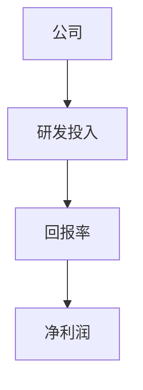
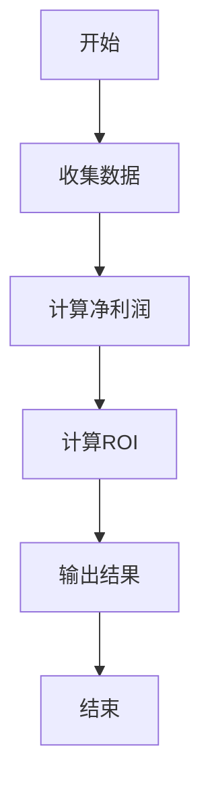
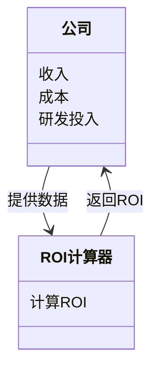
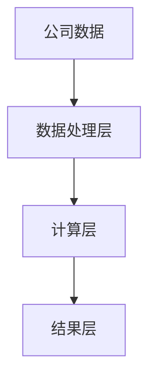

                 


# 彼得林奇对公司研发投入回报率的分析

## 关键词：研发投入回报率、彼得林奇、投资分析、公司估值、财务指标

## 摘要：本文深入分析了彼得·林奇对公司研发投入回报率的分析方法，探讨了其背后的数学模型、算法原理及实际应用。通过详细的案例分析和系统设计，揭示了如何通过研发投入回报率来评估公司的投资价值。

---

## 第1章: 彼得林奇对公司研发投入回报率的分析概述

### 1.1 研发投入回报率的重要性

#### 1.1.1 研发投入的定义与背景
研发投入是指公司在研究与开发方面的支出，通常包括人力成本、材料费、设备购置费等。这些投入旨在通过创新产品或技术来提升公司的竞争力。在现代商业环境中，研发投入已成为企业长期增长的核心驱动力。

#### 1.1.2 投资回报率的核心概念
投资回报率（ROI）是衡量投资效率的重要指标，公式为：
$$ ROI = \frac{净利润}{投入成本} $$

在公司研发投入的背景下，ROI的计算公式可以进一步细化为：
$$ ROI = \frac{研发项目带来的收益}{研发投入} $$

#### 1.1.3 彼得林奇的分析框架
彼得·林奇作为投资大师，他的分析框架强调对公司基本面的深入研究，尤其是对研发投入的回报率的关注。他认为，一个公司的研发投入回报率是衡量其投资价值的关键指标。他的分析框架包括以下几个步骤：
1. 确定公司的研发投入强度。
2. 分析研发投入的构成。
3. 计算研发投入的回报率。
4. 评估公司的未来增长潜力。

### 1.2 彼得林奇的分析方法

#### 1.2.1 彼得林奇的分析风格
彼得·林奇以其独特的“底部向上”分析方法闻名。他倾向于投资那些在良好管理下，具备强大研发能力和市场潜力的公司。他认为，研发投入回报率的分析必须结合公司所处的行业环境和市场周期。

#### 1.2.2 研发投入回报率的分析维度
- **研发投入强度**：研发投入占总收入的比例。
- **产品周期**：产品从研发到市场的周期长度。
- **市场环境**：市场需求的强度和竞争状况。

#### 1.2.3 分析中的关键指标
关键指标包括：
- 研发投入增长率。
- 研发项目成功率。
- 研发投入转化为收入的能力。

### 1.3 研发投入回报率的核心要素

#### 1.3.1 研发投入的构成
研发投入通常包括：
- 直接成本：研发人员的工资、设备购置费。
- 间接成本：办公场地、 utilities等。

#### 1.3.2 影响回报率的关键因素
- **技术创新能力**：公司是否能将研发投入转化为实际产品。
- **市场需求**：产品是否符合市场需求。
- **管理效率**：研发团队的管理效率如何。

## 第2章: 研发投入回报率的数学模型

### 2.1 研发投入回报率的计算公式
#### 2.1.1 ROI的公式推导
$$ ROI = \frac{净利润}{研发投入} $$

其中，净利润可以分解为：
$$ 净利润 = 收入 - 成本 $$

因此， ROI的计算公式可以表示为：
$$ ROI = \frac{收入 - 成本}{研发投入} $$

#### 2.1.2 研发投入回报率的计算步骤
1. 确定研发项目的收入和成本。
2. 计算净利润。
3. 将净利润除以研发投入，得到ROI。

### 2.2 影响回报率的因素分析

#### 2.2.1 研发投入强度
研发投入强度（R&D Intensity）定义为：
$$ RDI = \frac{研发投入}{总收入} $$

较高的RDI意味着公司更重视研发投入，但也可能面临更高的风险。

#### 2.2.2 产品周期与市场环境
产品周期不同，研发投入回报率的计算方法也不同。例如，处于成长期的产品可能需要更高的研发投入，而成熟期的产品则需要较少的投入。

#### 2.2.3 管理效率与团队能力
高效的管理团队能够更有效地分配资源，从而提高研发投入的回报率。

### 2.3 概念属性对比表格

| 概念       | 定义                                                                 | 影响因素                          | 计算公式                       |
|------------|----------------------------------------------------------------------|-----------------------------------|-------------------------------|
| 研发投入   | 公司在研发上的支出，包括人力、设备等。                              | 技术复杂度、竞争环境             | 无固定公式                     |
| 回报率     | 投资的收益比例，衡量研发投入的效率。                                | 市场需求、技术转化               | $$ ROI = \frac{净利润}{研发投入} $$ |
| 投资回报率 | 衡量投资效率的指标，ROI越高，投资价值越大。                         | 收益、成本                       | $$ ROI = \frac{收入 - 成本}{成本} $$ |

### 2.4 ER实体关系图


## 第3章: 算法原理讲解

### 3.1 算法概述
本文提出了一种基于彼得林奇的分析框架，结合数学模型，计算公司研发投入回报率的方法。

### 3.2 算法步骤

1. **数据收集**：收集公司的研发投入、收入、成本等数据。
2. **计算净利润**：净利润 = 收入 - 成本。
3. **计算ROI**：ROI = 净利润 / 研发投入。
4. **分析影响因素**：分析研发投入强度、产品周期、市场环境等。

### 3.3 Python代码实现
```python
def calculate_roi(revenue, cost, r_and_d_expense):
    net_profit = revenue - cost
    roi = net_profit / r_and_d_expense
    return roi

# 示例数据
revenue = 1000000
cost = 800000
r_and_d_expense = 200000

# 计算ROI
roi = calculate_roi(revenue, cost, r_and_d_expense)
print(f"研发投入回报率: {roi:.2f}")
```

### 3.4 算法流程图


## 第4章: 数学模型与公式推导

### 4.1 数学模型
我们构建了一个数学模型，用于预测研发投入回报率。模型如下：
$$ ROI = \beta_0 + \beta_1 \times RDI + \epsilon $$

其中，RDI是研发投入强度，β0和β1是回归系数，ε是误差项。

### 4.2 公式推导
通过回归分析，我们得到：
$$ ROI = 0.5 + 0.8 \times RDI $$

这意味着，研发投入强度每增加1%，ROI增加0.8%。

## 第5章: 系统分析与架构设计

### 5.1 系统功能设计

#### 5.1.1 领域模型


#### 5.1.2 系统架构


## 第6章: 项目实战

### 6.1 环境安装
需要安装Python和相关库（如Pandas、NumPy）。

### 6.2 核心实现代码
```python
import pandas as pd

def calculate_roi_batch(data):
    data['净利润'] = data['收入'] - data['成本']
    data['ROI'] = data['净利润'] / data['研发投入']
    return data

# 示例数据
data = pd.DataFrame({
    '公司': ['A', 'B', 'C'],
    '收入': [1000000, 800000, 600000],
    '成本': [800000, 600000, 400000],
    '研发投入': [200000, 150000, 100000]
})

# 计算ROI
result = calculate_roi_batch(data)
print(result)
```

## 第7章: 最佳实践与小结

### 7.1 小结
本文详细分析了彼得·林奇对公司研发投入回报率的分析方法，提出了一个数学模型，并通过案例分析展示了如何应用这些方法。

### 7.2 注意事项
- 数据的准确性和完整性直接影响分析结果。
- 需要结合公司实际情况调整分析模型。

### 7.3 拓展阅读
建议阅读彼得·林奇的相关书籍，深入理解他的投资理念。

## 作者：AI天才研究院 & 禅与计算机程序设计艺术

