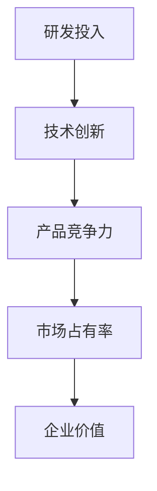

                 


# 彼得林奇对公司研发投入的分析标准

> **关键词**：彼得·林奇，研发投入，投资分析，企业价值，研发效率

> **摘要**：本文详细分析了彼得·林奇对公司研发投入的分析标准，探讨了研发投入在企业价值评估中的重要性，以及如何通过定量和定性分析来判断公司的研发效率和未来潜力。文章结合实际案例，深入解读了彼得·林奇的投资理念，为投资者提供了实用的分析框架。

---

## 第1章：引言

### 1.1 彼得·林奇的背景与成就

彼得·林奇（Peter Lynch）是美国著名的股票基金经理，以其在富达投资管理公司的卓越表现而闻名。他在任职期间管理的麦哲伦基金取得了令人瞩目的成绩，年化回报率超过29%，为投资者创造了巨额财富。彼得·林奇的投资哲学以“深入研究，长期持有”为核心，尤其注重对企业基本面的分析。

### 1.2 研发投入在企业价值中的重要性

研发投入是企业未来发展的重要驱动力，尤其是在科技和创新主导的行业中。彼得·林奇认为，合理的研发投入能够增强企业的竞争力，推动产品创新，从而提高企业的长期盈利能力。然而，过高的研发投入可能会影响短期财务表现，而过低的投入则可能导致企业失去竞争优势。

### 1.3 本书的核心目标

本文旨在揭示彼得·林奇分析公司研发投入的标准，结合实际案例，帮助投资者和企业管理者更好地理解和评估研发投入的价值。通过定量分析和定性评估，本文将展示如何将研发投入转化为企业长期增长的驱动力。

---

## 第2章：研发投入的定义与关键要素

### 2.1 研发投入的定义与分类

研发投入是指企业在研发活动中投入的资金、资源和人力资源。通常分为资本性支出和费用性支出。资本性支出用于购买研发设备和长期资产，而费用性支出用于支付研发人员的工资和日常研发费用。

### 2.2 彼得·林奇的分析维度

彼得·林奇从以下几个方面分析公司的研发投入：

- **金额与收入比例**：研发投入占收入的比例是衡量研发投入合理性的重要指标。
- **结构与用途**：分析研发投入的分配是否合理，是否用于核心产品的开发。
- **效率与成果**：评估研发投入的产出效率，包括专利数量、新产品推出速度等。

---

## 第3章：核心概念与联系

### 3.1 研发投入的关键要素

| 关键要素         | 定义与属性                     | 彼得·林奇的观点                 |
|------------------|-------------------------------|-------------------------------|
| 研发投入金额     | 研发活动的总支出               | 合理的研发投入是企业未来增长的关键 |
| 研发投入结构     | 各项研发支出的分配比例         | 重点支持核心产品的研发投入       |
| 研发效率         | 研发投入产出的效率             | 高效的研发投入能够创造更大的价值 |

### 3.2 研发投入与企业价值的关系

通过以下Mermaid图，可以更直观地理解研发投入与企业价值的关系：



---

## 第4章：算法原理讲解

### 4.1 研发投入分析模型

彼得·林奇的分析模型可以通过以下步骤进行：

1. 计算研发投入占收入的比例：
   $$ 研发投入比率 = \frac{研发投入}{营业收入} $$

2. 分析研发投入的结构：
   - 核心产品研发投入比例
   - 新产品研发与维护比例

3. 评估研发效率：
   - 专利数量与研发投入的对比
   - 新产品推出速度与研发投入的对比

### 4.2 Python代码实现

以下代码展示了如何计算某公司的研发投入比率：

```python
import pandas as pd

# 假设df为公司财务数据，包含"研发投入"和"营业收入"两列
def calculate_research_ratio(df):
    return df["研发投入"] / df["营业收入"]

# 示例数据
data = {
    "公司": ["公司A", "公司B", "公司C"],
    "研发投入": [100, 150, 200],
    "营业收入": [500, 600, 700]
}

df = pd.DataFrame(data)
research_ratios = calculate_research_ratio(df)

print("研发投入比率:")
print(research_ratios)
```

### 4.3 数学模型与公式

- 研发投入比率公式：
  $$ 研发投入比率 = \frac{研发投入}{营业收入} $$

- 研发效率公式：
  $$ 研发效率 = \frac{专利数量}{研发投入} $$

---

## 第5章：系统分析与架构设计方案

### 5.1 案例分析：苹果公司的研发投入

通过分析苹果公司的研发投入情况，我们可以更好地理解彼得·林奇的分析方法。

1. **研发投入占收入的比例**：
   $$ 研发投入比率 = \frac{研发投入}{营业收入} $$

2. **研发投入的结构**：
   - iOS开发
   - 产品设计
   - 其他

3. **研发效率评估**：
   - 苹果每年申请的专利数量
   - 新产品推出速度

---

## 第6章：项目实战

### 6.1 环境安装

- 安装Python和相关库（pandas、numpy）

### 6.2 核心代码实现

```python
import pandas as pd

# 示例数据
data = {
    "公司": ["公司A", "公司B", "公司C"],
    "研发投入": [100, 150, 200],
    "营业收入": [500, 600, 700],
    "专利数量": [20, 30, 25]
}

df = pd.DataFrame(data)

# 计算研发投入比率
research_ratios = df["研发投入"] / df["营业收入"]

# 计算研发效率
research_efficiency = df["专利数量"] / df["研发投入"]

# 输出结果
print("公司 | 研发投入比率 | 研发效率")
print("--- | --- | ---")
for i in range(len(df)):
    print(f"{df['公司'][i]} | {research_ratios[i]} | {research_efficiency[i]}")
```

### 6.3 案例分析与讨论

通过上述代码，我们可以得出各公司的研发投入比率和研发效率，从而判断其研发投入的合理性。

---

## 第7章：总结与展望

### 7.1 最佳实践

- 定期评估公司的研发投入比率和效率
- 关注核心产品的研发投入
- 结合专利数量和新产品推出速度评估研发效率

### 7.2 小结

彼得·林奇的分析方法为我们提供了一个有效的框架，帮助我们评估公司的研发投入。通过定量分析和定性评估，我们可以更好地判断公司的未来潜力。

### 7.3 注意事项

- 研发投入的分析应结合企业的具体情况
- 避免仅关注短期财务数据
- 长期跟踪企业的研发产出

### 7.4 拓展阅读

- 彼得·林奇的书籍：《彼得·林奇的选股标准》
- 其他投资分析方法：价值投资、成长投资

---

## 作者

作者：AI天才研究院 & 禅与计算机程序设计艺术

---

以上是《彼得林奇对公司研发投入的分析标准》的技术博客文章，详细分析了彼得·林奇的分析标准，并结合实际案例和代码示例，帮助读者更好地理解和应用这些分析方法。

