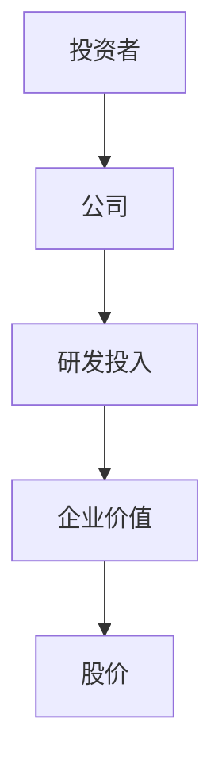
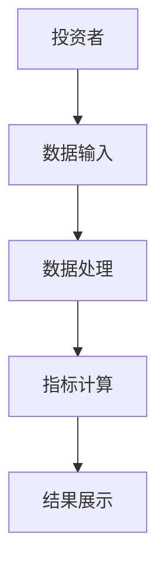
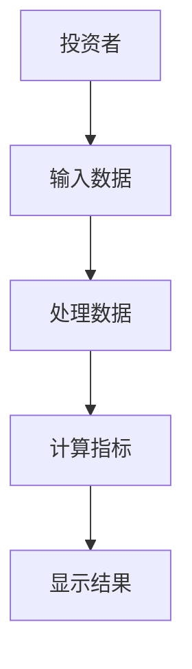

                 


# 彼得林奇对公司研发投入的评估方法

> 关键词：公司研发投入评估，彼得林奇，投资评估，研发投入回报率，研发投入周期

> 摘要：本文详细探讨了彼得·林奇在评估公司研发投入方面的方法和策略，分析了研发投入在企业价值中的作用，提出了基于研发投入强度、周期和回报率的评估框架，并通过实例分析和数学模型展示了如何在实际投资决策中应用这些方法。

---

# 第一部分：公司研发投入评估的背景与核心概念

## 第1章：公司研发投入评估的背景与重要性

### 1.1 投资评估中的研发投入问题

#### 1.1.1 投资评估的核心问题
在投资领域，评估一家公司的价值是核心任务之一。投资者需要了解公司的财务状况、市场地位、盈利能力以及未来的增长潜力。其中，研发投入是影响公司长期价值的重要因素，尤其是在科技行业。研发投入反映了公司对未来创新的投入和对技术领先的追求。

#### 1.1.2 研发投入在企业价值中的作用
研发投入是企业将资源用于研究和开发新产品或改进现有产品的能力。它直接影响企业的创新能力和市场竞争力。高研发投入通常意味着公司具备更强的技术储备和未来增长潜力，从而可能带来更高的股价和投资回报。

#### 1.1.3 彼得·林奇的投资风格与研发投入评估
彼得·林奇是美国著名的投资经理，以其成功的投资业绩和对成长型股票的偏好而闻名。他认为，公司未来的增长潜力是决定股价的关键因素，而研发投入是衡量公司成长潜力的重要指标之一。林奇注重分析公司的财务数据和行业地位，尤其是研发投入的合理性和效率。

### 1.2 研发投入的定义与分类

#### 1.2.1 研发投入的定义
研发投入是指企业在研究与开发活动中投入的资金、时间和资源。这些投入用于开发新产品、改进现有产品、优化生产流程和提升技术能力。

#### 1.2.2 研发投入的主要分类
1. **按行业分类**：不同行业的研发投入比例和性质不同。例如，科技行业通常研发投入较高，而传统制造业研发投入相对较低。
2. **按时间分类**：研发投入可以分为短期投入和长期投入。短期投入主要用于现有产品的改进，长期投入用于未来产品的开发。
3. **按用途分类**：研发投入可以分为基础研究、应用研究和产品开发三类。

#### 1.2.3 研发投入与企业长期价值的关系
高研发投入通常意味着公司具备更强的创新能力，能够推出新产品并保持竞争优势。然而，研发投入并非越高越好，关键在于投入的效率和回报。如果研发投入能够转化为实际的市场收益，将显著提升企业的长期价值。

### 1.3 研发投入评估的必要性

#### 1.3.1 研发投入对企业竞争力的影响
研发投入是企业保持竞争优势的重要手段。通过研发投入，企业可以推出创新产品，满足市场需求，从而在竞争中占据优势。

#### 1.3.2 研发投入对股价的影响
高研发投入通常被视为公司未来增长的潜力，能够吸引投资者的关注，从而推高股价。然而，如果研发投入无法转化为实际收益，可能对股价产生负面影响。

#### 1.3.3 研发投入评估的挑战与机遇
评估研发投入的挑战在于如何量化其对业绩的贡献，以及如何评估其未来的回报。这需要投资者具备深入的行业知识和数据分析能力。

---

## 第2章：彼得·林奇的公司研发投入评估方法概述

### 2.1 彼得·林奇的投资理念

#### 2.1.1 林奇的投资哲学
林奇认为，投资的最终目标是寻找那些能够持续增长的公司。他注重分析公司的基本面，尤其是财务数据和行业地位。

#### 2.1.2 林奇对研发投入的关注点
林奇认为，高研发投入并不一定意味着公司能够成功，关键在于研发投入的效率和回报。他关注公司是否能够将研发投入转化为实际的产品和市场收益。

#### 2.1.3 林奇的成功投资案例分析
以微软为例，微软在20世纪80年代和90年代进行了大量的研发投入，推出了Windows操作系统和Office软件，这些产品为公司带来了巨大的成功。

### 2.2 研发投入评估的核心指标

#### 2.2.1 研发投入强度
研发投入强度是指公司研发投入占营业收入的比例。该指标用于衡量公司对研发的重视程度。

$$ ROI = \frac{研发费用}{营业收入} $$

#### 2.2.2 研发投入周期
研发投入周期是指从研发开始到产品商业化的时间。该指标用于衡量公司研发效率和市场反应速度。

#### 2.2.3 研发投入回报率
研发投入回报率是指公司研发投入带来的净利润增长比例。该指标用于衡量研发投入的经济效益。

$$ ROI = \frac{净利润增长}{研发投入} $$

### 2.3 研发投入评估的框架

#### 2.3.1 评估框架的构成
评估框架包括以下几个步骤：
1. **收集数据**：收集公司的财务数据、行业数据和市场数据。
2. **计算指标**：计算研发投入强度、周期和回报率等指标。
3. **分析结果**：结合行业平均水平和公司历史数据，分析研发投入的合理性和效率。

#### 2.3.2 评估框架的应用步骤
1. **数据收集**：收集公司的研发投入数据和财务数据。
2. **指标计算**：计算研发投入强度、周期和回报率。
3. **结果分析**：将公司指标与行业平均水平进行对比，评估公司研发投入的合理性和效率。

#### 2.3.3 评估框架的优缺点
优点：指标简单易懂，便于分析和比较。
缺点：指标可能无法完全反映公司的实际情况，需要结合其他因素综合考虑。

---

## 第3章：研发投入评估的核心概念与联系

### 3.1 评估模型的原理

#### 3.1.1 模型的输入变量
- 研发费用
- 营业收入
- 净利润

#### 3.1.2 模型的输出结果
- 研发投入强度
- 研发投入回报率

#### 3.1.3 模型的数学表达式
$$ ROI = \frac{净利润增长}{研发投入} $$

### 3.2 核心概念的属性特征对比

| 概念         | 描述                                                                 |
|--------------|--------------------------------------------------------------------|
| 研发投入强度 | 研发投入占营业收入的比例                                               |
| 研发投入周期 | 从研发开始到产品商业化的时间                                           |
| 研发投入回报率 | 研发投入带来的净利润增长比例                                         |

### 3.3 ER实体关系图架构



---

## 第4章：研发投入评估的算法原理

### 4.1 算法原理概述

#### 4.1.1 算法的基本思路
通过分析公司的研发投入数据，计算研发投入强度、周期和回报率，结合行业平均水平和公司历史数据，评估公司研发投入的合理性和效率。

#### 4.1.2 算法的输入输出
输入：公司研发投入数据、财务数据和行业数据。
输出：研发投入强度、周期和回报率。

#### 4.1.3 算法的数学模型
$$ ROI = \frac{净利润增长}{研发投入} $$

### 4.2 算法的数学模型

$$ ROI = \frac{净利润增长}{研发投入} $$

---

## 第5章：系统分析与架构设计方案

### 5.1 问题场景介绍

#### 5.1.1 项目介绍
本项目旨在设计一个基于彼得·林奇方法的公司研发投入评估系统，帮助投资者快速评估公司的研发投入情况。

#### 5.1.2 系统功能设计
- 数据收集与处理
- 指标计算与分析
- 结果展示与报告

### 5.2 系统架构设计



### 5.3 系统接口设计

#### 5.3.1 数据接口
- 数据输入接口：接收公司的研发投入数据和财务数据。
- 数据输出接口：输出评估结果和报告。

#### 5.3.2 用户界面
- 界面设计：用户友好的界面，方便投资者输入数据和查看结果。

### 5.4 系统交互设计



---

## 第6章：项目实战

### 6.1 环境安装

#### 6.1.1 安装Python
- 下载并安装Python
- 安装必要的库：pandas、numpy、matplotlib

#### 6.1.2 安装其他工具
- 安装Mermaid工具：用于绘制图表。

### 6.2 系统核心实现源代码

```python
import pandas as pd
import numpy as np
import matplotlib.pyplot as plt

# 数据输入
data = {
    '公司': ['A', 'B', 'C'],
    '研发投入': [100, 200, 150],
    '营业收入': [500, 800, 600],
    '净利润': [100, 150, 120]
}

df = pd.DataFrame(data)

# 计算研发投入强度
df['研发投入强度'] = df['研发投入'] / df['营业收入']

# 计算研发投入回报率
df['净利润增长'] = df['净利润'].diff()
df['研发投入回报率'] = df['净利润增长'] / df['研发投入']

print(df)
```

### 6.3 代码应用解读与分析

- 数据输入：公司名称、研发投入、营业收入和净利润。
- 计算研发投入强度：研发投入占营业收入的比例。
- 计算净利润增长：净利润的变化量。
- 计算研发投入回报率：净利润增长除以研发投入。

### 6.4 实际案例分析

以公司A为例：
- 研发投入强度 = 100 / 500 = 0.2
- 净利润增长 = 100（假设）
- 投入回报率 = 100 / 100 = 1

---

## 第7章：总结与展望

### 7.1 最佳实践 tips

- 选择具有较高研发投入回报率的公司。
- 结合行业平均水平和公司历史数据进行分析。
- 定期更新数据，及时调整投资策略。

### 7.2 小结

本文详细探讨了彼得·林奇在评估公司研发投入方面的方法和策略，分析了研发投入在企业价值中的作用，并提出了基于研发投入强度、周期和回报率的评估框架。

### 7.3 注意事项

- 研发投入评估需要结合公司实际情况和市场环境。
- 数据分析需准确，避免误导性结论。

### 7.4 拓展阅读

- 彼得·林奇的投资哲学
- 研发投入与企业价值的关系
- 其他投资评估方法

---

作者：AI天才研究院/AI Genius Institute & 禅与计算机程序设计艺术 /Zen And The Art of Computer Programming

