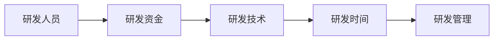
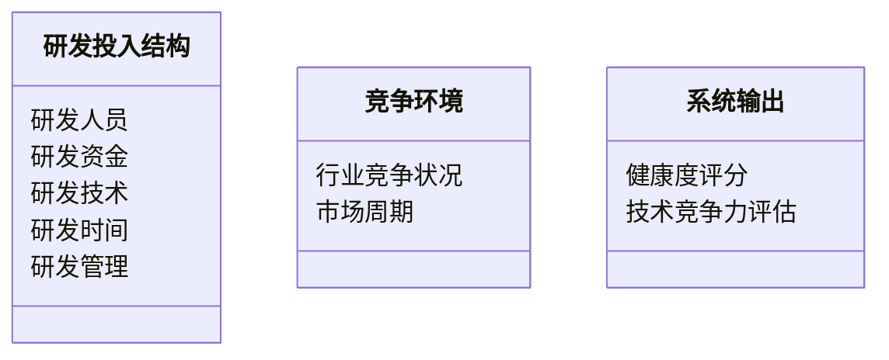

                 


# 彼得林奇对公司研发投入结构的长期跟踪分析

**关键词**：彼得·林奇，研发投入结构，长期跟踪分析，公司价值，技术分析，投资策略

**摘要**：本文深入分析了彼得·林奇对公司研发投入结构的长期跟踪分析方法，探讨了研发投入结构的核心要素及其对公司的战略意义，通过算法原理和实际案例，展示了如何通过长期跟踪分析评估公司的研发能力和发展潜力，为投资者提供科学的投资决策依据。

---

# 第1章: 背景介绍与核心概念

## 1.1 研发投入结构的定义与特征
### 1.1.1 研发投入的核心概念
研发投入结构是指公司用于研发活动的资源分配方式，包括资金、人员、时间和技术方向的配置。

### 1.1.2 研发投入的分类与维度
- 资金投入：研发预算的分配比例。
- 人员构成：研发团队的规模、结构和能力。
- 技术方向：研发投入的技术领域和优先级。
- 时间跨度：研发项目的时间规划和执行效率。
- 管理方式：研发管理的组织架构和流程效率。

### 1.1.3 研发投入对公司的战略意义
- 提升技术创新能力。
- 增强市场竞争力。
- 优化资源配置效率。
- 降低投资风险。

## 1.2 彼得·林奇的长期跟踪分析方法
### 1.2.1 彼得·林奇的分析框架
- 研发投入结构的动态变化分析。
- 竞争环境对研发投入的影响。
- 行业周期对研发投入的影响。

### 1.2.2 长期跟踪分析的意义
- 发现公司研发能力的潜在问题。
- 评估公司技术竞争力的持续性。
- 为投资决策提供数据支持。

### 1.2.3 研发投入结构与公司价值的关系
- 研发投入结构优化与公司价值增长的正相关性。

---

# 第2章: 研发投入结构的核心要素

## 2.1 研发投入的主要维度
### 2.1.1 研发人员构成
- 研发团队的规模、能力和稳定性。
- 研发人员的流动率和效率。

### 2.1.2 研发资金分配
- 研发预算的分配比例。
- 资金的使用效率和回报率。

### 2.1.3 研发技术方向
- 技术领域的选择和优先级。
- 技术研发的创新性和可行性。

### 2.1.4 研发时间跨度
- 研发项目的周期规划。
- 时间管理对研发效率的影响。

### 2.1.5 研发管理方式
- 管理组织架构的合理性。
- 管理流程的效率和透明度。

## 2.2 研发投入结构的特征对比
### 2.2.1 表格对比分析
| 维度 | 特征 | 重要性 |
|------|------|--------|
| 人员 | 稳定性 | 高     |
| 资金 | 投向合理性 | 中高 |
| 技术 | 创新性 | 高     |

### 2.2.2 图形化展示


### 2.2.3 核心要素的权重分配
- 人员：40%
- 资金：30%
- 技术：20%
- 时间：10%
- 管理：5%

---

# 第3章: 研发投入结构的长期跟踪分析框架

## 3.1 彼得·林奇的分析模型
### 3.1.1 模型的核心要素
- 研发投入的动态变化。
- 竞争环境的影响。
- 行业周期的影响。

### 3.1.2 模型的输入与输出
- 输入：公司研发投入的历史数据、行业竞争状况、市场周期。
- 输出：研发投入结构的健康度评分、公司技术竞争力评估。

### 3.1.3 模型的适用场景
- 公司价值评估。
- 投资决策支持。
- 研发战略优化。

## 3.2 研发投入结构的动态变化分析
### 3.2.1 短期与长期变化的对比
- 短期变化：研发投入的波动性。
- 长期变化：研发投入的持续性和稳定性。

### 3.2.2 竞争环境对研发投入的影响
- 竞争加剧：研发投入增加。
- 竞争缓和：研发投入减少。

### 3.2.3 行业周期对研发投入的影响
- 上行周期：研发投入增加。
- 下行周期：研发投入减少。

## 3.3 本章小结
通过长期跟踪分析，彼得·林奇能够准确评估公司研发投入结构的变化趋势及其对 company value 的影响。

---

# 第4章: 彼得·林奇分析模型的算法原理

## 4.1 模型的输入与输出
### 4.1.1 输入数据
- 公司研发投入的历史数据。
- 行业竞争状况。
- 市场周期数据。

### 4.1.2 输出结果
- 研发投入结构的健康度评分。
- 公司技术竞争力评估。

## 4.2 算法原理与数学模型
### 4.2.1 算法步骤
1. 数据收集与清洗。
2. 研发投入结构的量化评估。
3. 竞争环境与市场周期的分析。
4. 综合评分计算。

### 4.2.2 数学模型
$$ \text{健康度评分} = \sum (\text{人员评分} \times 0.4 + \text{资金评分} \times 0.3 + \text{技术评分} \times 0.2 + \text{时间评分} \times 0.1) $$

### 4.2.3 代码实现
```python
def calculate_health_score(employees_score, funds_score, technology_score, time_score):
    health_score = employees_score * 0.4 + funds_score * 0.3 + technology_score * 0.2 + time_score * 0.1
    return health_score

# 示例数据
employees_score = 85
funds_score = 70
technology_score = 90
time_score = 60

health_score = calculate_health_score(employees_score, funds_score, technology_score, time_score)
print("健康度评分：", health_score)
```

---

# 第5章: 系统分析与架构设计方案

## 5.1 问题场景介绍
- 如何高效跟踪和分析公司研发投入结构。
- 如何利用系统化方法提升分析效率。

## 5.2 系统功能设计
### 5.2.1 领域模型


### 5.2.2 系统架构设计


### 5.2.3 接口设计
- 数据接口：RESTful API。
- 用户接口：Web界面。

### 5.2.4 交互流程

```mermaid
sequenceDiagram
    系统用户 -> 研发投入数据采集模块: 提供历史数据
    研发投入数据采集模块 -> 竞争环境数据采集模块: 获取竞争环境数据
    竞争环境数据采集模块 -> 算法处理模块: 传递数据
    算法处理模块 -> 系统输出模块: 输出健康度评分
    系统输出模块 -> 系统用户: 显示结果
```


---

# 第6章: 项目实战

## 6.1 环境安装与数据准备
### 6.1.1 环境安装
- 安装Python和必要的库（Pandas, Matplotlib）。

### 6.1.2 数据准备
- 下载公司研发投入数据和行业竞争数据。

## 6.2 系统核心实现
### 6.2.1 数据清洗与预处理
```python
import pandas as pd

# 读取数据
df = pd.read_csv('研发数据.csv')

# 数据清洗
df.dropna(inplace=True)
df['研发金额'] = df['研发金额'].astype(float)
```

### 6.2.2 算法实现
```python
def calculate_health_score(employees_score, funds_score, technology_score, time_score):
    return employees_score * 0.4 + funds_score * 0.3 + technology_score * 0.2 + time_score * 0.1

# 示例计算
employees_score = 85
funds_score = 70
technology_score = 90
time_score = 60

health_score = calculate_health_score(employees_score, funds_score, technology_score, time_score)
print(f"健康度评分：{health_score}")
```

### 6.2.3 可视化展示
```python
import matplotlib.pyplot as plt

# 绘制研发投入结构分布图
plt.bar(['人员', '资金', '技术', '时间'], [85, 70, 90, 60])
plt.title('研发投入结构健康度评分')
plt.show()
```

## 6.3 实际案例分析
### 6.3.1 案例选择
- 某科技公司研发投入分析。

### 6.3.2 分析结果
- 健康度评分：78分。
- 技术竞争力评估：中等偏上。

---

# 第7章: 总结与最佳实践

## 7.1 本章小结
- 彼得·林奇的长期跟踪分析方法的核心在于对研发投入结构的动态评估。
- 通过系统化的方法和工具，可以提高分析效率和准确性。

## 7.2 最佳实践 tips
- 定期更新数据，保持分析的实时性。
- 结合行业趋势，优化分析模型。
- 多维度分析，避免单一维度的偏差。

## 7.3 注意事项
- 数据的准确性和完整性。
- 分析模型的适用性和可扩展性。

## 7.4 拓展阅读
- 彼得·林奇的其他分析方法。
- 其他投资策略的相关书籍。

---

# 作者：AI天才研究院 & 禅与计算机程序设计艺术

