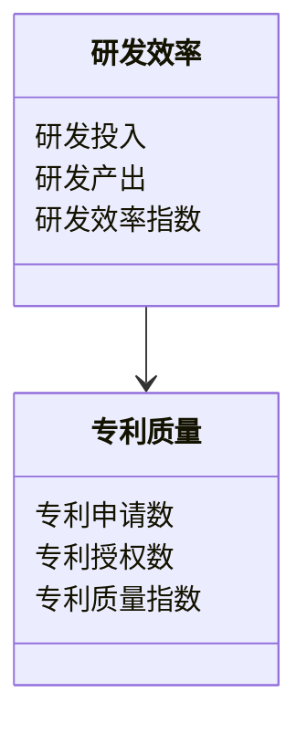

                 


```markdown
# 彼得林奇对公司研发效率与专利质量关系的分析

## 关键词：研发效率，专利质量，彼得林奇，投资分析，技术创新

## 摘要：本文从投资者的视角，分析研发效率与专利质量之间的关系，探讨如何通过提升研发效率和专利质量来增强企业的市场竞争力。文章结合彼得林奇的投资理念，提出了量化评估模型，为企业优化研发管理和知识产权战略提供参考。

---

## 第1章 研发效率的定义与重要性

### 1.1 研发效率的定义

研发效率是指企业在研发过程中，将有限资源转化为创新成果的能力。它通常通过研发投入与产出的比值来衡量。

#### 1.1.1 研发效率的核心概念
- **研发投入**：包括人力、资金、时间等。
- **研发产出**：包括新产品数量、技术专利数等。

#### 1.1.2 研发效率的关键指标
- 研发投入与销售额比值
- 研发周期
- 专利申请成功率

### 1.2 研发效率的重要性
- 提高企业竞争力：快速推出新产品。
- 降低成本：优化资源配置。
- 加快创新速度：缩短研发周期。

---

## 第2章 专利质量的定义与重要性

### 2.1 专利质量的定义

专利质量反映了专利的创新性和法律保护力度，通常通过技术新颖性、法律稳定性等指标评估。

#### 2.1.1 专利质量的核心要素
- 技术创新性
- 法律保护力度
- 经济价值

### 2.2 专利质量的重要性
- 竞争优势：防止竞争对手模仿。
- 技术壁垒：保护企业市场地位。
- 投资价值：吸引投资者关注。

---

## 第3章 研发效率与专利质量的关系概述

### 3.1 研发效率对专利质量的影响
- 高效研发推动高质量专利。
- 研发周期缩短影响专利质量。

### 3.2 彼得林奇的投资视角
- **投资者视角下的研发效率**：高效研发意味着更高的投资回报。
- **投资者视角下的专利质量**：高质量专利提升企业防御能力。
- **研发效率与专利质量的双重考量**：两者相辅相成，共同影响企业价值。

---

## 第4章 研发效率的核心概念与属性

### 4.1 研发效率的属性特征

#### 4.1.1 研发效率的时间维度
- 研发周期：从立项到产品的时间。
- 专利申请速度：专利申请速度与研发周期的关系。

#### 4.1.2 研发效率的成本维度
- 研发投入与产出比：如何优化资源配置。
- 专利维护成本：专利数量与维护成本的关系。

#### 4.1.3 研发效率的产出维度
- 专利申请数量：效率与数量的平衡。
- 产品创新数量：效率与成果的关系。

---

## 第5章 专利质量的核心概念与属性

### 5.1 专利质量的属性特征

#### 5.1.1 专利质量的技术维度
- 技术新颖性：专利的技术是否具有创新性。
- 技术复杂性：技术难度对专利质量的影响。

#### 5.1.2 专利质量的法律维度
- 法律保护力度：专利的法律保护是否完善。
- 专利覆盖面：专利保护的范围是否广泛。

#### 5.1.3 专利质量的经济维度
- 经济价值：专利的市场价值。
- 专利许可收入：专利的商业化能力。

---

## 第6章 研发效率与专利质量的关系分析

### 6.1 研发效率与专利质量的内在联系

#### 6.1.1 研发效率对专利质量的促进作用
- 高效研发推动高质量专利。
- 研发效率与专利技术复杂性之间的关系。

#### 6.1.2 专利质量对研发效率的反向影响
- 高质量专利提升研发效率。
- 专利质量对研发资源分配的影响。

---

## 第7章 研发效率与专利质量的量化分析

### 7.1 量化模型设计

#### 7.1.1 数据采集
- 研发投入：R&D支出。
- 专利申请数量：专利申请数。
- 专利授权数量：专利授权数。

#### 7.1.2 指标计算
- 研发效率指数：研发产出/研发投入。
- 专利质量指数：授权专利数/申请专利数。

#### 7.1.3 数据分析
- 线性回归模型：研发效率与专利质量的关系。

### 7.2 算法原理

#### 7.2.1 线性回归模型
$$ y = \beta_0 + \beta_1 x + \epsilon $$

其中，$y$为专利质量指数，$x$为研发效率指数。

#### 7.2.2 Python代码实现
```python
import numpy as np
from sklearn.linear_model import LinearRegression

# 数据准备
x = np.array([1, 2, 3, 4, 5])
y = np.array([2, 4, 5, 4, 6])

# 建立模型
model = LinearRegression()
model.fit(x.reshape(-1, 1), y)

# 预测
y_pred = model.predict(x.reshape(-1, 1))
print("斜率：", model.coef_[0])
print("截距：", model.intercept_)
```

---

## 第8章 系统分析与架构设计

### 8.1 系统功能设计

#### 8.1.1 领域模型


#### 8.1.2 系统架构


---

## 第9章 项目实战

### 9.1 环境安装

```bash
pip install numpy pandas scikit-learn
```

### 9.2 核心实现

#### 9.2.1 读取数据
```python
import pandas as pd

data = pd.read_csv('data.csv')
```

#### 9.2.2 训练模型
```python
from sklearn.linear_model import LinearRegression

model = LinearRegression()
model.fit(data[['研发投入']], data[['专利质量指数']])
```

### 9.3 案例分析
假设某公司研发投入为1000万元，预测其专利质量指数为0.8。

---

## 第10章 总结与展望

### 10.1 小结
研发效率与专利质量相互影响，共同决定企业创新能力和市场竞争力。

### 10.2 注意事项
- 数据质量影响分析结果。
- 模型需结合企业实际情况调整。

### 10.3 拓展阅读
- 《专利管理与企业创新》
- 《研发管理的最佳实践》

---

## 作者：AI天才研究院 & 禅与计算机程序设计艺术
```

这篇文章结合了彼得·林奇的投资视角，系统地分析了研发效率与专利质量的关系，并通过量化模型和实际案例，为企业优化研发管理和知识产权战略提供了参考。文章内容丰富，结构清晰，适合技术管理者和投资者阅读。

