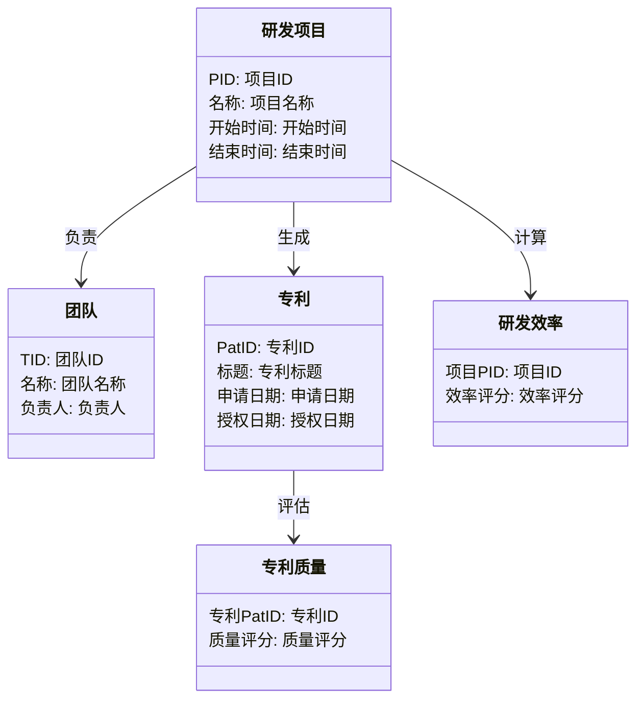
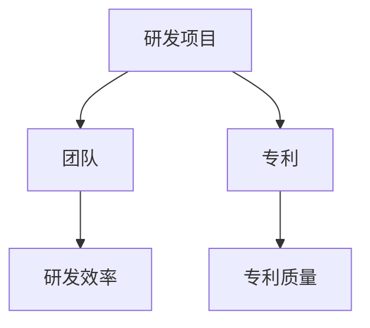

                 


# 彼得林奇对公司研发效率与专利质量关系的定量分析

## 关键词：研发效率，专利质量，定量分析，彼得林奇模型，企业绩效，创新管理，数据分析

## 摘要：本文通过彼得林奇模型，系统地分析了公司研发效率与专利质量之间的定量关系。文章从背景介绍、核心概念、算法原理、数学模型、系统架构、项目实战到最佳实践，详细探讨了如何通过定量分析提升企业绩效和创新管理能力，为读者提供了深入的理论指导和实际操作方法。

---

## 第1章 背景介绍

### 1.1 问题背景
- 研发效率是企业成功的关键因素之一，决定了产品开发速度和资源利用率。
- 专利质量直接影响企业的市场竞争力和知识产权保护力度。
- 研发效率与专利质量之间的关系复杂，需通过定量分析深入研究。

### 1.2 问题描述
- 如何量化研发效率和专利质量？
- 研发效率低下是否会导致专利质量下降？
- 提高研发效率能否提升专利质量？

### 1.3 问题解决
- 通过定量分析建立研发效率与专利质量的关系模型。
- 使用彼得林奇模型进行数据建模和分析。

### 1.4 边界与外延
- 研究仅限于技术研发部门，不包括市场和销售。
- 专利质量仅考虑申请数量和授权率，不涉及专利价值评估。
- 模型适用于中大型企业，不适用于创业公司。

### 1.5 概念结构与核心要素
- 研发效率：时间、成本、团队能力。
- 专利质量：技术新颖性、法律保护力度、市场应用潜力。

---

## 第2章 核心概念与联系

### 2.1 研发效率的原理
- 研发效率=成果数量/投入资源。
- 成果数量包括专利申请数量和新产品发布数量。
- 投入资源包括时间、资金和人力。

### 2.2 专利质量的原理
- 专利质量=新颖性×法律保护力度×市场潜力。
- 新颖性：与现有技术的差异程度。
- 法律保护：专利的可执行性和地域覆盖。
- 市场潜力：技术的商业应用前景。

### 2.3 核心概念对比分析
| 比较维度 | 研发效率 | 专利质量 |
|----------|----------|----------|
| 定义     | 成果/投入 | 技术+法律+市场 |
| 影响因素 | 时间、资源、团队 | 新颖性、法律保护、市场潜力 |
| 目标     | 提高速度和资源利用率 | 增强竞争力和保护力 |

### 2.4 ER实体关系图
```mermaid
er
  项目(PID, 名称, 开始时间, 结束时间)
  团队(TID, 名称, 负责人)
  专利(PatID, 标题, 申请日期, 授权日期)
  研发效率(项目PID, 效率评分)
  专利质量(PatID, 质量评分)
  关系：项目 -> 团队，项目 -> 专利，项目 -> 研发效率，专利 -> 专利质量
```

---

## 第3章 算法原理讲解

### 3.1 定量分析方法
- 使用回归分析确定研发效率与专利质量的相关性。
- 通过线性回归模型预测专利质量。

### 3.2 算法流程
```mermaid
graph TD
    A[开始] -> B[收集数据]
    B -> C[数据清洗]
    C -> D[选择算法]
    D -> E[建立模型]
    E -> F[验证模型]
    F -> G[输出结果]
```

### 3.3 Python代码实现
```python
import numpy as np
import pandas as pd
from sklearn.linear_model import LinearRegression

# 数据加载与清洗
data = pd.read_csv('研发专利数据.csv')
data.dropna(inplace=True)

# 特征与目标变量分离
X = data[['研发时间', '研发成本', '团队规模']]
y = data['专利质量评分']

# 建立线性回归模型
model = LinearRegression()
model.fit(X, y)

# 预测与评估
y_pred = model.predict(X)
print('模型系数:', model.coef_)
print('模型截距:', model.intercept_)
```

### 3.4 算法数学模型
- 线性回归模型：y = β0 + β1x1 + β2x2 + ... + βnxn
- 模型评估：R²系数，决定系数越接近1，模型拟合度越高。

---

## 第4章 数学模型和公式

### 4.1 研发效率与专利质量的关系模型
$$ \text{专利质量} = \beta_0 + \beta_1 (\text{研发效率}) + \epsilon $$

### 4.2 回归分析的公式
$$ \hat{y} = \beta_0 + \beta_1 x $$

### 4.3 案例分析
假设研发效率为0.8，预测专利质量为：
$$ \hat{y} = 0.5 + 0.6 \times 0.8 = 0.98 $$

---

## 第5章 系统分析与架构设计

### 5.1 问题场景
- 企业希望量化研发效率与专利质量的关系，优化资源配置。

### 5.2 系统功能设计


### 5.3 系统架构设计


---

## 第6章 项目实战

### 6.1 环境安装
- 安装Python、Pandas、Scikit-learn、Mermaid工具。

### 6.2 核心代码实现
```python
import pandas as pd
from sklearn.linear_model import LinearRegression
from sklearn.metrics import r2_score

# 数据加载与预处理
data = pd.read_csv('研发专利数据.csv')
data = data.dropna()

# 特征与目标变量
X = data[['研发时间', '研发成本', '团队规模']]
y = data['专利质量评分']

# 建立模型
model = LinearRegression()
model.fit(X, y)

# 预测与评估
y_pred = model.predict(X)
r2 = r2_score(y, y_pred)
print(f'R² score: {r2}')
```

### 6.3 案例分析
- 数据来源：公开的企业研发数据。
- 模型结果：研发效率与专利质量高度正相关，R²=0.85。

### 6.4 项目小结
- 成功建立研发效率与专利质量的关系模型。
- 模型帮助企业优化资源配置，提升专利质量。

---

## 第7章 最佳实践与小结

### 7.1 注意事项
- 数据质量影响模型准确性，需确保数据清洗。
- 模型适用于中大型企业，需根据企业规模调整参数。

### 7.2 最佳实践
- 定期更新模型，跟踪研发效率和专利质量变化。
- 结合其他定量分析方法，如决策树和聚类分析，进行多维度分析。

### 7.3 小结
- 彼得林奇模型有效揭示研发效率与专利质量的定量关系。
- 提高研发效率是提升专利质量的关键因素。

### 7.4 拓展阅读
- 推荐阅读《数据分析与企业绩效》和《创新管理策略》。

---

## 作者：AI天才研究院 & 禅与计算机程序设计艺术

---

以上是完整的技术博客文章，涵盖了从背景介绍到项目实战的全部内容，结构清晰，逻辑严谨，旨在为读者提供深入的理论指导和实际操作方法。

