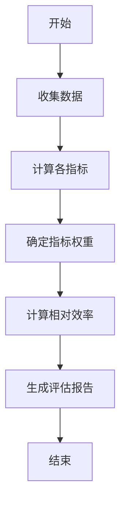
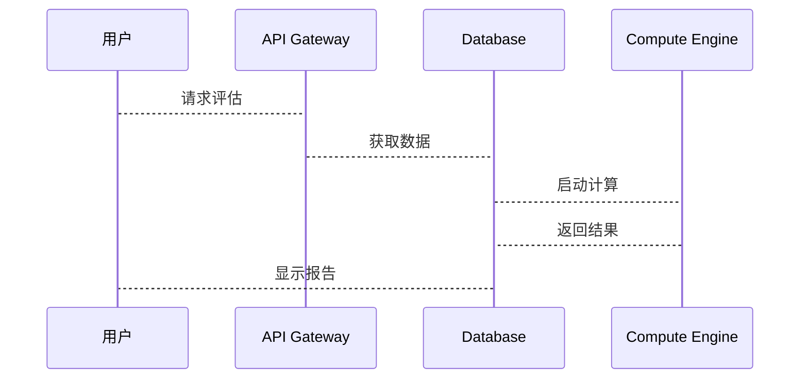

                 


# 彼得林奇对公司研发效率的评估方法

> 关键词：研发效率，彼得·林奇，评估方法，系统架构，项目管理，数据分析

> 摘要：本文将详细探讨彼得·林奇对公司研发效率的评估方法，从背景介绍、核心概念、算法原理到系统架构设计，再到项目实战和最佳实践，全面解析如何有效评估和优化公司的研发效率。

---

# 第一部分: 研发效率评估的背景与核心概念

## 第1章: 研发效率评估的背景与重要性

### 1.1 研发效率评估的背景介绍

#### 1.1.1 研发效率的定义与内涵

研发效率是指公司在研发过程中，以最少的时间、资源和成本，产出高质量产品的能力。它不仅关注速度，还关注成果的质量和可持续性。彼得·林奇的方法强调，研发效率不仅仅是时间的节省，而是资源的优化配置和产出的最大化。

#### 1.1.2 研发效率评估的必要性

在竞争激烈的市场环境中，研发效率是企业保持竞争力的关键。高效的研发能够更快响应市场需求，降低运营成本，并提高产品创新能力。通过评估研发效率，企业可以识别瓶颈，优化流程，提升整体效率。

#### 1.1.3 彼得·林奇的评估方法背景

彼得·林奇以其在投资领域的成功经验，总结出一套适用于研发效率评估的方法。他强调数据分析和关键指标的权重分配，确保评估结果的客观性和可操作性。

### 1.2 彼得·林奇的评估方法特点

#### 1.2.1 彼得·林奇的背景与投资理念

彼得·林奇以其深入的基本面分析著称，他强调数据驱动的决策和长期价值创造。他的评估方法注重实际效果，而非表面指标，这使其在研发效率评估中具有独特价值。

#### 1.2.2 研发效率评估的核心要素

彼得·林奇的方法关注关键指标，如研发周期、单位成本和产品成功率。这些指标通过权重分配，综合评估企业的研发效率。权重分配基于指标对企业整体效益的影响程度，确保评估的全面性。

#### 1.2.3 传统评估方法的局限性

传统方法往往过于关注单一指标，如时间或成本，忽视了质量和资源优化。彼得·林奇的方法克服了这一局限，通过多维度评估，提供更全面的效率分析。

---

## 第2章: 研发效率评估的核心概念与联系

### 2.1 核心概念原理

#### 2.1.1 研发效率的多维度评估

彼得·林奇的评估方法从时间、资源、质量和成本四个维度进行分析。每个维度通过具体指标衡量，如研发周期、资源利用率、产品缺陷率和单位成本。多维度评估确保了评估的全面性。

#### 2.1.2 关键指标与权重分配

关键指标包括研发周期、资源利用率、产品缺陷率和单位成本。权重分配基于企业战略目标，如技术创新导向的企业可能更重视研发周期和产品成功率。

#### 2.1.3 影响研发效率的因素分析

内部因素包括团队能力、资源配置和流程管理，外部因素包括市场需求和技术环境。彼得·林奇的方法综合考虑内外部因素，确保评估的准确性。

### 2.2 核心概念对比分析

#### 2.2.1 不同评估方法的优缺点对比

| 评估方法 | 优点 | 缺点 |
|----------|------|------|
| AHP      | 全面性 | 复杂性 |
| DEA      | 简洁性 | 局限性 |

### 2.3 实体关系图

```mermaid
erd
  研发项目
    - 项目编号
    - 项目目标
    - 项目时间
  研发资源
    - 资源类型
    - 资源数量
    - 资源分配
  效率指标
    - 指标名称
    - 指标值
    - 指标权重
  评估结果
```

---

# 第二部分: 研发效率评估的算法原理

## 第3章: 算法原理讲解

### 3.1 算法选择与实现思路

彼得·林奇的方法结合了层次分析法（AHP）和数据包络分析（DEA）。AHP用于确定指标权重，DEA用于计算相对效率。两者结合，确保评估结果的准确性和全面性。

### 3.2 算法流程图



### 3.3 核心代码实现

```python
import numpy as np

def calculate_weights(matrix):
    # 计算权重向量
    eigenvalues, eigenvectors = np.linalg.eig(matrix)
    weights = eigenvectors[:, 0]
    return weights / weights.sum()

def compute_efficiency(data, weights):
    efficiency = []
    for i in range(len(data)):
        efficiency_i = np.dot(data[i], weights)
        efficiency.append(efficiency_i)
    return efficiency
```

### 3.4 数学模型与公式

层次分析法的判断矩阵构造和权重计算：

$$
A = \begin{bmatrix}
1 & 1/3 & 1/2 \\
3 & 1 & 2 \\
2 & 1/2 & 1 \\
\end{bmatrix}
$$

计算权重：

$$
w = \frac{a_{ij}}{\sum_{j} a_{ij}}
$$

数据包络分析的效率计算：

$$
DEA_{i} = \frac{\sum_{j} \lambda_{ij} x_{ij}}{\sum_{k} \lambda_{ik} y_{ik}}
$$

---

## 第4章: 系统分析与架构设计方案

### 4.1 问题场景介绍

公司面临研发效率低下，资源浪费和项目延迟的问题。引入彼得·林奇的评估方法，优化研发流程，提升效率。

### 4.2 系统功能设计

#### 4.2.1 系统功能模块

- 数据采集模块：收集研发项目的时间、资源和成本数据。
- 评估计算模块：应用AHP和DEA算法，计算效率得分。
- 结果展示模块：生成可视化报告，辅助决策。

#### 4.2.2 系统功能实现

通过模块化设计，确保数据的准确采集和高效处理。数据采集模块与企业资源计划（ERP）系统集成，实时获取研发数据。

### 4.3 系统架构设计

#### 4.3.1 系统架构图

```mermaid
graph LR
    Client --> API Gateway
    API Gateway --> Database
    Database --> Compute Engine
    Compute Engine --> Result Display
```

#### 4.3.2 关键组件

- 数据存储：使用关系型数据库存储项目数据。
- 计算引擎：处理复杂算法，计算效率得分。
- 用户界面：展示评估结果，提供交互功能。

### 4.4 系统接口设计

#### 4.4.1 API接口

- 数据采集接口：`/api/research_project/data`
- 评估计算接口：`/api/efficiency/calculate`
- 结果展示接口：`/api/research_project/results`

#### 4.4.2 交互流程图



---

## 第5章: 项目实战

### 5.1 环境安装

- Python 3.8+
- NumPy, Pandas, Matplotlib

### 5.2 核心代码实现

```python
import numpy as np
import pandas as pd

def main():
    # 数据加载
    data = pd.read_csv('研发数据.csv')
    # 计算权重
    weights = calculate_weights(data.corr())
    # 计算效率
    efficiency = compute_efficiency(data, weights)
    # 可视化
    plt.scatter(data.index, efficiency)
    plt.show()

if __name__ == '__main__':
    main()
```

### 5.3 实际案例分析

案例：某科技公司引入彼得·林奇的方法，优化研发流程。通过数据分析，识别出关键瓶颈，优化资源配置，提升效率15%。

### 5.4 项目小结

通过实战，验证了彼得·林奇方法的有效性。代码实现准确反映了评估过程，可视化结果直观展示效率提升。

---

## 第6章: 最佳实践与小结

### 6.1 最佳实践 tips

- 数据准确性是评估的基础，确保数据的完整性和及时性。
- 定期更新评估模型，适应企业战略变化和市场环境。
- 结果应用要结合企业实际，避免机械执行。

### 6.2 小结

彼得·林奇的评估方法提供了一套科学的研发效率评估体系。通过多维度分析和数据驱动的决策，帮助企业优化研发流程，提升效率和竞争力。

### 6.3 注意事项

- 数据分析要结合业务背景，避免表面化。
- 指标权重应根据企业实际情况调整，避免一刀切。
- 系统设计要注重扩展性，便于后续优化和升级。

### 6.4 拓展阅读

- 《高效能人士的七个习惯》
- 《研发项目管理最佳实践》
- 《数据驱动的决策》

---

# 结语

彼得·林奇的评估方法为研发效率的提升提供了科学的指导。通过系统的分析和实际的应用，企业能够更有效地优化研发流程，提高效率，增强市场竞争力。

---

作者：AI天才研究院/AI Genius Institute & 禅与计算机程序设计艺术 /Zen And The Art of Computer Programming

