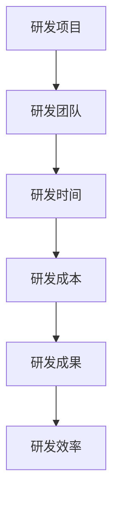
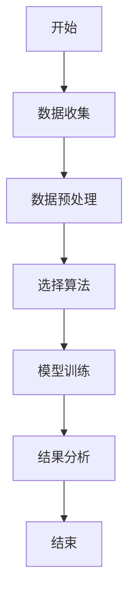
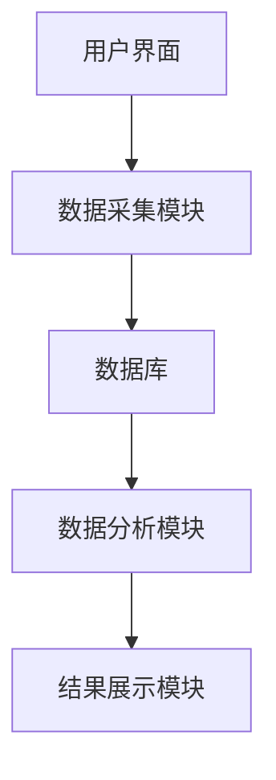

                 


# 彼得林奇对公司研发效率的跨期分析

## 关键词：
- 研发效率
- 跨期分析
- 彼得林奇
- 投资分析
- 系统架构
- 时间序列分析
- 线性回归模型

## 摘要：
本文从彼得·林奇的投资理念出发，分析研发效率在跨期维度上的表现和影响。通过构建跨期分析框架，结合数学模型和系统架构设计，详细探讨研发效率的评估方法及其在投资决策中的应用。文章最后结合实际案例，展示跨期分析在提升研发效率中的实践价值。

---

# 第一部分：研发效率与跨期分析的背景

## 第1章：研发效率的定义与核心要素

### 1.1 研发效率的定义与核心要素

#### 1.1.1 研发效率的定义
研发效率是指企业在一定时间内将资源（如人力、资金、技术）转化为创新成果的能力。它通常通过单位时间内的产出量、成本投入和成果质量来衡量。

#### 1.1.2 研发效率的核心要素
研发效率的核心要素包括：
1. **时间跨度**：研发项目的周期长短会影响效率评估。
2. **资源投入**：人力、资金、技术的投入量与效率密切相关。
3. **成果产出**：包括专利数量、产品数量、技术领先性等。
4. **成本控制**：单位成果的投入成本越低，效率越高。

#### 1.1.3 跨期分析的重要性
跨期分析能够捕捉研发效率的动态变化，揭示时间跨度对效率的影响。通过分析不同时间段的研发效率，可以发现趋势、周期性变化和潜在问题。

---

## 第2章：彼得林奇投资理念与研发效率

### 2.1 彼得林奇投资理念概述
彼得·林奇是著名的基金经理，强调长期投资和基本面分析。他认为，企业的研发效率是决定其长期竞争力的关键因素。

### 2.2 研发效率在投资分析中的作用
研发效率高的公司通常具有更强的市场竞争力和持续创新能力，这会反映在其股价和投资回报上。

### 2.3 跨期分析对研发效率的影响
通过跨期分析，投资者可以评估公司在不同经济周期中的研发效率表现，从而做出更科学的投资决策。

---

## 第3章：研发效率的跨期分析框架

### 3.1 跨期分析的基本概念
跨期分析是指将时间作为变量，研究企业在不同时间段内的研发效率变化。

### 3.2 研发效率的跨期评估方法
1. **时间序列分析**：通过历史数据识别研发效率的变化趋势。
2. **横向对比**：将公司在不同时间段的研发效率与行业平均水平进行比较。

### 3.3 跨期分析框架的构建
跨期分析框架包括数据收集、模型构建、结果分析三个主要步骤。

---

# 第二部分：研发效率的核心概念与联系

## 第4章：研发效率的核心概念与联系

### 4.1 研发效率的核心概念

#### 4.1.1 研发效率的多维度分析
研发效率可以从投入产出比、时间效率、资源利用率等多个维度进行分析。

#### 4.1.2 跨期分析的关键指标
关键指标包括研发周期、研发成本占总收入比例、专利申请数量等。

#### 4.1.3 研发效率与企业绩效的关系
研发效率高的企业通常具有更高的利润率和市场占有率。

### 4.2 核心概念的联系与对比

#### 4.2.1 研发效率与投资回报的对比
研发效率直接影响企业的创新能力，进而影响投资回报。

#### 4.2.2 跨期分析与传统分析的差异
跨期分析更注重时间维度的变化，而传统分析侧重于静态指标。

#### 4.2.3 研发效率的内外部影响因素
内部因素包括管理效率、技术能力；外部因素包括市场需求、行业竞争。

### 4.3 研发效率的ER实体关系图


---

## 第5章：研发效率的跨期分析算法原理

### 5.1 跨期分析的基本算法

#### 5.1.1 时间序列分析方法
时间序列分析用于识别研发效率的长期趋势和周期性变化。

#### 5.1.2 趋势分析与周期性分析
趋势分析通过线性回归模型捕捉研发效率的变化趋势，周期性分析则通过傅里叶变换识别周期性波动。

### 5.2 研发效率的数学模型

#### 5.2.1 研发效率的线性回归模型
$$ y = \beta_0 + \beta_1x + \epsilon $$
其中，$y$是研发效率，$x$是时间变量。

#### 5.2.2 趋势分解模型
$$ T_t = a \cdot t + b $$
$$ S_t = \sum_{i=1}^n \alpha_i \cdot \sin(2\pi i t/n) $$

#### 5.2.3 季节性调整模型
$$ S_t = \sum_{i=1}^n \alpha_i \cdot \sin(2\pi i t/n) $$

### 5.3 算法流程图


---

# 第三部分：研发效率的系统分析与架构设计

## 第6章：系统分析与架构设计

### 6.1 问题场景介绍
#### 6.1.1 研发效率分析的背景
企业需要通过跨期分析优化研发效率，提升市场竞争力。

#### 6.1.2 跨期分析的系统需求
系统需要支持多时间跨度的数据分析和可视化。

### 6.2 系统功能设计

#### 6.2.1 数据采集模块
负责收集企业历史研发数据。

#### 6.2.2 数据分析模块
实现时间序列分析和趋势分解。

#### 6.2.3 结果展示模块
提供可视化界面，展示研发效率的动态变化。

### 6.3 系统架构设计


---

# 第四部分：项目实战

## 第7章：项目实战与案例分析

### 7.1 项目环境安装
需要安装Python、Pandas、Matplotlib等工具。

### 7.2 核心代码实现

#### 7.2.1 数据预处理
```python
import pandas as pd

# 读取数据
data = pd.read_csv('研发效率.csv')

# 数据清洗
data = data.dropna()
```

#### 7.2.2 模型训练
```python
from sklearn.linear_model import LinearRegression

model = LinearRegression()
model.fit(data[['时间']], data['效率'])
```

### 7.3 实际案例分析
以某公司为例，分析其过去五年的研发效率变化，发现效率提升的关键因素。

---

## 第五部分：总结与展望

## 第8章：最佳实践与注意事项

### 8.1 最佳实践
1. 定期进行跨期分析，优化研发流程。
2. 结合行业基准，评估自身效率。

### 8.2 小结
跨期分析是评估研发效率的重要工具，能够为企业优化资源配置提供数据支持。

### 8.3 注意事项
1. 数据质量影响分析结果。
2. 模型选择需结合企业实际情况。

### 8.4 拓展阅读
建议阅读彼得·林奇的《投资的成功秘诀》和相关时间序列分析的书籍。

---

# 作者信息

作者：AI天才研究院/AI Genius Institute & 禅与计算机程序设计艺术/Zen And The Art of Computer Programming

