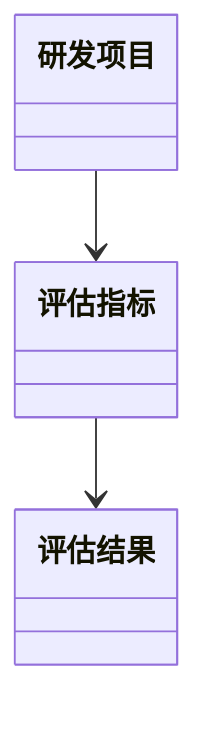

                 


# 彼得林奇对公司研发管线质量的评估

---

## 关键词：研发管线质量、彼得林奇、投资评估、企业价值、风险管理

---

## 摘要：  
本文深入分析了彼得林奇对公司研发管线质量的评估方法，探讨了研发管线质量对企业发展和投资决策的重要性。通过背景介绍、核心概念、算法原理、系统分析、项目实战和总结展望，本文详细阐述了如何从技术、市场和团队等多维度评估研发管线质量，并结合实际案例和代码实现，为读者提供了全面的理论和实践指导。

---

# 第一部分: 研发管线质量评估的背景与定义

## 第1章: 研发管线质量评估的背景与定义

### 1.1 研发管线质量评估的背景  
在现代企业竞争中，研发管线是企业创新的核心驱动力。研发管线的质量直接关系到企业的未来发展方向和市场竞争力。彼得林奇作为投资大师，非常注重对研发管线质量的评估，他认为一个高质量的研发管线能够为公司带来持续的创新能力和市场竞争力。  

#### 1.1.1 研发管线的定义与重要性  
研发管线是指企业在研发阶段的所有项目，包括从概念设计到商业化的所有阶段。研发管线的质量评估需要考虑项目的可行性、市场潜力、技术难度和团队能力等多个因素。  

#### 1.1.2 研发管线质量评估的必要性  
研发管线质量评估是企业在制定战略规划和投资决策时的重要依据。通过评估研发管线的质量，企业可以更好地优化资源配置，降低风险，提升整体竞争力。  

#### 1.1.3 彼得林奇的投资理念与研发管线评估的关系  
彼得林奇认为，投资的核心在于对企业未来盈利能力的评估。研发管线质量评估是评估企业未来盈利能力的重要组成部分。他强调，高质量的研发管线能够为公司带来持续的创新能力和市场竞争力。

---

### 1.2 研发管线质量评估的核心概念  

#### 1.2.1 研发管线质量的定义  
研发管线质量是指研发项目在技术可行性、市场潜力、团队能力和资源分配等方面的综合表现。  

#### 1.2.2 研发管线质量评估的关键要素  
- **技术可行性**：项目的技术难度、创新性和实现难度。  
- **市场潜力**：项目的市场规模、增长潜力和竞争环境。  
- **团队能力**：研发团队的专业能力和执行能力。  
- **资源分配**：企业在研发项目上的资源投入和分配效率。  

#### 1.2.3 研发管线质量与企业价值的关系  
研发管线质量是影响企业未来盈利能力的重要因素。高质量的研发管线能够提升企业的市场竞争力和长期发展潜力，从而提升企业价值。

---

### 1.3 研发管线质量评估的边界与外延  

#### 1.3.1 研发管线质量评估的边界条件  
- 评估范围：仅限于研发项目，不包括生产、销售等其他环节。  
- 评估时间：通常在项目初期和关键节点进行评估。  

#### 1.3.2 研发管线质量评估的外延领域  
- 技术创新：评估项目的技术创新性和领先性。  
- 市场风险：评估项目在市场中的潜在风险和不确定性。  

#### 1.3.3 研发管线质量评估的误区与注意事项  
- 避免过度关注短期收益，忽视长期发展潜力。  
- 避免仅关注技术可行性，忽视市场潜力和团队能力。  

---

### 1.4 本章小结  
本章从背景、定义、关键要素和边界条件等方面介绍了研发管线质量评估的核心概念。通过分析彼得林奇的投资理念，我们明确了研发管线质量评估在企业价值中的重要性。

---

# 第二部分: 研发管线质量评估的核心概念与联系

## 第2章: 研发管线质量评估的核心原理

### 2.1 研发管线质量评估的原理  

#### 2.1.1 研发管线质量评估的逻辑框架  
研发管线质量评估的逻辑框架包括以下几个步骤：  
1. 确定评估目标：明确评估的目的和范围。  
2. 收集数据：收集研发项目的相关信息，包括技术、市场和团队能力等。  
3. 评估指标：设计评估指标，量化各方面的表现。  
4. 综合评估：根据权重分配，计算综合得分。  

#### 2.1.2 研发管线质量评估的数学模型  
研发管线质量评估的数学模型可以表示为：  
$$ \text{研发质量} = \sum_{i=1}^{n} w_i \cdot x_i $$  
其中，$w_i$ 是第 $i$ 个评估指标的权重，$x_i$ 是第 $i$ 个评估指标的得分。

#### 2.1.3 研发管线质量评估的指标体系  
- **技术可行性**：技术难度、创新性和实现难度。  
- **市场潜力**：市场规模、增长潜力和竞争环境。  
- **团队能力**：团队的专业能力和执行能力。  
- **资源分配**：企业在研发项目上的资源投入和分配效率。  

---

### 2.2 研发管线质量评估的核心要素对比  

#### 2.2.1 研发项目的技术可行性对比  
技术可行性是评估研发项目的重要指标。通过对比不同项目的技术难度和创新性，可以判断其技术可行性。

#### 2.2.2 研发项目的市场潜力对比  
市场潜力是评估研发项目的重要指标。通过对比不同项目的市场规模和增长潜力，可以判断其市场竞争力。

#### 2.2.3 研发项目的团队能力对比  
团队能力是评估研发项目的重要指标。通过对比不同项目的团队专业能力和执行能力，可以判断其团队能力。

---

### 2.3 研发管线质量评估的ER实体关系图  

```mermaid
er
  actor: 评估者
  class: 研发项目
  subclass: 技术指标
  subclass: 市场潜力
  subclass: 团队能力
  actor --> class
  class --> subclass
```

---

### 2.4 本章小结  
本章从原理、指标体系和核心要素对比等方面详细介绍了研发管线质量评估的核心概念。通过ER实体关系图，我们明确了各评估指标之间的关系。

---

# 第三部分: 研发管线质量评估的算法原理

## 第3章: 研发管线质量评估的算法原理

### 3.1 研发管线质量评估的算法概述  

#### 3.1.1 基于权重的评分模型  
基于权重的评分模型是一种常用的评估方法。通过给每个评估指标分配权重，计算项目的综合得分。  

#### 3.1.2 基于层次分析法（AHP）的评估方法  
层次分析法是一种常用的多准则决策方法。通过构建层次结构，计算各指标的权重，进行综合评估。

#### 3.1.3 基于机器学习的预测模型  
基于机器学习的预测模型可以通过历史数据，预测研发项目的成功概率。常用的算法包括逻辑回归、随机森林和神经网络等。

---

### 3.2 研发管线质量评估的算法实现  

#### 3.2.1 层次分析法（AHP）的实现步骤  
1. 构建层次结构。  
2. 确定各指标的权重。  
3. 计算综合得分。  

#### 3.2.2 逻辑回归模型的实现步骤  
1. 数据预处理：收集和清洗数据。  
2. 特征选择：选择关键特征。  
3. 模型训练：训练逻辑回归模型。  
4. 模型评估：评估模型的性能。  

---

### 3.3 研发管线质量评估的数学模型  

#### 3.3.1 层次分析法的数学模型  
层次分析法的数学模型可以表示为：  
$$ A = \sum_{i=1}^{n} w_i \cdot x_i $$  
其中，$w_i$ 是第 $i$ 个指标的权重，$x_i$ 是第 $i$ 个指标的得分。

#### 3.3.2 逻辑回归模型的数学模型  
逻辑回归模型的数学模型可以表示为：  
$$ P(y=1|x) = \frac{e^{\beta x}}{1 + e^{\beta x}} $$  
其中，$\beta$ 是模型参数，$x$ 是输入特征。

---

### 3.4 本章小结  
本章详细介绍了研发管线质量评估的算法原理，包括基于权重的评分模型、层次分析法和逻辑回归模型的实现步骤和数学模型。

---

# 第四部分: 研发管线质量评估的系统分析与架构设计

## 第4章: 研发管线质量评估的系统分析与架构设计

### 4.1 问题场景介绍  
研发管线质量评估系统需要满足以下需求：  
1. 支持多指标评估。  
2. 支持多种评估方法。  
3. 支持数据可视化和结果分析。

---

### 4.2 系统功能设计  

#### 4.2.1 系统功能模块  
- 数据输入模块：支持用户输入研发项目数据。  
- 评估计算模块：支持多种评估方法的计算。  
- 结果分析模块：支持数据可视化和结果分析。

#### 4.2.2 领域模型类图  



---

### 4.3 系统架构设计  

#### 4.3.1 系统架构设计图  


---

### 4.4 本章小结  
本章从系统功能设计和架构设计两个方面介绍了研发管线质量评估系统的实现方案。通过类图和架构图，我们明确了系统的各个模块和交互关系。

---

# 第五部分: 研发管线质量评估的项目实战

## 第5章: 研发管线质量评估的项目实战

### 5.1 环境安装  

#### 5.1.1 安装Python和相关库  
```bash
pip install numpy pandas scikit-learn matplotlib
```

#### 5.1.2 数据准备  
创建一个包含研发项目数据的CSV文件，例如：  
```csv
项目编号,技术可行性,市场潜力,团队能力
A001,0.8,0.7,0.8
A002,0.6,0.9,0.7
```

---

### 5.2 系统核心实现  

#### 5.2.1 数据预处理  
```python
import pandas as pd

data = pd.read_csv('研发项目数据.csv')
data.head()
```

#### 5.2.2 评估模型计算  
```python
from sklearn.linear_model import LogisticRegression

model = LogisticRegression()
model.fit(X, y)
```

#### 5.2.3 结果分析  
```python
import matplotlib.pyplot as plt

plt.bar(range(len(scores)), scores)
plt.xticks(range(len(scores)), projects)
plt.show()
```

---

### 5.3 实际案例分析  

#### 5.3.1 案例背景  
假设我们有一个包含三个研发项目的数据集，需要评估它们的质量。

#### 5.3.2 数据分析  
通过数据分析，我们发现项目A001的技术可行性和团队能力较强，但市场潜力较低。项目A002的市场潜力较高，但技术可行性较低。项目A003的综合表现较好。

---

### 5.4 本章小结  
本章通过实际案例分析，展示了研发管线质量评估系统的实现过程和应用效果。

---

# 第六部分: 总结与展望

## 第6章: 总结与展望

### 6.1 本章总结  
研发管线质量评估是企业投资决策的重要组成部分。通过本文的分析，我们明确了研发管线质量评估的核心概念和实现方法。

### 6.2 未来展望  
未来，随着人工智能和大数据技术的发展，研发管线质量评估将更加智能化和精准化。我们可以通过引入更多数据和算法，进一步提升评估的准确性和效率。

---

# 作者：AI天才研究院/AI Genius Institute & 禅与计算机程序设计艺术 /Zen And The Art of Computer Programming

