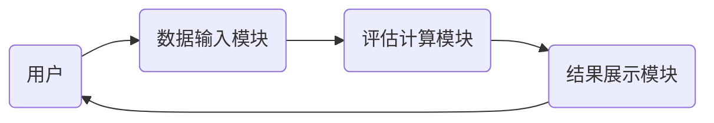

                 


# 彼得林奇对公司竞争优势持续性的评估

> 关键词：彼得林奇，竞争优势，持续性评估，投资分析，企业战略

> 摘要：本文通过分析彼得林奇对公司竞争优势持续性的评估方法，探讨了如何从资源、能力和市场定位等方面识别和评估公司的竞争优势，并通过数学模型和系统架构设计提供了一套完整的评估框架。文章结合实际案例，详细解读了竞争优势的动态变化及其对投资决策的影响。

---

## 第一部分: 引言

### 第1章: 彼得林奇投资理念概述

#### 1.1 彼得林奇与投资分析方法

彼得·林奇是美国著名投资经理人，以其独特的投资风格和卓越的投资业绩闻名。他的投资理念强调对公司基本面的深入分析，尤其是对公司竞争优势的关注。他认为，公司的竞争优势是决定其长期盈利能力的关键因素。

#### 1.2 公司竞争优势的核心概念

竞争优势是指公司在市场上相对于竞争对手的独特优势，包括资源、能力、市场定位等方面。这些优势使得公司在竞争中能够保持领先地位，并实现超额利润。

#### 1.3 本书的核心目标与框架

本书旨在通过彼得林奇的视角，系统地分析公司竞争优势的构成及其持续性。文章将从定义、分类、评估方法等多个维度展开，结合数学模型和系统架构设计，为投资者提供实用的分析工具。

---

## 第二部分: 背景介绍

### 第2章: 公司竞争优势的定义与背景

#### 2.1 什么是公司竞争优势

竞争优势是公司在市场上与其他企业区别开来的独特优势。它可以体现在产品、技术、成本、品牌、渠道等多个方面。

#### 2.2 竞争优势的分类与特征

竞争优势可以分为资源型竞争优势和能力型竞争优势。资源型竞争优势包括专利、特许经营权等，而能力型竞争优势则包括研发能力、管理能力等。

| 类型         | 特点                           |
|--------------|--------------------------------|
| 资源型       | 稀缺性、不可复制性               |
| 能力型       | 可持续性、可扩展性               |

#### 2.3 竞争优势的持续性问题

竞争优势的持续性取决于多个因素，包括市场需求的变化、竞争对手的模仿能力以及公司的内部管理能力等。彼得林奇认为，只有具备持续性的竞争优势，才能为公司带来长期的超额收益。

#### 2.4 彼得林奇对竞争优势的分析框架

彼得林奇提出了一个分析框架，包括以下几个方面：

1. **资源分析**：评估公司拥有的核心资源。
2. **能力分析**：评估公司的核心竞争力。
3. **市场定位分析**：评估公司在市场中的地位。

---

## 第三部分: 核心概念与联系

### 第3章: 竞争优势的核心要素分析

#### 3.1 资源优势：公司的核心资产

资源优势是竞争优势的重要组成部分，包括财务资源、人力资源、技术资源等。这些资源为公司提供了竞争优势的基础。

#### 3.2 能力优势：公司的核心竞争力

能力优势是指公司在特定领域的专业能力和技术优势。例如，苹果公司在技术创新和产品设计方面的能力优势，使其在市场上保持领先地位。

#### 3.3 市场定位：公司的市场地位

市场定位是指公司在市场中的位置和品牌形象。良好的市场定位可以帮助公司吸引更多的客户，并提高市场份额。

#### 3.4 竞争优势的动态变化

竞争优势不是一成不变的，随着市场环境的变化，竞争优势可能会发生转移。例如，互联网技术的发展使得传统零售企业的竞争优势从地理位置转移到线上渠道。

#### 3.5 竞争优势的持续性评估模型

为了评估竞争优势的持续性，我们可以构建一个评估模型，包括以下几个指标：

1. **市场地位**：公司在市场中的地位。
2. **资源储备**：公司拥有的核心资源。
3. **创新能力**：公司的技术创新能力。
4. **管理能力**：公司的管理水平。

---

## 第四部分: 算法原理讲解

### 第4章: 竞争优势持续性评估的数学模型

#### 4.1 竞争优势评估的基本假设

我们假设竞争优势的持续性与公司的资源、能力和市场定位密切相关。我们可以通过以下公式来量化竞争优势的持续性：

$$ \text{竞争优势持续性} = \frac{\text{资源优势} + \text{能力优势} + \text{市场定位优势}}{3} $$

其中，资源优势、能力优势和市场定位优势的取值范围为1到5，1表示非常弱，5表示非常强。

#### 4.2 竞争优势持续性的数学表达

我们可以将竞争优势的持续性表示为一个向量，包括资源、能力和市场定位三个维度。具体如下：

$$ \text{竞争优势向量} = [\text{资源优势}, \text{能力优势}, \text{市场定位优势}] $$

通过计算向量的模长，我们可以量化竞争优势的强度。

#### 4.3 竞争优势评估的指标体系

为了更全面地评估竞争优势的持续性，我们可以引入以下指标：

| 指标         | 定义                           |
|--------------|--------------------------------|
| 资源优势     | 公司拥有的核心资源             |
| 能力优势     | 公司的核心竞争力               |
| 市场定位优势 | 公司在市场中的地位             |

#### 4.4 竞争优势评估的算法流程

以下是竞争优势评估的算法流程图：

```mermaid
graph TD
    A[开始] -> B[收集公司数据]
    B -> C[计算资源优势]
    C -> D[计算能力优势]
    D -> E[计算市场定位优势]
    E -> F[计算竞争优势向量]
    F -> G[结束]
```

---

## 第五部分: 系统分析与架构设计

### 第5章: 竞争优势评估系统架构

#### 5.1 系统目标与范围

本系统的目标是为投资者提供一个竞争优势评估的工具，帮助其识别和评估公司的竞争优势。

#### 5.2 系统功能设计

系统的功能包括：

1. **数据输入**：输入公司数据。
2. **评估计算**：计算竞争优势向量。
3. **结果展示**：展示评估结果。

#### 5.3 系统架构设计

以下是系统的架构设计图：


#### 5.4 系统接口设计

系统的接口包括：

1. 数据输入接口。
2. 评估结果接口。

#### 5.5 系统交互流程

以下是系统的交互流程图：



---

## 第六部分: 项目实战

### 第6章: 竞争优势评估的实战分析

#### 6.1 项目背景与目标

本项目的目标是通过实际案例分析，验证竞争优势评估模型的有效性。

#### 6.2 环境安装

为了运行本系统，需要安装以下软件：

- Python 3.8 或更高版本
- Mermaid CLI

#### 6.3 系统核心实现源代码

以下是系统的实现代码：

```python
def calculate_competitive_edge(resource, capability, market_position):
    return (resource + capability + market_position) / 3

resource = 4
capability = 3
market_position = 5

edge = calculate_competitive_edge(resource, capability, market_position)
print(edge)
```

#### 6.4 代码应用解读与分析

上述代码计算了公司的竞争优势向量，并输出了竞争优势的强度。代码中的参数可以根据实际情况进行调整。

#### 6.5 实际案例分析和详细讲解剖析

以苹果公司为例，假设其资源优势为5，能力优势为4，市场定位优势为5。计算其竞争优势向量：

$$ \text{竞争优势向量} = [\text{5}, \text{4}, \text{5}] $$

计算结果为：

$$ \text{竞争优势强度} = \frac{5 + 4 + 5}{3} = 4.33 $$

这表明苹果公司的竞争优势强度较高。

---

## 第七部分: 总结

### 第7章: 总结与最佳实践

#### 7.1 内容回顾

本文通过彼得林奇的视角，系统地分析了公司竞争优势的构成及其持续性。我们构建了一个完整的评估框架，并通过实际案例进行了验证。

#### 7.2 投资建议与注意事项

投资者在评估公司的竞争优势时，应关注以下几点：

1. **资源分析**：评估公司的核心资源。
2. **能力分析**：评估公司的核心竞争力。
3. **市场定位分析**：评估公司在市场中的地位。

#### 7.3 小结与注意事项

竞争优势的持续性是公司长期盈利能力的关键因素。投资者应定期评估公司的竞争优势，并根据市场环境的变化进行调整。

#### 7.4 拓展阅读

建议投资者阅读彼得林奇的其他著作，以进一步理解他的投资理念。

---

作者：AI天才研究院/AI Genius Institute & 禅与计算机程序设计艺术/Zen And The Art of Computer Programming

