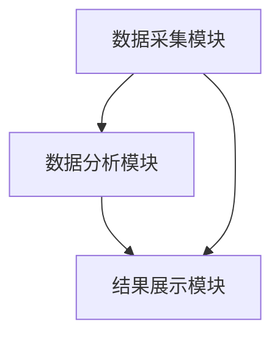

                 

# 彼得林奇对公司管理团队稳定性的评估

## 关键词：
- 彼得林奇
- 管理团队
- 稳定性评估
- 投资决策
- 团队结构

## 摘要：
本文详细探讨了彼得林奇对公司管理团队稳定性评估的方法。通过分析团队结构、领导力、文化及历史稳定性等因素，结合数学模型和系统架构，阐述了如何通过评估管理团队的稳定性来辅助投资决策。文章从背景介绍、核心概念、算法原理、数学模型、系统架构、项目实战到最佳实践，全面解析了这一评估方法的理论基础和实际应用。

---

## 第一部分：彼得林奇与团队稳定性评估的背景介绍

### 第1章：彼得林奇与团队稳定性评估概述

#### 1.1 彼得林奇的背景与投资理念
##### 1.1.1 彼得林奇的生平简介
彼得·林奇（Peter Lynch）是全球著名的投资专家，曾任富达投资集团麦哲伦基金的经理。他的投资哲学以“买入并持有”为核心，强调长期投资和深入分析。

##### 1.1.2 彼得林奇的投资哲学
彼得林奇认为，成功的投资不仅依赖于市场分析，更需要对企业管理团队的深入了解。他强调，一个稳定的管理团队是企业长期发展的关键。

##### 1.1.3 彼得林奇对管理团队的重视
彼得林奇在其投资生涯中，通过分析管理团队的稳定性，筛选出具有长期增长潜力的企业。

#### 1.2 团队稳定性评估的重要性
##### 1.2.1 管理团队稳定性对企业发展的影响
稳定的管理团队能够确保企业战略的连续性和执行力，减少因管理层变动带来的风险。

##### 1.2.2 管理团队稳定性对投资者决策的影响
对于投资者而言，评估管理团队的稳定性是制定投资策略的重要依据。一个稳定的团队能够为企业带来持续的价值增长。

##### 1.2.3 稳定管理团队的核心要素
稳定管理团队的核心要素包括团队结构、领导力、文化凝聚力和历史稳定性。

### 第2章：团队稳定性评估的背景与问题描述

#### 2.1 现代企业中的管理团队问题
##### 2.1.1 管理团队的构成与功能
现代企业的管理团队通常由 CEO、 CFO、 CTO 等高管组成，负责企业的战略制定和执行。

##### 2.1.2 当前企业中管理团队面临的挑战
全球经济波动、市场竞争加剧和技术变革加快，使得管理团队面临前所未有的挑战。

##### 2.1.3 管理团队不稳定对企业的影响
管理团队的不稳定可能导致企业战略调整频繁，影响员工士气，最终影响企业绩效。

#### 2.2 团队稳定性评估的必要性
##### 2.2.1 企业价值评估中的团队因素
企业的长期价值不仅取决于财务指标，还取决于管理团队的稳定性。

##### 2.2.2 投资者如何通过团队稳定性评估做出决策
投资者通过评估管理团队的稳定性，选择具有长期增长潜力的企业进行投资。

##### 2.2.3 团队稳定性评估的边界与外延
团队稳定性评估的边界包括管理层的稳定性、团队协作能力等，其外延涉及企业文化、战略规划等多个方面。

#### 2.3 彼得林奇团队稳定性评估的核心要素
##### 2.3.1 团队结构的稳定性
团队结构的稳定性包括高管团队的构成是否合理，职责分配是否明确。

##### 2.3.2 团队成员的稳定性
团队成员的稳定性包括高管的任职时间、离职率等指标。

##### 2.3.3 团队协作的稳定性
团队协作的稳定性包括团队内部的沟通效率、决策效率等指标。

---

## 第二部分：团队稳定性评估的核心概念与联系

### 第3章：团队稳定性评估的核心概念

#### 3.1 核心概念的定义与特征
##### 3.1.1 团队结构的核心要素
团队结构的核心要素包括高管团队的构成、职责分配、团队协作机制等。

##### 3.1.2 团队成员的核心特征
团队成员的核心特征包括高管的专业背景、经验、稳定性等。

##### 3.1.3 团队协作的核心机制
团队协作的核心机制包括沟通机制、决策机制、激励机制等。

#### 3.2 核心概念的对比分析
##### 3.2.1 团队稳定性与团队能力的对比
团队稳定性强调团队的持续性和稳定性，团队能力则强调团队的业绩和表现。

##### 3.2.2 团队协作与团队文化的对比
团队协作强调团队内部的互动和合作，团队文化则强调团队的价值观和凝聚力。

##### 3.2.3 团队结构与团队战略的对比
团队结构强调团队的组织形式，团队战略则强调团队的长期目标和规划。

---

### 第4章：团队稳定性评估的核心概念与联系

#### 4.1 团队稳定性评估的核心概念
##### 4.1.1 团队结构的稳定性
团队结构的稳定性包括高管团队的构成是否合理，职责分配是否明确。

##### 4.1.2 团队成员的稳定性
团队成员的稳定性包括高管的任职时间、离职率等指标。

##### 4.1.3 团队协作的稳定性
团队协作的稳定性包括团队内部的沟通效率、决策效率等指标。

#### 4.2 核心概念之间的联系
##### 4.2.1 团队结构与团队协作的关系
合理的团队结构能够促进高效的团队协作，反之亦然。

##### 4.2.2 团队成员与团队文化的互动
团队成员的稳定性影响团队文化的形成，团队文化又反作用于团队成员的稳定性。

##### 4.2.3 团队协作与团队战略的关系
高效的团队协作能够推动团队战略的实现，团队战略则为团队协作提供方向。

---

## 第三部分：团队稳定性评估的算法原理

### 第5章：团队稳定性评估的算法原理

#### 5.1 算法原理概述
团队稳定性评估的算法原理包括数据收集、数据处理、数据分析和结果输出。

#### 5.2 数据收集
##### 5.2.1 数据来源
数据来源包括公司财报、新闻报道、行业报告等。

##### 5.2.2 数据类型
数据类型包括定量数据（如高管任期、离职率）和定性数据（如团队协作效率、企业文化）。

#### 5.3 数据处理
##### 5.3.1 数据清洗
数据清洗包括去除重复数据、处理缺失值等。

##### 5.3.2 数据转换
数据转换包括将定性数据转化为定量指标。

#### 5.4 数据分析
##### 5.4.1 数据分析方法
数据分析方法包括统计分析、机器学习算法等。

##### 5.4.2 数据分析工具
数据分析工具包括 Excel、Python、R 等。

#### 5.5 结果输出
##### 5.5.1 评分系统
评分系统包括团队稳定性指数的计算和展示。

##### 5.5.2 可视化分析
可视化分析包括图表展示、趋势分析等。

---

## 第四部分：团队稳定性评估的数学模型

### 第6章：团队稳定性评估的数学模型

#### 6.1 模型定义
团队稳定性指数（TSI）用于量化管理团队的稳定性。

#### 6.2 模型公式
团队稳定性指数的计算公式如下：

$$ TSI = \sum_{i=1}^{n} (w_i \times s_i) $$

其中，$w_i$ 是第 $i$ 个指标的权重，$s_i$ 是第 $i$ 个指标的评分。

#### 6.3 模型参数
##### 6.3.1 权重分配
权重分配需要根据各指标的重要性进行调整。

##### 6.3.2 指标评分
指标评分需要根据实际情况进行量化。

#### 6.4 模型实现
##### 6.4.1 指标选择
指标选择包括高管任期、离职率、团队协作效率等。

##### 6.4.2 指标评分方法
指标评分方法包括层次分析法、德尔菲法等。

---

## 第五部分：团队稳定性评估的系统架构

### 第7章：团队稳定性评估的系统架构

#### 7.1 系统架构设计
系统架构包括数据采集模块、数据分析模块、结果展示模块。

#### 7.2 系统功能设计
##### 7.2.1 数据采集功能
数据采集功能包括从多种数据源采集数据。

##### 7.2.2 数据分析功能
数据分析功能包括对数据进行清洗、转换和分析。

##### 7.2.3 结果展示功能
结果展示功能包括生成团队稳定性指数报告和可视化图表。

#### 7.3 系统架构图

---

## 第六部分：团队稳定性评估的项目实战

### 第8章：团队稳定性评估的项目实战

#### 8.1 项目背景
假设我们有一个科技公司，需要评估其管理团队的稳定性。

#### 8.2 项目实施
##### 8.2.1 环境安装
环境安装包括安装 Python、Pandas、Matplotlib 等工具。

##### 8.2.2 核心代码实现
核心代码实现包括数据清洗、数据分析和结果展示。

##### 8.2.3 代码应用解读与分析
代码应用解读与分析包括对数据进行清洗、转换和分析。

#### 8.3 项目小结
项目小结包括对项目实施过程的总结和经验教训。

---

## 第七部分：团队稳定性评估的最佳实践

### 第9章：团队稳定性评估的最佳实践

#### 9.1 最佳实践 tips
##### 9.1.1 定期评估
定期评估管理团队的稳定性，及时发现问题。

##### 9.1.2 数据驱动决策
通过数据分析，制定科学的评估决策。

##### 9.1.3 重视团队文化建设
重视团队文化建设，增强团队凝聚力。

#### 9.2 小结
总结全文，强调团队稳定性评估的重要性和应用价值。

#### 9.3 注意事项
注意事项包括数据来源的可靠性、模型的适用性等。

#### 9.4 拓展阅读
推荐相关书籍和文章，供读者进一步学习。

---

## 作者：AI天才研究院/AI Genius Institute & 禅与计算机程序设计艺术 /Zen And The Art of Computer Programming

---

### 总结
本文从彼得林奇的管理团队稳定性评估方法出发，详细探讨了其核心概念、算法原理、数学模型、系统架构和项目实战。通过本文的学习，读者可以掌握如何通过系统化的方法评估管理团队的稳定性，并将其应用于实际投资决策中。

