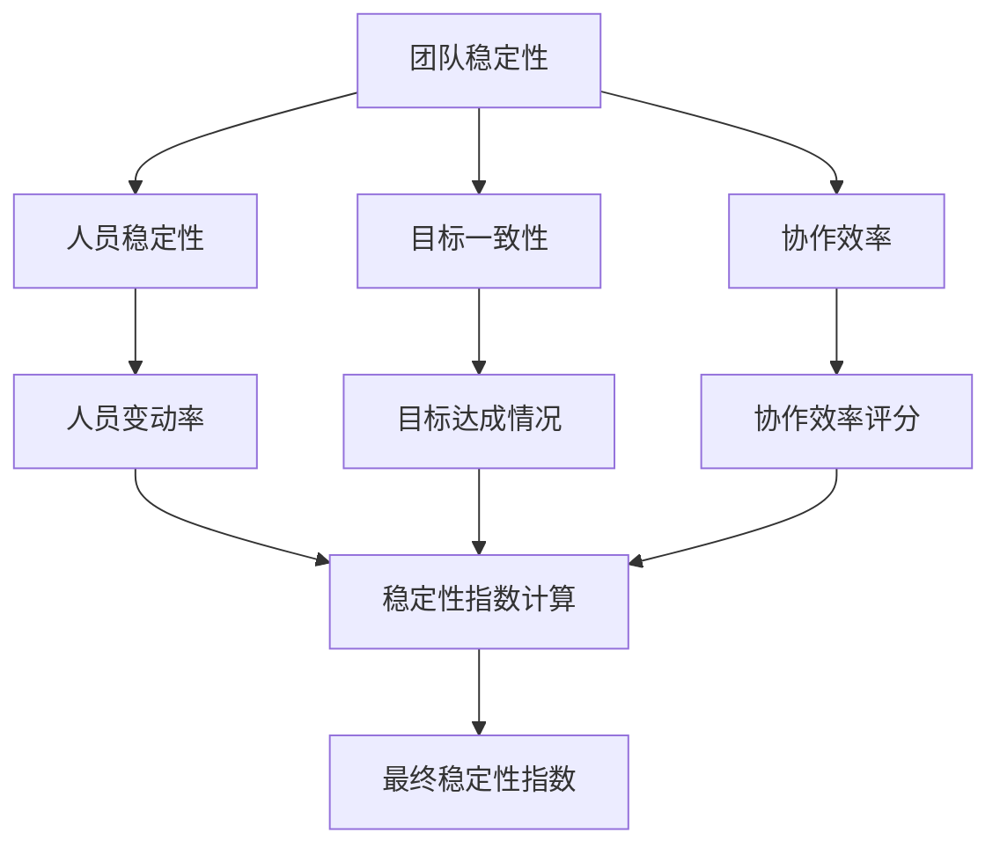
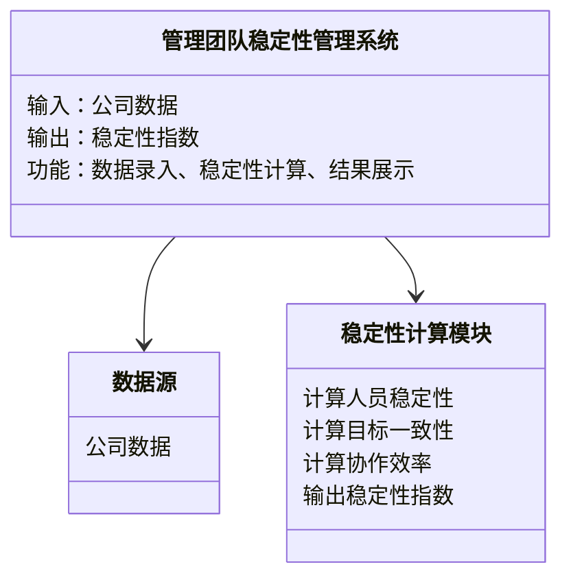
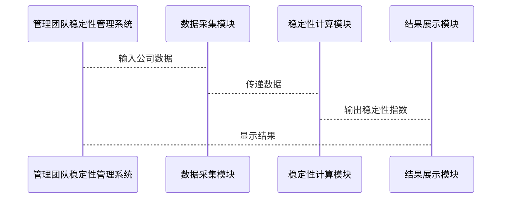

                 


# 彼得林奇对公司管理团队稳定性的重视

## 关键词：彼得林奇，团队稳定性，管理团队，投资策略，稳定性指数

## 摘要：彼得·林奇作为著名的投资经理人，高度重视公司管理团队的稳定性。本文从团队稳定性的重要性、评估模型、系统设计、实战案例等方面展开分析，探讨彼得林奇如何通过团队稳定性来优化投资决策，并提供具体的数学模型和系统架构设计，以帮助读者更好地理解和应用这一策略。

---

## 第一部分：彼得林奇投资理念与团队稳定性概述

### 第1章：彼得林奇与团队稳定性概述

#### 1.1 彼得林奇的背景与投资理念  
彼得·林奇是富达投资集团的传奇经理人，以其卓越的投资业绩闻名。他的投资理念强调基本面分析和长期投资，而团队稳定性是其投资决策中的关键因素。  

- 彼得林奇的生平简介：  
  - 1949年出生于美国波士顿。  
  - 曾任富达麦哲伦基金经理，创造了年均29%的回报率。  
  - 著有《彼得·林奇的投资之道》等书籍。  

- 投资哲学：  
  - 重视公司基本面，尤其是管理层的稳定性和团队的协作能力。  
  - 避免短期波动，追求长期稳定的投资回报。  

#### 1.2 团队稳定性在公司管理中的意义  
团队稳定性是公司长期发展的基石，直接影响投资决策和公司绩效。  

- 团队稳定性对投资决策的影响：  
  - 稳定的管理团队能够制定一致的战略，降低投资风险。  
  - 团队成员的稳定性影响公司的执行力和创新能力。  

- 管理团队稳定性与公司绩效的关系：  
  - 稳定的管理团队有助于公司长期目标的实现。  
  - 团队稳定性与公司股价的相关性：高稳定性团队通常带来更高的股价稳定性。  

- 彼得林奇对团队稳定性的独特见解：  
  - 管理层的稳定性是公司长期价值的关键指标。  
  - 稳定的团队能够更好地应对市场波动和挑战。  

---

## 第二部分：团队稳定性核心概念与分析框架

### 第2章：团队稳定性核心概念

#### 2.1 团队稳定性定义与维度  
- 团队稳定性的定义：  
  - 团队稳定性是指团队成员的稳定性、目标一致性和协作效率的综合表现。  

- 关键维度：  
  - 人员稳定性：团队成员的离职率和保留情况。  
  - 目标一致性：团队成员对共同目标的认同和追求。  
  - 协作效率：团队内部的沟通与协作效率。  

- 彼得林奇视角下的团队稳定性特征：  
  - 团队成员之间的信任与合作。  
  - 领导层的战略一致性。  

#### 2.2 彼得林奇团队稳定性分析模型  
- 模型的核心要素：  
  - 团队结构：团队成员的角色和职责。  
  - 目标一致性：团队目标的明确性和一致性。  
  - 外部环境：市场环境和行业竞争。  
  - 内部协作：团队内部的沟通与合作效率。  

- 模型的数学表达：  
  $$稳定性指数 = \frac{人员稳定性 + 目标一致性 + 协作效率}{3}$$  

- 稳定性指数的分类：  
  - 高稳定性：指数 ≥ 0.8。  
  - 中稳定性：0.5 ≤ 指数 < 0.8。  
  - 低稳定性：指数 < 0.5。  

#### 2.3 团队稳定性与公司绩效的关系  
- 团队稳定性对财务绩效的影响：  
  - 稳定的管理团队能够制定长期战略，提高公司盈利能力。  

- 管理团队稳定性与公司股价的相关性：  
  - 稳定的管理团队通常会带来股价的稳定性。  

- 彼得林奇案例中的稳定性与投资回报分析：  
  - 通过分析彼得林奇投资的公司，验证团队稳定性与投资回报的相关性。  

---

## 第三部分：团队稳定性评估与数学模型

### 第3章：团队稳定性评估模型

#### 3.1 团队稳定性评估指标  
- 人员变动率：$$人员变动率 = \frac{年度离职率}{平均员工数}$$  
- 目标一致性评估：基于团队目标的达成情况。  
- 协作效率评估：基于团队内部沟通与决策效率。  

#### 3.2 团队稳定性指数计算  
- 稳定性指数公式：  
  $$稳定性指数 = 0.4 \times 人员变动率 + 0.3 \times 目标一致性 + 0.3 \times 协作效率$$  

- 稳定性指数的分类：  
  - 高稳定性：指数 ≥ 0.8。  
  - 中稳定性：0.5 ≤ 指数 < 0.8。  
  - 低稳定性：指数 < 0.5。  

#### 3.3 彼得林奇团队稳定性评估模型的 mermaid 图  



---

## 第四部分：系统分析与架构设计

### 第4章：系统分析与架构设计

#### 4.1 问题场景介绍  
- 系统目标：设计一个团队稳定性管理系统，帮助投资者评估公司管理团队的稳定性。  

#### 4.2 系统功能设计  



#### 4.3 系统架构设计  


#### 4.4 系统接口设计  
- 输入接口：公司数据输入。  
- 输出接口：稳定性指数输出。  

#### 4.5 系统交互设计  



---

## 第五部分：项目实战

### 第5章：项目实战

#### 5.1 环境安装  
- 安装Python和相关库（如pandas、numpy）。  

#### 5.2 核心代码实现  

```python
import pandas as pd
import numpy as np

def calculate_stability_index(company_data):
   人员变动率 = company_data['年度离职率'] / company_data['平均员工数']
    目标一致性 = company_data['目标达成情况']
    协作效率 = company_data['协作效率评分']
    稳定性指数 = 0.4 * 人员变动率 + 0.3 * 目标一致性 + 0.3 * 协作效率
    return 稳定性指数

# 示例数据
data = {
    '公司名称': ['Company A', 'Company B', 'Company C'],
    '年度离职率': [10, 5, 8],
    '平均员工数': [100, 80, 90],
    '目标达成情况': [0.8, 0.7, 0.75],
    '协作效率评分': [0.7, 0.6, 0.65]
}

df = pd.DataFrame(data)
结果 = df.apply(lambda x: calculate_stability_index(x), axis=1)

print(结果)
```

#### 5.3 案例分析与详细解读  
- 以具体公司为例，分析如何应用上述模型评估团队稳定性。  

#### 5.4 项目小结  
- 总结项目实施的关键点和注意事项。  

---

## 第六部分：总结与展望

### 第6章：总结与展望

#### 6.1 总结  
- 团队稳定性是彼得林奇投资策略的核心要素。  
- 通过数学模型和系统设计，可以有效评估和管理团队稳定性。  

#### 6.2 最佳实践 tips  
- 定期评估团队稳定性，及时调整管理策略。  
- 重视团队内部沟通与协作效率。  
- 长期关注管理团队的稳定性，以优化投资决策。  

#### 6.3 展望  
- 结合人工智能技术，进一步提升团队稳定性评估的准确性。  
- 探索更多团队稳定性相关的研究方向。  

---

## 作者：AI天才研究院/AI Genius Institute & 禅与计算机程序设计艺术 /Zen And The Art of Computer Programming

