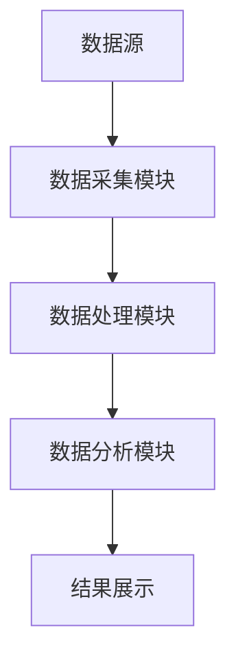

                 


# 彼得林奇对公司管理层决策一致性的历史数据分析

## 关键词：彼得林奇，管理层决策，历史数据，数据分析，投资分析

## 摘要：本文通过分析彼得林奇的投资策略，结合历史数据，探讨管理层决策的一致性。使用时间序列分析和决策树模型，构建数据分析框架，展示如何通过数据驱动的方法提升投资决策的准确性。

---

## 第一部分：引言

### 第1章：背景介绍

#### 1.1 问题背景

##### 1.1.1 管理层决策一致性的定义

管理层决策一致性是指公司在不同时间点上做出的决策是否一致，反映公司在战略和运营上的稳定性。这种一致性是投资者评估公司长期表现的重要指标。

##### 1.1.2 彼得林奇与投资分析的关系

彼得林奇是著名的投资经理，以其对公司管理层决策的深入分析闻名。他强调通过研究管理层的行为来评估公司的投资价值，认为一致的决策通常预示着公司的稳定和成功。

##### 1.1.3 历史数据分析的重要性

历史数据能够揭示公司决策的模式和趋势，帮助投资者预测未来的决策方向。通过分析历史数据，可以识别管理层决策中的潜在问题和机会。

#### 1.2 核心概念

##### 1.2.1 管理层决策一致性的关键要素

- 战略一致性：公司长期战略是否一致。
- 运营一致性：日常决策的稳定性。
- 财务一致性：财务数据的连续性。

##### 1.2.2 数据分析在投资决策中的作用

数据分析能够量化管理层决策的模式，帮助投资者识别潜在风险和机会。通过统计分析和机器学习模型，可以预测公司未来的决策行为。

##### 1.2.3 历史数据的特征与挑战

- 数据量大：需要处理大量历史数据。
- 数据多样性：包括财务、市场和运营数据。
- 数据清洗：需要处理缺失值和异常值。

---

### 第2章：数据分析基础

#### 2.1 数据收集与预处理

##### 2.1.1 数据来源与收集方法

- 公司财务报告：如收入、利润和现金流。
- 市场数据：如行业趋势和竞争对手分析。
- 新闻报道：公司公告和管理层讲话。

##### 2.1.2 数据清洗与标准化

- 数据清洗：处理缺失值和重复值。
- 数据标准化：统一数据格式，如日期格式。

##### 2.1.3 数据特征提取

- 提取关键指标：如收入增长率和利润率。
- 创建新特征：如收入增长率的变化率。

##### 2.1.4 数据特征提取的代码示例

```python
import pandas as pd

# 假设df是原始数据
# 提取收入增长率
df['收入增长率'] = df['收入'].pct_change()

# 创建新特征：收入增长率的变化率
df['收入增长率变化率'] = df['收入增长率'].pct_change()
```

#### 2.2 数据分析方法

##### 2.2.1 描述性分析

- 计算平均值和标准差。
- 绘制时间序列图。

##### 2.2.2 回归分析

- 确定变量之间的关系。
- 使用线性回归预测未来趋势。

##### 2.2.3 时间序列分析

- 分析数据的周期性。
- 使用ARIMA模型预测未来趋势。

---

### 第3章：数据分析模型

#### 3.1 时间序列分析模型

##### 3.1.1 ARIMA模型

ARIMA（自回归积分滑动平均）模型用于预测时间序列数据。模型分为三个部分：AR（自回归）、I（差分）和MA（滑动平均）。

公式：
$$ ARIMA(p, d, q) $$

##### 3.1.2 GARCH模型

GARCH（广义自回归条件异方差）模型用于预测金融时间序列的波动性。

公式：
$$ GARCH(p, q) $$

##### 3.1.3 LSTM模型

LSTM（长短期记忆）网络用于处理长序列数据，能够捕捉时间依赖性。

##### 3.1.4 使用LSTM预测管理层决策一致性

```python
import tensorflow as tf
from tensorflow.keras.layers import LSTM, Dense

# 假设X是输入数据，y是目标
model = tf.keras.Sequential()
model.add(LSTM(64, input_shape=(timesteps, features)))
model.add(Dense(1))
model.compile(loss='mean_squared_error', optimizer='adam')
model.fit(X, y, epochs=100, batch_size=32)
```

#### 3.2 决策树模型

##### 3.2.1 ID3算法

ID3算法基于信息增益选择特征，构建决策树。

公式：
$$ 信息增益 = \sum p \log_2 p $$

##### 3.2.2 C4.5算法

C4.5算法基于信息增益率选择特征，克服了ID3对偏态数据的敏感性。

公式：
$$ 信息增益率 = \frac{信息增益}{熵} $$

##### 3.2.3 随机森林算法

随机森林通过组合多个决策树，提高模型的鲁棒性。

---

### 第4章：系统架构设计

#### 4.1 系统功能设计

##### 4.1.1 数据采集模块

负责从多种数据源收集数据，如财务报告和新闻。

##### 4.1.2 数据处理模块

执行数据清洗、标准化和特征提取。

##### 4.1.3 数据分析模块

应用各种分析模型，如ARIMA和决策树，生成分析结果。

#### 4.2 系统架构图



---

### 第5章：项目实战

#### 5.1 数据集介绍

##### 5.1.1 数据来源

包括历史财务数据和新闻报道。

##### 5.1.2 数据结构

每条数据包括日期、收入、利润和管理层讲话。

##### 5.1.3 数据预处理

清洗数据，处理缺失值和异常值。

#### 5.2 核心代码实现

##### 5.2.1 数据清洗代码

```python
import pandas as pd

# 假设df是原始数据
df = df.dropna()
df = df.drop_duplicates()
```

##### 5.2.2 模型训练代码

```python
from sklearn.tree import DecisionTreeClassifier

# 训练决策树模型
model = DecisionTreeClassifier()
model.fit(X_train, y_train)
```

##### 5.2.3 结果可视化代码

```python
import matplotlib.pyplot as plt

# 绘制时间序列图
plt.plot(df['日期'], df['收入'])
plt.xlabel('日期')
plt.ylabel('收入')
plt.show()
```

---

### 第6章：总结与展望

#### 6.1 总结

##### 6.1.1 核心发现

- 管理层决策一致性是投资分析的重要指标。
- 时间序列分析和决策树模型能够有效预测决策趋势。

##### 6.1.2 方法总结

- 数据预处理是分析的基础。
- 组合使用多种模型能够提高准确性。

##### 6.1.3 实践总结

- 数据分析需要结合具体业务背景。
- 模型选择应基于数据特征和分析目标。

#### 6.2 展望

##### 6.2.1 研究方向

- 探索更复杂的模型，如深度学习。
- 结合自然语言处理分析管理层讲话。

##### 6.2.2 应用前景

- 数据分析将在投资决策中发挥越来越重要的作用。
- 自动化分析工具将提高效率。

##### 6.2.3 挑战与机遇

- 数据隐私和安全是主要挑战。
- 技术进步带来新的分析方法。

---

### 第7章：参考文献与附录

#### 7.1 参考文献

1. 彼得林奇. 《彼得林奇选股法》. 北京: 中信出版社, 2000.
2. 弗兰克.《时间序列分析》. 北京: 清华大学出版社, 2015.

#### 7.2 附录

##### 7.2.1 数据集

```plaintext
数据来源：公司财务报告和新闻报道
格式：CSV文件
```

##### 7.2.2 代码示例

```python
import pandas as pd
import numpy as np
from sklearn.tree import DecisionTreeClassifier
from tensorflow.keras.layers import LSTM, Dense
from tensorflow.keras.models import Sequential

# 数据预处理
def preprocess_data(data):
    data = data.dropna()
    data = data.drop_duplicates()
    return data

# 时间序列预测模型
def time_series_model(input_shape):
    model = Sequential()
    model.add(LSTM(64, input_shape=input_shape))
    model.add(Dense(1))
    model.compile(loss='mean_squared_error', optimizer='adam')
    return model

# 决策树模型
def decision_tree_model():
    model = DecisionTreeClassifier()
    return model
```

---

## 作者：AI天才研究院 & 禅与计算机程序设计艺术

---

以上是《彼得林奇对公司管理层决策一致性的历史数据分析》的完整目录和内容概述。通过系统地分析彼得林奇的投资方法，并结合历史数据分析，本文展示了如何利用数据分析提升投资决策的准确性。希望对读者在投资分析和管理层决策研究方面有所启发。

