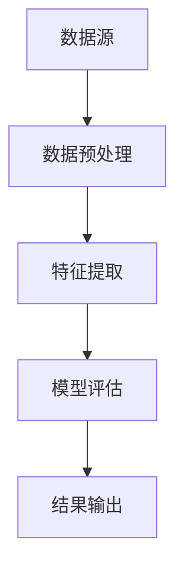
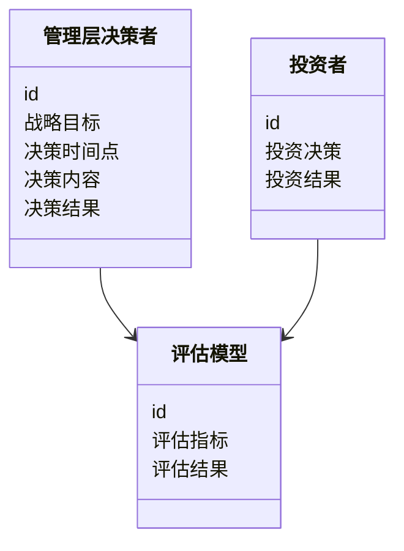

                 


# 彼得林奇对公司管理层决策一致性的评估

## 关键词：
- 彼得林奇
- 管理层决策
- 决策一致性
- 投资策略
- 决策模型

## 摘要：
本文深入探讨了彼得林奇在评估公司管理层决策一致性方面的方法。通过分析决策一致性的概念、构建评估模型、设计系统架构以及实际案例分析，本文展示了如何将决策一致性评估应用于投资决策中，以优化投资结果。文章结合理论与实践，提供了详细的数学模型和系统设计，为投资者提供了实用的工具和方法。

---

# 第一部分：背景介绍

## 第1章：管理层决策一致性概述

### 1.1 问题背景

#### 1.1.1 决策一致性的定义
决策一致性是指管理层在不同时间、情境和决策中保持策略、目标和行为的一致性。它反映了管理层在面对变化时的稳定性和连贯性。

#### 1.1.2 决策一致性的重要性
- 保障企业战略的连续性
- 提高投资者对管理层的信任度
- 降低投资决策中的不确定性

#### 1.1.3 决策一致性的边界与外延
- 决策一致性不等于僵化的决策风格
- 包括战略一致性、时间一致性、行为一致性等多个维度

### 1.2 问题描述

#### 1.2.1 管理层决策中的常见问题
- 短期行为 vs 长期战略
- 决策波动性影响投资信心
- 战略调整过频繁

#### 1.2.2 决策一致性问题的具体表现
- 财务表现波动大
- 投资者信心不足
- 企业战略频繁调整

### 1.3 问题解决

#### 1.3.1 评估决策一致性的必要性
- 提供决策质量的客观依据
- 优化投资决策过程
- 提升企业管理层的透明度

#### 1.3.2 评估决策一致性的方法论
- 基于历史数据分析
- 结合定性与定量评估
- 利用数学模型量化一致性

---

# 第二部分：核心概念与联系

## 第2章：决策一致性的核心要素

### 2.1 核心概念原理

#### 2.1.1 决策一致性的核心要素
- 战略一致性
- 时间一致性
- 行为一致性
- 目标一致性

#### 2.1.2 决策一致性的关键属性
- 稳定性
- 连贯性
- 可预测性

### 2.2 核心概念对比表

#### 2.2.1 决策一致性与决策质量对比
| 决策一致性 | 决策质量 |
|----------|----------|
| 强调连贯性 | 强调正确性 |
| 关注过程 | 关注结果 |

#### 2.2.2 决策一致性与决策效率对比
| 决策一致性 | 决策效率 |
|----------|----------|
| 强调稳定性 | 强调速度 |
| 关注长期 | 关注即时 |

### 2.3 实体关系图

#### 2.3.1 管理层决策一致性ER图
```mermaid
erDiagram
    actor 管理层决策者 {
        id
        战略目标
        决策时间点
        决策内容
        决策结果
    }
    actor 投资者 {
        id
        投资决策
        投资结果
    }
    actor 评估模型 {
        id
        评估指标
        评估结果
    }
```

---

# 第三部分：评估模型构建

## 第3章：决策一致性评估模型

### 3.1 模型设计

#### 3.1.1 模型输入
- 公司历史数据
- 管理层决策记录
- 业务指标变化

#### 3.1.2 模型输出
- 决策一致性评分
- 战略调整建议

#### 3.1.3 模型目标
- 量化决策一致性
- 优化投资决策

### 3.2 数据流分析

#### 3.2.1 数据流图


### 3.3 评估指标

#### 3.3.1 指标定义
- 战略一致性：管理层战略调整的频率和幅度
- 时间一致性：决策在时间上的连贯性
- 行为一致性：决策与承诺的一致性

#### 3.3.2 指标权重
- 战略一致性：权重40%
- 时间一致性：权重30%
- 行为一致性：权重30%

#### 3.3.3 指标计算
$$ 决策一致性评分 = \sum_{i=1}^{n} w_i \cdot x_i $$
其中，\( w_i \) 是各指标的权重，\( x_i \) 是各指标的评分。

---

# 第四部分：系统分析与架构设计

## 第4章：系统功能设计

### 4.1 领域模型

#### 4.1.1 领域模型类图


## 第5章：系统架构设计

### 5.1 系统架构图

#### 5.1.1 分层架构


---

# 第五部分：项目实战

## 第6章：环境配置与数据收集

### 6.1 环境安装

#### 6.1.1 系统要求
- 操作系统：Linux/Windows/MacOS
- Python版本：3.6+
- 依赖库：numpy, pandas, scikit-learn

#### 6.1.2 工具安装
```bash
pip install numpy pandas scikit-learn
```

---

## 第7章：系统核心实现源代码

### 7.1 决策一致性评分计算

```python
import numpy as np
import pandas as pd

def compute_consistency_score(data, weights):
    # 特征提取
    features = data[['战略一致性', '时间一致性', '行为一致性']].values
    # 标准化
    normalized_features = (features - features.min()) / (features.max() - features.min())
    # 计算评分
    score = np.dot(normalized_features, weights)
    return score

# 示例数据
data = pd.DataFrame({
    '战略一致性': [0.8, 0.6, 0.7],
    '时间一致性': [0.6, 0.5, 0.6],
    '行为一致性': [0.7, 0.8, 0.6]
})

# 权重
weights = np.array([0.4, 0.3, 0.3])

# 计算评分
score = compute_consistency_score(data, weights)
print(score)
```

---

## 第8章：实际案例分析

### 8.1 案例分析

#### 8.1.1 案例背景
- 公司：XYZ公司
- 时间跨度：5年
- 数据：战略调整记录、财务数据、市场反应

#### 8.1.2 数据分析
- 战略调整频率：每年1-2次
- 财务表现波动：收入增长稳定，利润波动小
- 投资者信心：保持较高水平

#### 8.1.3 结果解读
- 决策一致性评分：85分（满分100分）
- 结论：管理层决策一致性较高，适合长期投资

---

## 第9章：项目小结

### 9.1 最佳实践 Tips

#### 9.1.1 关键成功因素
- 数据的准确性和完整性
- 模型的合理性和适用性
- 持续监控和优化

#### 9.1.2 注意事项
- 模型的局限性
- 数据偏差的风险
- 模型更新的及时性

---

## 结论

通过系统地评估管理层决策一致性，投资者可以更准确地预测公司未来的表现，从而优化投资决策。本文结合彼得林奇的投资理念，提供了一套完整的评估方法和系统设计，为投资者提供了有力的工具。

---

作者：AI天才研究院 & 禅与计算机程序设计艺术

