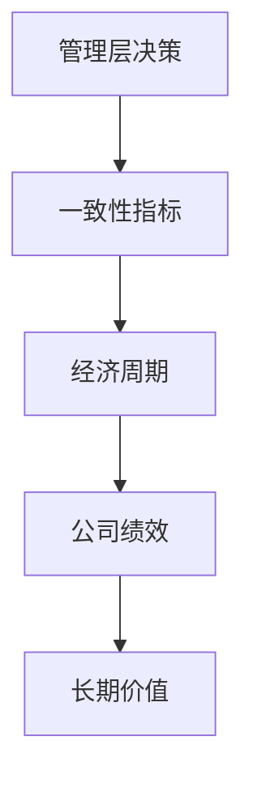
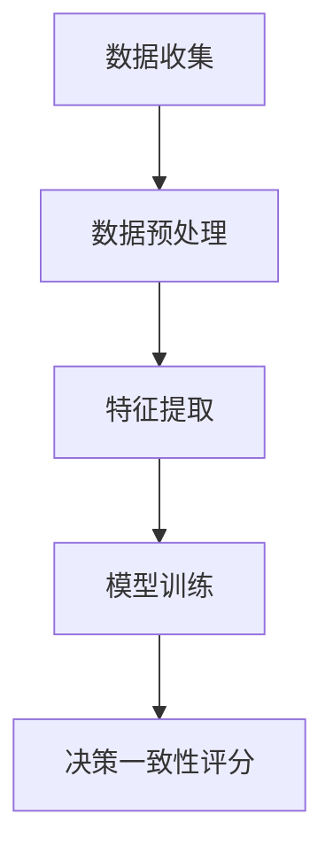
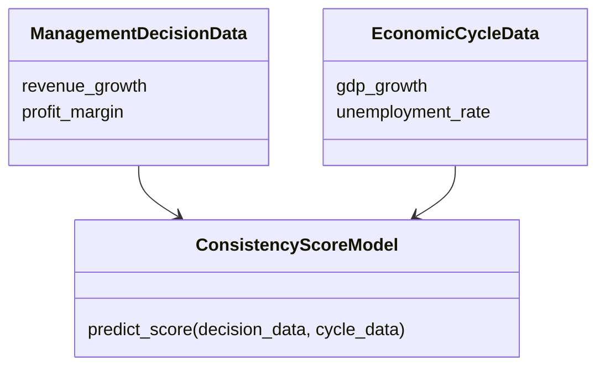
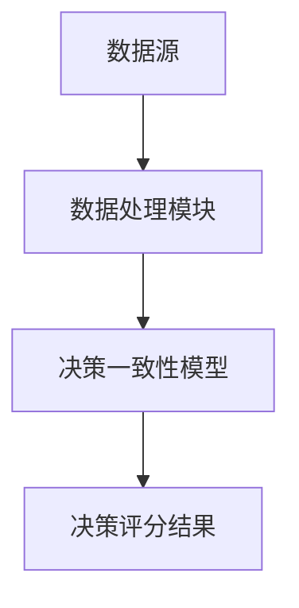
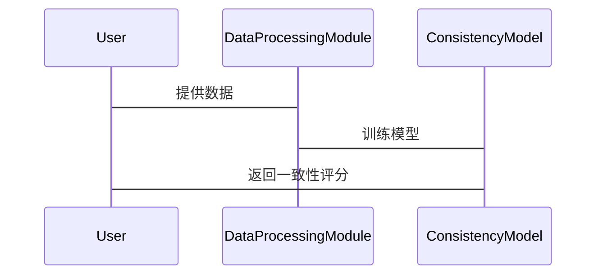

                 


# 彼得林奇对公司管理层决策一致性的跨周期分析

> 关键词：彼得林奇，管理层决策，一致性分析，经济周期，决策模型

> 摘要：本文从彼得林奇的投资理念出发，结合技术方法，系统分析公司管理层决策一致性的跨周期特征，构建决策一致性评分模型，并通过实际案例分析验证模型的有效性。

---

## 第一部分: 背景介绍

### 第1章: 彼得林奇与公司管理层决策一致性概述

#### 1.1 背景与问题背景
##### 1.1.1 管理层决策一致性的定义
管理层决策一致性是指公司在不同时间点、不同经济环境下，管理层决策的稳定性和连贯性。具体包括决策的质量、稳定性和可预测性。

##### 1.1.2 问题背景与研究意义
- 管理层决策的稳定性对公司长期价值至关重要。
- 经济周期波动对管理层决策的影响显著。
- 通过分析决策一致性，可以帮助投资者和公司更好地理解管理层的行为模式。

##### 1.1.3 彼得林奇投资方法的核心理念
- 重视公司基本面分析。
- 关注管理层的决策能力和一致性。
- 长期投资，避免短期波动干扰。

#### 1.2 核心概念与问题描述
##### 1.2.1 管理层决策一致性的关键要素
| 要素 | 定义 | 示例 |
|------|------|------|
| 决策质量 | 决策的合理性和有效性 | 高增长投资决策 |
| 决策稳定性 | 决策的持续性和一致性 | 连续多年的研发投入 |
| 决策可预测性 | 决策的可预测性 | 稳定的股息政策 |

##### 1.2.2 问题的边界与外延
- 边界：仅分析管理层决策，不考虑外部市场干扰。
- 外延：包括经济周期波动对决策的影响。

##### 1.2.3 决策一致性与公司长期价值的关系
- 决策一致性是公司长期价值的重要保障。
- 决策一致性与公司股价波动呈负相关。

#### 1.3 本章小结
本章介绍了管理层决策一致性的定义、关键要素及其与公司长期价值的关系，为后续分析奠定了基础。

---

## 第二部分: 核心概念与联系

### 第2章: 管理层决策一致性的核心要素与模型

#### 2.1 核心概念与原理
##### 2.1.1 决策一致性模型的构建
- 模型包括决策质量、稳定性、可预测性三个维度。
- 使用线性回归模型量化决策一致性。

##### 2.1.2 决策质量与稳定性的对比分析
| 维度 | 定义 | 关注点 |
|------|------|--------|
| 决策质量 | 决策的合理性和有效性 | 投资回报率 |
| 决策稳定性 | 决策的持续性和一致性 | 研发投入 |

##### 2.1.3 决策一致性与公司治理的关系
- 决策一致性受公司治理结构影响。
- 良好的公司治理可以提高决策一致性。

#### 2.2 决策一致性与周期性经济波动
##### 2.2.1 经济周期对管理层决策的影响
- 经济衰退：保守决策为主。
- 经济繁荣：激进决策为主。

##### 2.2.2 决策一致性的跨周期稳定性分析
- 稳定性分析：使用时间序列分析。
- 波动性分析：使用波动率指标。

##### 2.2.3 公司管理层决策的外部环境因素
- 宏观经济环境。
- 行业竞争格局。

#### 2.3 决策一致性ER实体关系图


---

## 第三部分: 算法原理讲解

### 第3章: 决策一致性分析的算法原理

#### 3.1 算法原理概述
##### 3.1.1 决策一致性评分模型
- 使用线性回归模型量化决策一致性。
- 公式：$$ consistency\_score = \beta_0 + \beta_1 \times revenue\_growth + \beta_2 \times profit\_margin $$

##### 3.1.2 时间序列分析方法
- 使用ARIMA模型分析决策一致性的时间序列特征。

##### 3.1.3 多元回归分析的应用
- 通过多元回归分析，识别影响决策一致性的关键因素。

#### 3.2 算法流程图


#### 3.3 Python实现代码
```python
import pandas as pd
from sklearn.linear_model import LinearRegression

# 数据预处理
data = pd.read_csv('management_decisions.csv')
X = data[['revenue_growth', 'profit_margin']]
y = data['consistency_score']

# 模型训练
model = LinearRegression()
model.fit(X, y)

# 预测与评分
predicted_scores = model.predict(X)
```

#### 3.4 数学模型与公式
##### 线性回归模型
$$ y = \beta_0 + \beta_1x_1 + \beta_2x_2 + \epsilon $$

##### 决策一致性评分公式
$$ consistency\_score = \frac{\sum_{i=1}^{n} |actual\_i - predicted\_i|}{n} $$

---

## 第四部分: 系统分析与架构设计

### 第4章: 系统架构与实现

#### 4.1 问题场景介绍
##### 4.1.1 管理层决策数据的收集与处理
- 数据来源：公司财报、行业报告。
- 数据处理：清洗、特征提取。

##### 4.1.2 经济周期数据的获取与整合
- 数据来源：宏观经济指标。
- 数据整合：时间序列数据处理。

##### 4.1.3 决策一致性评分模型的构建与应用
- 模型构建：使用历史数据训练模型。
- 应用：预测未来决策一致性。

#### 4.2 系统功能设计
##### 4.2.1 领域模型（类图）


##### 4.2.2 系统架构设计（架构图）


##### 4.2.3 系统交互（序列图）


---

## 第五部分: 项目实战

### 第5章: 项目实战与案例分析

#### 5.1 环境安装与数据准备
- 环境安装：安装Python、Pandas、Scikit-learn。
- 数据准备：下载公司财报数据和宏观经济数据。

#### 5.2 系统核心实现源代码
```python
import pandas as pd
from sklearn.linear_model import LinearRegression

# 数据预处理
data = pd.read_csv('management_decisions.csv')
X = data[['revenue_growth', 'profit_margin']]
y = data['consistency_score']

# 模型训练
model = LinearRegression()
model.fit(X, y)

# 预测与评分
predicted_scores = model.predict(X)
```

#### 5.3 代码应用解读与分析
- 代码功能：构建决策一致性评分模型。
- 模型解释：线性回归模型量化决策一致性。

#### 5.4 实际案例分析
- 案例背景：某公司管理层决策数据。
- 数据分析：使用模型预测决策一致性。
- 结果解读：高一致性决策有助于公司长期发展。

#### 5.5 项目小结
- 项目总结：构建了决策一致性评分模型。
- 项目意义：为投资者提供决策支持。

---

## 第六部分: 最佳实践与总结

### 第6章: 最佳实践与总结

#### 6.1 最佳实践 tips
- 数据质量是关键。
- 模型选择要合适。
- 结果要结合实际。

#### 6.2 小结
- 本文系统分析了彼得林奇的决策一致性观点。
- 构建了决策一致性评分模型。
- 通过案例分析验证了模型的有效性。

#### 6.3 注意事项
- 数据获取要注意合法合规。
- 模型要结合实际调整参数。

#### 6.4 拓展阅读
- 《彼得林奇的投资艺术》。
- 时间序列分析相关书籍。

---

## 作者：AI天才研究院（AI Genius Institute） & 禅与计算机程序设计艺术（Zen And The Art of Computer Programming）

作者邮箱：contact@aigeniusinstitute.com  
作者网站：https://www.aigeniusinstitute.com

