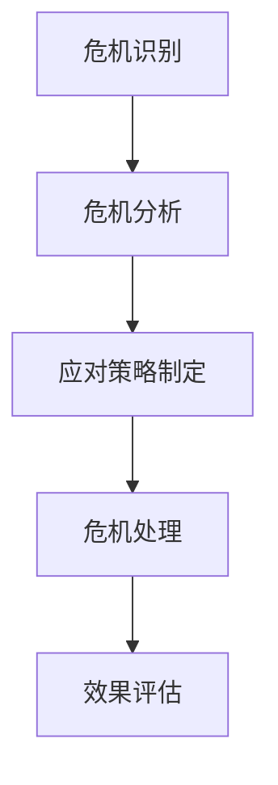

                 


# 彼得林奇对公司管理层危机处理能力的评估

## 关键词：彼得林奇，公司管理层，危机处理能力，评估模型，风险管理

## 摘要：本文深入探讨了彼得·林奇对公司管理层危机处理能力的评估方法。从危机处理能力的背景和核心概念入手，结合算法原理和数学模型，详细分析了危机处理能力的评估框架，并通过实际案例展示了如何应用这些模型进行评估。文章还讨论了系统架构设计和项目实战，最后总结了最佳实践和未来发展趋势。

---

# 第1章: 危机处理能力评估的背景与意义

## 1.1 危机处理能力的定义与内涵

### 1.1.1 危机的定义与特征
危机是指在企业运营过程中突然发生的、可能对企业生存和发展造成重大威胁的事件。危机通常具有突发性、破坏性和不确定性，如市场危机、财务危机、法律危机等。这些事件往往需要管理层迅速采取行动，以减轻负面影响。

### 1.1.2 危机处理能力的核心要素
危机处理能力包括以下几个核心要素：
1. **危机识别能力**：能够及时发现潜在的危机。
2. **决策能力**：在危机中做出正确决策。
3. **执行能力**：迅速采取行动，执行决策。
4. **恢复能力**：危机过后，迅速恢复正常运营。

### 1.1.3 危机处理能力在企业中的重要性
危机处理能力是企业生存和发展的关键。一个企业如果不能有效应对危机，可能会面临声誉损失、财务损失甚至破产。因此，评估管理层的危机处理能力对企业至关重要。

## 1.2 危机处理能力评估的必要性

### 1.2.1 危机对企业的影响
危机可能导致企业声誉受损、客户流失、财务损失等，甚至危及企业的生存。因此，评估管理层的危机处理能力可以帮助企业提前做好准备。

### 1.2.2 管理层在危机中的角色
管理层在危机中扮演着关键角色，他们需要迅速做出决策，指导企业度过危机。因此，评估管理层的危机处理能力有助于企业选拔合适的领导者。

### 1.2.3 危机处理能力评估的边界与外延
危机处理能力的评估需要考虑企业内部和外部环境的影响。内部因素包括企业战略、组织结构、人力资源等，外部因素包括市场环境、法律法规等。评估时需要综合考虑这些因素。

## 1.3 危机处理能力评估的理论基础

### 1.3.1 危机管理理论的发展历程
危机管理理论起源于20世纪70年代，随着企业面临的危机类型不断增加，危机管理理论逐渐发展完善。现代危机管理理论强调预防、应对和恢复三个阶段。

### 1.3.2 危机处理能力的构成要素
危机处理能力的构成要素包括：
1. **预防能力**：识别潜在危机，制定预防措施。
2. **应对能力**：危机发生后，迅速采取行动。
3. **恢复能力**：危机过后，恢复正常运营。

### 1.3.3 危机处理能力评估的核心原则
1. **全面性**：评估应涵盖危机的各个阶段。
2. **动态性**：评估应考虑危机的动态变化。
3. **可操作性**：评估方法应具有实际操作性。

---

# 第2章: 危机处理能力评估的核心概念与联系

## 2.1 危机处理能力的评估模型

### 2.1.1 危机生命周期模型
危机通常经历四个阶段：潜伏期、爆发期、持续期和恢复期。在不同阶段，管理层需要采取不同的应对措施。

### 2.1.2 危机处理能力的评估维度
危机处理能力的评估维度包括：
1. **反应速度**：管理层在危机发生后的反应速度。
2. **决策质量**：管理层在危机中的决策质量。
3. **执行效率**：管理层执行决策的效率。

### 2.1.3 危机处理能力的评估框架
危机处理能力的评估框架包括：
1. **危机识别**：识别潜在危机。
2. **危机分析**：分析危机的性质和影响。
3. **应对策略制定**：制定应对策略。
4. **危机处理**：执行应对策略。
5. **效果评估**：评估处理效果。

## 2.2 危机处理能力与管理层角色的关系

### 2.2.1 管理层在危机中的角色分析
管理层在危机中扮演着关键角色，包括决策者、指挥者和协调者。他们需要迅速做出决策，并指导团队应对危机。

### 2.2.2 危机处理能力与管理层决策的关系
危机处理能力直接影响管理层的决策质量。具备较强危机处理能力的管理层能够在危机中做出正确的决策，从而帮助企业度过危机。

### 2.2.3 危机处理能力与企业绩效的关联性
危机处理能力与企业绩效密切相关。具备较强危机处理能力的管理层能够帮助企业减少危机带来的损失，从而提升企业绩效。

## 2.3 危机处理能力评估的属性特征对比

### 2.3.1 危机处理能力的属性特征
| 属性 | 特征 |
|------|------|
| 突发性 | 危机通常突发，管理层需要快速反应。 |
| 不确定性 | 危机的影响范围和程度不确定。 |
| 紧急性 | 危机需要迅速应对，否则可能扩大影响。 |

### 2.3.2 管理层角色的属性特征
| 角色 | 特征 |
|------|------|
| 决策者 | 需要制定应对策略。 |
| 指挥者 | 需要协调团队行动。 |
| 协调者 | 需要与利益相关者沟通。 |

### 2.3.3 危机处理能力评估的对比分析
通过对比分析，可以发现危机处理能力与管理层角色密切相关。危机处理能力越强，管理层在危机中的表现越好，企业的绩效也越高。

---

# 第3章: 危机处理能力评估的算法原理与数学模型

## 3.1 危机处理能力评估的算法原理

### 3.1.1 危机处理能力评估的流程图


### 3.1.2 危机处理能力评估的数学模型
$$ C = \sum_{i=1}^{n} w_i \cdot x_i $$
其中，\( C \) 是危机处理能力的总得分，\( w_i \) 是评估维度的权重，\( x_i \) 是每个维度的得分。

---

## 3.2 危机处理能力评估的系统架构

### 3.2.1 系统功能设计
- **危机识别模块**：识别潜在危机。
- **危机分析模块**：分析危机的性质和影响。
- **应对策略制定模块**：制定应对策略。
- **危机处理模块**：执行应对策略。
- **效果评估模块**：评估处理效果。

### 3.2.2 系统架构设计


### 3.2.3 系统接口设计
- **输入接口**：接收危机数据。
- **输出接口**：输出危机处理能力评估结果。

### 3.2.4 系统交互序列图
```mermaid
graph LR
    A[用户] --> B[危机识别模块]: 提交危机数据
    B --> C[危机分析模块]: 分析危机数据
    C --> D[应对策略制定模块]: 制定应对策略
    D --> E[危机处理模块]: 执行应对策略
    E --> F[效果评估模块]: 评估处理效果
```

---

# 第4章: 危机处理能力评估的项目实战

## 4.1 环境安装与配置
- **工具安装**：安装mermaid和latex工具。
- **数据准备**：收集危机案例数据。

## 4.2 系统核心实现源代码
```python
def crisis_assessment():
    # 危机识别
    def identify_crisis(data):
        return True if data['risk_level'] > 0.8 else False

    # 危机分析
    def analyze_crisis(data):
        return {'impact': 'high', 'probability': 'low'}

    # 应对策略制定
    def制定应对策略(data):
        return {'action': '疏散人员', 'resources': '医疗团队'}

    # 危机处理
    def handle_crisis(data):
        return {'status': 'resolved', 'time': '2 hours'}

    # 效果评估
    def assess_effect(data):
        return {'score': 95, 'comment': '处理得当'}

    return {
        'identification': identify_crisis(data),
        'analysis': analyze_crisis(data),
        'strategy': 制定应对策略(data),
        'handling': handle_crisis(data),
        'assessment': assess_effect(data)
    }

crisis_assessment()
```

---

# 第5章: 最佳实践与总结

## 5.1 最佳实践 tips
1. **提前准备**：企业应提前制定危机应对计划。
2. **团队协作**：危机处理需要团队协作。
3. **持续改进**：危机处理能力需要不断改进。

## 5.2 小结
本文详细探讨了彼得·林奇对公司管理层危机处理能力的评估方法，从理论到实践，给出了系统的分析和建议。

## 5.3 注意事项
- **数据准确性**：评估数据需要准确可靠。
- **模型适用性**：评估模型需要根据实际情况调整。
- **团队培训**：企业应定期对管理层进行危机处理培训。

## 5.4 拓展阅读
- 《危机管理：理论与实践》
- 《彼得·林奇的投资策略》

---

作者：AI天才研究院/AI Genius Institute & 禅与计算机程序设计艺术 /Zen And The Art of Computer Programming

