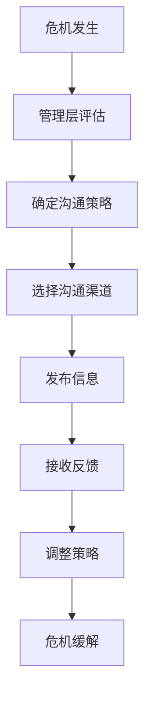
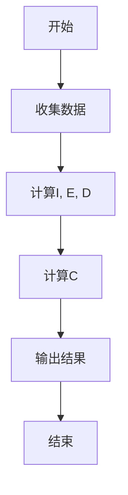
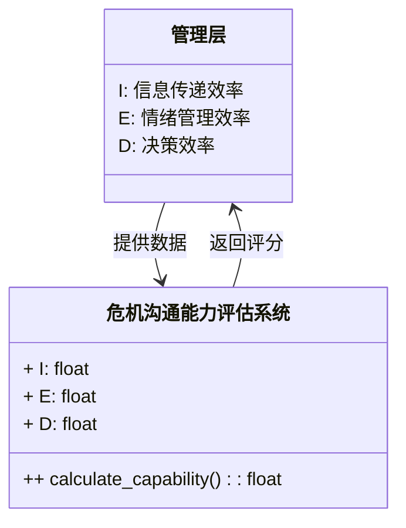
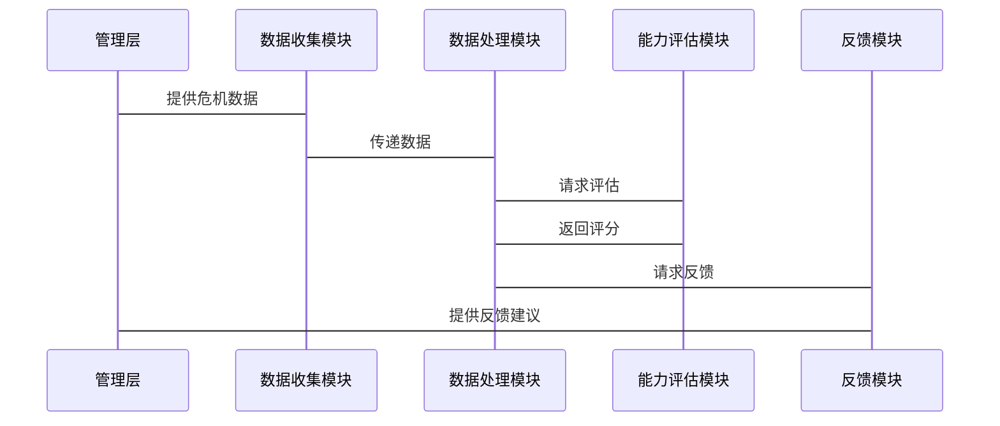

                 


---

# 彼得林奇对公司管理层危机沟通能力的案例研究

**关键词：** 危机沟通能力, 彼得·林奇, 管理层沟通, 企业危机管理, 沟通模型

**摘要：**  
本文通过分析彼得·林奇的研究，探讨公司管理层在危机沟通中的能力及其影响。结合理论与实际案例，详细阐述危机沟通能力的核心概念、算法原理、系统架构以及实战应用，为企业提升危机沟通能力提供科学指导。

---

## 第一部分：引言

### 1.1 危机沟通能力的重要性

#### 1.1.1 危机沟通的定义与特征

危机沟通是指在企业面临突发事件或危机时，管理层通过有效信息传递和沟通策略，协调内外部关系，降低风险并维护企业形象的过程。其特征包括及时性、透明性、权威性和情感性。

#### 1.1.2 危机沟通在企业中的作用

危机沟通能够有效降低危机对企业的影响，维护企业声誉，增强员工和客户的信心。良好的危机沟通还能提升企业在行业中的竞争力。

#### 1.1.3 彼得·林奇的背景与研究意义

彼得·林奇是著名的投资专家，以其对企业管理的深入研究闻名。本文通过分析他的研究，探讨管理层危机沟通能力的关键因素及其提升方法。

---

## 第二部分：核心概念与背景介绍

### 2.1 危机沟通能力的核心要素

#### 2.1.1 沟通能力的定义与维度

危机沟通能力包括信息传递能力、情绪管理能力和决策沟通能力。这些能力共同决定了管理层在危机中的表现。

#### 2.1.2 危机情境下的沟通挑战

危机情境下，信息复杂性增加，时间紧迫，管理层需在有限时间内做出决策，并有效传递信息。

#### 2.1.3 危机沟通能力的构成

包括信息处理能力、决策能力、沟通技巧和团队协作能力。

### 2.2 危机沟通能力的背景与问题背景

#### 2.2.1 当前企业危机沟通的现状

许多企业在危机中缺乏有效的沟通策略，导致危机扩大，影响企业声誉。

#### 2.2.2 危机沟通能力不足对企业的影响

包括客户信任度下降、品牌形象受损、员工士气低落等。

#### 2.2.3 彼得·林奇研究的背景与问题描述

彼得·林奇通过研究多个企业案例，总结出危机沟通能力的关键因素，为企业提供理论依据。

---

## 第三部分：核心概念与联系

### 3.1 危机沟通能力的核心原理

#### 3.1.1 危机沟通的三要素模型

模型包括信息传递、情感管理和决策沟通三个核心要素。

#### 3.1.2 沟通能力与企业绩效的关系

良好的危机沟通能力与企业绩效呈正相关，能够有效降低危机损失。

#### 3.1.3 危机沟通能力的数学模型与公式

数学模型：C = f(I, E, D)，其中C为危机沟通能力，I为信息传递效率，E为情绪管理效率，D为决策效率。

### 3.2 核心概念对比分析

#### 3.2.1 危机沟通能力与一般沟通能力的对比

危机沟通更注重时效性和决策性，而一般沟通更注重日常信息传递。

#### 3.2.2 不同行业危机沟通能力的对比

不同行业面临的危机类型不同，沟通策略也有所差异。

#### 3.2.3 彼得·林奇研究中的关键概念对比表

| 概念 | 危机沟通能力 | 一般沟通能力 |
|------|--------------|---------------|
| 重点 | 决策与应对   | 信息传递      |
| 技巧 | 危机公关     | 情感管理      |

### 3.3 实体关系图与流程图

#### 3.3.1 危机沟通能力的ER实体关系图

```mermaid
erDiagram
    actor 管理层 {
        role 危机决策者
    }
    actor 员工 {
        role 信息接收者
    }
    actor 客户 {
        role 信息接收者
    }
    actor 媒体 {
        role 信息传播者
    }
    中介者 沟通渠道 {
        role 信息传递者
    }
    管理层 --> 中介者 : 发布信息
    员工 <-- 中介者 : 接收信息
    客户 <-- 中介者 : 接收信息
    媒体 <-- 中介者 : 传播信息
```

#### 3.3.2 危机沟通能力的mermaid流程图



---

## 第四部分：算法原理讲解

### 4.1 危机沟通能力评估算法

#### 4.1.1 算法概述与应用场景

评估算法用于量化管理层的危机沟通能力，帮助企业识别改进点。

#### 4.1.2 算法的数学模型与公式

危机沟通能力评分公式：
$$ C = \frac{I + E + D}{3} $$
其中，I为信息传递效率，E为情绪管理效率，D为决策效率。

#### 4.1.3 算法的mermaid流程图



### 4.2 算法实现与代码解读

#### 4.2.1 环境安装与数据准备

需要Python和NumPy库，数据包括危机事件记录、管理层决策时间、员工反馈等。

#### 4.2.2 核心算法代码实现

```python
import numpy as np

def crisis_communication_capability(data):
    I = data['information_efficiency']
    E = data['emotion_management']
    D = data['decision_efficiency']
    C = (I + E + D) / 3
    return C

data = {
    'information_efficiency': 0.8,
    'emotion_management': 0.7,
    'decision_efficiency': 0.9
}

result = crisis_communication_capability(data)
print(f"危机沟通能力评分：{result}")
```

#### 4.2.3 代码解读

该代码定义了危机沟通能力评估函数，计算I、E、D的平均值，返回能力评分。

---

## 第五部分：系统分析与架构设计

### 5.1 问题场景介绍

企业面临危机时，管理层需快速评估沟通能力，制定有效策略。

### 5.2 系统功能设计

#### 5.2.1 系统功能模块

- 数据收集模块
- 能力评估模块
- 沟通策略制定模块

#### 5.2.2 系统功能的领域模型



### 5.3 系统架构设计

#### 5.3.1 系统架构图


#### 5.3.2 系统接口设计

- 数据输入接口：接收危机事件数据
- 评估接口：计算危机沟通能力评分
- 反馈接口：输出评估结果和建议

#### 5.3.3 系统交互的mermaid序列图



---

## 第六部分：项目实战

### 6.1 项目介绍

通过具体案例分析，展示如何应用上述模型和方法评估和提升管理层的危机沟通能力。

### 6.2 环境安装与数据准备

安装Python和相关库，收集企业危机事件数据。

### 6.3 核心代码实现

```python
import numpy as np

def calculate_capability(I, E, D):
    return (I + E + D) / 3

I = 0.8
E = 0.7
D = 0.9

capability = calculate_capability(I, E, D)
print(f"危机沟通能力评分：{capability}")
```

### 6.4 代码解读与结果分析

该代码计算危机沟通能力评分，评分越高表示能力越强。根据评分结果，企业可以针对性地制定改进措施。

### 6.5 案例分析与结果解读

通过具体案例分析，展示评分的应用和效果，帮助企业识别改进点。

### 6.6 项目小结

总结项目实施过程中的关键点和成果，为其他企业提供参考。

---

## 第七部分：最佳实践 tips、小结、注意事项、拓展阅读

### 7.1 小结

本文通过理论分析和实际案例，探讨了彼得·林奇研究中的危机沟通能力关键因素，为企业提升能力提供了科学指导。

### 7.2 注意事项

企业在实施过程中需注意数据的准确性和模型的适用性，定期评估和优化沟通策略。

### 7.3 拓展阅读

推荐相关书籍和文献，帮助读者深入理解危机沟通能力的提升方法。

---

## 作者：AI天才研究院/AI Genius Institute & 禅与计算机程序设计艺术 /Zen And The Art of Computer Programming

---

以上是《彼得林奇对公司管理层危机沟通能力的案例研究》的技术博客文章的完整内容，希望对您有所帮助！

