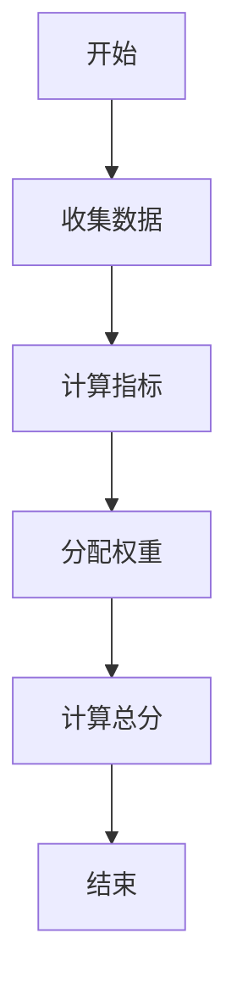
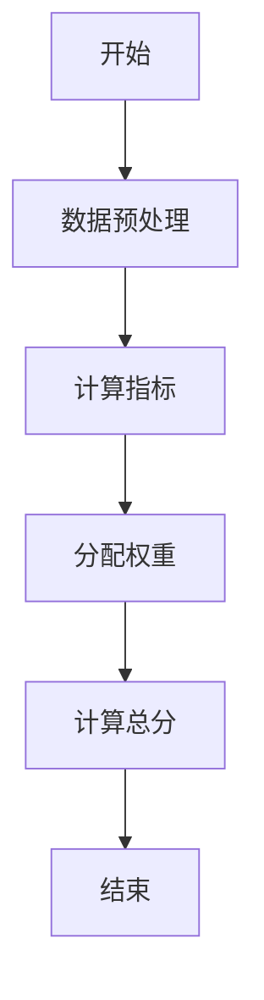
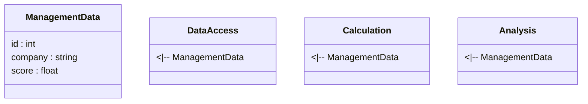
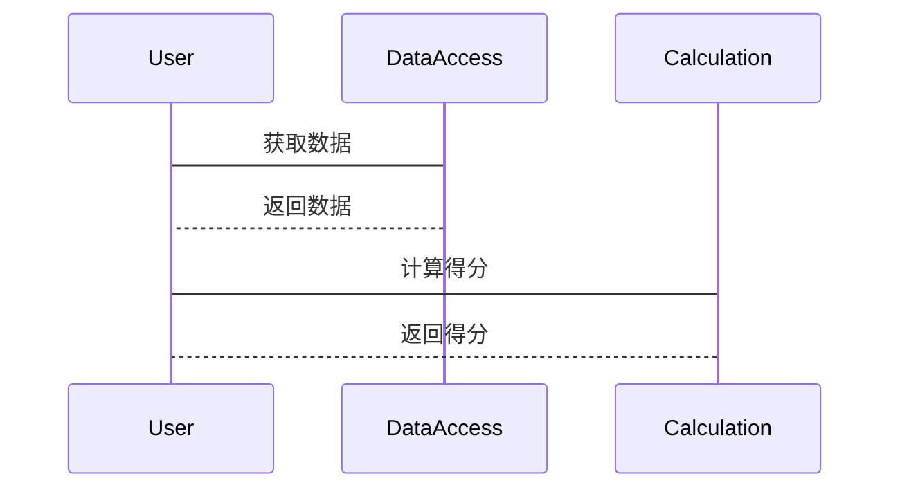

                 


# 彼得林奇对公司管理层执行力的量化评估

> 关键词：彼得林奇，管理层执行力，量化评估，投资理念，模型构建

> 摘要：本文通过分析彼得林奇的投资理念，提出了一种对公司管理层执行力进行量化评估的方法。从战略执行能力、组织协调能力和决策能力三个维度出发，构建了基于ER实体关系和数学模型的评估框架。文章详细讲解了算法原理、系统架构，并通过实际案例展示了评估过程和结果，最后总结了最佳实践和注意事项。

---

# 正文

## 第一部分：背景介绍

### 第1章：管理层执行力的量化评估背景

#### 1.1 管理层执行力的重要性

##### 1.1.1 管理层执行力的定义

管理层执行力是指公司高层管理者在制定战略、组织资源、协调团队和实现目标方面的能力。它是企业成功的关键因素之一，直接影响企业的绩效和可持续发展。

##### 1.1.2 管理层执行力对企业的影响

管理层执行力强的企业通常能够快速响应市场变化、高效执行战略决策，并在竞争中占据优势。相反，执行力弱的企业可能会错过市场机会，导致资源浪费和企业绩效低下。

##### 1.1.3 量化评估的必要性

量化评估能够帮助企业客观地衡量管理层的执行能力，为优化管理提供数据支持。通过量化评估，企业可以识别管理层的 strengths 和 weaknesses，并制定改进策略。

#### 1.2 彼得林奇的投资理念

##### 1.2.1 彼得林奇的投资者视角

彼得林奇是著名的投资专家，他认为投资的本质是选择优秀的公司和管理层。他强调，管理层的能力和决策对企业价值的影响至关重要。

##### 1.2.2 彼得林奇对管理层的重视

彼得林奇在选股时非常注重管理层的稳定性、决策能力和战略执行能力。他认为，优秀的管理层能够带领企业不断创造价值。

##### 1.2.3 量化评估的背景与意义

量化评估是彼得林奇投资理念的重要组成部分。通过量化指标，投资者可以更客观地评估管理层的执行力，从而做出更明智的投资决策。

### 第2章：量化评估的核心概念

#### 2.1 管理层执行力的关键维度

##### 2.1.1 战略执行能力

战略执行能力是指管理层将战略目标转化为具体行动的能力。它包括制定战略计划、分配资源和监控执行过程等方面。

##### 2.1.2 组织协调能力

组织协调能力是指管理层在内部协调团队、资源和流程的能力。高效的组织协调能力能够提高企业的运营效率。

##### 2.1.3 决策能力

决策能力是指管理层在复杂情况下做出明智决策的能力。优秀的决策能力能够帮助企业抓住机会和规避风险。

#### 2.2 量化评估的框架

##### 2.2.1 评估指标的选择

评估指标应涵盖战略执行能力、组织协调能力和决策能力。常见的指标包括净利润增长率、资产周转率和决策响应速度等。

##### 2.2.2 数据收集与处理

数据收集包括财务数据、管理数据和市场数据。处理数据时需要进行清洗和标准化，确保数据的准确性和一致性。

##### 2.2.3 评估模型的构建

评估模型应结合定量和定性分析，采用加权评分法。权重分配应根据各指标的重要性进行调整。

---

## 第二部分：核心概念与联系

### 第3章：核心概念的原理与联系

#### 3.1 管理层执行力的属性特征对比

| 维度         | 战略执行能力 | 组织协调能力 | 决策能力 |
|--------------|--------------|--------------|----------|
| 定义         | 战略目标的执行 | 资源协调与流程优化 | 重大决策的质量 |
| 重要性       | 高           | 中           | 高       |
| 评估难度     | 中           | 中           | 高       |

#### 3.2 ER实体关系图

```mermaid
erDiagram
    company {
        id : int
        name : string
        industry : string
    }
    manager {
        id : int
        name : string
        role : string
    }
    performance {
        id : int
        score : int
        timestamp : date
    }
    company --> performance : has
    manager --> performance : contributes_to
```

#### 3.3 管理层执行力的 Mermaid 流程图



---

## 第三部分：算法原理讲解

### 第4章：算法原理

#### 4.1 彼得林奇评估模型的算法原理

##### 4.1.1 数据预处理

```python
import pandas as pd

data = pd.read_csv('management_data.csv')
data = data.dropna().reset_index(drop=True)
```

##### 4.1.2 指标计算

```python
def calculate_scores(data):
    scores = []
    for _, row in data.iterrows():
        score = row['net_profit_growth'] * 0.4 + row['asset_turnover'] * 0.3 + row['decision_speed'] * 0.3
        scores.append(score)
    return scores

scores = calculate_scores(data)
```

##### 4.1.3 权重分配

```python
weights = {'net_profit_growth': 0.4, 'asset_turnover': 0.3, 'decision_speed': 0.3}
```

#### 4.2 算法流程图



#### 4.3 数学模型

##### 计算各指标的权重：

$$ \text{weight}_i = \frac{\text{importance}_i}{\sum_{j=1}^{n}\text{importance}_j} $$

##### 计算总分：

$$ \text{total\_score} = \sum_{i=1}^{m} (\text{score}_i \times \text{weight}_i) $$

---

### 第5章：数学模型与公式

#### 5.1 指标权重分配公式

$$ \text{weight}_i = \frac{\text{importance}_i}{\sum_{j=1}^{n}\text{importance}_j} $$

#### 5.2 总分计算公式

$$ \text{total\_score} = \sum_{i=1}^{m} (\text{score}_i \times \text{weight}_i) $$

#### 5.3 示例计算

假设三个指标的权重分别为0.4、0.3和0.3，某公司的指标得分为0.8、0.6和0.7。

$$ \text{total\_score} = 0.8 \times 0.4 + 0.6 \times 0.3 + 0.7 \times 0.3 = 0.32 + 0.18 + 0.21 = 0.71 $$

---

## 第四部分：系统分析与架构设计

### 第6章：系统架构设计

#### 6.1 项目介绍

本系统旨在量化评估公司管理层的执行力，帮助投资者做出更明智的投资决策。

#### 6.2 系统功能设计



#### 6.3 系统架构设计


#### 6.4 系统接口设计

##### 数据接口

```python
class DataAccess:
    def get_data(self):
        pass
```

##### 计算接口

```python
class Calculation:
    def compute_scores(self, data):
        pass
```

#### 6.5 系统交互设计



---

## 第五部分：项目实战

### 第7章：项目实战

#### 7.1 环境安装

安装所需的库：

```bash
pip install pandas mermaid4jupyter
```

#### 7.2 核心实现

##### 数据处理

```python
import pandas as pd

data = pd.read_csv('management_data.csv')
data = data.dropna().reset_index(drop=True)
```

##### 指标计算

```python
def calculate_scores(data):
    scores = []
    for _, row in data.iterrows():
        score = row['net_profit_growth'] * 0.4 + row['asset_turnover'] * 0.3 + row['decision_speed'] * 0.3
        scores.append(score)
    return scores

scores = calculate_scores(data)
```

##### 结果分析

```python
import matplotlib.pyplot as plt

plt.hist(scores, bins=5, alpha=0.5)
plt.xlabel('Score')
plt.ylabel('Frequency')
plt.title('Management Execution Score Distribution')
plt.show()
```

#### 7.3 案例分析

##### 数据收集

```python
data = {
    'company': ['A', 'B', 'C'],
    'net_profit_growth': [0.15, 0.2, 0.1],
    'asset_turnover': [0.8, 0.7, 0.9],
    'decision_speed': [0.7, 0.6, 0.8]
}
data = pd.DataFrame(data)
```

##### 计算得分

```python
scores = calculate_scores(data)
print(scores)  # 输出结果
```

##### 结果解读

得分高的公司管理层执行力较强，得分低的公司需要改进。

---

## 第六部分：最佳实践

### 第8章：总结与注意事项

#### 8.1 最佳实践 tips

1. 数据收集要全面且准确。
2. 指标权重应根据实际情况调整。
3. 定期更新评估模型。

#### 8.2 小结

本文通过彼得林奇的投资理念，构建了管理层执行力的量化评估模型，为投资者提供了科学的决策依据。

#### 8.3 注意事项

- 数据隐私和安全问题需要重视。
- 模型的适用性要根据具体行业调整。
- 结果解释时要结合实际情况。

#### 8.4 拓展阅读

建议进一步阅读彼得林奇的书籍，深入理解他的投资理念。

---

## 作者：AI天才研究院/AI Genius Institute & 禅与计算机程序设计艺术 /Zen And The Art of Computer Programming

