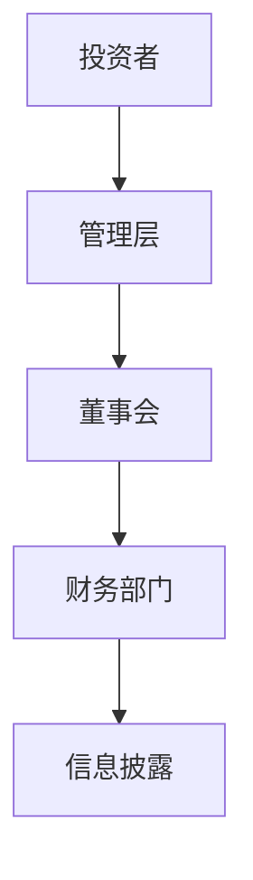

                 


# 彼得林奇对公司管理层沟通透明度的评估

> 关键词：彼得·林奇，公司管理层，沟通透明度，投资评估，公司治理，信息不对称

> 摘要：本文通过分析彼得·林奇的投资策略，探讨公司管理层沟通透明度的重要性及其在投资决策中的作用。文章详细阐述了沟通透明度的核心概念、评估方法和实际应用，结合实例分析，为投资者和企业管理者提供有价值的参考。

---

## 第1章: 沟通透明度的定义与重要性

### 1.1 沟通透明度的定义

- 沟通透明度是指企业在与利益相关者（如股东、投资者、员工等）交流时，信息的公开性、完整性和及时性。
- 核心要素包括信息的完整性、准确性和及时性。

### 1.2 彼得·林奇与公司管理层沟通透明度

- 彼得·林奇是著名的投资专家，强调透明度在投资决策中的重要性。
- 他通过分析管理层的沟通，评估企业的健康状况和未来潜力。

### 1.3 沟通透明度的重要性

- 帮助投资者评估企业价值，降低信息不对称风险。
- 提高企业信任度，增强投资者信心。

---

## 第2章: 沟通透明度的评估背景与问题描述

### 2.1 当前公司治理中的沟通问题

- 信息不透明的表现形式包括隐瞒负面信息、夸大成绩等。
- 信息不对称导致投资者决策失误，影响企业价值。

### 2.2 投资者与管理层之间的信息不对称

- 信息不对称定义及表现：管理层掌握更多信息，投资者处于弱势地位。
- 信息不对称对企业投资的影响：可能导致错误定价和投资决策。

### 2.3 沟通透明度的边界与外延

- 信息的边界：受法律法规限制，区分内部和外部透明度。
- 外延：透明度与企业治理、风险管理等密切相关。

---

## 第3章: 沟通透明度的核心概念与联系

### 3.1 核心概念

- 信息完整性：确保所有重要信息都被披露。
- 信息及时性：及时更新信息，反映最新情况。
- 信息准确性：数据真实可靠，避免误导。

### 3.2 概念对比

| 核心概念       | 定义与特征               |
|----------------|--------------------------|
| 完整性         | 包括所有相关信息           |
| 及时性         | 及时更新信息               |
| 准确性         | 数据真实可靠               |

---

## 第4章: 沟通透明度评估的算法原理

### 4.1 层次分析法（AHP）的应用

- 基本原理：通过构建层次结构，量化各因素的重要性。
- 应用步骤：构建层次模型、计算权重、进行一致性检验。

### 4.2 数学模型

- 公式：$A = \sum_{i=1}^{n} w_i x_i$
- 其中，$w_i$为权重，$x_i$为指标值。

---

## 第5章: 系统分析与架构设计

### 5.1 项目背景与目标

- 分析管理层沟通，评估透明度，辅助投资决策。

### 5.2 系统架构图



### 5.3 实体关系图


---

## 第6章: 项目实战

### 6.1 环境安装

- 使用Python和相关库（如pandas、numpy）进行数据处理。

### 6.2 核心代码实现

```python
import pandas as pd
import numpy as np

def calculate_transparency(company_data):
    # 计算透明度得分
    transparency = np.mean(company_data)
    return transparency

# 示例数据
data = {
    '管理层沟通': [0.8, 0.7, 0.9],
    '信息披露': [0.6, 0.8, 0.7],
    '及时性': [0.9, 0.8, 0.8]
}
df = pd.DataFrame(data)

transparency_score = calculate_transparency(df)
print(f"透明度得分: {transparency_score}")
```

### 6.3 案例分析

- 通过实际案例分析透明度评估结果，指导投资决策。

---

## 第7章: 最佳实践与总结

### 7.1 小结

- 透明度是投资决策的关键因素，影响企业价值和投资者信心。

### 7.2 注意事项

- 确保信息准确性和及时性，避免误导投资者。
- 结合其他治理要素，全面评估企业风险。

### 7.3 拓展阅读

- 推荐阅读相关书籍和文献，深入研究透明度评估方法。

---

## 参考文献

- 彼得·林奇的著作
- 相关公司治理文献
- 投资评估方法研究

---

作者：AI天才研究院/AI Genius Institute & 禅与计算机程序设计艺术 /Zen And The Art of Computer Programming

---

通过以上结构和内容，文章详细分析了彼得·林奇对公司管理层沟通透明度的评估，结合理论与实践，为投资者和企业管理者提供了深入的指导和参考。

