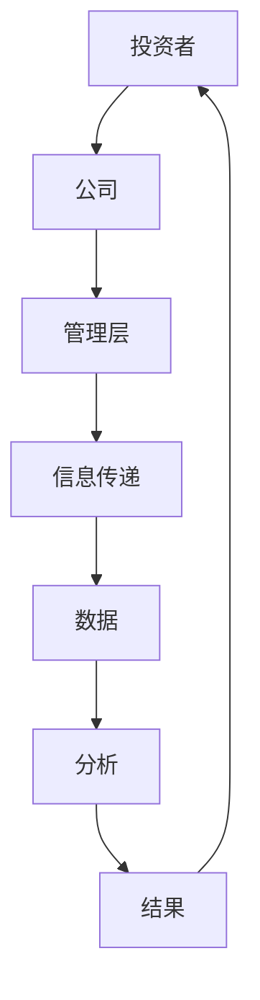
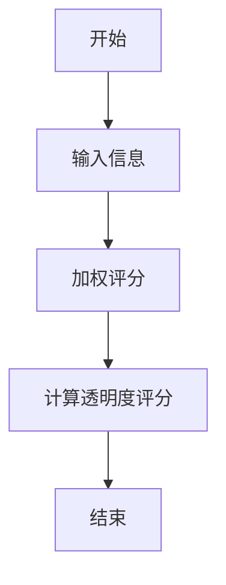
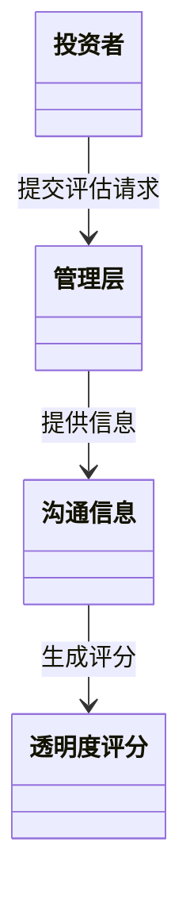
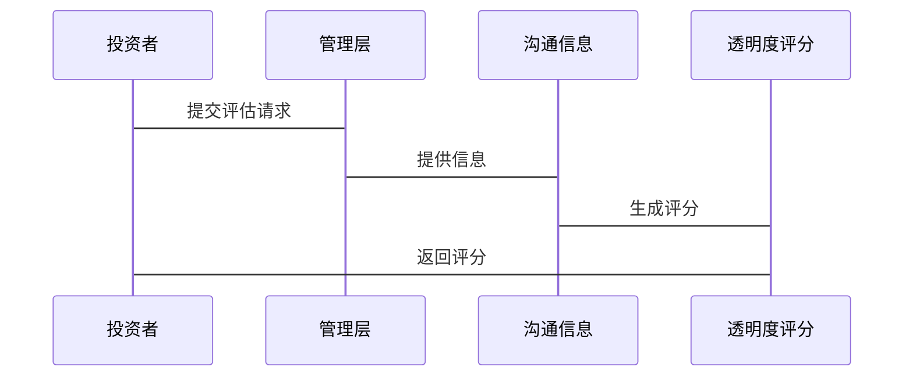

                 


# 彼得林奇对公司管理层沟通透明度的量化评估方法

> 关键词：彼得林奇、沟通透明度、量化评估、管理层沟通、投资决策

> 摘要：本文详细探讨了彼得·林奇对公司管理层沟通透明度的量化评估方法。通过分析沟通透明度的核心概念、算法原理、系统架构设计和项目实战，本文为投资者提供了一套科学的评估体系，帮助他们在投资决策中更好地评估公司的管理透明度。

---

# 第一部分：彼得林奇对公司管理层沟通透明度的量化评估背景

## 第1章：沟通透明度与投资决策的重要性

### 1.1 沟通透明度的定义与背景

#### 1.1.1 公司管理层沟通的基本概念
公司管理层的沟通是指管理层通过各种渠道与股东、投资者、员工和其他利益相关者进行信息交流的过程。有效的沟通能够帮助各方了解公司的经营状况、战略规划和未来发展方向。

#### 1.1.2 沟通透明度的定义与特征
沟通透明度是指管理层在信息传递过程中，确保信息的完整性、准确性和及时性的程度。其主要特征包括：
- **完整性**：信息传递无遗漏。
- **准确性**：信息内容无误。
- **及时性**：信息传递无延迟。

#### 1.1.3 沟通透明度与投资决策的关系
沟通透明度是投资者评估公司价值的重要依据。透明的沟通能够增强投资者对公司的信任，降低投资风险。

---

### 1.2 投资者与管理层沟通的核心问题

#### 1.2.1 管理层沟通中的常见问题
- 信息不透明导致投资者无法准确评估公司价值。
- 沟通渠道单一，信息传递效率低。
- 管理层隐瞒负面信息，损害投资者利益。

#### 1.2.2 沟通透明度对投资者决策的影响
透明的沟通能够帮助投资者做出更明智的投资决策，反之则可能导致投资失误。

#### 1.2.3 透明度不足的潜在风险
透明度不足可能导致投资者对公司价值评估不准确，进而引发投资损失。

---

## 第2章：彼得林奇的沟通透明度评估方法

### 2.1 彼得林奇的投资者背景与方法论

#### 2.1.1 彼得林奇的投资者理念
彼得·林奇是美国著名投资家，他强调通过深入研究公司基本面和管理层沟通来评估投资价值。

#### 2.1.2 彼得林奇的沟通透明度研究框架
彼得林奇提出，公司管理层的沟通透明度可以通过以下四个维度进行评估：
1. **信息完整性**：管理层是否提供了足够的信息。
2. **信息准确性**：信息是否真实可靠。
3. **信息及时性**：信息传递是否及时。
4. **信息一致性**：信息是否前后一致。

#### 2.1.3 透明度评估的核心要素
透明度评估的核心要素包括：
- 信息的完整性。
- 信息的准确性。
- 信息的及时性。
- 信息的一致性。

---

### 2.2 沟通透明度的量化评估模型

#### 2.2.1 模型的基本原理
彼得林奇的透明度评估模型基于四个核心维度，通过加权评分的方式量化管理层的沟通透明度。

#### 2.2.2 模型的评估指标与权重分配
| 维度       | 权重（%） |
|------------|------------|
| 信息完整性 | 40         |
| 信息准确性 | 30         |
| 信息及时性 | 20         |
| 信息一致性 | 10         |

#### 2.2.3 模型的适用范围与边界
该模型适用于上市公司和非上市公司，但需根据具体行业特点调整权重。

---

## 第3章：透明度量化评估的核心概念与联系

### 3.1 沟通透明度的核心概念

#### 3.1.1 信息传递的完整性
信息传递的完整性是指管理层提供的信息是否全面，无遗漏。

#### 3.1.2 信息传递的及时性
信息传递的及时性是指管理层是否在第一时间传递重要信息。

#### 3.1.3 信息传递的准确性
信息传递的准确性是指信息内容是否真实可靠。

---

### 3.2 沟通透明度的关键属性对比

#### 3.2.1 不同透明度指标的对比分析
| 指标         | 特点                     |
|--------------|--------------------------|
| 完整性       | 信息无遗漏               |
| 准确性       | 信息真实可靠             |
| 及时性       | 信息传递无延迟           |
| 一致性       | 信息前后一致             |

#### 3.2.2 沟通透明度与企业治理的关系
透明度高的公司通常治理结构完善，管理层决策透明。

#### 3.2.3 沟通透明度与企业绩效的关联
透明度高的公司通常绩效表现更优，投资者信任度更高。

---

### 3.3 实体关系图与流程图

#### 3.3.1 沟通透明度的ER实体关系图
```mermaid
erDiagram
    actor 投资者
    actor 员工
    actor 监管机构
    company 公司
    公司信息
    沟通渠道
    信息传递
    公司信息 <----> 沟通渠道
    沟通渠道 <----> 投资者
    沟通渠道 <----> 员工
    沟通渠道 <----> 监管机构
```

#### 3.3.2 沟通透明度的流程图分析


---

## 第4章：透明度量化评估的算法原理

### 4.1 透明度评估算法概述

#### 4.1.1 算法的基本原理
彼得林奇透明度评估算法通过加权评分的方式，量化管理层的沟通透明度。

#### 4.1.2 算法的输入与输出
- **输入**：公司管理层的沟通信息。
- **输出**：透明度评分（0-100分）。

#### 4.1.3 算法的优缺点分析
- **优点**：简单易懂，可操作性强。
- **缺点**：依赖人工评分，可能存在主观性。

---

### 4.2 透明度评估算法的数学模型

#### 4.2.1 模型的数学公式
透明度评分公式：
$$
\text{透明度评分} = \sum_{i=1}^{n} w_i \times s_i
$$
其中，$w_i$ 是第i个维度的权重，$s_i$ 是第i个维度的评分。

#### 4.2.2 公式的详细解释
透明度评分是各维度评分的加权和，权重根据维度的重要性分配。

---

### 4.3 透明度评估算法的流程图



---

## 第5章：透明度量化评估的系统分析与架构设计

### 5.1 问题场景介绍

#### 5.1.1 沟通透明度评估的目标
评估公司管理层的沟通透明度，帮助投资者做出明智决策。

#### 5.1.2 沟通透明度评估的范围
涵盖上市公司和非上市公司。

#### 5.1.3 沟通透明度评估的约束条件
数据来源必须真实可靠。

---

### 5.2 系统功能设计

#### 5.2.1 领域模型的Mermaid类图


#### 5.2.2 系统架构设计的Mermaid架构图
```mermaid
container 系统架构 {
    前端：投资者界面
    中端：数据处理逻辑
    后端：透明度评分计算
}
```

#### 5.2.3 系统接口设计
- **输入接口**：投资者提交评估请求。
- **输出接口**：生成透明度评分。

#### 5.2.4 系统交互的Mermaid序列图


---

## 第6章：透明度量化评估的项目实战

### 6.1 项目环境与工具安装

#### 6.1.1 开发环境的搭建
- 操作系统：Windows 10
- 编程语言：Python 3.9
- 开发工具：PyCharm

#### 6.1.2 依赖工具的安装
- 安装Python库：pandas、numpy

#### 6.1.3 数据采集与准备
- 数据来源：公司财报、新闻报道。

---

### 6.2 项目核心实现

#### 6.2.1 模型实现的Python代码
```python
def calculate_transparency_score(info_completeness, info_accuracy, info_timeliness, info_consistency):
    weights = [0.4, 0.3, 0.2, 0.1]
    score = sum(w * s for w, s in zip(weights, [info_completeness, info_accuracy, info_timeliness, info_consistency]))
    return score

# 示例数据
info_completeness = 90
info_accuracy = 85
info_timeliness = 80
info_consistency = 95

score = calculate_transparency_score(info_completeness, info_accuracy, info_timeliness, info_consistency)
print(f"透明度评分：{score}")
```

#### 6.2.2 代码的详细解读
- 函数 `calculate_transparency_score` 实现透明度评分计算。
- 示例数据：信息完整性90，准确性85，及时性80，一致性95。
- 最终评分：90*0.4 + 85*0.3 + 80*0.2 + 95*0.1 = 36 + 25.5 + 16 + 9.5 = 87。

---

### 6.3 实际案例分析

#### 6.3.1 案例背景介绍
某上市公司财务造假被曝光，管理层未及时披露信息。

#### 6.3.2 案例的具体实施
- 信息完整性：50分（信息不完整）。
- 信息准确性：20分（信息不准确）。
- 信息及时性：30分（未及时披露）。
- 信息一致性：10分（前后不一致）。
- 最终评分：50*0.4 + 20*0.3 + 30*0.2 + 10*0.1 = 20 + 6 + 6 + 1 = 33分。

#### 6.3.3 案例的结果与分析
评分低，说明公司管理层沟通透明度较差，投资者应谨慎投资。

---

## 第7章：透明度量化评估的最佳实践与总结

### 7.1 最佳实践Tips

#### 7.1.1 沟通透明度评估的注意事项
- 数据来源要真实可靠。
- 定期更新评估结果。
- 结合其他评估指标综合分析。

#### 7.1.2 透明度量化评估的拓展阅读
- 彼得·林奇的其他投资理念。
- 公司治理与透明度的关系。

---

### 7.2 小结

彼得林奇的沟通透明度量化评估方法为投资者提供了一套科学的评估体系。通过加权评分的方式，投资者可以量化公司管理层的沟通透明度，从而做出更明智的投资决策。

---

### 7.3 注意事项

- 透明度评估结果仅供参考，需结合其他因素综合分析。
- 数据来源必须真实可靠，避免评估结果偏差。

---

### 7.4 拓展阅读

- 《彼得·林奇的成功投资法则》。
- 公司治理与透明度的关系研究。

---

作者：AI天才研究院/AI Genius Institute & 禅与计算机程序设计艺术/Zen And The Art of Computer Programming

