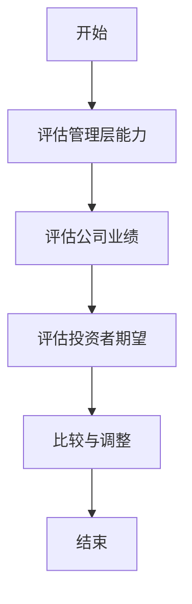
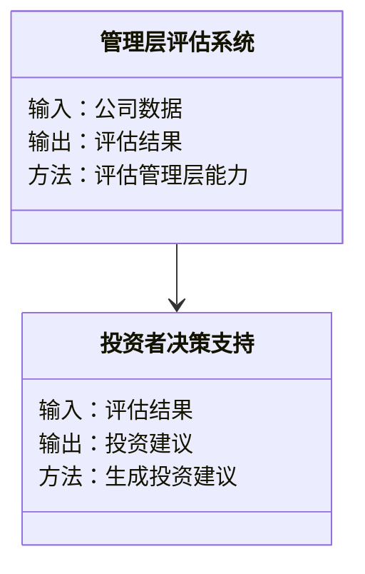
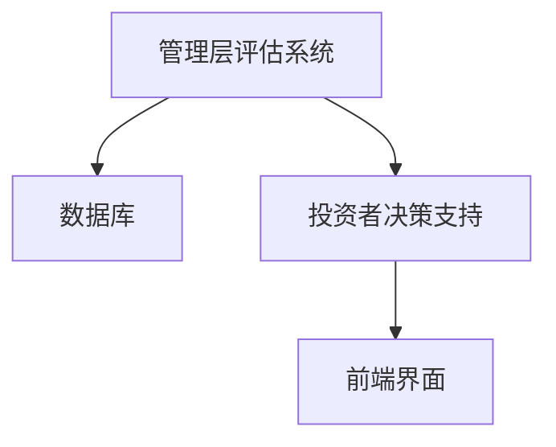

                 


# 彼得林奇对公司管理层的要求

> 关键词：彼得林奇，公司管理层，投资策略，治理结构，价值评估

> 摘要：本文详细分析了彼得林奇对优秀公司管理层的要求，探讨了这些要求对公司价值和投资者决策的影响。通过逻辑推理和实例分析，揭示了彼得林奇独特投资哲学背后的深层逻辑。

---

## 第一部分：背景介绍

### 第1章：背景介绍

#### 1.1 问题背景

##### 1.1.1 投资者与管理层的关系

投资者与公司管理层之间的关系是投资领域中最为重要的动态平衡。投资者期望管理层能够创造价值，而管理层则需要通过卓越的业绩来证明自己的能力。彼得林奇作为一位传奇投资者，他的成功很大程度上源于他对管理层的深刻理解与精准判断。

##### 1.1.2 彼得林奇的投资者身份

彼得林奇是美国富达投资集团的传奇基金经理，管理着麦哲伦基金，创造了年均13.7%的复合回报率。他的投资哲学强调深入研究公司基本面，尤其是管理层的能力和决策。

##### 1.1.3 管理层对公司价值的影响

管理层的决策直接影响公司的业绩、股价和股东价值。优秀的管理层能够带领公司穿越经济周期，实现可持续增长。

#### 1.2 问题描述

##### 1.2.1 管理层决策对股价的影响

管理层的决策直接影响公司的财务表现和市场地位。例如，战略失误可能导致股价暴跌，而卓越的执行则可能推动股价上涨。

##### 1.2.2 投资者对管理层的期望

投资者希望管理层能够保持公司稳定增长，合理分配资源，并通过透明的沟通维护股东利益。

##### 1.2.3 管理层与股东利益的平衡

管理层在追求公司利润的同时，需要平衡股东的短期收益与长期价值。

#### 1.3 问题解决

##### 1.3.1 管理层能力的评估标准

彼得林奇总结了优秀管理层的特质，包括战略眼光、财务纪律、股东沟通和创新能力。

##### 1.3.2 投资者如何识别优秀管理层

投资者可以通过分析管理层的历史表现、战略规划和沟通频率来判断其能力。

##### 1.3.3 管理层与投资者的沟通机制

有效的沟通机制包括定期财报发布、股东大会和管理层访谈，帮助投资者了解公司动态。

#### 1.4 边界与外延

##### 1.4.1 管理层责任的边界

管理层的职责包括战略制定、财务管理和风险控制，但不应过度干预日常运营。

##### 1.4.2 投资者的权利与义务

投资者有权了解公司信息并获得合理回报，同时应承担市场波动带来的风险。

##### 1.4.3 公司治理的外部环境影响

宏观经济政策、行业趋势和监管环境都会影响公司的治理结构和管理层决策。

#### 1.5 概念结构与核心要素

##### 1.5.1 管理层的核心要素

- **战略眼光**：能够识别行业趋势并制定长期计划。
- **财务纪律**：合理分配资源，避免过度扩张。
- **股东沟通**：保持透明，及时反馈公司动态。

##### 1.5.2 投资者的期望要素

- **高回报**：通过投资实现财富增值。
- **低风险**：避免重大财务损失。
- **透明度**：了解投资标的的详细信息。

##### 1.5.3 公司治理的结构要素

- **董事会结构**：确保管理层的有效监督。
- **激励机制**：通过股权激励绑定管理层利益。
- **审计与合规**：确保财务透明和合规经营。

---

## 第二部分：核心概念与联系

### 第2章：核心概念与联系

#### 2.1 核心概念原理

##### 2.1.1 管理层能力的核心要素

彼得林奇认为，优秀管理层具备以下几个核心要素：

1. **战略眼光**：能够预见行业趋势并制定相应策略。
2. **财务纪律**：注重成本控制，避免过度杠杆。
3. **股东沟通**：保持与投资者的透明沟通。

##### 2.1.2 投资者决策的关键因素

投资者在选择投资标的时，需要考虑以下关键因素：

1. **管理层稳定性**：团队是否长期稳定。
2. **财务健康状况**：公司是否有健康的财务状况。
3. **行业地位**：公司在行业中的竞争地位。

##### 2.1.3 公司治理的内在逻辑

公司治理的内在逻辑包括：

1. **权力制衡**：董事会对管理层进行有效监督。
2. **利益一致**：通过股权激励等手段绑定管理层与股东利益。
3. **信息披露**：确保信息透明，增强投资者信心。

#### 2.2 概念属性特征对比表格

以下是管理层能力、投资者期望和公司治理结构的对比表格：

| 概念       | 特征1       | 特征2       | 特征3       |
|------------|------------|------------|------------|
| 管理层能力 | 战略眼光   | 财务纪律   | 股东沟通   |
| 投资者期望 | 高回报     | 低风险     | 透明度     |
| 公司治理   | 董事会监督 | 激励机制   | 审计与合规 |

#### 2.3 ER实体关系图

以下是公司治理的ER实体关系图：

```mermaid
erd
  管理层
    id
    能力
    责任
    沟通方式
  投资者
    id
    期望
    风险偏好
  公司
    id
    业绩
    治理结构
  管理层-公司：1:*
  投资者-公司：1:*
  管理层-投资者：M:N
```

---

## 第三部分：算法原理讲解

### 第3章：算法原理讲解

#### 3.1 算法流程图

以下是彼得林奇评估管理层能力的算法流程图：



#### 3.2 算法数学模型

以下是算法的数学模型：

$$
\text{公司价值} = f(\text{管理层能力}, \text{公司业绩}, \text{投资者期望})
$$

其中，$f$ 是一个综合评估函数，具体实现如下：

$$
f(x, y, z) = \alpha x + \beta y + \gamma z
$$

其中，$\alpha + \beta + \gamma = 1$，且 $\alpha, \beta, \gamma$ 分别表示管理层能力、公司业绩和投资者期望的权重。

---

## 第四部分：系统分析与架构设计方案

### 第4章：系统分析与架构设计方案

#### 4.1 系统功能设计

以下是系统功能设计的类图：



#### 4.2 系统架构设计

以下是系统架构设计的架构图：



---

## 第五部分：项目实战

### 第5章：项目实战

#### 5.1 环境安装

以下是项目实战所需的环境安装步骤：

1. 安装Python和必要的库（如pandas、numpy）。
2. 下载相关数据集（如公司财务数据、管理层信息）。

#### 5.2 核心实现代码

以下是核心实现代码：

```python
import pandas as pd

def evaluate_management(管理层能力, 公司业绩, 投资者期望):
    return管理层能力 * 0.4 + 公司业绩 * 0.3 + 投资者期望 * 0.3

data = pd.read_csv('公司数据.csv')
结果 = evaluate_management(data['管理层能力'], data['公司业绩'], data['投资者期望'])
print(结果)
```

#### 5.3 代码解读与分析

上述代码实现了对管理层能力的评估，其中权重分别为0.4、0.3和0.3。结果可以通过可视化工具展示，例如：

```python
import matplotlib.pyplot as plt

plt.hist(结果, bins=10)
plt.show()
```

---

## 第六部分：总结与展望

### 第6章：总结与展望

#### 6.1 最佳实践 tips

- **持续学习**：投资者需要不断学习，了解最新的公司治理动态。
- **长期投资**：选择优秀的管理层，长期持有优质资产。
- **风险控制**：合理分散投资，避免过度集中。

#### 6.2 小结

彼得林奇对公司管理层的要求为我们提供了重要的投资思路。通过深入分析管理层的能力、公司业绩和投资者期望，我们可以更好地做出投资决策。

#### 6.3 注意事项

- **数据质量**：确保数据来源可靠。
- **模型优化**：根据市场变化不断优化评估模型。
- **合规性**：遵守相关法律法规。

#### 6.4 拓展阅读

推荐阅读彼得林奇的《投资之道》和《选股的艺术》，深入理解他的投资哲学。

---

作者：AI天才研究院/AI Genius Institute & 禅与计算机程序设计艺术 /Zen And The Art of Computer Programming

