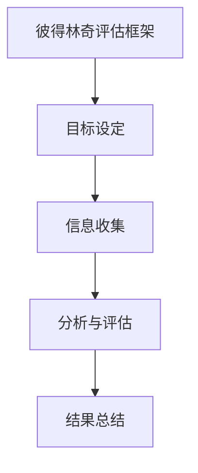

                 

# 彼得林奇对公司管理层继任计划的质量评估

> 关键词：彼得林奇，管理层继任计划，评估框架，领导力评估，战略一致性，团队稳定性，文化匹配度

> 摘要：本文详细探讨了彼得林奇对公司管理层继任计划的质量评估方法，从投资哲学到评估框架，再到实际案例分析，全面解析了管理层继任计划的重要性及其对投资者和企业的影响。

---

## 第1章 彼得林奇投资理念与管理层继任计划的重要性

### 1.1 彼得林奇的投资哲学

彼得·林奇是全球著名的价值投资者，他的投资理念以基本面分析和长期持有为核心。他认为，投资成功的最关键因素是公司管理层的质量和能力。在评估一家公司时，他不仅关注财务数据，更关注管理层的领导力、战略规划和团队稳定性。

#### 1.1.1 价值投资的核心理念

价值投资的核心在于寻找那些被市场低估的优秀企业。彼得林奇认为，这些企业不仅要有良好的财务状况，还必须具备优秀的管理层。他强调，管理层的素质和能力是决定公司长期发展的关键因素。

#### 1.1.2 彼得林奇对管理层继任计划的重视

在彼得林奇看来，管理层继任计划的质量直接关系到公司的未来。一个良好的继任计划能够确保公司在管理层交接时保持稳定，避免因领导层变动而导致业绩下滑。他通常会评估公司是否有明确的继任计划，并关注这些计划的执行情况。

#### 1.1.3 继任计划在投资决策中的地位

彼得林奇认为，继任计划是公司治理的重要组成部分。一个高质量的继任计划能够增强投资者对公司的信心，同时也能反映出公司管理层对未来发展的规划和准备。

---

### 1.2 管理层继任计划的重要性

#### 1.2.1 继任计划对企业发展的影响

管理层的稳定性和交接直接影响公司的运营和战略执行。一个清晰的继任计划能够确保公司在领导层变动时保持战略连续性，减少因领导层变动带来的不确定性。

#### 1.2.2 继任计划对投资者价值的影响

对于投资者来说，一个高质量的继任计划意味着公司有更大的潜力和稳定性，从而提升公司的市场价值和投资者的回报。

#### 1.2.3 彼得林奇对继任计划质量的重视

彼得林奇在评估公司时，会仔细研究管理层的继任计划。他认为，一个高质量的继任计划不仅体现了管理层的专业性和团队合作能力，还能够为公司未来发展提供有力保障。

---

### 1.3 彼得林奇的继任计划评估框架

#### 1.3.1 评估的核心要素

彼得林奇的评估框架主要包括以下要素：
1. **领导力评估**：评估接班人的领导能力和经验。
2. **战略一致性**：评估继任计划是否与公司长期战略一致。
3. **团队稳定性**：评估公司管理团队的稳定性。
4. **文化匹配度**：评估接班人是否符合公司文化。

#### 1.3.2 评估的标准与方法

彼得林奇会通过以下方法进行评估：
- **定性分析**：评估管理层的领导力、经验和声誉。
- **定量分析**：分析公司历史上的管理层交接情况及其对公司业绩的影响。
- **案例分析**：研究行业内类似公司的继任计划及其效果。

#### 1.3.3 评估的边界与外延

彼得林奇认为，继任计划的评估不仅仅局限于接班人的个人能力，还应考虑公司整体的管理结构和文化环境。

---

## 第2章 管理层继任计划的核心要素

### 2.1 领导力评估

#### 2.1.1 领导能力的定义与特征

领导力是管理层继任计划的核心。彼得林奇认为，一个优秀的领导者应具备以下特征：
- **愿景与战略**：能够为公司制定清晰的发展战略。
- **决策能力**：在关键时刻能够做出正确的决策。
- **团队管理**：能够有效管理团队，激发员工潜力。

#### 2.1.2 彼得林奇对领导力的关注

彼得林奇在评估管理层时，会重点关注其过往的领导经历和成就。他认为，过去的表现是未来领导能力的最好证明。

#### 2.1.3 领导力评估的维度

- **经验与成就**：评估候选人的行业经验、过往成就。
- **决策风格**：评估候选人在决策时的风格和能力。
- **团队合作**：评估候选人与现有管理团队的合作能力。

---

### 2.2 战略一致性

#### 2.2.1 公司战略与继任计划的关系

彼得林奇认为，继任计划应与公司战略保持一致。只有这样，才能确保管理层交接后公司战略的连续性。

#### 2.2.2 战略一致性评估的方法

- **战略分析**：评估公司当前战略的清晰度和可行性。
- **继任计划分析**：评估继任计划是否与公司战略一致。
- **匹配度评估**：评估继任计划与公司战略的匹配程度。

---

### 2.3 团队稳定性

#### 2.3.1 团队稳定性对继任计划的影响

团队稳定性是继任计划的重要因素。一个稳定的团队能够更好地支持新任领导，确保公司运营的连续性。

#### 2.3.2 团队稳定性评估的指标

- **团队成员的稳定性**：评估团队成员的离职率和稳定性。
- **团队合作能力**：评估团队成员之间的合作能力和默契程度。
- **团队文化**：评估团队文化是否积极向上。

---

### 2.4 文化匹配度

#### 2.4.1 企业文化与继任计划的关系

企业文化是公司管理团队的土壤。彼得林奇认为，继任计划的成功需要接班人与公司文化高度契合。

#### 2.4.2 文化匹配度评估的方法

- **文化分析**：评估公司文化的特征和价值观。
- **候选人评估**：评估候选人的个人价值观与公司文化的匹配度。
- **文化融入度**：评估候选人是否能够快速融入公司文化。

---

## 第3章 管理层继任计划的评估框架

### 3.1 评估框架的构建

彼得林奇的评估框架包括以下几个步骤：
1. **明确评估目标**：确定评估的目的和范围。
2. **收集相关信息**：收集公司和管理层的相关信息。
3. **评估分析**：对收集的信息进行分析和评估。
4. **得出结论**：根据评估结果得出结论。

#### 3.1.1 框架的核心要素

- **目标设定**：明确评估的目标。
- **信息收集**：收集相关数据和信息。
- **分析与评估**：对信息进行分析和评估。
- **结果总结**：总结评估结果并提出建议。

---

### 3.2 战略契合度评估

#### 3.2.1 战略契合度的定义

战略契合度是指继任计划与公司战略的一致程度。

#### 3.2.2 战略契合度评估的步骤

1. **明确公司战略**：了解公司的长期战略目标。
2. **分析继任计划**：评估继任计划是否与公司战略一致。
3. **评估匹配度**：评估继任计划与公司战略的契合程度。

---

### 3.3 领导力评估

#### 3.3.1 领导力评估的维度

- **经验与成就**：评估候选人的行业经验、过往成就。
- **决策风格**：评估候选人在决策时的风格和能力。
- **团队合作**：评估候选人与现有管理团队的合作能力。

---

## 第4章 彼得林奇继任计划评估框架的系统分析

### 4.1 系统分析与架构设计方案

彼得林奇的评估框架是一个系统性的工程，需要从多个维度进行分析和评估。以下是一个简化的系统架构图：

---

## 第5章 项目实战与案例分析

### 5.1 项目实战

以某科技公司为例，分析其管理层继任计划的质量。

#### 5.1.1 环境安装

- **数据收集**：收集公司管理层的信息和继任计划。
- **工具准备**：准备分析工具和评估框架。

#### 5.1.2 核心实现

- **数据清洗**：对收集的数据进行清洗和整理。
- **数据分析**：使用评估框架对数据进行分析。

---

### 5.2 实际案例分析

以苹果公司为例，分析其管理层继任计划的成功经验。

---

## 第6章 挑战与解决方案

### 6.1 挑战

- **信息不对称**：如何获取准确的管理层信息。
- **文化差异**：如何处理不同文化背景下的继任计划。

---

## 第7章 总结与启示

### 7.1 彼得林奇的总结与启示

彼得林奇通过长期的实践，总结出一套完整的管理层继任计划评估框架。他认为，一个高质量的继任计划能够为公司未来发展提供有力保障，同时也能增强投资者对公司的信心。

### 7.2 对投资者的启示

- **关注管理层素质**：投资者应关注公司管理层的素质和能力。
- **评估继任计划**：投资者应评估公司的继任计划质量。

---

## 第8章 最佳实践、小结与注意事项

### 8.1 最佳实践

- **定期评估**：定期评估管理层继任计划的质量。
- **关注文化匹配度**：关注接班人与公司文化的匹配度。

### 8.2 小结

本文详细探讨了彼得林奇对公司管理层继任计划的质量评估方法，从投资哲学到评估框架，再到实际案例分析，全面解析了管理层继任计划的重要性及其对投资者和企业的影响。

### 8.3 注意事项

- **信息的准确性**：评估时需确保信息的准确性。
- **综合分析**：评估时需综合考虑多个因素。

---

## 作者

作者：AI天才研究院/AI Genius Institute & 禅与计算机程序设计艺术 /Zen And The Art of Computer Programming

---

以上是基于彼得林奇的管理层继任计划评估方法的详细分析和系统阐述，从理论到实践，为投资者和企业管理者提供了有价值的参考和启示。

