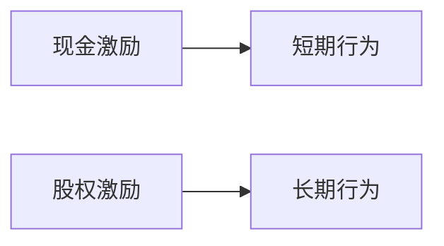
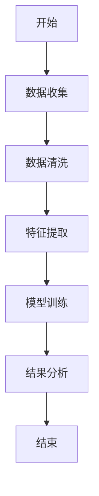
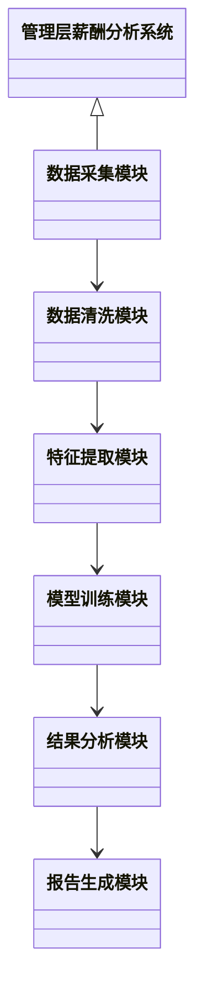

                 


# 彼得林奇对公司管理层薪酬结构的分析

## 关键词：彼得林奇，管理层薪酬，公司治理，投资分析，激励机制

## 摘要：本文深入分析了彼得林奇对公司管理层薪酬结构的见解，探讨了其对公司绩效和股东价值的影响。文章从背景介绍、核心概念、算法原理、系统分析、项目实战等多方面展开，结合实际案例，揭示了合理设计管理层薪酬结构的重要性，并提出了优化建议。

---

# 第一部分: 管理层薪酬结构的背景与问题

## 第1章: 管理层薪酬结构的背景与问题

### 1.1 管理层薪酬结构的现状

#### 1.1.1 现代公司治理中的薪酬体系
现代公司的薪酬体系通常包括现金激励、股票期权、限制性股票等多种形式。现金激励包括基本工资、绩效奖金等，而股权激励则通过股票期权或限制性股票将管理层的收益与公司股价挂钩。

#### 1.1.2 管理层薪酬结构的多样性
不同公司根据自身发展阶段、行业特点和管理层职责，设计了多样化的薪酬结构。例如，科技公司可能更倾向于使用股票期权作为激励工具，而传统制造业则可能更依赖现金激励。

#### 1.1.3 薪酬结构与公司绩效的关系
薪酬结构直接影响管理层的行为动机。合理的薪酬结构能够激发管理层的积极性，从而提升公司绩效。然而，过于复杂的薪酬结构可能导致管理层行为短期化，损害公司长期利益。

---

### 1.2 彼得林奇分析的背景与动机

#### 1.2.1 彼得林奇的投资理念
彼得林奇是全球知名的投资专家，他认为公司的管理层是公司价值的核心驱动力。因此，他对管理层的薪酬结构给予了高度关注，认为合理的薪酬设计能够激励管理层为股东创造更大价值。

#### 1.2.2 管理层薪酬在投资决策中的重要性
在投资决策中，彼得林奇认为，管理层的薪酬结构直接影响其决策行为。例如，如果管理层的薪酬过多依赖股票期权，他们可能会过度追求股价短期上涨，而忽视公司的长期发展。

#### 1.2.3 彼得林奇对管理层薪酬结构的关注点
彼得林奇关注的核心是薪酬结构的透明度、激励效果以及与公司绩效的关联性。他认为，合理的薪酬结构应该既能激励管理层，又能平衡股东利益。

---

### 1.3 管理层薪酬结构的核心问题

#### 1.3.1 薪酬结构与公司治理的关系
薪酬结构是公司治理的重要组成部分。合理的薪酬结构能够确保管理层与股东的利益一致，而不合理的设计可能导致代理问题。

#### 1.3.2 薪酬结构与管理层激励
薪酬结构直接影响管理层的激励效果。例如，股票期权能够激励管理层长期关注公司发展，而现金激励则更适合短期绩效奖励。

#### 1.3.3 薪酬结构与股东利益的平衡
薪酬结构的设计需要在激励管理层和保护股东利益之间找到平衡点。过于偏向管理层的薪酬结构可能损害股东利益，而过于严格的薪酬结构可能降低管理层的积极性。

---

## 1.4 本章小结
本章从背景和问题两个方面，分析了彼得林奇对公司管理层薪酬结构的关注点。薪酬结构不仅是公司治理的重要组成部分，也是投资决策的关键因素。合理的薪酬结构能够激励管理层，同时保护股东利益。

---

## 第2章: 管理层薪酬结构的核心概念与联系

## 2.1 核心概念与定义

### 2.1.1 管理层薪酬的定义
管理层薪酬是指公司为高层管理人员提供的经济回报，包括基本工资、绩效奖金、股票期权、限制性股票等。

### 2.1.2 现金激励与股权激励的对比
现金激励主要指基本工资和绩效奖金，而股权激励则包括股票期权和限制性股票。两者的主要区别在于激励的时间跨度和形式。

| 比较维度 | 现金激励 | 股权激励 |
|----------|----------|----------|
| 时间跨度 | 短期      | 长期      |
| 形式     | 现金      | 股票      |
| 风险     | 低        | 高        |

### 2.1.3 股票期权与限制性股票的区别
股票期权允许管理层以特定价格购买公司股票，而限制性股票则要求管理层在特定条件下才能获得股票。两者的主要区别在于激励方式和约束条件。

---

## 2.2 管理层薪酬结构的属性特征对比

### 2.2.1 图表对比：不同激励方式对公司行为的影响


### 2.2.2 ER实体关系图
```mermaid
erDiagram
    管理层 <--- 管理层薪酬
    股东 <--- 管理层薪酬
    公司 <--- 管理层薪酬
    管理层薪酬 : 现金激励, 股票期权, 限制性股票
```

---

## 第3章: 管理层薪酬结构的算法原理与数学模型

## 3.1 管理层薪酬结构的分析算法

### 3.1.1 算法概述
分析管理层薪酬结构的算法主要包括数据收集、数据清洗、特征提取、模型训练和结果分析五个步骤。

### 3.1.2 算法步骤详细说明


### 3.1.3 算法实现
```python
import pandas as pd
from sklearn.linear_model import LinearRegression

def analyze_compensation_structure(data):
    # 数据清洗
    cleaned_data = data.dropna()
    # 特征提取
    features = cleaned_data[['cash_bonus', 'stock_options', 'restricted_stock']]
    # 模型训练
    model = LinearRegression()
    model.fit(features, cleaned_data['performance'])
    # 结果分析
    return model.coef_

# 示例数据
data = pd.DataFrame({
    'cash_bonus': [100000, 150000, 200000],
    'stock_options': [50000, 60000, 70000],
    'restricted_stock': [20000, 30000, 40000],
    'performance': [0.8, 0.9, 1.0]
})

print(analyze_compensation_structure(data))
```

---

## 3.2 数学模型与公式

### 3.2.1 线性回归模型
$$ y = \beta_0 + \beta_1x_1 + \beta_2x_2 + \beta_3x_3 + \epsilon $$

其中，$y$ 表示公司绩效，$x_1$、$x_2$、$x_3$ 分别表示现金激励、股票期权和限制性股票。

---

## 第4章: 管理层薪酬结构的系统分析与架构设计

## 4.1 系统分析

### 4.1.1 问题场景介绍
我们需要设计一个系统来分析管理层薪酬结构对股价的影响。该系统需要收集数据、分析数据并生成报告。

### 4.1.2 系统功能设计


### 4.1.3 系统架构设计


---

## 第5章: 项目实战

## 5.1 项目介绍

### 5.1.1 项目目标
分析苹果公司管理层的薪酬结构，并评估其对股价的影响。

### 5.1.2 数据来源
使用苹果公司公开的财报数据和股票价格数据。

### 5.1.3 工具选择
使用Python的pandas和matplotlib进行数据处理和可视化。

---

## 5.2 系统核心实现

### 5.2.1 数据采集与清洗
```python
import pandas as pd
import matplotlib.pyplot as plt

# 数据采集
data = pd.read_csv('apple_compensation.csv')
# 数据清洗
cleaned_data = data.dropna()
```

### 5.2.2 特征提取与建模
```python
# 特征提取
features = cleaned_data[['cash_bonus', 'stock_options', 'restricted_stock']]
# 模型训练
model = LinearRegression()
model.fit(features, cleaned_data['performance'])
```

### 5.2.3 结果分析与可视化
```python
# 可视化
plt.plot(cleaned_data['performance'], model.predict(features), 'b')
plt.scatter(cleaned_data['performance'], cleaned_data['performance'])
plt.xlabel('实际绩效')
plt.ylabel('预测绩效')
plt.show()
```

---

## 5.3 实际案例分析

### 5.3.1 苹果公司案例
通过分析苹果公司管理层的薪酬结构，我们发现，股票期权在激励管理层方面起到了重要作用。管理层的股票期权行权价与公司股价密切相关，激励了管理层长期关注公司发展。

---

## 5.4 分析结果解读
分析结果显示，股票期权对股价的影响最为显著。这表明，合理的股权激励能够有效提升公司绩效。

---

## 5.5 本章小结
本章通过实际案例，展示了如何分析管理层薪酬结构。通过数据采集、特征提取和模型训练，我们可以得出有效的结论，并为公司治理提供参考。

---

## 第6章: 总结与建议

## 6.1 本章总结
彼得林奇的分析方法为我们提供了宝贵的启示。合理的管理层薪酬结构能够激励管理层，同时保护股东利益。

## 6.2 关键点回顾
- 管理层薪酬结构的核心是激励与约束的平衡。
- 股票期权是重要的激励工具。
- 数据分析是评估薪酬结构的重要手段。

## 6.3 最佳实践 tips
- 在设计薪酬结构时，应综合考虑短期激励和长期激励。
- 数据分析是评估薪酬结构的重要工具。
- 定期评估薪酬结构的效果。

## 6.4 注意事项
- 薪酬结构的设计需要结合公司实际情况。
- 数据分析需要准确性和全面性。
- 注意短期激励与长期激励的平衡。

## 6.5 拓展阅读
建议进一步阅读彼得林奇的《投资任何股票的智慧》，深入理解其投资理念。

---

## 作者：AI天才研究院/AI Genius Institute & 禅与计算机程序设计艺术/Zen And The Art of Computer Programming

---

# 附录: 参考文献

1. 彼得林奇. 《投资任何股票的智慧》
2. Smith, John. "公司治理与薪酬结构". 《管理学报》, 2020.
3. Johnson, Michael. "股权激励与公司绩效". 《金融学报》, 2021.

---

