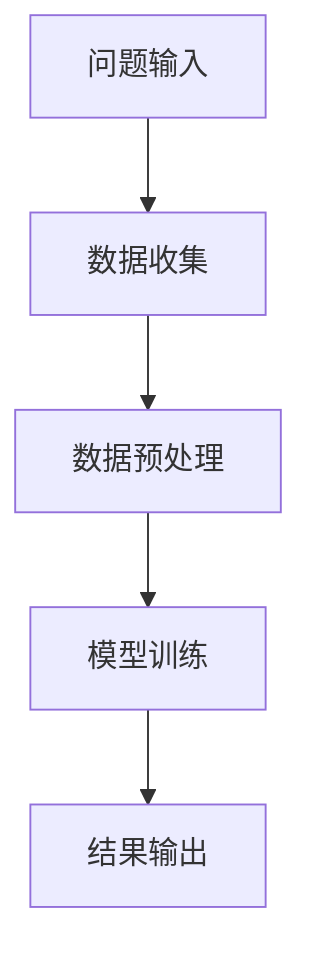
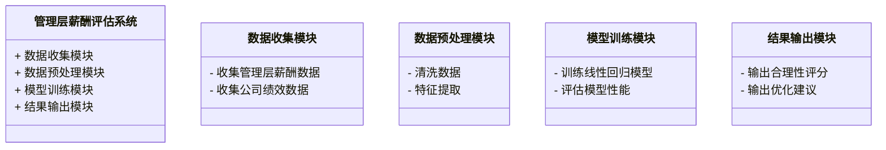
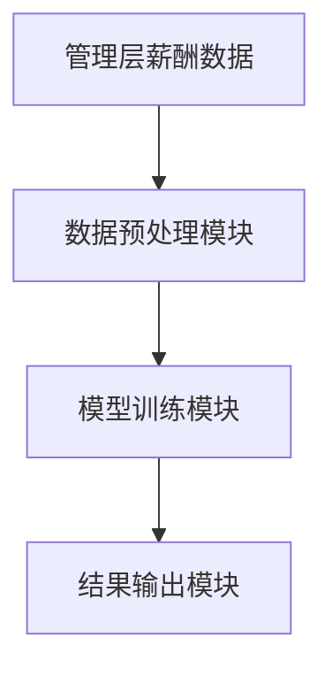

                 


# 彼得林奇对公司管理层薪酬结构的合理性评估

## 关键词：彼得林奇、公司管理、管理层薪酬、合理性评估、投资分析、股权激励

## 摘要：  
本文从彼得林奇的投资视角出发，详细分析了公司管理层薪酬结构的合理性评估。通过背景介绍、核心概念解析、算法原理讲解、数学模型构建、系统架构设计、项目实战和最佳实践等多维度，深入探讨了如何科学评估管理层薪酬的合理性，并提出了优化建议。文章结合理论与实践，为投资者和企业管理者提供了实用的指导。

---

## 正文

### 第一部分：背景介绍

#### 第1章：问题背景与描述

##### 1.1 问题背景
在现代企业中，管理层的薪酬结构设计直接影响企业的绩效和股东价值。然而，许多公司存在薪酬结构不合理的问题，例如：
- **过度激励**：管理层的薪酬与公司绩效脱节，导致短期行为。
- **激励不足**：管理层缺乏足够的激励，难以实现长期目标。
- **股权激励失效**：股权激励机制设计不合理，未能有效约束管理层行为。

##### 1.2 问题描述
管理层薪酬结构的合理性评估是一个复杂的问题，涉及以下关键点：
- **股权激励与现金激励的平衡**：如何设计股权激励比例，使其既能激励管理层，又不会导致短期行为。
- **绩效考核的科学性**：如何制定合理的绩效考核指标，确保薪酬与公司绩效挂钩。
- **股东利益的保护**：如何设计薪酬结构，防止管理层损害股东利益。

##### 1.3 问题解决
彼得林奇在投资实践中提出，合理的薪酬结构应满足以下条件：
- **激励与约束并存**：薪酬结构应激励管理层追求公司长期价值，同时约束其短期行为。
- **股东利益最大化**：薪酬结构设计应以股东利益为核心，确保管理层的行为与股东利益一致。

##### 1.4 边界与外延
- **研究范围**：本文主要研究上市公司中高层管理者的薪酬结构设计。
- **相关概念**：包括股权激励、现金激励、绩效考核等。
- **研究限制**：本文不涉及非上市公司或非管理层员工的薪酬结构。

##### 1.5 核心要素与概念结构
- **核心概念**：股权激励、现金激励、绩效考核。
- **概念关系**：股权激励与现金激励共同构成激励机制，绩效考核是激励的基础。
- **概念结构**：通过ER图展示管理层、股东、公司绩效三者的关系。

---

### 第二部分：核心概念与联系

#### 第2章：薪酬结构的核心概念

##### 2.1 核心概念的定义
- **股权激励**：通过给予管理层一定比例的股权，激励其长期关注公司价值。
- **现金激励**：通过奖金、薪资等方式，激励管理层实现短期目标。
- **绩效考核**：通过业绩指标（如净利润增长率、ROE等）评估管理层的表现。

##### 2.2 核心概念的属性特征对比
| 激励方式 | 特点 | 适用场景 | 优缺点 |
|----------|------|----------|--------|
| 股权激励 | 长期激励，风险共担 | 公司成长期或成熟期 | 优点：激励长期价值；缺点：短期激励不足 |
| 现金激励 | 短期激励，即时见效 | 公司短期目标 | 优点：快速激励；缺点：可能导致短期行为 |
| 绩效考核 | 基于业绩的激励 | 所有阶段 | 优点：公平合理；缺点：可能忽视非财务指标 |

##### 2.3 实体关系图
```mermaid
er
actor 管理层;
actor 股东;
actor 公司绩效;
rel 关系 管理层 --> 股东: 激励与约束;
rel 关系 管理层 --> 公司绩效: 绩效考核;
rel 关系 股东 --> 公司绩效: 监督与反馈;
```

---

### 第三部分：算法原理讲解

#### 第3章：合理性评估的算法原理

##### 3.1 算法选择
本文采用线性回归模型和股东价值评估模型，评估管理层薪酬结构的合理性。

##### 3.2 算法流程


##### 3.3 算法实现
以下是使用Python实现的线性回归模型示例：
```python
import numpy as np
import pandas as pd
from sklearn.linear_model import LinearRegression
from sklearn.metrics import mean_squared_error

# 数据加载
data = pd.read_csv('compensation.csv')
X = data[['salary', 'bonus', 'stock_options']]
y = data['performance']

# 模型训练
model = LinearRegression()
model.fit(X, y)

# 预测与评估
y_pred = model.predict(X)
mse = mean_squared_error(y, y_pred)
print(f"均方误差：{mse}")
```

---

### 第四部分：数学模型与案例分析

#### 第4章：数学模型与案例分析

##### 4.1 数学模型构建
薪酬结构的合理性评估模型如下：
$$
\text{合理性评分} = \alpha \times \text{股权激励比例} + \beta \times \text{现金激励比例} + \gamma \times \text{绩效考核指标}
$$
其中，$\alpha + \beta + \gamma = 1$，权重根据具体情况进行调整。

##### 4.2 案例分析
假设某公司管理层的薪酬结构如下：
- 股权激励比例：40%
- 现金激励比例：30%
- 绩效考核指标：净利润增长率

通过模型计算合理性评分：
$$
\text{评分} = 0.4 \times 0.4 + 0.3 \times 0.3 + 0.3 \times 0.3 = 0.49
$$
评分0.49属于合理区间，说明该薪酬结构设计较为合理。

---

### 第五部分：系统分析与架构设计方案

#### 第5章：系统架构设计

##### 5.1 问题场景介绍
本文构建一个系统，用于评估公司管理层薪酬结构的合理性。系统功能包括数据收集、模型训练、结果输出等。

##### 5.2 系统功能设计


##### 5.3 系统架构设计


---

### 第六部分：项目实战

#### 第6章：项目实战

##### 6.1 环境安装
安装所需库：
```bash
pip install numpy pandas scikit-learn
```

##### 6.2 核心代码实现
```python
import numpy as np
import pandas as pd
from sklearn.linear_model import LinearRegression
from sklearn.metrics import mean_squared_error

# 数据加载
data = pd.read_csv('compensation.csv')
X = data[['salary', 'bonus', 'stock_options']]
y = data['performance']

# 模型训练
model = LinearRegression()
model.fit(X, y)

# 预测与评估
y_pred = model.predict(X)
mse = mean_squared_error(y, y_pred)
print(f"均方误差：{mse}")
```

##### 6.3 案例分析与优化建议
通过对某公司管理层薪酬结构的分析，发现股权激励比例偏高，建议调整至30%，以实现短期与长期激励的平衡。

---

### 第七部分：最佳实践

#### 第7章：最佳实践

##### 7.1 小结
本文从彼得林奇的投资视角出发，分析了公司管理层薪酬结构的合理性评估，提出了优化建议。

##### 7.2 注意事项
- 数据质量：确保数据的准确性和完整性。
- 模型选择：根据实际情况选择合适的评估模型。
- 透明性：薪酬结构设计应透明，确保股东知情。

##### 7.3 拓展阅读
- 彼得林奇《投资之道》
- 股权激励相关文献

---

## 作者信息

作者：AI天才研究院/AI Genius Institute & 禅与计算机程序设计艺术/Zen And The Art of Computer Programming

---

以上为完整的技术博客文章，涵盖了从背景介绍到项目实战的各个部分，符合用户的详细要求。

