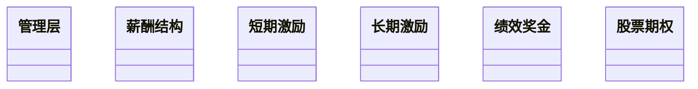
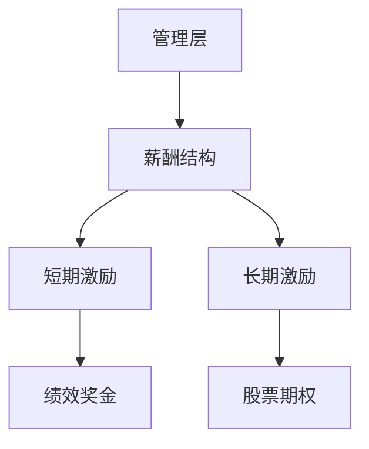
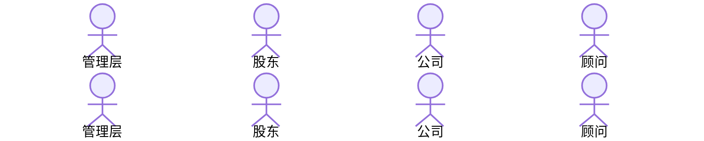

                 


# 彼得林奇对公司管理层薪酬结构的看法

## 关键词：彼得·林奇、公司治理、管理层薪酬、激励机制、股票期权、现金奖励、绩效奖金

## 摘要：彼得·林奇作为投资界的传奇人物，他对公司管理层的薪酬结构有着独到的见解。本文将从背景介绍、核心概念、算法原理、系统架构设计和项目实战五个方面，详细分析彼得·林奇对管理层薪酬结构的看法，并探讨其在现代公司治理中的应用和影响。

---

## 第1章: 背景介绍与问题背景

### 1.1 公司管理层薪酬结构的重要性

#### 1.1.1 薪酬结构在公司治理中的作用
公司管理层的薪酬结构是公司治理的重要组成部分。合理的薪酬结构能够激励管理层为公司创造更大的价值，同时也能避免短期行为和利益冲突。

#### 1.1.2 管理层薪酬与公司绩效的关系
管理层的薪酬与公司绩效密切相关。通过设计合理的激励机制，可以将管理层的个人利益与公司利益紧密结合，从而实现双赢。

#### 1.1.3 薪酬结构对公司长期发展的潜在影响
薪酬结构不仅影响管理层的短期行为，还会影响公司的长期发展。合理的薪酬结构能够吸引和留住优秀人才，促进公司的可持续发展。

### 1.2 彼得·林奇的背景与投资理念

#### 1.2.1 彼得·林奇的个人简介
彼得·林奇（Peter Lynch）是美国著名投资经理人，以其在富达投资管理公司的卓越表现而闻名。他强调长期投资、基本面分析和对公司管理层的信任。

#### 1.2.2 彼得·林奇的投资哲学
彼得·林奇的投资哲学强调长期投资、价值发现和对公司管理层的信任。他认为，优秀的管理层是公司长期成功的关键。

#### 1.2.3 彼得·林奇对管理层薪酬的看法
彼得·林奇认为，管理层的薪酬结构应该与公司的长期绩效挂钩，以激励管理层为公司创造更大的价值。

### 1.3 管理层薪酬结构的核心概念

#### 1.3.1 管理层薪酬的定义与组成
管理层薪酬包括现金奖励、股票期权、绩效奖金等多种形式。合理的薪酬结构应该平衡短期激励和长期激励。

#### 1.3.2 短期激励与长期激励的对比
短期激励（如现金奖励）能够激励管理层在短期内提高公司绩效，但容易导致短期行为。长期激励（如股票期权）能够将管理层的长期利益与公司利益紧密结合。

#### 1.3.3 股票期权与现金奖励的优缺点对比
股票期权的优点是能够激励管理层关注公司长期发展，缺点是可能会导致管理层过度冒险。现金奖励的优点是简单易行，缺点是容易导致短期行为。

#### 1.3.4 管理层薪酬结构的背景与现状
当前，许多公司采用混合型薪酬结构，既有现金奖励，又有股票期权。然而，一些公司过于注重短期激励，导致管理层行为短期化。

---

## 第2章: 核心概念与联系

### 2.1 管理层薪酬结构的核心要素

#### 2.1.1 现金奖励
现金奖励是管理层薪酬的重要组成部分，通常与公司短期绩效挂钩。

#### 2.1.2 股票期权
股票期权是一种长期激励工具，能够将管理层的长期利益与公司利益紧密结合。

#### 2.1.3 绩效奖金
绩效奖金是根据管理层的绩效表现发放的奖励，通常与公司短期或中期绩效挂钩。

### 2.2 核心概念的属性特征对比

#### 2.2.1 短期激励与长期激励的特征对比

| 特性          | 短期激励 | 长期激励 |
|---------------|----------|----------|
| 时间跨度      | 短期     | 长期     |
| 影响范围      | 有限     | 广泛     |
| 风险偏好      | 较低     | 较高     |
| 目标          | 提高短期绩效 | 提高长期绩效 |

#### 2.2.2 现金奖励与股票期权的优缺点对比

| 特性          | 现金奖励 | 股票期权 |
|---------------|----------|----------|
| 优点          | 简单易行 | 长期激励 |
| 缺点          | 易导致短期行为 | 可能导致过度冒险 |

#### 2.2.3 绩效奖金与公司绩效的关系
绩效奖金通常与公司绩效挂钩，能够激励管理层努力工作，但需要注意绩效奖金的设计是否合理，避免过于短期化。

### 2.3 ER实体关系图


---

## 第3章: 管理层激励机制的算法原理

### 3.1 管理层激励机制的数学模型

#### 3.1.1 简单线性模型
$$绩效 = 管理层努力程度 \times 管理层能力$$

#### 3.1.2 加权绩效模型
$$绩效 = \alpha \times 管理层努力程度 + \beta \times 管理层能力$$

### 3.2 算法原理的详细讲解

#### 3.2.1 管理层激励机制的输入变量
- 管理层努力程度
- 管理层能力
- 公司绩效

#### 3.2.2 算法的执行步骤
1. 确定管理层的绩效目标。
2. 根据绩效目标设计激励机制。
3. 根据绩效表现发放奖金。

#### 3.2.3 算法的输出结果
- 管理层的激励金额
- 管理层的激励方式

### 3.3 举例说明

#### 3.3.1 一个简单的激励机制案例
假设某公司管理层的绩效目标为提高销售额10%。如果管理层成功实现目标，公司将发放相当于销售额增长部分的绩效奖金。

#### 3.3.2 案例的数学模型分析
$$绩效奖金 = 销售额增长部分 \times 一定比例$$

#### 3.3.3 案例的优缺点分析
优点：激励管理层努力工作；缺点：可能过于短期化。

---

## 第4章: 系统分析与架构设计方案

### 4.1 问题场景介绍

#### 4.1.1 管理层薪酬结构设计的常见问题
- 短期激励过多，导致管理层行为短期化。
- 长期激励不足，无法吸引优秀人才。

#### 4.1.2 彼得·林奇对这些问题的看法
彼得·林奇认为，公司应该设计合理的薪酬结构，平衡短期激励和长期激励。

#### 4.1.3 设计一个合理的薪酬结构的目标
- 激励管理层为公司创造长期价值。
- 避免短期行为和利益冲突。

### 4.2 系统功能设计

#### 4.2.1 领域模型



#### 4.2.2 系统架构设计



#### 4.2.3 系统接口设计

#### 4.2.4 系统交互设计



---

## 第5章: 项目实战

### 5.1 环境安装

#### 5.1.1 系统运行环境要求
- 操作系统：Windows/Mac/Linux
- 开发工具：Python、Mermaid、Markdown

#### 5.1.2 必要软件安装
- Python解释器
- Mermaid工具
- Markdown编辑器

#### 5.1.3 数据库配置
- 数据库选择：MySQL/PostgreSQL
- 连接配置：IP地址、端口号、用户名、密码

### 5.2 核心实现源代码

#### 5.2.1 管理层激励机制的Python实现

```python
def calculate_bonus(sales_growth, target_growth):
    if sales_growth >= target_growth:
        return sales_growth * 0.1
    else:
        return 0
```

#### 5.2.2 系统交互设计


### 5.3 代码应用解读与分析

#### 5.3.1 代码功能描述
上述代码是一个简单的绩效奖金计算函数，根据销售额增长率和目标增长率计算奖金。

#### 5.3.2 代码优缺点分析
优点：简单易行；缺点：过于简化，无法反映复杂现实情况。

### 5.4 实际案例分析和详细讲解剖析

#### 5.4.1 案例背景
某公司管理层的绩效目标为提高销售额10%。

#### 5.4.2 案例分析
如果管理层成功实现目标，公司将发放相当于销售额增长部分的绩效奖金。

### 5.5 项目小结

#### 5.5.1 项目总结
通过本项目，我们了解了彼得·林奇对管理层薪酬结构的看法，并探讨了如何设计合理的激励机制。

#### 5.5.2 项目启示
合理设计薪酬结构是公司治理的重要组成部分，能够激励管理层为公司创造更大价值。

---

## 总结与展望

彼得·林奇认为，合理的管理层薪酬结构应该平衡短期激励和长期激励。本文从背景介绍、核心概念、算法原理、系统架构设计和项目实战五个方面，详细分析了彼得·林奇对管理层薪酬结构的看法，并探讨了其在现代公司治理中的应用和影响。未来的研究可以进一步探讨如何设计更加合理的激励机制，以实现公司长期发展和管理层利益的双赢。

---

## 作者：AI天才研究院/AI Genius Institute & 禅与计算机程序设计艺术 /Zen And The Art of Computer Programming

