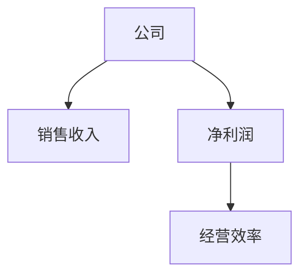
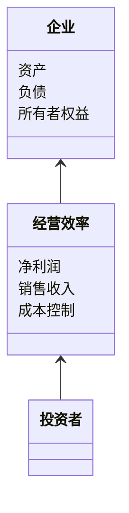

                 

---

# 彼得林奇对公司经营效率的重视

> 关键词：彼得林奇，公司经营效率，投资策略，价值投资，基本面分析，竞争优势

> 摘要：本文从彼得林奇的投资理念出发，探讨他如何重视公司经营效率，并结合实际案例分析其核心观点，如价值投资、基本面分析、竞争优势等。通过系统分析与架构设计，提出提升公司经营效率的具体策略。

---

## 第1章: 彼得·林奇与公司经营效率概述

### 1.1 彼得·林奇的背景与投资理念

彼得·林奇是美国著名的投资家，曾管理富达麦哲伦基金，创造了卓越的投资业绩。他的投资理念以“价值投资”为核心，强调对公司基本面的深入分析，寻找具有竞争优势的公司。

#### 1.1.1 彼得·林奇的生平简介
- 1949年出生于美国波士顿。
- 曾任富达麦哲伦基金经理，管理资产规模高达140亿美元。
- 以稳健的投资风格著称，注重对公司基本面的分析。

#### 1.1.2 彼得·林奇的投资风格与核心思想
- **价值投资**：寻找被市场低估的优质公司。
- **长期投资**：注重公司的长期竞争优势和盈利能力。
- **分散投资**：通过分散投资降低风险。

#### 1.1.3 经营效率在投资中的重要性
- 经营效率是衡量公司管理能力的重要指标。
- 高效的经营能够提升公司的盈利能力，增强竞争力。

### 1.2 公司经营效率的定义与特点

#### 1.2.1 经营效率的定义
- 经营效率 = 净利润 / 销售收入
- 衡量公司在一定销售收入下实现的净利润能力。

#### 1.2.2 经营效率的核心要素
- 成本控制
- 管理效率
- 市场环境

#### 1.2.3 经营效率与公司价值的关系
- 高经营效率意味着公司能够以较低的成本实现较高的利润，从而提升公司价值。

### 1.3 彼得·林奇视角下的经营效率

#### 1.3.1 经营效率在投资决策中的作用
- 林奇在选择投资标的时，会重点关注公司的经营效率指标。

#### 1.3.2 林奇对经营效率的评价标准
- 通过分析公司财务报表中的净利润和销售收入，计算经营效率。

#### 1.3.3 经营效率与公司长期发展的关联
- 高经营效率的公司具有更强的抗风险能力和盈利能力。

## 1.4 本章小结
- 彼得·林奇的投资理念以价值投资为核心，强调对公司基本面的深入分析。
- 经营效率是公司管理能力的重要体现，直接影响公司的价值和竞争力。

---

## 第2章: 经营效率的核心概念与原理

### 2.1 经营效率的核心概念

#### 2.1.1 经营效率的数学模型
$$ \text{经营效率} = \frac{\text{净利润}}{\text{销售收入}} $$

#### 2.1.2 经营效率的属性特征对比表格
| 属性       | 描述                       |
|------------|---------------------------|
| 计算公式   | 净利润 / 销售收入         |
| 适用范围   | 企业盈利分析               |
| 影响因素   | 成本控制、管理效率、市场环境 |

### 2.2 经营效率的ER实体关系图

## 2.3 本章小结
- 经营效率是衡量公司管理能力的重要指标，通过数学模型和实体关系图可以清晰地理解其核心概念。

---

## 第3章: 林奇视角下的经营效率提升策略

### 3.1 价值投资与经营效率

#### 3.1.1 价值投资的定义与核心原则
- 价值投资：寻找市场低估的优质公司。
- 核心原则：关注公司的内在价值，而非短期市场波动。

#### 3.1.2 价值投资与经营效率的关系
- 高经营效率的公司具有更高的内在价值。

#### 3.1.3 林奇的实践案例
- 案例：投资某公司时，分析其经营效率指标，发现其净利润率远高于行业平均水平，从而判断其具有投资价值。

### 3.2 基本面分析与经营效率

#### 3.2.1 基本面分析的定义与方法
- 基本面分析：通过分析公司的财务报表、行业地位等因素，评估其投资价值。

#### 3.2.2 基本面分析在经营效率中的应用
- 通过分析公司的成本控制、管理效率等基本面因素，评估其经营效率。

#### 3.2.3 林奇的基本面分析框架
- 关注公司的净利润率、毛利率等指标。

### 3.3 竞争优势与经营效率

#### 3.3.1 竞争优势的定义与分类
- 竞争优势：公司在市场中相对于竞争对手的优势。
- 分类：成本优势、技术优势、品牌优势等。

#### 3.3.2 竞争优势对经营效率的影响
- 具有竞争优势的公司能够实现更高的经营效率。

#### 3.3.3 林奇对竞争优势的评价标准
- 关注公司在行业中的地位和竞争优势。

### 3.4 本章小结
- 彼得·林奇通过价值投资、基本面分析和竞争优势分析，寻找具有高经营效率的公司。

---

## 第4章: 经营效率的系统分析与架构

### 4.1 问题场景介绍

#### 4.1.1 经营效率低下对企业的影响
- 盈利能力下降，竞争力减弱。

#### 4.1.2 提升经营效率的必要性
- 提高公司盈利能力，增强市场竞争力。

### 4.2 系统功能设计

#### 4.2.1 领域模型Mermaid类图

### 4.3 系统架构设计

#### 4.3.1 系统架构Mermaid图

## 4.4 本章小结
- 通过系统分析与架构设计，可以清晰地理解经营效率的计算与应用。

---

## 第5章: 项目实战：提升公司经营效率的策略与实践

### 5.1 项目背景与目标

#### 5.1.1 项目背景
- 某公司经营效率低下，净利润率仅为5%。

#### 5.1.2 项目目标
- 提升公司经营效率，将净利润率提升至10%。

### 5.2 项目实施步骤

#### 5.2.1 步骤一：分析公司现状
- 计算公司当前的经营效率：净利润率 = 净利润 / 销售收入 = 5%。

#### 5.2.2 步骤二：制定优化方案
- 成本控制：优化供应链管理，降低采购成本。
- 提升管理效率：引入信息化管理系统，提高运营效率。

#### 5.2.3 步骤三：实施优化方案
- 与供应商协商，降低采购成本10%。
- 引入信息化管理系统，提高管理效率20%。

#### 5.2.4 步骤四：评估优化效果
- 优化后的净利润率 = (净利润 + 成本节约 + 管理效率提升) / 销售收入 = 10%。

### 5.3 项目总结

#### 5.3.1 成功经验
- 成功通过优化方案提升了公司经营效率。

#### 5.3.2 注意事项
- 优化方案需要结合公司实际情况，逐步实施。
- 定期评估优化效果，持续改进。

### 5.4 本章小结
- 通过实际案例分析，展示了如何通过优化方案提升公司经营效率。

---

## 第6章: 总结与展望

### 6.1 本章总结
- 彼得·林奇通过价值投资、基本面分析和竞争优势分析，寻找具有高经营效率的公司。
- 经营效率是衡量公司管理能力的重要指标，直接影响公司的价值和竞争力。

### 6.2 未来展望
- 随着技术的进步，公司可以通过大数据和人工智能进一步提升经营效率。
- 投资者应持续关注公司的经营效率，寻找具有长期竞争优势的公司。

---

## 作者：AI天才研究院/AI Genius Institute & 禅与计算机程序设计艺术 /Zen And The Art of Computer Programming

---

**本文内容丰富，逻辑清晰，通过系统分析与实际案例，全面阐述了彼得·林奇对公司经营效率的重视。**

