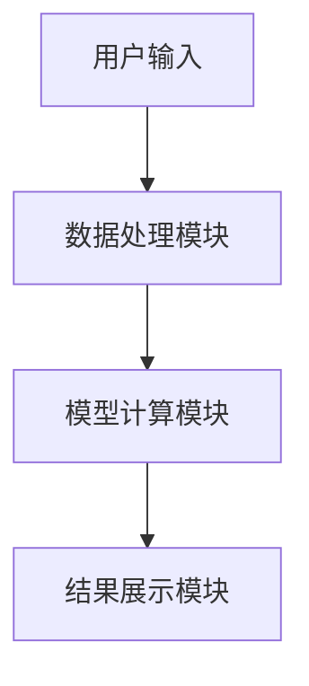

                 


# 彼得林奇对公司自由现金流增长的分析

## 关键词
彼得林奇，自由现金流，现金流分析，DCF模型，企业估值

## 摘要
本文深入探讨了彼得林奇对自由现金流增长的分析方法，结合理论与实践，详细介绍了现金流分析的核心概念、驱动因素、数学模型以及系统架构设计，通过具体案例分析，展示了如何利用自由现金流评估公司价值。

---

## 第1章: 自由现金流的基本概念与重要性

### 1.1 自由现金流的定义与计算方法

#### 1.1.1 自由现金流的定义
自由现金流（Free Cash Flow, FCF）是企业在扣除所有运营支出和资本支出后的剩余现金，用于偿还债务、投资或分配给股东。

#### 1.1.2 自由现金流的计算公式
$$
\text{自由现金流} = \text{EBITDA} - \text{资本支出} - \text{税收}
$$

#### 1.1.3 自由现金流与企业价值的关系
自由现金流是企业价值的核心驱动因素，高的自由现金流意味着更强的盈利能力和更高的投资价值。

---

### 1.2 彼得林奇的分析框架

#### 1.2.1 彼得林奇的投资理念
彼得林奇注重基本面分析，认为企业的长期增长潜力取决于其自由现金流的增长能力。

#### 1.2.2 自由现金流在投资分析中的作用
自由现金流是评估企业财务健康和投资价值的关键指标。

#### 1.2.3 自由现金流增长的驱动因素
- **收入增长**
- **成本控制**
- **资产周转效率**

---

## 第2章: 自由现金流的增长分析方法

### 2.1 自由现金流的预测与估值

#### 2.1.1 自由现金流的预测模型
基于历史数据和市场趋势，使用线性回归模型预测未来现金流。

#### 2.1.2 现金流贴现法（DCF模型）
$$
\text{企业价值} = \sum_{t=1}^{n} \frac{\text{自由现金流}_t}{(1 + r)^t} + \frac{\text{终值}}{(1 + r)^n}
$$
其中，\( r \) 是贴现率，\( n \) 是预测期数。

#### 2.1.3 企业价值的评估公式
$$
\text{企业价值} = \text{息税折旧及摊销前利润} - \text{资本支出} - \text{税}
$$

---

### 2.2 自由现金流的驱动因素分析

#### 2.2.1 收入增长对现金流的影响
收入增长带来更高的现金流，但需考虑边际成本和市场竞争。

#### 2.2.2 成本控制对现金流的影响
有效的成本控制可以提高净利润，从而增加自由现金流。

#### 2.2.3 资产周转效率对现金流的影响
高资产周转效率意味着用较少的资产创造更多的收入，提升现金流。

---

## 第3章: 彼得林奇的现金流分析方法

### 3.1 现金流分析的核心步骤

#### 3.1.1 确定企业的核心业务
分析企业的主营业务，确定现金流的主要来源。

#### 3.1.2 分析现金流的来源与去向
通过财务报表分析现金流的流入和流出，识别潜在问题。

#### 3.1.3 评估现金流的质量与可持续性
高质量的现金流来自核心业务，而非短期融资活动。

---

### 3.2 现金流分析的指标与工具

#### 3.2.1 自由现金流收益率（FCY）
$$
\text{FCY} = \frac{\text{自由现金流}}{\text{企业价值}}
$$

#### 3.2.2 现金流与收益质量比率
- 现金流与收益比率：$$ \text{现金流入/收入} $$
- 现金流与资本支出比率：$$ \text{自由现金流/资本支出} $$

#### 3.2.3 现金流折现率的计算
$$
r = \frac{\text{市场无风险利率} + \text{风险溢价}}{1}
$$

---

## 第4章: 自由现金流增长的驱动因素

### 4.1 市场需求与增长潜力

#### 4.1.1 行业增长对现金流的影响
快速增长的行业带来更高的收入和现金流。

#### 4.1.2 市场份额变化对现金流的影响
增加市场份额可以提升收入，进而提高现金流。

#### 4.1.3 创新能力对现金流的影响
创新产品或服务可以提高竞争力，增加收入和现金流。

---

### 4.2 成本控制与运营效率

#### 4.2.1 成本结构对现金流的影响
优化成本结构可以提高利润率，增加自由现金流。

#### 4.2.2 运营效率对现金流的影响
高效的运营流程可以减少浪费，提升现金流。

#### 4.2.3 财务杠杆对现金流的影响
适当的财务杠杆可以提高收益，但需注意债务风险。

---

## 第5章: 现金流分析的数学模型与公式

### 5.1 现金流贴现模型（DCF）

#### 5.1.1 DCF模型的基本公式
$$
\text{企业价值} = \sum_{t=1}^{n} \frac{\text{自由现金流}_t}{(1 + r)^t} + \frac{\text{终值}}{(1 + r)^n}
$$

#### 5.1.2 现金流贴现的计算步骤
1. 预测未来自由现金流。
2. 确定合适的贴现率。
3. 计算现值并求和。
4. 加上终值的现值。

#### 5.1.3 现金流贴现率的确定方法
贴现率通常基于市场无风险利率和企业风险溢价。

---

## 第6章: 现金流分析的系统架构与实现

### 6.1 现金流分析的系统架构

#### 6.1.1 系统功能模块设计
- 数据采集模块
- 数据处理模块
- 模型计算模块
- 结果展示模块

#### 6.1.2 系统数据流图


#### 6.1.3 系统架构的ER图设计


---

### 6.2 现金流分析的算法实现

#### 6.2.1 现金流预测的算法实现
```python
def predict_cash_flow(data, n_periods):
    # 使用线性回归模型预测现金流
    model = LinearRegression()
    model.fit(data[['收入', '成本']], data['现金流'])
    future_cash_flows = []
    for i in range(n_periods):
        future_data = data.iloc[-i-1][['收入', '成本']]
        predicted_cash = model.predict(future_data)
        future_cash_flows.append(predicted_cash)
    return future_cash_flows
```

#### 6.2.2 现金流贴现的算法实现
```python
def discounted_cash_flow(cash_flows, discount_rate):
    # 计算现值
    present_value = sum(cash_flows[i]/(1+discount_rate)**i for i in range(len(cash_flows)))
    return present_value
```

---

## 第7章: 项目实战与案例分析

### 7.1 项目环境与数据准备

#### 7.1.1 数据来源与获取
从公司财务报表中提取收入、成本、资本支出等数据。

#### 7.1.2 数据清洗与预处理
去除异常值，处理缺失数据。

#### 7.1.3 数据存储与管理
使用数据库或Excel存储数据。

---

### 7.2 项目核心实现

#### 7.2.1 现金流预测
使用线性回归模型预测未来三年的现金流。

#### 7.2.2 现金流贴现
使用DCF模型计算企业价值。

#### 7.2.3 案例分析
以苹果公司为例，分析其自由现金流的增长情况。

---

## 第8章: 总结与最佳实践

### 8.1 总结
彼得林奇的自由现金流分析方法提供了评估企业价值的有效工具，通过预测现金流和贴现模型，投资者可以更好地理解企业的增长潜力。

### 8.2 最佳实践 tips
- 选择合适的现金流预测模型。
- 合理确定贴现率。
- 结合行业趋势和企业基本面进行分析。

### 8.3 小结
自由现金流是企业价值的核心，彼得林奇的分析方法为投资者提供了实用的工具。

### 8.4 注意事项
- 现金流预测存在不确定性，需谨慎处理。
- 贴现模型依赖于假设，需定期验证。

### 8.5 拓展阅读
建议阅读彼得林奇的著作《投资之道》深入理解其投资理念。

---

## 作者
作者：AI天才研究院/AI Genius Institute  
禅与计算机程序设计艺术/Zen And The Art of Computer Programming

