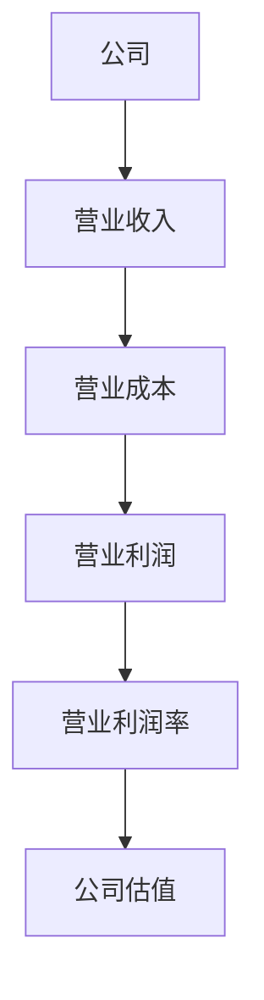
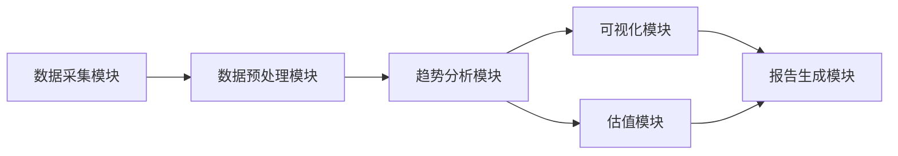

                 


# 彼得林奇对公司营业利润率趋势的分析

> 关键词：彼得林奇，营业利润率，趋势分析，投资分析，财务指标

> 摘要：本文深入分析了彼得林奇对公司营业利润率趋势的分析方法，探讨了其背后的理论基础、算法原理和实际应用。通过系统化的分析框架和具体案例，展示了如何利用营业利润率趋势分析来进行投资决策优化和公司估值。

---

## 第一部分：彼得林奇分析方法的背景与基础

### 第1章：公司营业利润率概述

#### 1.1 营业利润率的定义与计算公式
- **营业利润率的定义**：营业利润率是衡量公司盈利能力的重要指标，反映了公司每单位营业收入的盈利能力。
- **营业利润率的计算公式**：  
  $$ \text{营业利润率} = \frac{\text{营业利润}}{\text{营业收入}} \times 100\% $$
- **营业利润率的重要性**：  
  营业利润率不仅反映了公司的盈利效率，还能揭示公司在成本控制和收入增长方面的表现。

#### 1.2 彼得林奇投资分析方法的背景
- **彼得林奇的投资者身份与风格**：  
  彼得林奇是著名的投资专家，以其价值投资理念闻名，注重对公司基本面的深入分析。
- **彼得林奇分析方法的核心**：  
  彼得林奇注重对公司财务指标的长期趋势分析，尤其是营业利润率的变化趋势，以评估公司的财务健康和投资价值。
- **营业利润率在彼得林奇分析体系中的地位**：  
  营业利润率是彼得林奇分析公司盈利能力的核心指标之一，常用于判断公司的核心竞争力和长期发展潜力。

#### 1.3 营业利润率趋势分析的意义
- **营业利润率趋势分析的定义**：  
  通过分析公司过去一段时间内的营业利润率变化，预测未来趋势并评估公司的财务表现。
- **营业利润率趋势分析的目的**：  
  发现公司的盈利能力变化规律，识别潜在风险和投资机会。
- **营业利润率趋势分析的应用场景**：  
  适用于公司估值、投资决策优化、行业趋势分析等场景。

---

## 第二部分：彼得林奇分析方法的核心概念与联系

### 第2章：营业利润率的核心要素

#### 2.1 营业利润率的核心要素
- **营业收入**：公司主营业务收入的总和，是计算营业利润率的基础。
- **营业成本**：与主营业务相关的直接成本，影响营业利润的大小。
- **营业利润**：营业收入减去营业成本和各项费用后的利润，是营业利润率的关键组成部分。
- **影响营业利润率的关键因素**：  
  包括成本控制能力、收入增长速度、行业竞争格局等。

#### 2.2 营业利润率与其他财务指标的关系
- **净利润率**：净利润率是营业利润率的延伸，考虑了非经营性损益的影响。
- **毛利率**：毛利率衡量的是公司销售产品的直接成本控制能力，与营业利润率密切相关。
- **资产负债率**：资产负债率反映公司的财务杠杆风险，间接影响营业利润率的稳定性。
- **营业利润率与公司估值的关系**：  
  营业利润率的稳定增长通常意味着公司具有较强的盈利能力，能够支撑较高的估值。

#### 2.3 营业利润率趋势分析的ER实体关系图


---

## 第三部分：彼得林奇分析方法的算法原理

### 第3章：营业利润率趋势分析的算法框架

#### 3.1 数据收集与预处理
- **数据来源**：收集公司过去几年的财务报表数据，包括营业收入、营业成本和营业利润。
- **数据清洗**：处理缺失值、异常值和单位不一致的问题。
- **数据转换**：将数据转换为适合趋势分析的格式，如时间序列数据。

#### 3.2 趋势分析方法
- **线性回归模型**：假设营业利润率的变化呈线性趋势，通过回归分析预测未来趋势。
  $$ \text{趋势线方程} = a + bt $$
  其中，$a$ 是截距，$b$ 是斜率，$t$ 是时间变量。
- **指数平滑法**：适用于非线性趋势的预测，通过加权平均的方法平滑数据波动。
- **ARIMA模型**：一种广泛应用于时间序列分析的方法，能够捕捉数据的周期性和趋势性。

#### 3.3 异常值检测
- **基于统计的方法**：利用Z-score或标准差等方法识别异常值。
- **基于时间序列的方法**：通过分析数据的波动性识别异常值。

#### 3.4 营业利润率趋势分析的Python实现
```python
import pandas as pd
import numpy as np
from statsmodels.tsa.arima_model import ARIMA

# 示例数据
data = pd.DataFrame({
    'year': [2018, 2019, 2020, 2021, 2022],
    'profit_margin': [20, 22, 18, 25, 24]
})

# 模型训练
model = ARIMA(data['profit_margin'], order=(1, 1, 0))
model_fit = model.fit()

# 预测未来一年的营业利润率
forecast = model_fit.forecast(steps=1)
print(forecast)
```

---

## 第四部分：系统分析与架构设计方案

### 第4章：系统功能设计与架构

#### 4.1 问题场景介绍
- **投资者如何快速分析公司营业利润率趋势**：  
  通过自动化工具快速获取并分析公司财务数据，生成营业利润率趋势报告。
- **如何利用彼得林奇方法进行公司估值**：  
  结合营业利润率趋势分析，评估公司的盈利能力和发展潜力。
- **系统化分析方法的必要性**：  
  通过系统化的分析工具提高分析效率和准确性，减少人为误差。

#### 4.2 系统功能设计
- **数据采集模块**：从财务报表中提取营业收入、营业成本和营业利润数据。
- **趋势分析模块**：应用时间序列分析模型预测营业利润率趋势。
- **可视化模块**：生成趋势图表，直观展示营业利润率的变化趋势。
- **估值模块**：结合营业利润率趋势分析结果，评估公司估值。

#### 4.3 系统架构设计


---

## 第五部分：项目实战与案例分析

### 第5章：项目实战

#### 5.1 环境安装与配置
- **安装Python和相关库**：包括pandas、numpy、statsmodels等。
- **数据获取**：从公开的财务报表中获取目标公司的营业利润率数据。

#### 5.2 系统核心实现
- **数据预处理**：清洗和转换数据，确保数据格式一致。
- **趋势分析**：应用ARIMA模型或其他时间序列分析方法预测营业利润率趋势。
- **可视化**：使用matplotlib或seaborn库生成趋势图表。

#### 5.3 案例分析
- **案例公司选择**：选择一个具有代表性的公司，如科技公司或制造公司。
- **数据分析与解读**：通过分析公司过去几年的营业利润率趋势，判断其财务健康状况和投资价值。
- **结果展示**：生成趋势图表和分析报告，展示分析结果。

---

## 第六部分：总结与展望

### 第6章：总结与展望

#### 6.1 小结
- 彼得林奇的营业利润率趋势分析方法提供了从财务数据中挖掘投资价值的有力工具。
- 通过系统化的分析框架和算法实现，投资者可以更高效地进行财务分析和投资决策。

#### 6.2 注意事项
- 数据质量对分析结果的影响至关重要，需确保数据的准确性和完整性。
- 趋势分析结果仅供参考，需结合其他财务指标和市场信息进行综合判断。

#### 6.3 拓展阅读
- 推荐阅读彼得林奇的其他著作，深入了解其投资理念和分析方法。
- 学习更多的时间序列分析方法，如LSTM、Prophet等，提升趋势预测的准确性。

---

## 作者：AI天才研究院/AI Genius Institute & 禅与计算机程序设计艺术/Zen And The Art of Computer Programming

---

以上是文章的目录大纲和内容概要，具体内容将根据上述结构展开，确保每个部分都详细、具体且富有深度。

