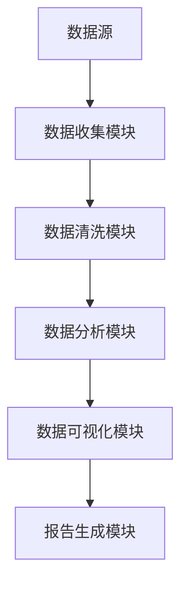

                 


# 彼得·林奇对公司营运效率的跨行业比较

## 关键词：彼得·林奇，公司营运效率，跨行业比较，投资分析，财务指标

## 摘要：彼得·林奇作为著名投资家，其对公司营运效率的分析方法在投资领域备受推崇。本文通过跨行业比较的视角，深入分析林奇的分析框架，探讨其在不同行业中的应用和表现。文章结合理论与实践，详细讲解了营运效率的核心指标、跨行业比较的方法，并通过具体案例分析和系统架构设计，为投资者提供实用的分析工具和方法。

---

## 第一部分：彼得·林奇的背景与投资理念

### 第1章：彼得·林奇的背景介绍

#### 1.1 彼得·林奇的生平简介
彼得·林奇（Peter Lynch）是美国著名的投资家和职业棒球运动员，1942年出生在美国马萨诸塞州。他在1977年加入富达投资（Fidelity Investments），担任麦哲伦基金（Magellan Fund）经理，直至2005年退休。林奇以其卓越的投资业绩和独特的投资理念闻名，他的投资策略注重基本面分析和长期投资，为投资者提供了宝贵的实践经验。

#### 1.2 彼得·林奇的投资哲学
林奇的投资哲学以价值投资为核心，强调深入研究公司的基本面，关注公司的财务状况、管理层能力和市场竞争力。他认为，成功的投资不仅仅依赖于市场走势，而是通过选择那些能够持续增长且管理层有能力推动公司发展的企业。

#### 1.3 彼得·林奇的投资方法论
林奇的投资方法论主要包括以下几点：
1. **基本面分析**：通过研究公司的财务报表、行业地位和竞争优势，评估公司的投资价值。
2. **长期投资**：避免短期市场波动的干扰，长期持有优质股票。
3. **管理层评估**：关注管理层的决策能力和诚信度，认为管理层的能力是公司长期发展的重要因素。

---

### 第2章：公司营运效率的定义与核心指标

#### 2.1 公司营运效率的定义
公司营运效率是指公司在一定时间内将资源转化为产出的能力，反映了公司在管理和运用资产方面的效率。营运效率不仅影响公司的盈利能力，还影响公司的市场竞争力和抗风险能力。

#### 2.2 公司营运效率的核心指标
以下是衡量公司营运效率的核心指标：

1. **营业周期（Operating Cycle）**  
   营业周期是指从收到订单到完成交付的时间，通常包括存货周转期和应收账款周转期。营业周期越短，说明公司在生产和销售环节的效率越高。

2. **资产周转率（Asset Turnover）**  
   资产周转率是衡量公司每单位资产产生的收入能力，公式为：  
   $$ \text{资产周转率} = \frac{\text{营业收入}}{\text{平均总资产}} $$  
   资产周转率越高，说明公司对资产的利用效率越高。

3. **净资产收益率（ROE）**  
   净资产收益率是衡量公司股东权益回报能力的重要指标，公式为：  
   $$ \text{ROE} = \frac{\text{净利润}}{\text{股东权益}} $$  
   ROE越高，说明公司利用股东资金的效率越高。

4. **每股收益（EPS）**  
   每股收益是衡量公司每股普通股的净利润，公式为：  
   $$ \text{EPS} = \frac{\text{净利润}}{\text{普通股股数}} $$  
   EPS越高，说明公司的盈利能力越强。

---

## 第二部分：彼得·林奇分析框架的构建

### 第3章：彼得·林奇的公司分析框架

#### 3.1 林奇分析框架的核心要素
林奇的分析框架以基本面分析为核心，主要包括以下三个要素：

1. **财务指标分析**  
   林奇关注公司的财务指标，如ROE、EPS和资产周转率等，通过这些指标评估公司的盈利能力和发展潜力。

2. **竞争优势分析**  
   林奇注重分析公司的竞争优势，包括市场地位、产品差异化和成本控制能力等。他认为，公司只有具备竞争优势，才能在行业中长期保持增长。

3. **管理层评估**  
   林奇认为，管理层的能力和诚信度是公司长期发展的关键因素。他通过观察管理层的决策历史和战略规划，评估管理层的能力和对公司发展的承诺。

#### 3.2 林奇分析框架的逻辑关系
林奇的分析框架通过将财务指标、竞争优势和管理层评估三者有机结合，形成一个完整的分析体系。财务指标反映了公司的经营成果，竞争优势决定了公司的市场地位，而管理层评估则确保了公司战略的实施和持续发展。

---

### 第4章：跨行业比较的分析方法

#### 4.1 跨行业比较的核心思路
跨行业比较的核心思路是通过对比不同行业内的公司，分析它们在营运效率上的差异和特点。这种比较不仅有助于理解不同行业的经营特点，还能为投资者提供选择优质公司的依据。

#### 4.2 跨行业比较的实施步骤
1. **数据收集与整理**  
   收集不同行业的公司财务数据，包括ROE、资产周转率和EPS等核心指标。

2. **数据分析与对比**  
   使用统计方法分析不同行业在营运效率上的差异，找出行业间的共同点和差异点。

3. **结果解读与应用**  
   根据分析结果，评估不同行业的投资价值，为投资者提供参考。

#### 4.3 跨行业比较的注意事项
- **行业特异性问题**：不同行业的经营模式和盈利模式差异较大，需注意行业特异性。
- **数据可比性问题**：确保数据来源一致，避免因数据质量差异影响分析结果。
- **结果的局限性**：跨行业比较只能提供表面的差异，需结合具体情况进行深入分析。

---

## 第三部分：系统分析与架构设计方案

### 第5章：系统功能设计

#### 5.1 问题场景介绍
为了更好地进行跨行业比较，我们设计了一个基于Python的数据分析系统，用于收集、整理和分析不同行业的公司财务数据，评估公司的营运效率。

#### 5.2 系统功能设计
1. **数据收集模块**  
   从多个数据源收集公司财务数据，包括ROE、资产周转率和EPS等核心指标。

2. **数据分析模块**  
   使用Python的Pandas库对数据进行清洗和整理，计算各行业的营运效率指标。

3. **数据可视化模块**  
   使用Matplotlib库生成图表，直观展示不同行业在营运效率上的差异。

4. **报告生成模块**  
   根据分析结果生成报告，提供投资建议和行业比较的结论。

#### 5.3 系统架构设计
以下是系统的架构图：



---

### 第6章：项目实战

#### 6.1 环境安装
需要安装以下Python库：
- `pandas`：用于数据处理
- `numpy`：用于数据计算
- `matplotlib`：用于数据可视化

安装命令：
```bash
pip install pandas numpy matplotlib
```

#### 6.2 核心实现代码
以下是数据处理和分析的Python代码示例：

```python
import pandas as pd
import numpy as np
import matplotlib.pyplot as plt

# 数据收集
data = pd.read_csv('company_data.csv')

# 数据清洗
data.dropna(inplace=True)
data['ROE'] = data['净利润'] / data['股东权益']
data['资产周转率'] = data['营业收入'] / data['平均总资产']

# 数据分析
industry_groups = data.groupby('行业')
industry_stats = industry_groups.mean()

# 数据可视化
ax = industry_stats[['ROE', '资产周转率']].plot(kind='bar', figsize=(10,6))
ax.set_title('不同行业的营运效率对比')
ax.set_xlabel('行业')
ax.set_ylabel('指标值')
plt.show()
```

---

## 第四部分：总结与展望

### 第7章：总结与展望

#### 7.1 小结
本文通过分析彼得·林奇的公司营运效率分析方法，结合跨行业比较的视角，探讨了不同行业在营运效率上的差异和特点。通过系统架构设计和项目实战，为投资者提供了一个实用的分析工具。

#### 7.2 展望
未来，可以进一步研究更多行业的营运效率，优化分析模型，并结合人工智能技术，提高分析的准确性和效率。

---

## 作者：AI天才研究院 & 禅与计算机程序设计艺术

---

**关键词**：彼得·林奇，公司营运效率，跨行业比较，投资分析，财务指标  
**摘要**：本文通过跨行业比较的视角，深入分析彼得·林奇的公司营运效率分析方法，探讨其在不同行业中的应用和表现，为投资者提供实用的分析工具和方法。

