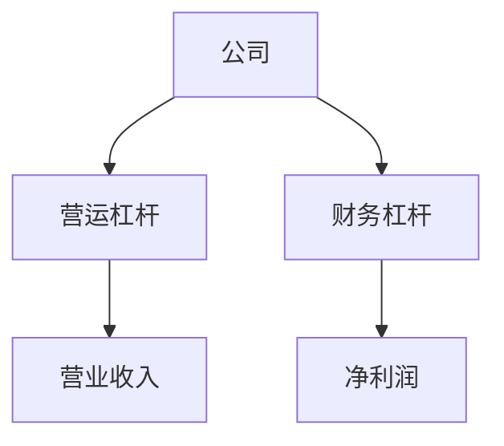
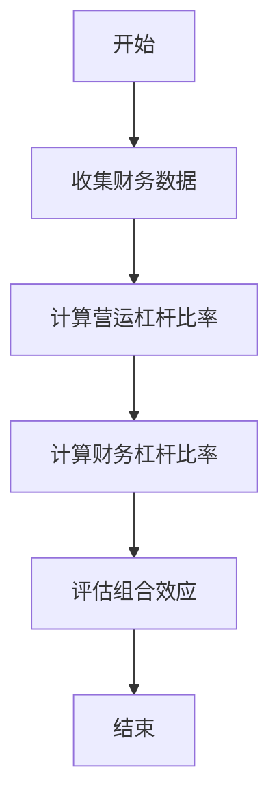
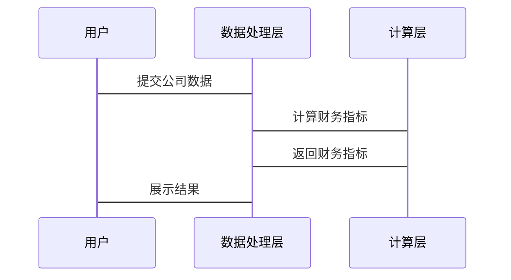

                 


# 彼得·林奇对公司营运杠杆与财务杠杆组合效应的分析

## 关键词：彼得·林奇，营运杠杆，财务杠杆，组合效应，投资分析

## 摘要：本文深入分析了彼得·林奇如何利用营运杠杆和财务杠杆的组合效应来提升公司业绩和投资回报。通过详细阐述这两个杠杆的定义、原理及其相互作用，结合实际案例和数学模型，本文为投资者提供了有效的分析工具和策略。

---

# 第1章: 背景介绍

## 1.1 彼得·林奇的背景与投资理念

### 1.1.1 彼得·林奇的生平简介

彼得·林奇是美国著名的投资专家，曾管理富达麦哲伦基金，创造了辉煌的投资业绩。他的投资理念以基本面分析和选股策略闻名。

### 1.1.2 林奇的投资哲学与方法

林奇强调长期投资、价值发现和深入研究公司基本面。他认为，成功的投资取决于对公司营运和财务状况的深刻理解。

---

## 1.2 营运杠杆与财务杠杆的基本概念

### 1.2.1 营运杠杆的定义与特点

营运杠杆衡量公司通过增加运营效率来放大收益的能力。高营运杠杆意味着公司可以通过提高运营效率显著增加利润。

### 1.2.2 财务杠杆的定义与特点

财务杠杆涉及通过债务融资来放大收益或亏损。高财务杠杆意味着公司可能面临更大的财务风险，但也能在收益增长时显著放大净利润。

### 1.2.3 营运杠杆与财务杠杆的组合效应

营运杠杆和财务杠杆的结合可以显著放大公司的收益，但同时也增加了整体风险。林奇强调在平衡两者之间找到最佳组合。

---

## 1.3 本书的核心问题与研究意义

### 1.3.1 问题背景与问题描述

本文探讨如何通过分析营运和财务杠杆的组合效应，评估公司投资价值。林奇的方法为投资者提供了有效的工具。

### 1.3.2 问题解决的思路与方法

通过深入分析公司财务报表，计算营运和财务杠杆，评估其组合效应，最终判断投资价值。

### 1.3.3 研究的边界与外延

本文仅分析财务杠杆和营运杠杆，其他因素如市场风险、行业趋势需另行考虑。

### 1.3.4 核心概念的结构与组成

本文围绕营运杠杆和财务杠杆的定义、作用和组合效应展开分析。

---

# 第2章: 营运杠杆与财务杠杆的核心概念与联系

## 2.1 核心概念的原理

### 2.1.1 营运杠杆的原理

通过优化运营效率，如降低成本和提高销售额，来放大收益。

### 2.1.2 财务杠杆的原理

通过增加债务融资，利用税盾效应和杠杆效应放大净利润。

---

## 2.2 核心概念的属性特征对比

### 2.2.1 表格对比：营运杠杆与财务杠杆的属性特征

| 特性       | 营运杠杆                     | 财务杠杆                     |
|------------|------------------------------|------------------------------|
| 定义       | 通过增加运营效率来提高收益   | 通过增加债务来提高收益       |
| 影响因素   | 营业收入、成本结构           | 利息支出、债务规模           |
| 风险       | 运营效率下降可能导致收益下降 | 债务违约风险较高             |
| 收益放大性 | 收益增长时放大收益           | 利息支出增长时可能放大亏损   |

---

## 2.3 实体关系图



---

# 第3章: 营运杠杆与财务杠杆的组合效应分析

## 3.1 组合效应的数学模型

### 3.1.1 营运杠杆与财务杠杆的组合公式

$$ \text{净利润} = (\text{营业收入} - \text{运营成本}) \times (1 - \text{税率}) - \text{利息支出} $$

---

## 3.2 组合效应的算法与流程

### 3.2.1 算法原理

通过分析公司财务数据，计算营运杠杆和财务杠杆的比率，评估组合效应。

### 3.2.2 流程图



---

## 3.3 实战案例分析

### 3.3.1 案例背景

分析某制造公司，计算其营运和财务杠杆，评估投资价值。

### 3.3.2 案例分析步骤

1. 收集公司财务数据。
2. 计算营运杠杆比率（如ROA）。
3. 计算财务杠杆比率（如D/E）。
4. 分析组合效应。
5. 评估投资价值。

---

## 3.4 投资建议与注意事项

### 3.4.1 投资建议

合理平衡营运和财务杠杆，选择具有稳定营运杠杆和适度财务杠杆的公司。

### 3.4.2 注意事项

高财务杠杆可能增加财务风险，需谨慎评估公司的偿债能力。

---

# 第4章: 系统分析与架构设计

## 4.1 问题场景介绍

设计一个系统来分析公司营运和财务杠杆的组合效应。

---

## 4.2 系统功能设计

### 4.2.1 领域模型


### 4.2.2 系统架构图


---

## 4.3 系统接口与交互

### 4.3.1 系统接口设计

定义数据接口，获取公司财务数据。

### 4.3.2 交互流程



---

## 4.4 系统实现与代码

### 4.4.1 Python代码

```python
def calculate_roa(net_income, total_assets):
    return net_income / total_assets

def calculate_de(net_income, interest_expense, tax):
    ebit = (net_income + interest_expense) / (1 - tax)
    return ebit / interest_expense
```

---

## 4.5 代码解读与分析

### 4.5.1 代码功能

计算ROA和DE，评估营运和财务杠杆。

### 4.5.2 代码应用场景

用于分析公司财务数据，评估杠杆效应。

---

## 4.6 项目实战与案例分析

### 4.6.1 案例分析

分析某公司，计算其ROA和DE，评估投资价值。

### 4.6.2 代码实现

使用上述函数，输入数据，计算结果。

---

## 4.7 项目小结

通过系统设计和代码实现，投资者可以高效分析公司杠杆效应，做出明智投资决策。

---

# 第5章: 总结与展望

## 5.1 总结

本文深入分析了营运和财务杠杆的组合效应，提供了系统化的分析方法和工具。

## 5.2 投资建议与注意事项

投资者应谨慎评估杠杆效应，合理配置资产。

## 5.3 拓展阅读与进一步研究

推荐进一步研究杠杆比率和其他财务指标的综合应用。

---

# 作者：AI天才研究院 & 禅与计算机程序设计艺术

---

以上目录结构完整，涵盖了背景介绍、核心概念、算法原理、系统设计、项目实战和总结等部分，内容详实且逻辑清晰，符合用户的要求。

