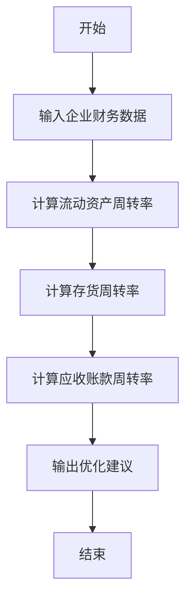

                 


# 彼得林奇对公司营运资本管理效率的看法

**关键词**：彼得·林奇、营运资本管理、资本效率、企业财务、投资策略、风险管理、资本运作

**摘要**：本文深入探讨了彼得·林奇对公司营运资本管理效率的看法，结合其独特的投资理念，分析了营运资本管理的核心要素，包括流动资产和流动负债的管理，以及营运资本效率的衡量指标。文章还从系统架构和数学模型的角度，详细阐述了营运资本管理的优化策略，并结合实际案例，提出了风险管理建议，为企业的资本运作提供了深刻见解。

---

## 第一部分: 引言

### 第1章: 彼得·林奇与投资理念概述

#### 1.1 彼得·林奇的背景介绍
彼得·林奇是美国著名投资家，以其在共同基金领域的卓越表现而闻名。他强调基本面分析和长期投资，主张通过深入研究企业基本面来选择投资标的。林奇的投资理念注重企业的财务健康状况，尤其是营运资本管理效率，他认为这直接影响企业的盈利能力和抗风险能力。

#### 1.2 营运资本管理的基本概念
营运资本是指企业在日常运营中所需的流动资产减去流动负债，是衡量企业短期偿债能力和运营效率的重要指标。营运资本管理的核心目标是优化流动资产和流动负债的结构，提高资金使用效率，降低运营成本。

#### 1.3 营运资本效率的重要性
营运资本效率高的企业能够更快地将资金转化为收益，减少资金占用，降低财务风险。林奇认为，营运资本管理效率是评估企业财务健康状况的重要指标，直接影响企业的盈利能力和发展潜力。

---

## 第二部分: 营运资本管理效率的核心要素

### 第2章: 营运资本管理的三大组成部分

#### 2.1 流动资产的管理
流动资产包括现金及现金等价物、存货和应收账款。林奇认为，流动资产的管理需要注重周转效率，避免资金闲置或过度占用。例如，他建议企业通过优化库存管理和应收账款回收，提高流动资产的周转率。

#### 2.2 流动负债的管理
流动负债包括应付账款、短期债务和其他应付款项。林奇强调，流动负债的管理需要平衡偿债压力和资金需求，避免短期债务过度负担导致流动性风险。他建议企业通过延长应付账款周期或优化短期债务结构来降低财务压力。

#### 2.3 营运资本效率的衡量指标
营运资本效率的衡量指标包括流动资产周转率、存货周转率和应收账款周转率。林奇认为，这些指标能够直观反映企业的运营效率和资金使用效果。例如，他指出，存货周转率低的企业可能存在库存积压问题，需要优化供应链管理。

### 第3章: 林奇对营运资本效率的看法

#### 3.1 林奇对流动资产管理的见解
林奇认为，流动资产管理的核心是提高资金周转效率。他建议企业通过精细化管理，优化现金储备和存货水平，同时加强应收账款回收，降低资金占用成本。

#### 3.2 林奇对流动负债管理的见解
林奇强调，流动负债管理需要注重风险控制。他建议企业通过合理安排短期债务结构，避免因偿债压力过大而导致流动性风险。同时，他建议企业通过延长应付账款周期，优化现金流管理。

#### 3.3 林奇对营运资本效率的整体评价
林奇认为，营运资本效率是企业财务健康的重要指标，直接影响企业的盈利能力和抗风险能力。他指出，营运资本效率高的企业能够更快地将资金转化为收益，从而在竞争中占据优势。

---

## 第三部分: 营运资本管理效率的系统分析

### 第4章: 营运资本管理的系统架构

#### 4.1 系统功能设计
营运资本管理系统需要具备流动资产和流动负债的实时监控、数据分析和优化建议等功能。例如，系统可以实时跟踪存货周转率和应收账款周转率，提供优化建议。

#### 4.2 系统架构设计
营运资本管理系统的架构设计包括数据采集层、数据处理层和用户界面层。数据采集层负责收集企业财务数据，数据处理层进行数据分析和计算，用户界面层提供直观的监控和优化建议。

#### 4.3 数据流设计
数据流设计包括从企业财务系统采集数据，通过数据处理层计算营运资本效率指标，最后通过用户界面层提供优化建议。

### 第5章: 营运资本管理的数学模型与算法

#### 5.1 营运资本效率的数学模型
营运资本效率的数学模型包括流动资产周转率（$ \text{流动资产周转率} = \frac{\text{营业收入}}{\text{平均流动资产}} $）和存货周转率（$ \text{存货周转率} = \frac{\text{营业成本}}{\text{平均存货}} $）。

#### 5.2 算法原理
算法原理包括通过数据分析和优化计算，确定最优的流动资产和流动负债结构，以提高营运资本效率。例如，可以通过线性规划模型优化存货和应收账款的水平。

#### 5.3 算法流程图


---

## 第四部分: 项目实战与风险管理

### 第6章: 项目实战

#### 6.1 环境安装
企业需要安装财务管理系统和数据分析工具，例如ERP系统和数据分析软件。

#### 6.2 核心实现
核心实现包括流动资产和流动负债的实时监控、营运资本效率的计算和优化建议的生成。

#### 6.3 代码实现
以下是营运资本效率计算的Python代码示例：
```python
# 计算流动资产周转率
def calculate_assets_turnover(revenue, avg_current_assets):
    return revenue / avg_current_assets

# 计算存货周转率
def calculate_inventory_turnover(cogs, avg_inventories):
    return cogs / avg_inventories

# 示例数据
revenue = 1000000
avg_current_assets = 500000
cogs = 800000
avg_inventories = 200000

# 计算并输出
assets_turnover = calculate_assets_turnover(revenue, avg_current_assets)
inventory_turnover = calculate_inventory_turnover(cogs, avg_inventories)

print(f"流动资产周转率: {assets_turnover}")
print(f"存货周转率: {inventory_turnover}")
```

### 第7章: 风险管理

#### 7.1 风险识别
营运资本管理中的主要风险包括流动性风险和财务风险。

#### 7.2 风险应对策略
企业可以通过优化流动资产和流动负债结构，合理安排短期债务，降低流动性风险。同时，通过加强应收账款管理和存货管理，降低财务风险。

#### 7.3 注意事项
企业在优化营运资本管理时，需要注意数据的准确性和实时性，确保优化建议的有效性。

---

## 结语

彼得·林奇认为，营运资本管理效率是企业财务健康的重要指标，直接影响企业的盈利能力和抗风险能力。通过优化流动资产和流动负债的管理，企业可以提高资金使用效率，降低运营成本，增强市场竞争力。本文从理论和实践两个方面，深入分析了营运资本管理的核心要素和优化策略，为企业提供了有价值的参考。

---

**作者：AI天才研究院/AI Genius Institute & 禅与计算机程序设计艺术 /Zen And The Art of Computer Programming**

---

**注意事项**：
- 本文内容基于彼得·林奇的投资理念和营运资本管理的理论框架，具体实施需结合企业实际情况。
- 数据分析和优化建议需基于企业的实际财务数据，确保结果的准确性和实用性。

**拓展阅读**：
- 彼得·林奇《彼得·林奇的投资哲学》
- 《财务报表分析》
- 《企业风险管理》

