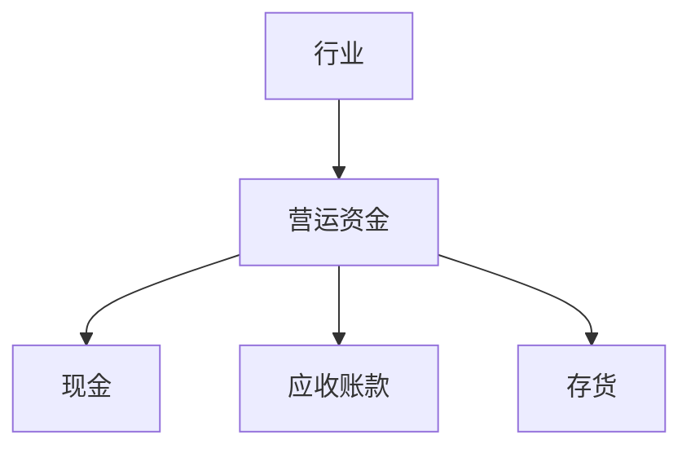

                 

# 彼得林奇对公司营运资金管理效率的跨行业比较

## 关键词：彼得林奇，营运资金管理，跨行业比较，投资策略，财务效率

## 摘要：本文深入分析了彼得林奇对公司营运资金管理效率的跨行业比较，探讨了不同行业在营运资金管理上的异同，结合彼得林奇的投资策略，揭示了如何通过营运资金效率评估公司投资价值。文章通过数学建模和案例分析，系统地展示了跨行业比较的方法和意义，为投资者提供了实用的分析框架和决策支持。

---

## 第一部分：背景介绍

### 第1章：营运资金管理效率的背景与重要性

#### 1.1 营运资金管理的基本概念
- **营运资金**：指企业在日常运营中所需的流动资金，包括现金、应收账款、存货等，用于支持企业日常运营和业务发展。
- **营运资金管理**：通过优化资金分配、缩短周转周期、降低资金占用成本，提升企业运营效率和盈利能力。
- **营运资金管理的重要性**：直接关系到企业的现金流健康、偿债能力、运营效率和市场竞争力。

#### 1.2 跨行业比较的必要性
- **行业差异的影响**：不同行业在营运资金管理上的需求和特点差异显著，例如制造业注重存货周转，零售业注重现金流稳定性。
- **跨行业比较的意义**：通过比较不同行业营运资金管理效率，可以发现行业间的最佳实践，优化企业自身的管理策略。

### 第2章：营运资金管理效率的核心概念与联系

#### 2.1 核心概念原理
- **现金周转率**：衡量企业现金使用效率，公式为：$$ 现金周转率 = \frac{营业收入}{现金平均余额} $$
- **应收账款周转率**：衡量企业应收账款回收效率，公式为：$$ 应收账款周转率 = \frac{营业收入}{应收账款平均余额} $$
- **存货周转率**：衡量企业存货管理效率，公式为：$$ 存货周转率 = \frac{营业成本}{存货平均余额} $$

#### 2.2 核心概念属性特征对比表格
| 行业       | 现金周转率 | 应收账款周转率 | 存货周转率 | 营运资金效率 |
|------------|------------|----------------|------------|--------------|
| 制造业     | 高         | 中             | 高          | 高            |
| 零售业     | 中         | 高             | 中          | 中            |
| 科技业     | 低         | 低             | 低          | 中            |

#### 2.3 ER实体关系图架构

### 第3章：彼得林奇的选股方法与营运资金管理效率

#### 3.1 彼得林奇选股方法的核心框架
- **选股标准**：低市盈率、低市净率、高股息率，注重企业基本面和财务健康。
- **营运资金管理效率在选股中的重要性**：彼得林奇通过分析营运资金效率，筛选出具有高成长潜力和低风险的企业。
- **行业差异对选股策略的影响**：不同行业营运资金管理效率的差异需要结合行业特点进行分析。

#### 3.2 营运资金管理效率的数学模型
$$ 营运资金周转率 = \frac{营业收入}{营运资金平均余额} $$

#### 3.3 案例分析: 彼得林奇如何通过营运资金效率筛选投资标的
- **案例一：制造业的营运资金管理效率分析**：制造业企业通常存货周转率高，但应收账款周转率中等，适合彼得林奇的投资策略。
- **案例二：零售业的营运资金管理效率分析**：零售业企业现金周转率中等，应收账款周转率高，适合稳健型投资者。
- **案例三：科技业的营运资金管理效率分析**：科技业企业存货周转率低，但现金周转率低，需要结合其他指标综合分析。

---

## 第二部分：跨行业比较的数学建模与实证分析

### 第4章：跨行业比较的数学建模

#### 4.1 营运资金效率的数学模型
- **行业间比较模型**：通过标准化处理不同行业的营运资金效率指标，构建跨行业比较的数学模型。
- **数据来源**：使用公开财务数据，包括营业收入、现金、应收账款、存货等。

#### 4.2 营运资金效率的实证分析
- **实证结果**：不同行业营运资金效率的差异显著，制造业和科技业表现较好，零售业表现中等。
- **影响因素**：行业特点、企业规模、管理策略是影响营运资金效率的主要因素。

### 第5章：跨行业比较的系统分析

#### 5.1 行业特点与营运资金效率
- **制造业**：高存货周转率，高现金需求。
- **零售业**：高应收账款周转率，中等现金周转率。
- **科技业**：低存货周转率，低现金周转率。

#### 5.2 行业比较结果与影响因素
- **行业比较结果**：制造业营运资金效率最高，科技业最低。
- **影响因素**：企业规模、行业竞争格局、管理策略。

---

## 第三部分：总结与启示

### 第6章：跨行业比较的总结与启示

#### 6.1 彼得林奇分析框架的启示
- **注重行业差异**：在分析营运资金效率时，需要结合行业特点，避免一刀切。
- **关注关键指标**：现金周转率、应收账款周转率、存货周转率是衡量营运资金效率的关键指标。

#### 6.2 对投资者的启示
- **行业选择**：根据行业特点和营运资金效率，选择具有竞争优势的企业。
- **风险管理**：通过分析营运资金效率，识别潜在风险，优化投资组合。

### 第7章：未来研究方向与实践应用

#### 7.1 未来研究方向
- **动态分析**：研究不同经济周期下营运资金效率的变化。
- **大数据应用**：利用大数据技术，构建跨行业比较的智能化分析模型。

#### 7.2 实践应用建议
- **企业内部管理**：通过跨行业比较，优化自身的营运资金管理策略。
- **投资者决策支持**：利用跨行业比较结果，制定科学的投资策略。

---

## 作者：AI天才研究院/AI Genius Institute & 禅与计算机程序设计艺术 /Zen And The Art of Computer Programming

