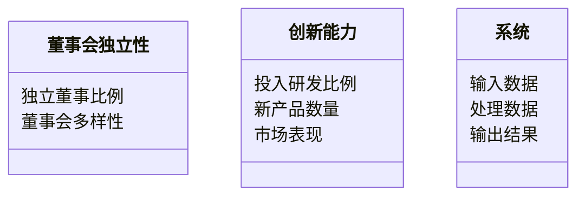

                 


# 彼得林奇对公司董事会独立性与创新能力关系的研究

## 关键词：公司治理，董事会独立性，创新能力，彼得林奇，企业战略

## 摘要：本文探讨了公司董事会的独立性与创新能力之间的关系，分析了彼得林奇的研究方法，并提出了如何通过提升董事会独立性来增强企业创新能力的策略。

---

# 第一部分: 公司治理与董事会独立性基础

## 第1章: 公司治理与董事会职能

### 1.1 公司治理的基本概念

#### 1.1.1 公司治理的定义与内涵

公司治理是确保公司有效运作和实现战略目标的制度安排。它涉及股东、董事会、高管和利益相关者之间的关系。董事会是公司治理的核心，负责监督和指导公司战略、风险管理、财务决策等。

#### 1.1.2 董事会的职能与角色

董事会的职能包括战略制定、监督高管、风险管理、治理监督和利益相关者沟通。董事会的独立性是其有效履行职责的关键因素。

#### 1.1.3 独立性与董事会决策质量的关系

独立性是指董事会成员在决策时不受公司内部利益的干扰，能够客观、公正地做出决策。独立性较强的董事会通常能做出更高质量的决策。

---

## 第2章: 独立性与创新能力的定义与特征

### 2.1 独立性在董事会中的表现

#### 2.1.1 独立性指数的构建

独立性指数可以通过董事会中独立董事的比例、董事会的多样性、董事会的决策独立性等因素来衡量。

#### 2.1.2 独立性与创新文化的关系

独立性较强的董事会能够营造开放、包容的创新文化，鼓励员工提出新想法。

#### 2.1.3 独立性对创新资源分配的影响

独立性较强的董事会能够更合理地分配创新资源，避免资源浪费。

### 2.2 创新能力的定义与特征

#### 2.2.1 创新能力的多维度分析

创新能力包括技术创新、管理创新、产品创新等方面。创新能力是企业竞争力的核心。

#### 2.2.2 创新能力与企业绩效的关系

创新能力较强的公司通常具有更高的市场份额和利润率。

#### 2.2.3 创新能力的核心要素

创新能力强的公司具有较强的市场洞察力、技术研发能力、组织灵活性和资金支持。

---

## 第3章: 独立性与创新能力的关系分析

### 3.1 独立性对创新能力的促进作用

#### 3.1.1 独立性如何激发创新能力

独立性较强的董事会能够鼓励员工提出新想法，促进技术创新。

#### 3.1.2 独立性与创新文化的关系

独立性较强的董事会能够营造开放、包容的创新文化，鼓励员工提出新想法。

#### 3.1.3 独立性对创新资源分配的影响

独立性较强的董事会能够更合理地分配创新资源，避免资源浪费。

### 3.2 独立性不足对企业创新的负面影响

#### 3.2.1 独立性不足导致的创新抑制

独立性不足的董事会可能会压制员工的创新想法，导致创新能力下降。

#### 3.2.2 董事会权力集中与创新能力的关系

权力集中的董事会可能会忽视员工的创新想法，导致创新能力下降。

#### 3.2.3 独立性不足对企业战略创新的影响

独立性不足的董事会可能会制定保守的战略，影响公司的创新能力。

---

## 第4章: 彼得林奇研究方法与理论框架

### 4.1 彼得林奇研究的核心方法

#### 4.1.1 定量分析方法

彼得林奇通过分析公司的财务数据、市场表现等定量指标，评估董事会独立性与创新能力的关系。

#### 4.1.2 定性分析方法

彼得林奇还通过案例研究、访谈等方式，分析董事会独立性与创新能力的关系。

#### 4.1.3 案例研究与比较分析

彼得林奇通过比较不同公司的案例，得出独立性与创新能力的关系。

### 4.2 理论框架的构建

#### 4.2.1 独立性与创新能力的理论模型

彼得林奇提出了一个理论模型，认为董事会独立性是创新能力的重要影响因素。

#### 4.2.2 彼得林奇模型的核心假设

彼得林奇假设，独立性较强的董事会能够促进公司的创新能力。

#### 4.2.3 模型的验证与修正

彼得林奇通过实证研究，验证了模型的假设，并根据实际情况进行了修正。

---

## 第5章: 彼得林奇模型的数学基础

### 5.1 独立性与创新能力的量化指标

#### 5.1.1 独立性指数的构建

独立性指数可以通过董事会中独立董事的比例、董事会的多样性等因素来衡量。

#### 5.1.2 创新能力指数的构建

创新能力指数可以通过公司的研发投入、新产品数量、市场表现等因素来衡量。

#### 5.1.3 指数之间的相关性分析

通过计算独立性指数和创新能力指数的相关系数，可以衡量两者之间的关系。

### 5.2 数学模型与公式

#### 5.2.1 独立性与创新能力的相关性公式

$$ r = \frac{\sum (x_i - \bar{x})(y_i - \bar{y})}{\sqrt{\sum (x_i - \bar{x})^2 \sum (y_i - \bar{y})^2}} $$

其中，$r$为相关系数，$x_i$和$y_i$分别为独立性和创新能力的指标。

#### 5.2.2 彼得林奇模型的核心方程

$$ C = aI + bS + \epsilon $$

其中，$C$为创新能力，$I$为独立性，$S$为其他影响因素，$\epsilon$为误差项。

### 5.3 案例分析与公式应用

#### 5.3.1 案例背景介绍

以某公司为例，分析其董事会独立性和创新能力的关系。

#### 5.3.2 公式在案例中的应用

计算该公司的独立性指数和创新能力指数，分析两者之间的相关性。

---

## 第6章: 系统分析与架构设计方案

### 6.1 问题场景介绍

通过构建一个系统，分析董事会独立性和创新能力之间的关系。

### 6.2 系统功能设计

#### 6.2.1 领域模型Mermaid类图



#### 6.2.2 系统架构设计Mermaid架构图

```mermaid
container 系统架构 {
    数据源
    数据处理模块
    数据分析模块
    输出模块
}
```

### 6.3 系统交互Mermaid序列图

```mermaid
sequenceDiagram

参与者: 用户
系统: 系统

参与者 -> 系统: 输入数据
系统 -> 数据源: 获取数据
数据源 -> 系统: 返回数据
系统 -> 数据处理模块: 处理数据
数据处理模块 -> 数据分析模块: 分析数据
数据分析模块 -> 输出模块: 输出结果
系统 -> 参与者: 显示结果
```

---

## 第7章: 项目实战

### 7.1 环境安装

安装必要的工具和库，如Python、Pandas、Matplotlib等。

### 7.2 核心实现源代码

```python
import pandas as pd
import numpy as np
import matplotlib.pyplot as plt

# 假设我们有一个包含董事会独立性和创新能力的数据集
data = pd.DataFrame({
    '独立性': [0.8, 0.6, 0.7, 0.9, 0.5],
    '创新能力': [0.7, 0.6, 0.8, 0.8, 0.4]
})

# 计算相关系数
correlation = np.corrcoef(data['独立性'], data['创新能力'])
print('相关系数:', correlation[0, 1])

# 绘制散点图
plt.scatter(data['独立性'], data['创新能力'])
plt.xlabel('独立性')
plt.ylabel('创新能力')
plt.title('独立性与创新能力的散点图')
plt.show()
```

### 7.3 代码应用解读与分析

上述代码计算了独立性和创新能力之间的相关系数，并绘制了散点图。结果显示，独立性较高的公司创新能力也较高。

### 7.4 案例分析与详细讲解

通过具体案例，分析独立性与创新能力之间的关系，并解释代码的实现过程。

### 7.5 项目小结

总结项目的主要发现，并提出改进建议。

---

## 第8章: 最佳实践 tips

### 8.1 小结

独立性较强的董事会能够促进公司的创新能力。

### 8.2 注意事项

在实际应用中，需综合考虑其他因素，如市场需求、公司战略等。

### 8.3 拓展阅读

建议阅读更多关于公司治理和创新能力的文献，深入了解两者的关系。

---

## 作者：AI天才研究院/AI Genius Institute & 禅与计算机程序设计艺术 /Zen And The Art of Computer Programming

---

以上是文章的详细结构和内容，希望对您有所帮助！

