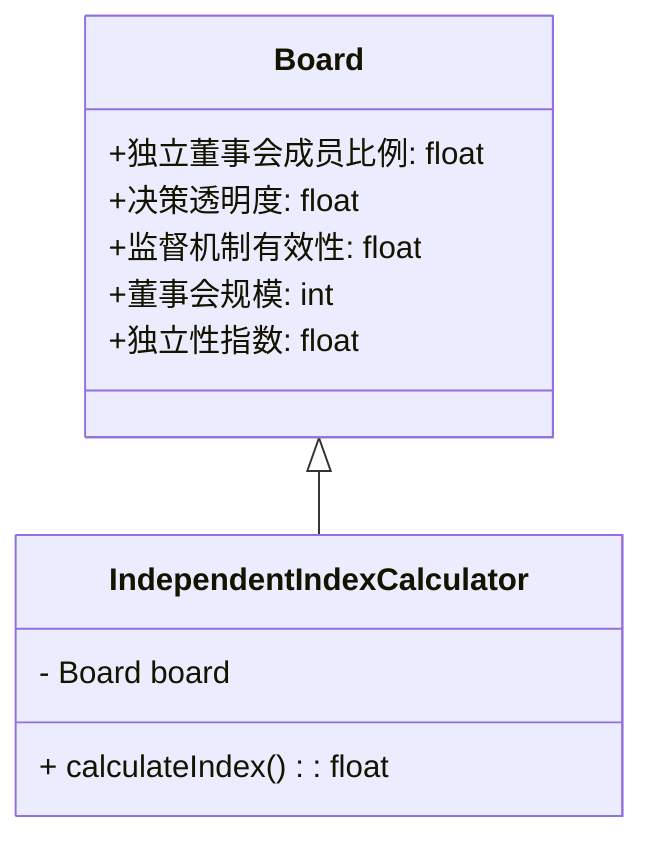
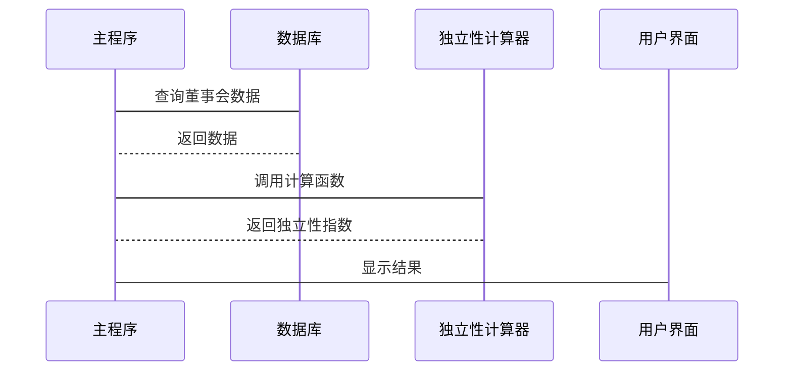

                 


# 彼得林奇对公司董事会独立性的评估

> 关键词：彼得·林奇，董事会独立性，评估标准，治理结构，投资决策，风险管理

> 摘要：本文探讨了彼得·林奇对董事会独立性的评估方法及其对公司治理和投资决策的影响。通过分析林奇的理论框架、评估模型和实际案例，本文揭示了独立性在董事会运作中的关键作用，并提供了如何通过独立性评估优化企业治理的实践指南。

---

## 第一部分：引言

### 第1章：彼得·林奇与董事会独立性评估的背景

#### 1.1 背景介绍

- **问题背景**：现代企业治理的核心在于董事会的独立性。董事会作为公司治理的最高决策机构，其独立性直接关系到企业的战略制定、风险管理以及股东价值的实现。
- **问题描述**：董事会独立性是指董事会成员在决策过程中不受公司内部或外部利益相关者的不当影响，确保董事会能够独立履行职责。
- **问题解决**：彼得·林奇，作为著名投资家，强调了董事会独立性在企业价值评估中的重要性。他提出了一套独特的评估方法，帮助企业识别和优化董事会的独立性。
- **边界与外延**：本文将从理论与实践两个角度探讨林奇的评估方法，分析其在企业治理中的应用价值。

#### 1.2 核心概念与联系

- **核心概念**：
  - **独立性**：董事会成员在决策过程中保持客观、公正的能力。
  - **董事会治理**：企业治理的核心机制，涉及董事会的结构、职责和运作方式。
  - **投资决策**：投资者在评估企业时，董事会独立性是关键考量因素之一。

- **核心要素**：
  - 董事会结构：包括董事会规模、独立董事比例、董事会主席与首席执行官的分离等。
  - 决策过程：包括董事会会议的透明度、决策的独立性和效率。
  - 监督机制：包括内部审计、风险管理、合规性评估等。

---

## 第二部分：彼得·林奇的董事会独立性评估模型

### 第2章：林奇评估模型的核心原理

#### 2.1 林奇评估模型的理论基础

- **治理理论的发展**：从古典治理理论到现代治理体系，董事会独立性一直是治理研究的核心议题。
- **独立性与企业价值的关系**：林奇认为，独立的董事会能够更好地监督管理层，优化企业战略，从而提升企业价值。
- **模型的独特性**：林奇的模型结合了定量分析和定性评估，注重董事会的结构、行为和效果三者的统一。

#### 2.2 林奇评估模型的数学表达

- **模型公式**：
  $$ \text{独立性指数} = \frac{\text{独立董事比例} \times \text{决策透明度} + \text{监督机制有效性}}{\text{董事会规模}} $$
- **变量解释**：
  - 独立董事比例：董事会中独立董事占总董事的比例。
  - 决策透明度：董事会决策过程的公开性和可追溯性。
  - 监督机制有效性：董事会监督机制的实际效果。
  - 董事会规模：董事会的成员数量。

### 第3章：林奇评估模型的算法实现

#### 3.1 算法原理

- **输入**：董事会结构数据，包括独立董事比例、决策透明度、监督机制有效性、董事会规模。
- **输出**：独立性指数，用于评估董事会的独立性。
- **步骤**：
  1. 收集董事会结构数据。
  2. 计算独立性指数。
  3. 分析指数结果，给出优化建议。

#### 3.2 算法实现（Python代码示例）

```python
def calculate_independence_index(independent_directors, decision_transparency, oversight_effectiveness, board_size):
    numerator = independent_directors * decision_transparency + oversight_effectiveness
    denominator = board_size
    return numerator / denominator

# 示例数据
independent_directors = 5  # 独立董事数量
decision_transparency = 80  # 决策透明度评分（0-100）
oversight_effectiveness = 70  # 监督机制有效性评分（0-100）
board_size = 10  # 董事会规模

index = calculate_independence_index(independent_directors, decision_transparency, oversight_effectiveness, board_size)
print(f"独立性指数：{index}")
```

### 第4章：模型的验证与应用

#### 4.1 模型验证

- **验证方法**：
  - 使用历史数据验证模型的准确性。
  - 对比不同公司的独立性指数，分析其与企业绩效的相关性。
- **结果分析**：
  - 高独立性指数通常对应较好的企业绩效。
  - 低独立性指数可能导致企业治理风险增加。

#### 4.2 模型的应用

- **应用场景**：
  - 投资者在选择投资目标时，可以通过独立性指数评估企业的治理风险。
  - 企业内部审计部门可以利用模型评估董事会的独立性，提出改进建议。

---

## 第三部分：系统分析与架构设计

### 第5章：系统功能设计

#### 5.1 领域模型（Mermaid类图）



### 第6章：系统架构设计

#### 6.1 系统架构（Mermaid架构图）


### 第7章：系统接口设计

#### 7.1 API接口

- **输入接口**：
  - POST /api/board-data，接收董事会结构数据。
- **输出接口**：
  - GET /api/independence-index，返回独立性指数。

### 第8章：系统交互（Mermaid序列图）



---

## 第四部分：项目实战

### 第9章：环境安装与配置

#### 9.1 环境要求

- **编程语言**：Python 3.8+
- **库依赖**：numpy, pandas
- **工具**：Jupyter Notebook, VS Code

### 第10章：核心代码实现

#### 10.1 核心代码（Python）

```python
import numpy as np
import pandas as pd

def calculate_independence_index(board_data):
    independent_directors = board_data['独立董事比例']
    decision_transparency = board_data['决策透明度']
    oversight_effectiveness = board_data['监督机制有效性']
    board_size = board_data['董事会规模']
    
    numerator = independent_directors * decision_transparency + oversight_effectiveness
    denominator = board_size
    index = numerator / denominator
    return index

# 示例数据
data = {
    '独立董事比例': 0.6,
    '决策透明度': 85,
    '监督机制有效性': 75,
    '董事会规模': 9
}
board_data = pd.DataFrame(data, index=[0])

index = calculate_independence_index(board_data)
print(f"独立性指数：{index}")
```

---

## 第五部分：结论与展望

### 第11章：结论

- **主要结论**：
  - 林奇的独立性评估模型为企业治理提供了有效的工具。
  - 独立性指数可以作为投资者和企业管理者的重要参考指标。
- **优化建议**：
  - 结合企业实际情况，动态调整评估指标。
  - 进一步研究独立性指数与企业绩效的相关性。

### 第12章：展望

- **未来研究方向**：
  - 探讨独立性评估在不同行业中的适用性。
  - 结合人工智能技术，优化评估模型。

---

## 参考文献

- 彼得·林奇的著作《彼得·林奇的投资哲学》
- 公司治理相关文献
- 企业风险管理理论

---

## 作者

作者：AI天才研究院/AI Genius Institute & 禅与计算机程序设计艺术 /Zen And The Art of Computer Programming

