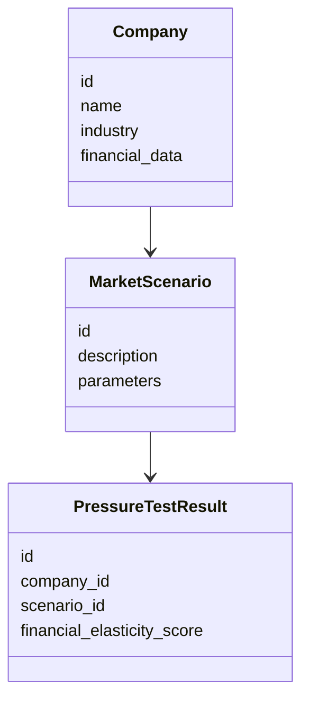

                 


# 彼得林奇对公司财务弹性的压力测试方法

## 关键词
- 彼得林奇
- 财务弹性
- 压力测试
- 财务稳健性
- 投资策略
- 系统设计
- 项目实战

## 摘要
本文深入探讨了彼得·林奇对公司财务弹性的压力测试方法，从理论基础到实际应用进行了全面分析。通过介绍财务弹性与压力测试的核心概念，详细讲解了彼得·林奇的压力测试算法，结合系统架构设计和项目实战，展示了如何在实际投资中应用这些方法。本文旨在帮助读者掌握彼得·林奇的压力测试技巧，提升投资决策的科学性和稳健性。

---

# 第一部分: 财务弹性与压力测试的背景与基础

## 第1章: 财务弹性的定义与重要性

### 1.1 财务弹性的定义与特征
财务弹性是指企业在面对市场波动、经济 downturn 或其他外部压力时，维持财务稳健性和持续经营能力的能力。它通常通过企业的财务比率、现金流状况和资产结构来衡量。

#### 1.1.1 财务弹性的定义
财务弹性强调企业在压力环境下的适应能力和恢复能力，是企业抵御风险的核心指标之一。一个具有高财务弹性的企业能够在市场低迷时期保持稳健，并通过调整战略和资源分配实现长期发展。

#### 1.1.2 财务弹性的关键特征
- **流动性**：企业能否快速将资产转化为现金，以应对突发事件。
- **偿债能力**：企业在债务到期时的还款能力。
- **盈利能力**：企业通过经营活动产生的利润，支撑其财务弹性。
- **资产结构**：企业的资产分布是否合理，能否在压力下快速变现。

#### 1.1.3 财务弹性与公司价值的关系
财务弹性是公司价值的重要组成部分。高财务弹性的企业通常具有更强的抗风险能力和更高的市场估值，能够吸引更多的投资者。

---

## 第2章: 压力测试的定义与作用

### 2.1 压力测试的定义
压力测试是一种通过模拟极端市场条件，评估企业或投资组合在不利环境下的表现和风险承受能力的方法。它是企业风险管理的重要工具。

#### 2.1.1 压力测试的目的与意义
- **识别风险**：通过模拟极端市场条件，发现企业在压力下的潜在问题。
- **评估稳健性**：了解企业在不利环境下的财务表现和抗风险能力。
- **制定应对策略**：根据测试结果，制定有效的风险管理措施。

#### 2.1.2 压力测试的实施步骤
1. **设定测试场景**：选择极端市场条件（如经济衰退、市场崩盘等）。
2. **选择测试指标**：确定关键财务指标（如净利润率、资产负债率等）。
3. **模拟测试结果**：通过模型计算企业在不同场景下的财务表现。
4. **分析结果**：评估企业是否能够承受极端压力，提出改进建议。

#### 2.1.3 彼得林奇压力测试方法的核心思想
彼得林奇认为，压力测试不仅仅是对财务数据的分析，更是对企业管理能力、战略灵活性和市场适应能力的综合考量。他强调在压力测试中关注企业的现金流状况和管理层应对危机的能力。

---

## 第3章: 彼得林奇的财务弹性压力测试方法

### 3.1 彼得林奇的背景与投资理念
彼得·林奇是美国著名投资经理，以其成功的投资策略和对企业的深入分析闻名。他主张通过基本面分析和压力测试来评估企业的长期投资价值。

#### 3.1.1 彼得林奇的财务弹性压力测试方法
彼得林奇的压力测试方法以现金流为核心，结合企业的财务比率和市场环境，评估企业在极端情况下的生存能力。

#### 3.1.2 彼得林奇方法的适用范围
彼得林奇的压力测试方法适用于所有行业，尤其适合那些依赖现金流的企业（如制造业、零售业等）。

---

## 第4章: 财务弹性压力测试的核心概念与联系

### 4.1 财务弹性压力测试的核心概念
财务弹性压力测试的核心概念包括：
- **现金流分析**：企业在未来一定时期内的现金流预测。
- **财务比率分析**：通过财务比率（如流动比率、速动比率等）评估企业的财务健康状况。
- **市场环境模拟**：模拟极端市场条件，评估企业的应对能力。

#### 4.1.1 财务弹性与流动性比率的对比
| 指标         | 定义与作用                          |
|--------------|------------------------------------|
| 流动比率     | 流动资产与流动负债的比值，衡量短期偿债能力。 |
| 速动比率     | （流动资产 - 存货）与流动负债的比值，更保守的短期偿债能力衡量。 |

#### 4.1.2 财务弹性与偿债能力的对比
| 指标         | 定义与作用                          |
|--------------|------------------------------------|
| 负债率       | 负债总额与资产总额的比值，衡量企业杠杆风险。 |
| 利息保障倍数 | 恰当EBITDA与利息支出的比值，衡量企业支付利息的能力。 |

#### 4.1.3 财务弹性与盈利能力的对比
| 指标         | 定义与作用                          |
|--------------|------------------------------------|
| 净利润率     | 净利润与营业收入的比值，衡量企业的盈利能力。 |
| 投资回报率   | 净利润与平均股东权益的比值，衡量股东投资回报能力。 |

---

## 第5章: 彼得林奇压力测试方法的系统架构设计

### 5.1 系统功能设计
彼得林奇压力测试系统的功能模块包括：
- **数据输入模块**：收集企业的财务数据和市场数据。
- **模型计算模块**：根据设定的场景，计算企业的财务弹性指标。
- **结果输出模块**：生成压力测试报告，提出改进建议。

#### 5.1.1 领域模型（mermaid 类图）


#### 5.1.2 系统架构设计（mermaid 架构图）


---

## 第6章: 项目实战——基于彼得林奇方法的财务弹性压力测试

### 6.1 环境安装与数据准备
- **环境安装**：安装 Python、Pandas、NumPy 等工具。
- **数据准备**：收集企业的财务数据和市场数据。

#### 6.1.1 代码实现
```python
import pandas as pd
import numpy as np

def calculate_financial_elasticity(finance_data, scenario):
    # 计算现金流
    cash_flow = finance_data['revenue'] - finance_data['expenses']
    # 计算流动比率
    current_ratio = finance_data['current_assets'] / finance_data['current_liabilities']
    # 计算速动比率
    quick_ratio = (finance_data['current_assets'] - finance_data['inventory']) / finance_data['current_liabilities']
    # 返回财务弹性评分
    return (cash_flow + current_ratio + quick_ratio) / 3
```

#### 6.1.2 案例分析
以某制造企业为例，模拟经济衰退场景，计算其财务弹性评分，评估其在极端情况下的生存能力。

---

## 第7章: 最佳实践与注意事项

### 7.1 小结
彼得林奇的压力测试方法通过对企业财务弹性进行深入分析，帮助企业识别潜在风险并制定应对策略。

### 7.2 注意事项
- 数据的准确性和完整性是压力测试结果的关键。
- 压力测试模型需要根据市场变化和企业实际情况不断优化。
- 在实际应用中，应结合企业战略和管理层能力进行综合评估。

### 7.3 拓展阅读
- 《彼得·林奇的投资艺术》
- 《压力测试与风险管理》

---

## 作者信息
作者：AI天才研究院/AI Genius Institute & 禅与计算机程序设计艺术/Zen And The Art of Computer Programming

---

通过本文的详细分析，读者可以全面理解彼得林奇的压力测试方法，并将其应用于实际投资和企业风险管理中。

