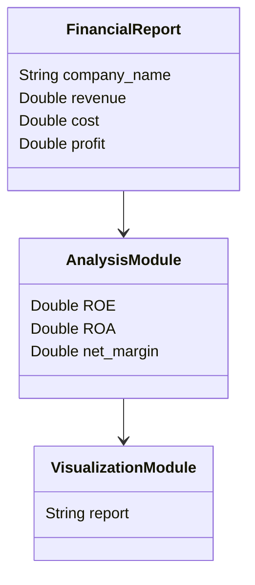
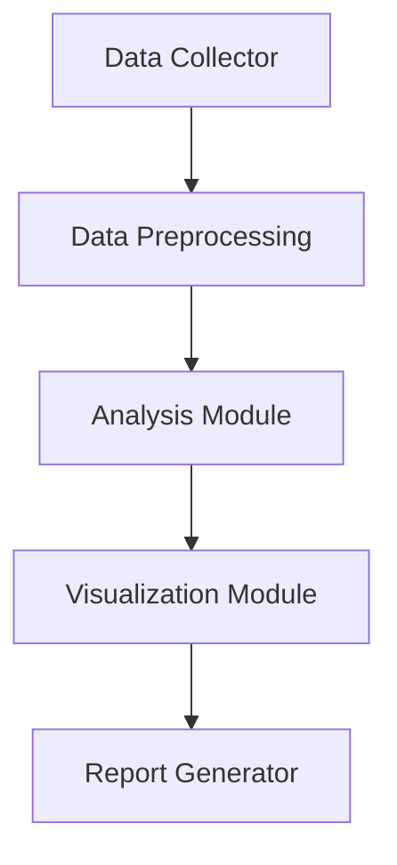
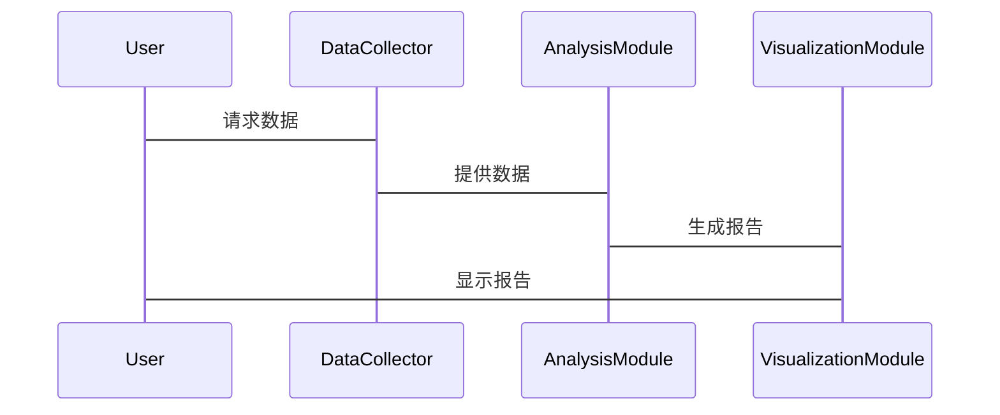

                 


```markdown
# 彼得林奇对公司财务报表质量的评估

> 关键词：彼得林奇，财务报表，质量评估，投资分析，财务指标

> 摘要：本文详细探讨了彼得林奇如何评估公司财务报表的质量，通过分析其独特的方法，结合实际案例和数学模型，展示了如何通过基本面分析做出明智的投资决策。

---

# 第一部分: 背景介绍

# 第1章: 财务报表质量评估的背景与重要性

## 1.1 财务报表的基本概念与作用

### 1.1.1 财务报表的定义与组成
财务报表是企业在一定会计期间内经济活动的总结，主要包括：
- **资产负债表**：反映企业在某一特定日期的财务状况。
- **利润表**：反映企业在一定会计期间的经营成果。
- **现金流量表**：反映企业在一定会计期间的现金流入和流出情况。

### 1.1.2 财务报表在企业中的作用
财务报表是企业内外部利益相关者评估企业财务健康状况的重要工具，包括投资者、债权人、管理层等。

### 1.1.3 财务报表质量评估的意义
质量评估能够帮助投资者识别财务造假，评估企业的真实盈利能力和发展潜力。

## 1.2 彼得·林奇与财务报表分析

### 1.2.1 彼得·林奇的个人背景
彼得·林奇是美国著名投资经理人，以其对基本面分析的重视而闻名，尤其擅长通过分析公司财务报表来评估投资价值。

### 1.2.2 彼得·林奇的投资理念
- 重视企业的基本面，尤其是财务数据的真实性和稳定性。
- 寻找那些具有持续增长潜力的公司。

### 1.2.3 彼得·林奇与财务报表分析的关联
彼得·林奇通过深入分析财务报表，识别企业的财务健康状况和潜在风险，从而做出投资决策。

## 1.3 财务报表质量评估的传统方法与局限性

### 1.3.1 传统财务报表分析方法
传统方法通常依赖于财务比率分析，如ROE（净资产收益率）、ROA（资产回报率）等。

### 1.3.2 传统方法的局限性
- 过于依赖历史数据，忽视未来增长潜力。
- 忽视行业差异，导致评估结果偏差。

### 1.3.3 彼得·林奇方法的优势
彼得·林奇通过对比分析和行业标准，结合具体数据，更准确地评估企业财务状况。

---

# 第二部分: 核心概念与联系

# 第2章: 财务报表质量评估的核心概念

## 2.1 财务报表的结构与内容

### 2.1.1 资产负债表
- **资产**：企业拥有的资源，如现金、应收账款、存货等。
- **负债**：企业欠款，如应付账款、长期借款等。
- **所有者权益**：企业净资产，包括股本、资本公积等。

### 2.1.2 利润表
- **收入**：企业在一定时期内通过销售商品或提供服务所获得的总收入。
- **成本**：生产商品或提供服务所发生的直接成本。
- **利润**：收入减去成本和费用后的净收益。

### 2.1.3 现金流量表
- **经营活动现金流**：企业日常经营活动中产生的现金流。
- **投资活动现金流**：企业投资活动产生的现金流。
- **筹资活动现金流**：企业筹资活动产生的现金流。

## 2.2 财务报表质量评估的维度

### 2.2.1 财务数据的真实性
通过对比分析和行业标准，识别财务数据的异常值。

### 2.2.2 财务数据的完整性
确保财务报表中所有重要信息都已披露，无遗漏。

### 2.2.3 财务数据的合理性
通过财务比率分析，评估数据的合理性，如ROE、ROA等。

## 2.3 彼得·林奇的财务报表分析方法

### 2.3.1 重点关注的财务指标
- **ROE（净资产收益率）**：衡量企业盈利能力的重要指标。
- **ROA（资产回报率）**：衡量资产使用效率的指标。
- **净利率**：衡量企业利润能力的指标。

### 2.3.2 财务数据的横向与纵向对比
- **横向对比**：将企业与同行业其他公司进行对比。
- **纵向对比**：分析企业在不同会计期间的财务数据变化趋势。

### 2.3.3 行业标准与公司实际的结合
结合行业标准和公司实际情况，评估财务数据的合理性。

## 2.4 核心概念对比分析

### 2.4.1 传统方法与彼得·林奇方法的对比
| 对比维度       | 传统方法             | 彼得·林奇方法         |
|----------------|----------------------|----------------------|
| 数据分析重点     | 财务比率分析         | 综合分析与对比        |
| 数据处理方式     | 单一指标分析         | 多维度对比分析        |
| 评估结果         | 简单的财务健康评价     | 更精准的投资决策参考   |

### 2.4.2 财务指标的属性特征对比表格
| 财务指标     | 属性特征             |
|--------------|----------------------|
| ROE           | 衡量盈利能力         |
| ROA           | 衡量资产使用效率     |
| 净利率         | 衡量利润能力         |

---

# 第三部分: 算法原理讲解

# 第3章: 财务报表质量评估的算法原理

## 3.1 数据预处理

### 3.1.1 数据清洗
- 检查数据完整性，处理缺失值。
- 识别异常值，进行数据修正。

### 3.1.2 数据转换
- 将数据转换为适合分析的格式，如标准化处理。

## 3.2 评估指标计算

### 3.2.1 计算ROE
$$ROE = \frac{\text{净利润}}{\text{净资产}}$$

### 3.2.2 计算ROA
$$ROA = \frac{\text{净利润}}{\text{总资产}}$$

### 3.2.3 计算净利率
$$\text{净利率} = \frac{\text{净利润}}{\text{营业收入}} \times 100\%$$

## 3.3 综合评分模型

### 3.3.1 模型设计
根据各个财务指标的权重，计算综合评分。

### 3.3.2 权重分配
| 财务指标     | 权重   |
|--------------|--------|
| ROE           | 40%    |
| ROA           | 30%    |
| 净利率         | 30%    |

### 3.3.3 计算公式
$$\text{综合评分} = \sum (\text{指标值} \times \text{权重})$$

## 3.4 算法实现

### 3.4.1 数据预处理代码
```python
import pandas as pd

# 读取数据
data = pd.read_csv('financial_data.csv')

# 处理缺失值
data = data.dropna()

# 标准化处理
from sklearn.preprocessing import StandardScaler
scaler = StandardScaler()
scaled_data = scaler.fit_transform(data)
```

### 3.4.2 评估指标计算代码
```python
# 计算ROE
roe = data['净利润'] / data['净资产']

# 计算ROA
roa = data['净利润'] / data['总资产']

# 计算净利率
net_margin = (data['净利润'] / data['营业收入']) * 100
```

### 3.4.3 综合评分计算代码
```python
# 定义权重
weights = {'ROE': 0.4, 'ROA': 0.3, 'Net Margin': 0.3}

# 计算综合评分
def calculate_overall_score(roe, roa, net_margin, weights):
    score = (roe * weights['ROE']) + (roa * weights['ROA']) + (net_margin * weights['Net Margin'])
    return score

overall_scores = calculate_overall_score(roe, roa, net_margin, weights)
```

---

# 第四部分: 系统分析与架构设计

# 第4章: 系统分析与架构设计方案

## 4.1 系统功能设计

### 4.1.1 领域模型


### 4.1.2 系统架构设计


### 4.1.3 接口设计
- 数据采集接口：从数据库中读取财务数据。
- 数据处理接口：对数据进行清洗和转换。
- 分析接口：计算各个财务指标并生成评分。
- 可视化接口：将分析结果以图表形式展示。

### 4.1.4 交互设计


---

# 第五部分: 项目实战

# 第5章: 项目实战与案例分析

## 5.1 环境安装

### 5.1.1 安装Python
```bash
python --version
pip install pandas
pip install scikit-learn
```

### 5.1.2 安装其他工具
```bash
pip install mermaid
pip install matplotlib
```

## 5.2 系统核心实现

### 5.2.1 数据采集
```python
import pandas as pd

# 从CSV文件中读取数据
data = pd.read_csv('financial_data.csv')
```

### 5.2.2 数据处理
```python
# 处理缺失值
data = data.dropna()

# 标准化处理
from sklearn.preprocessing import StandardScaler
scaler = StandardScaler()
scaled_data = scaler.fit_transform(data)
```

### 5.2.3 指标计算
```python
# 计算ROE
roe = data['净利润'] / data['净资产']

# 计算ROA
roa = data['净利润'] / data['总资产']

# 计算净利率
net_margin = (data['净利润'] / data['营业收入']) * 100
```

### 5.2.4 综合评分
```python
def calculate_overall_score(roe, roa, net_margin, weights):
    score = (roe * weights['ROE']) + (roa * weights['ROA']) + (net_margin * weights['Net Margin'])
    return score

weights = {'ROE': 0.4, 'ROA': 0.3, 'Net Margin': 0.3}
overall_scores = calculate_overall_score(roe, roa, net_margin, weights)
```

### 5.2.5 可视化
```python
import matplotlib.pyplot as plt

plt.hist(overall_scores, bins=10)
plt.xlabel('综合评分')
plt.ylabel('频率')
plt.show()
```

## 5.3 案例分析

### 5.3.1 案例背景
分析某制造公司2020-2022年的财务数据，评估其财务报表质量。

### 5.3.2 数据分析
```python
# 计算ROE
 Roe = data['净利润'] / data['净资产']

# 计算ROA
 ROA = data['净利润'] / data['总资产']

# 计算净利率
 net_margin = (data['净利润'] / data['营业收入']) * 100
```

### 5.3.3 结果展示
```python
print(f"ROE: {Roe}")
print(f"ROA: {ROA}")
print(f"净利率: {net_margin}%")
print(f"综合评分: {overall_scores}")
```

---

# 第六部分: 最佳实践

# 第6章: 最佳实践与注意事项

## 6.1 总结与反思

### 6.1.1 彼得·林奇方法的核心要点
- 重视基本面分析。
- 多维度对比分析。
- 结合行业标准和公司实际情况。

### 6.1.2 方法的优势
- 提高评估准确性。
- 帮助做出更明智的投资决策。

## 6.2 注意事项

### 6.2.1 数据来源的可靠性
确保数据准确无误，避免因数据错误导致分析偏差。

### 6.2.2 方法的适用性
不同行业和不同规模的企业可能需要不同的分析方法。

### 6.2.3 持续学习与更新
财务分析方法和行业标准会不断更新，需持续学习新知识。

## 6.3 小结

通过本文的分析，我们可以看到彼得·林奇的财务报表分析方法在实际应用中的有效性。通过多维度的对比分析，结合行业标准和公司实际情况，可以更准确地评估企业的财务状况，从而做出更明智的投资决策。

---

# 作者

作者：AI天才研究院/AI Genius Institute & 禅与计算机程序设计艺术/Zen And The Art of Computer Programming
```

