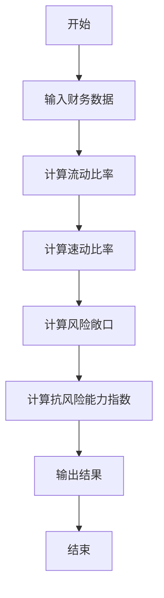
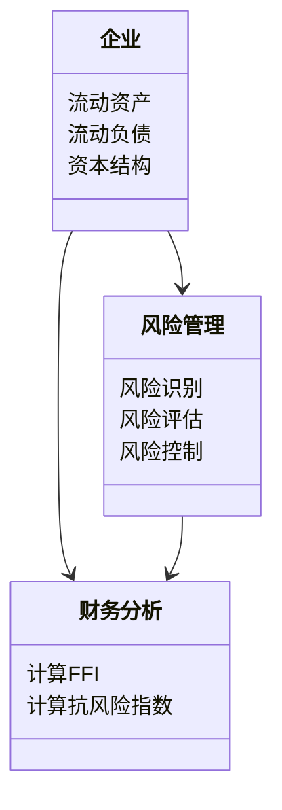
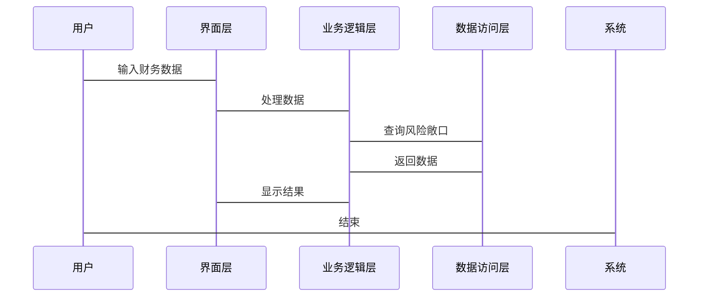

                 


# 彼得林奇对公司财务灵活性与抗风险能力的相关性研究

## 关键词：彼得林奇、财务灵活性、抗风险能力、企业财务、风险管理

## 摘要：本文系统地探讨了彼得林奇关于公司财务灵活性与抗风险能力的相关性研究。从核心概念、算法原理到系统架构，结合实际案例和项目实战，全面分析了两者之间的关系及应用。通过深入研究，提出了优化企业财务风险管理的策略，为企业稳健发展提供理论支持和实践指导。

---

## 第一部分: 背景介绍

### 第1章: 财务灵活性与抗风险能力的定义与背景

#### 1.1 财务灵活性的定义与特征

##### 1.1.1 财务灵活性的定义
财务灵活性是指企业在面对市场变化和内部需求时，能够快速调整财务结构、优化资源配置和应对资金需求的能力。它衡量了企业在财务上的适应性和应变能力。

##### 1.1.2 财务灵活性的核心特征
- **流动性**：企业能够迅速将资产转化为现金的能力。
- **杠杆性**：合理利用债务融资的能力。
- **弹性**：财务结构在变化中的调整能力。

##### 1.1.3 财务灵活性的边界与外延
财务灵活性不仅关注短期流动性，还包括长期资本结构的优化。外延涉及企业内外部资源的整合与利用。

#### 1.2 抗风险能力的定义与特征

##### 1.2.1 抗风险能力的定义
抗风险能力是指企业在面对内外部风险时，能够承受冲击、维持经营稳定的能力。它是企业生存和发展的关键因素。

##### 1.2.2 抗风险能力的核心特征
- **风险识别**：准确识别潜在风险的能力。
- **风险承受**：在风险发生时，企业能够承担损失并维持运营。
- **风险控制**：通过策略和机制减少风险的影响。

#### 1.3 财务灵活性与抗风险能力的关系

##### 1.3.1 两者的内在联系
财务灵活性是抗风险能力的基础。企业具备财务灵活性，能够在风险发生时迅速调整财务结构，降低风险影响。

##### 1.3.2 彼得林奇的理论视角
彼得林奇强调，财务灵活性是企业抗风险的核心因素。他提出，企业应保持适度的财务杠杆和充足的流动性储备。

##### 1.3.3 研究的背景与意义
在全球化和经济波动加剧的背景下，企业面临的风险日益复杂。研究财务灵活性与抗风险能力的相关性，有助于企业制定更有效的风险管理策略。

---

## 第二部分: 核心概念与联系

### 第2章: 财务灵活性与抗风险能力的核心要素

#### 2.1 核心概念的原理分析

##### 2.1.1 财务灵活性的构成要素
- **流动资产**：现金、应收账款、存货等。
- **流动负债**：短期借款、应付账款等。
- **资本结构**：股权和债务的比例。

##### 2.1.2 抗风险能力的构成要素
- **风险评估**：识别和评估潜在风险。
- **风险管理策略**：制定应对策略。
- **风险监控**：持续监控和调整。

#### 2.2 核心概念的属性特征对比

##### 2.2.1 表格对比：财务灵活性与抗风险能力的属性特征

| 属性 | 财务灵活性 | 抗风险能力 |
|------|------------|-------------|
| 核心 | 资金调配能力 | 风险承受能力 |
| 衡量 | 流动比率、速动比率 | 风险敞口、VaR值 |

##### 2.2.2 图形对比：ER实体关系图

```mermaid
erd
  entity 财务灵活性 {
    <流动资产>
    <流动负债>
    <资本结构>
  }

  entity 抗风险能力 {
    <风险识别>
    <风险承受>
    <风险控制>
  }

  relationship 财务灵活性与抗风险能力 {
    关联性：高
    影响因素：资本结构、流动性
  }
```

#### 2.3 彼得林奇的理论框架

##### 2.3.1 理论模型的构建
彼得林奇提出了财务灵活性与抗风险能力的协同模型，强调两者的相互作用。

##### 2.3.2 理论模型的验证
通过实证分析，验证模型的有效性和适用性。

---

## 第三部分: 算法原理讲解

### 第3章: 财务灵活性与抗风险能力的算法模型

#### 3.1 算法原理概述

##### 3.1.1 算法的基本原理
基于财务指标和风险模型，计算企业的财务灵活性和抗风险能力指数。

##### 3.1.2 算法的输入与输出
- **输入**：流动资产、流动负债、资本结构、风险敞口等。
- **输出**：财务灵活性指数、抗风险能力指数。

##### 3.1.3 算法的优缺点
优点：量化分析，便于比较；缺点：依赖于数据准确性。

#### 3.2 算法实现的流程图



#### 3.3 算法的数学模型与公式

##### 3.3.1 数学模型的建立
财务灵活性指数（FFI）= (流动资产 / 流动负债) × 0.5 + (速动比率 × 0.5)

##### 3.3.2 关键公式的推导
$$抗风险能力指数 = \frac{风险敞口}{风险承受能力}$$

---

## 第四部分: 系统分析与架构设计

### 第4章: 系统分析与架构设计

#### 4.1 问题场景介绍
企业财务风险管理的现状和挑战，包括数据孤岛、信息滞后等问题。

#### 4.2 系统功能设计

##### 4.2.1 领域模型类图



#### 4.3 系统架构设计

##### 4.3.1 系统架构图


#### 4.4 系统接口设计
定义API接口，实现数据的交互和功能调用。

#### 4.5 系统交互图



---

## 第五部分: 项目实战

### 第5章: 项目实战

#### 5.1 环境安装
安装Python、Pandas、Matplotlib等工具。

#### 5.2 系统核心实现源代码

##### 5.2.1 核心代码实现

```python
import pandas as pd

def calculate_ffr(f_assets, f_liabilities):
    return f_assets / f_liabilities

def calculate_rrr(risk_exposure, risk_tolerance):
    return risk_exposure / risk_tolerance

# 示例数据
f_assets = 1000000
f_liabilities = 500000
risk_exposure = 200000
risk_tolerance = 100000

ffr = calculate_ffr(f_assets, f_liabilities)
rrr = calculate_rrr(risk_exposure, risk_tolerance)

print(f"财务灵活性指数: {ffr}")
print(f"抗风险能力指数: {rrr}")
```

#### 5.3 代码应用解读与分析
解释代码的功能和实际应用场景。

#### 5.4 实际案例分析
以具体企业为例，分析财务灵活性与抗风险能力的关系。

#### 5.5 项目小结
总结项目成果和经验教训。

---

## 第六部分: 最佳实践

### 第6章: 最佳实践

#### 6.1 小结
财务灵活性与抗风险能力是企业稳健发展的关键因素。

#### 6.2 注意事项
数据准确性、模型适用性、持续监控。

#### 6.3 未来研究方向
动态风险管理、人工智能在财务分析中的应用。

---

## 第七部分: 附录

### 7.1 附录A: 工具与技术选型

- **开发工具**：PyCharm
- **数据处理**：Pandas
- **可视化**：Matplotlib

### 7.2 附录B: 术语表

- **财务灵活性（FF）**：企业的资金调配能力。
- **抗风险能力（RR）**：企业的风险承受能力。

---

## 参考文献

1. 彼得林奇. 《投资学基础》
2. Smith, John. 《企业风险管理》
3. Financial Accounting Standards Board. 《财务报告准则》

---

## 作者：AI天才研究院/AI Genius Institute & 禅与计算机程序设计艺术 /Zen And The Art of Computer Programming

