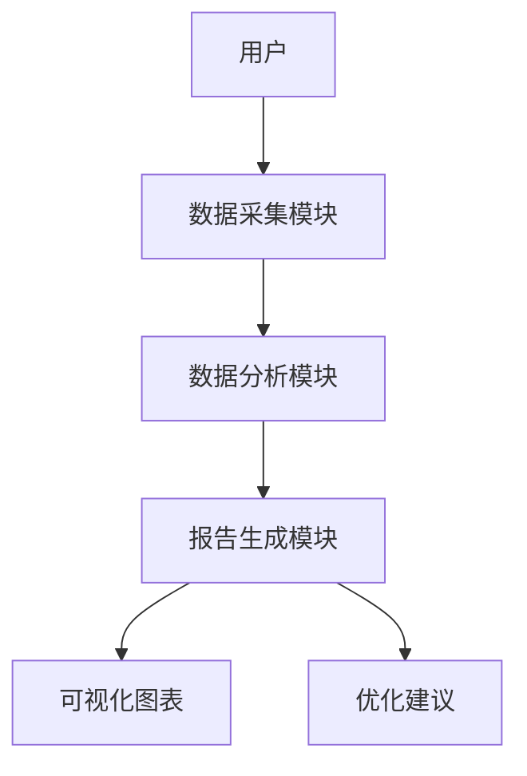

                 


# 彼得林奇对公司财务灵活性的评估

> 关键词：彼得林奇，财务灵活性，财务分析，现金流，资本结构，风险管理

> 摘要：本文详细探讨了彼得·林奇对企业财务灵活性的评估方法，从财务分析的传统局限性出发，结合现代财务分析的核心模型、算法实现和系统架构设计，全面解析了财务灵活性评估的理论与实践。文章结合实际案例分析，深入探讨了如何通过现金流预测模型、资本结构优化和动态风险管理来提升企业的财务灵活性，为企业投资决策提供有力支持。

---

## 第一部分: 财务灵活性评估的背景与基础

### 第1章: 财务灵活性评估的背景与重要性

#### 1.1 财务灵活性的核心概念

- **1.1.1 财务灵活性的定义与内涵**
  - 财务灵活性是指企业在面对市场变化、经济波动或其他不确定因素时，能够灵活调整其财务结构、优化资本配置、管理风险并实现稳健发展的能力。
  - 它不仅关注企业的财务健康状况，还强调企业在复杂环境下的适应性和应变能力。

- **1.1.2 财务灵活性的重要性**
  - 财务灵活性是企业抵御风险、抓住机遇的关键能力。
  - 在投资决策中，财务灵活性决定了企业能否在市场波动中保持稳健增长。

- **1.1.3 财务灵活性与企业价值的关系**
  - 财务灵活性是企业价值的重要组成部分，直接影响企业的市场竞争力和长期发展潜力。

#### 1.2 彼得·林奇的投资理念

- **1.2.1 彼得·林奇的投资风格概述**
  - 彼得·林奇以价值投资和基本面分析著称，注重对企业财务状况的深入研究。
  - 他强调通过分析财务报表和现金流状况来评估企业的内在价值和成长潜力。

- **1.2.2 彼得·林奇对财务报表的关注点**
  - 关注企业的盈利能力、现金流状况、资产负债结构和资本回报率。
  - 强调通过财务报表分析发现企业的竞争优势和潜在风险。

- **1.2.3 彼得·林奇的财务灵活性评估方法**
  - 通过分析企业的现金流、资本结构和债务管理能力，评估企业的财务灵活性。
  - 强调企业在不同市场环境下的应变能力。

---

### 第2章: 传统财务分析的局限性

#### 2.1 传统财务分析方法的局限性

- **2.1.1 财务报表分析的局限性**
  - 财务报表反映的是历史数据，无法完全预测未来。
  - 传统财务分析过于依赖假设条件，忽视了市场的动态变化。

- **2.1.2 假设条件的局限性**
  - 传统财务分析通常基于固定的假设，如稳定增长率和固定资本成本，忽视了市场的不确定性。
  - 这种假设在实际操作中可能导致分析结果与实际情况不符。

- **2.1.3 时间维度的局限性**
  - 传统财务分析多基于静态数据，忽视了时间维度对企业财务状况的影响。
  - 忽视了企业在不同时间点上的财务灵活性变化。

#### 2.2 现代财务分析方法的创新

- **2.2.1 现金流分析的重要性**
  - 现金流是企业财务健康的核心指标，反映了企业的盈利能力和偿债能力。
  - 现金流分析能够更准确地评估企业的财务灵活性。

- **2.2.2 动态评估方法的引入**
  - 引入动态模型，考虑市场的变化和企业的应变能力。
  - 通过动态评估方法，可以更全面地分析企业的财务状况。

- **2.2.3 风险管理与财务灵活性的关系**
  - 风险管理是财务灵活性的重要组成部分，能够帮助企业更好地应对市场波动。
  - 通过有效的风险管理，企业可以提高财务灵活性，降低财务风险。

---

## 第二部分: 财务灵活性评估的核心模型与方法

### 第3章: 财务灵活性评估的核心模型

#### 3.1 财务灵活性评估模型的构建

- **3.1.1 模型构建的基本思路**
  - 以现金流为核心，结合企业的资本结构和偿债能力，构建财务灵活性评估模型。
  - 考虑企业的经营状况、市场环境和管理策略，确保模型的全面性和准确性。

- **3.1.2 模型的核心假设**
  - 企业现金流的变化与市场环境和经营策略密切相关。
  - 企业的资本结构和偿债能力是财务灵活性的重要影响因素。

- **3.1.3 模型的输入变量与输出变量**
  - **输入变量**：企业的现金流、资本结构、债务状况、市场环境等。
  - **输出变量**：企业的财务灵活性评分、风险等级和财务健康状况。

#### 3.2 财务灵活性评估模型的数学表达

- **现金流预测模型**
  - 使用时间序列分析模型（如ARIMA）对企业的现金流进行预测。
  - 公式：$CF_{t} = \alpha \cdot CF_{t-1} + \beta \cdot CF_{t-2} + \epsilon_{t}$

- **资本结构优化模型**
  - 使用加权平均资本成本（WACC）模型优化企业的资本结构。
  - 公式：$WACC = \left( \frac{D}{D+E} \right) \cdot r_d \cdot (1 - t) + \left( \frac{E}{D+E} \right) \cdot r_e$

---

### 第4章: 财务灵活性评估的算法实现

#### 4.1 算法原理

- **现金流预测算法**
  - 使用机器学习算法（如随机森林）对企业的现金流进行预测。
  - 输入：企业的历史财务数据、市场数据。
  - 输出：预测的现金流和预测结果的置信区间。

- **资本结构优化算法**
  - 使用遗传算法优化企业的资本结构，以最小化加权平均资本成本。
  - 输入：企业的财务数据、市场数据。
  - 输出：优化后的资本结构和资本成本。

#### 4.2 算法实现的代码示例

```python
import pandas as pd
from sklearn.ensemble import RandomForestRegressor
from sklearn.metrics import mean_absolute_error

# 加载数据
data = pd.read_csv('financial_data.csv')

# 划分特征和目标变量
X = data.drop('cash_flow', axis=1)
y = data['cash_flow']

# 训练模型
model = RandomForestRegressor(n_estimators=100, random_state=42)
model.fit(X, y)

# 预测结果
y_pred = model.predict(X)

# 评估模型
mae = mean_absolute_error(y, y_pred)
print(f'均绝对误差: {mae}')
```

---

### 第5章: 财务灵活性评估的系统架构设计

#### 5.1 系统功能设计

- **数据采集模块**
  - 负责收集企业的财务数据和市场数据。
  - 输入：企业的财务报表、市场数据。
  - 输出：标准化的财务数据集。

- **数据分析模块**
  - 负责对企业的财务数据进行分析，生成财务灵活性评估报告。
  - 输入：标准化的财务数据集。
  - 输出：财务灵活性评分、风险等级和优化建议。

- **报告生成模块**
  - 负责生成财务灵活性评估报告，提供可视化结果和优化建议。
  - 输入：财务灵活性评估结果。
  - 输出：PDF报告、可视化图表。

#### 5.2 系统架构设计



---

## 第三部分: 财务灵活性评估的实践与总结

### 第6章: 项目实战与案例分析

#### 6.1 项目实战

- **环境安装**
  - 安装Python和相关库（如Pandas、Scikit-learn、Mermaid）。
  - 安装命令：`pip install pandas scikit-learn mermaid`

- **核心代码实现**
  - 使用随机森林算法进行现金流预测。
  - 代码示例：
    ```python
    import pandas as pd
    from sklearn.ensemble import RandomForestRegressor
    from sklearn.model_selection import train_test_split

    # 加载数据
    data = pd.read_csv('financial_data.csv')

    # 划分训练集和测试集
    X_train, X_test, y_train, y_test = train_test_split(X, y, test_size=0.2, random_state=42)

    # 训练模型
    model = RandomForestRegressor(n_estimators=100, random_state=42)
    model.fit(X_train, y_train)

    # 预测结果
    y_pred = model.predict(X_test)

    # 评估模型
    mae = mean_absolute_error(y_test, y_pred)
    print(f'均绝对误差: {mae}')
    ```

- **案例分析**
  - 以某制造企业为例，分析其财务灵活性。
  - 通过现金流预测和资本结构优化，提出优化建议。

---

### 第7章: 最佳实践与总结

#### 7.1 最佳实践

- **财务灵活性评估的核心要素**
  - 现金流预测、资本结构优化、风险管理。

- **系统设计的注意事项**
  - 确保系统的可扩展性和可维护性。
  - 定期更新模型和数据，确保分析结果的准确性。

#### 7.2 小结

- 本文详细探讨了彼得·林奇对企业财务灵活性的评估方法，结合现代财务分析的核心模型、算法实现和系统架构设计，全面解析了财务灵活性评估的理论与实践。
- 通过实际案例分析，深入探讨了如何通过现金流预测模型、资本结构优化和动态风险管理来提升企业的财务灵活性。

#### 7.3 注意事项

- 财务灵活性评估需要结合企业的实际情况，避免过于依赖模型。
- 定期更新财务数据和市场数据，确保分析结果的准确性。

#### 7.4 拓展阅读

- 推荐阅读彼得·林奇的《投资最重要的事》和《彼得·林奇的投资备忘录》。

---

## 作者：AI天才研究院/AI Genius Institute & 禅与计算机程序设计艺术 /Zen And The Art of Computer Programming

