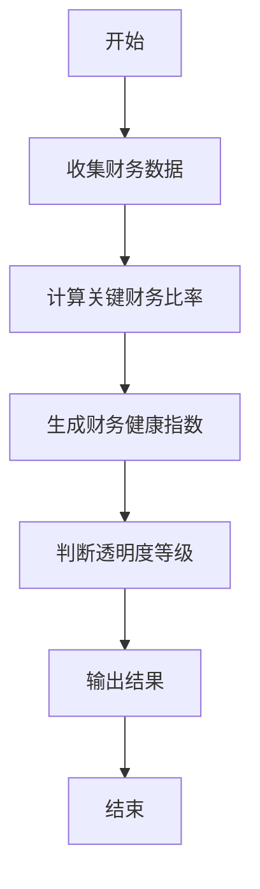
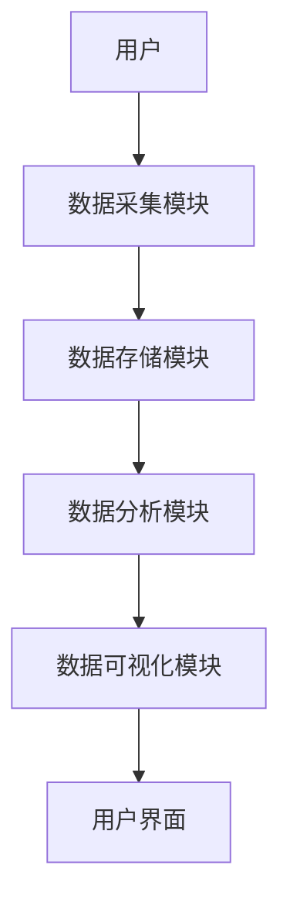

                 


# 彼得林奇对公司财务透明度的要求

## 关键词：财务透明度、彼得林奇、投资策略、财务报表分析、风险管理、公司治理

## 摘要：  
彼得·林奇作为投资领域的权威，强调财务透明度是评估公司投资价值的关键因素。本文深入分析财务透明度的核心概念、评估方法、系统设计及实战案例，帮助投资者掌握如何通过财务数据和透明度判断公司前景，做出明智的投资决策。

---

## 目录大纲

---

# 第一部分: 财务透明度的背景与重要性

## 第1章: 财务透明度的定义与重要性

### 1.1 财务透明度的定义  
- 1.1.1 财务透明度的核心概念  
- 1.1.2 财务透明度在投资中的作用  
- 1.1.3 彼得林奇对财务透明度的关注  

### 1.2 财务透明度的重要性  
- 1.2.1 企业财务健康评估  
- 1.2.2 投资者信心的建立  
- 1.2.3 避免财务欺诈的关键作用  

### 1.3 财务透明度的边界与外延  
- 1.3.1 财务透明度的范围  
- 1.3.2 与企业治理的关系  
- 1.3.3 与其他财务概念的区分  

### 1.4 财务透明度的核心要素  
- 1.4.1 财务报表的完整性  
- 1.4.2 信息披露的及时性  
- 1.4.3 管理层的诚信度  

### 1.5 本章小结  

---

# 第二部分: 财务透明度的核心概念与联系

## 第2章: 财务透明度的核心要素

### 2.1 财务报表的分析  
- 2.1.1 资产负债表的核心要素  
- 2.1.2 利润表的关键指标  
- 2.1.3 现金流量表的重要性  

### 2.2 管理层的诚信与责任  
- 2.2.1 管理层决策对财务透明度的影响  
- 2.2.2 诚信管理的重要性  
- 2.2.3 管理层与投资者的关系  

### 2.3 审计与财务透明度  
- 2.3.1 审计的基本概念  
- 2.3.2 审计在财务透明度中的作用  
- 2.3.3 审计流程与结果的解读  

### 2.4 财务透明度的衡量指标  
- 2.4.1 财务比率分析  
- 2.4.2 财务预警信号  
- 2.4.3 财务健康指数  

### 2.5 核心概念原理  
- 2.5.1 财务透明度的系统性分析  
- 2.5.2 财务报表的结构化分析  
- 2.5.3 管理层行为对财务透明度的影响  

### 2.6 概念属性特征对比表格  
- 2.6.1 财务透明度与其他财务概念的对比  
- 2.6.2 不同行业财务透明度的差异  

### 2.7 ER实体关系图架构  
```mermaid
erd
    股东
    管理层
    财务报表
    审计机构
    投资者
    债权人
    业务部门
    股票市场
    交易
    关系：股东拥有公司，管理层管理公司，财务报表反映公司财务状况，审计机构验证财务报表，投资者基于财务报表做出决策，债权人评估公司信用风险，业务部门影响财务数据，股票市场反映公司价值。
```

---

# 第三部分: 财务透明度的评估方法

## 第3章: 财务透明度的评估方法

### 3.1 财务报表分析方法  
- 3.1.1 资产负债表分析  
- 3.1.2 利润表分析  
- 3.1.3 现金流量表分析  

### 3.2 财务数据的可视化分析  
- 3.2.1 财务数据的图表化展示  
- 3.2.2 财务趋势分析  
- 3.2.3 财务比率的动态变化  

### 3.3 财务透明度的数学模型  
- 3.3.1 财务健康指数模型  
- 3.3.2 财务预警模型  
- 3.3.3 投资价值评估模型  

### 3.4 算法流程图  


### 3.5 Python实现代码  
```python
import pandas as pd

def calculate_finance_health_index(finance_data):
    # 计算关键财务比率
    roe = finance_data['净利润'] / finance_data['股东权益']
    debt_ratio = finance_data['负债总额'] / finance_data['资产总额']
    growth_rate = (finance_data['净利润'] - finance_data['去年同期净利润']) / finance_data['去年同期净利润']
    
    # 生成财务健康指数
    health_index = (roe * 0.4) + (debt_ratio * 0.3) + (growth_rate * 0.3)
    return health_index

# 示例数据
data = {
    '净利润': [100, 120, 150],
    '股东权益': [500, 600, 700],
    '负债总额': [300, 350, 400],
    '资产总额': [800, 900, 1000],
    '去年同期净利润': [80, 90, 100]
}

finance_data = pd.DataFrame(data)
health_index = calculate_finance_health_index(finance_data)
print("财务健康指数:", health_index)
```

### 3.6 本章小结  

---

# 第四部分: 系统分析与架构设计

## 第4章: 财务透明度评估系统的设计与实现

### 4.1 系统功能设计  
- 4.1.1 数据采集模块  
- 4.1.2 数据分析模块  
- 4.1.3 可视化展示模块  

### 4.2 系统架构设计  


### 4.3 系统接口设计  
- 4.3.1 数据接口  
- 4.3.2 分析接口  
- 4.3.3 可视化接口  

### 4.4 系统交互设计  
```mermaid
sequenceDiagram
    actor 用户
    participant 数据采集模块
    participant 数据分析模块
    participant 数据可视化模块
    用户 -> 数据采集模块: 提供财务数据
    数据采集模块 -> 数据分析模块: 分析数据
    数据分析模块 -> 数据可视化模块: 生成报告
    用户 <- 数据可视化模块: 显示结果
```

### 4.5 本章小结  

---

# 第五部分: 项目实战

## 第5章: 财务透明度评估的项目实战

### 5.1 项目背景  
- 5.1.1 项目目标  
- 5.1.2 项目范围  

### 5.2 数据准备  
- 5.2.1 数据收集  
- 5.2.2 数据清洗  

### 5.3 数据分析与建模  
- 5.3.1 模型选择  
- 5.3.2 模型训练  

### 5.4 结果展示  
- 5.4.1 分析报告  
- 5.4.2 可视化展示  

### 5.5 本章小结  

---

# 第六部分: 总结与最佳实践

## 第6章: 总结与最佳实践

### 6.1 总结  
- 6.1.1 财务透明度的重要性  
- 6.1.2 彼得林奇的启示  

### 6.2 投资策略建议  
- 6.2.1 选择透明度高的公司  
- 6.2.2 定期跟踪财务数据  

### 6.3 风险提示  
- 6.3.1 财务造假的风险  
- 6.3.2 市场波动的影响  

### 6.4 案例分析  
- 6.4.1 成功案例  
- 6.4.2 失败案例  

### 6.5 本章小结  

---

## 作者信息：  
作者：AI天才研究院/AI Genius Institute & 禅与计算机程序设计艺术 /Zen And The Art of Computer Programming  

---

**扩展阅读：**  
- 彼得·林奇的其他著作  
- 财务透明度相关的学术论文  
- 相关投资策略和技术博客

