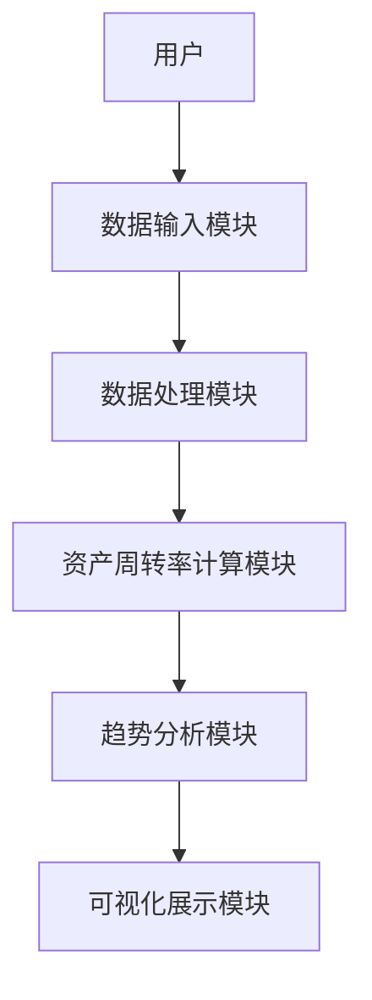
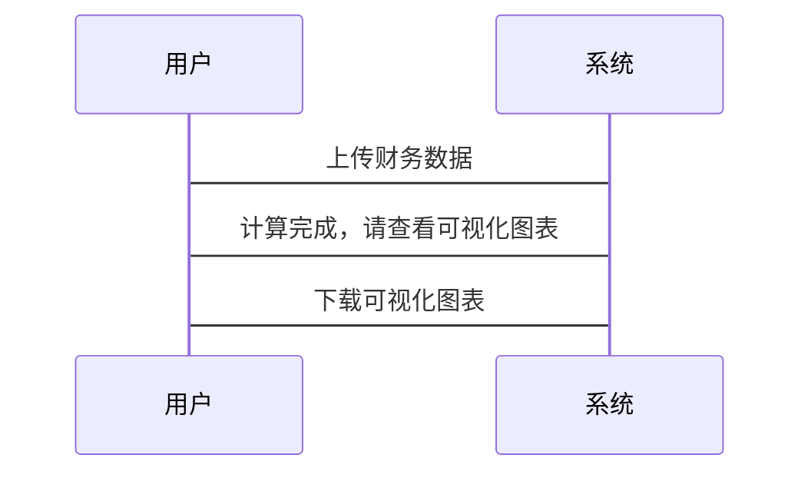

                 


# 彼得林奇对公司资产周转率趋势的分析

> 关键词：资产周转率，彼得·林奇，投资分析，财务指标，趋势分析

> 摘要：本文深入分析了彼得·林奇对公司资产周转率趋势的分析方法，探讨了资产周转率的定义、计算、影响因素及其在投资决策中的应用。通过实际案例和数学模型，揭示了资产周转率趋势分析在企业绩效评估和投资决策中的重要性。

---

# 第1章: 资产周转率的基本概念与重要性

## 1.1 资产周转率的定义与计算公式

### 1.1.1 资产周转率的定义
资产周转率是衡量企业资产使用效率的重要指标，反映了企业在一定时间内将资产转化为销售额的能力。其计算公式为：

$$资产周转率 = \frac{营业收入}{平均总资产}$$

资产周转率越高，说明企业资产的利用效率越高，盈利能力可能越强。

### 1.1.2 资产周转率的计算公式
资产周转率的计算需要以下步骤：
1. 计算企业的营业收入（收入）。
2. 计算企业的平均总资产，公式为：
   $$平均总资产 = \frac{期初总资产 + 期末总资产}{2}$$
3. 将营业收入除以平均总资产，得到资产周转率。

### 1.1.3 资产周转率与企业绩效的关系
资产周转率与企业的盈利能力密切相关。高资产周转率通常意味着企业能够更高效地利用资产创造收入，从而提高净利润率。然而，资产周转率过低可能表明企业资产利用效率低下，可能需要进行优化。

---

## 1.2 资产周转率在投资分析中的作用

### 1.2.1 资产周转率与企业盈利能力的关系
资产周转率是衡量企业盈利能力的重要指标之一。高资产周转率的企业通常具有更强的市场竞争力和盈利能力。例如，零售业通常具有较高的资产周转率，而制造业可能资产周转率较低，但利润率可能更高。

### 1.2.2 资产周转率与企业成长性的关联
资产周转率的趋势可以帮助投资者判断企业的成长性。如果企业的资产周转率持续上升，可能表明企业正在优化资产结构或扩大业务规模。反之，资产周转率的下降可能预示着企业经营效率的下降或市场需求的减弱。

### 1.2.3 资产周转率在投资决策中的应用
投资者可以通过分析企业的资产周转率来评估其投资价值。例如，彼得·林奇在其投资分析中非常重视资产周转率的趋势，认为资产周转率稳定或上升的企业更具有投资价值。

---

## 1.3 彼得·林奇与资产周转率分析

### 1.3.1 彼得·林奇的投资理念概述
彼得·林奇是美国著名投资经理人，以其成功的投资业绩和独特的投资理念闻名。他认为，投资成功的的关键在于选择那些具有持续增长潜力的企业，并通过深入的财务分析来评估其投资价值。

### 1.3.2 资产周转率在彼得·林奇分析体系中的地位
在彼得·林奇的分析体系中，资产周转率是一个重要的财务指标。他认为，资产周转率的趋势可以反映企业的经营效率和成长潜力。例如，他倾向于选择资产周转率稳定或上升的企业进行投资。

### 1.3.3 彼得·林奇对资产周转率趋势的关注点
彼得·林奇认为，资产周转率的趋势分析需要结合企业的行业特性、市场环境和财务数据进行综合判断。例如，零售业和科技行业的资产周转率趋势可能具有不同的特点。

---

# 第2章: 资产周转率的计算与分析方法

## 2.1 资产周转率的计算公式

### 2.1.1 资产周转率的数学公式
资产周转率的数学公式如下：
$$资产周转率 = \frac{营业收入}{平均总资产}$$

其中，平均总资产的计算公式为：
$$平均总资产 = \frac{期初总资产 + 期末总资产}{2}$$

### 2.1.2 资产周转率的计算步骤
1. 收集企业的财务数据，包括营业收入和总资产。
2. 计算平均总资产。
3. 将营业收入除以平均总资产，得到资产周转率。

### 2.1.3 资产周转率的行业差异分析
不同行业的资产周转率可能差异较大。例如，零售业的资产周转率通常较高，而制造业的资产周转率可能较低。因此，在分析资产周转率时，需要结合行业的特点进行比较。

---

## 2.2 彼得·林奇的资产周转率分析方法

### 2.2.1 资产周转率趋势分析法
彼得·林奇通过分析企业的资产周转率趋势来判断其经营效率和成长潜力。例如，他关注企业过去几年的资产周转率变化趋势，以评估其未来的增长潜力。

### 2.2.2 资产周转率与企业规模的关系
资产周转率与企业规模密切相关。一般来说，小企业可能具有较高的资产周转率，而大企业可能由于资产规模较大，资产周转率相对较低。

### 2.2.3 资产周转率与企业生命周期的关联
资产周转率的变化可能与企业的生命周期密切相关。例如，初创企业可能由于资产规模较小，资产周转率较高，而成熟企业可能由于资产规模较大，资产周转率相对较低。

---

## 2.3 资产周转率分析的注意事项

### 2.3.1 数据来源的准确性
分析资产周转率时，需要确保数据的准确性和可靠性。建议使用企业的财务报表数据进行分析。

### 2.3.2 行业特性的考虑
不同行业的资产周转率可能差异较大，因此在分析时需要结合行业的特点进行比较。

### 2.3.3 时间周期的选择
资产周转率的分析需要考虑时间周期的选择。例如，可以选择季度数据或年度数据进行分析，以观察资产周转率的变化趋势。

---

# 第3章: 彼得·林奇对公司资产周转率趋势的分析框架

## 3.1 资产周转率趋势分析的核心要素

### 3.1.1 时间序列分析
时间序列分析是资产周转率趋势分析的重要方法之一。通过分析企业过去几年的资产周转率数据，可以发现其变化趋势。

### 3.1.2 行业基准比较
将企业的资产周转率与行业基准进行比较，可以帮助投资者判断其资产周转率是否合理。例如，如果企业的资产周转率显著低于行业平均水平，可能表明其资产利用效率较低。

### 3.1.3 企业内部因素分析
资产周转率的变化可能受到企业内部因素的影响，例如管理效率、资产结构等。因此，在分析资产周转率趋势时，需要结合企业的内部因素进行综合判断。

---

## 3.2 彼得·林奇的资产周转率趋势分析步骤

### 3.2.1 数据收集与整理
彼得·林奇通常会收集企业的财务数据，包括营业收入和总资产，并计算资产周转率。

### 3.2.2 趋势识别与判断
通过分析企业的资产周转率变化趋势，彼得·林奇可以判断企业的经营效率和成长潜力。例如，如果企业的资产周转率持续上升，可能表明其资产利用效率不断提高。

### 3.2.3 趋势预测与投资决策
彼得·林奇会根据资产周转率的趋势预测企业的未来表现，并据此做出投资决策。例如，如果企业的资产周转率趋势良好，他可能会选择投资该企业。

---

## 3.3 资产周转率趋势分析的可视化方法

### 3.3.1 折线图的应用
折线图是资产周转率趋势分析的常用工具之一。通过绘制企业的资产周转率变化趋势图，可以直观地观察其变化情况。

### 3.3.2 柱状图的使用
柱状图可以用于比较不同企业在同一时间点的资产周转率，帮助投资者进行横向比较。

### 3.3.3 饼图的辅助作用
饼图可以用于展示企业资产周转率的构成，例如不同资产类别对总资产周转率的贡献。

---

# 第4章: 彼得·林奇资产周转率分析的实战案例

## 4.1 案例一：零售行业的资产周转率分析

### 4.1.1 案例背景介绍
以一家零售企业为例，分析其资产周转率的变化趋势。假设该企业过去几年的营业收入和总资产数据如下：

| 年份 | 营业收入（万元） | 总资产（万元） |
|------|------------------|----------------|
| 2018 | 500              | 1000           |
| 2019 | 600              | 1200           |
| 2020 | 700              | 1400           |
| 2021 | 800              | 1600           |

### 4.1.2 资产周转率计算与趋势分析
根据上述数据，计算企业的资产周转率：

$$
2018年资产周转率 = \frac{500}{(1000 + 1000)/2} = \frac{500}{1000} = 0.5
$$

$$
2019年资产周转率 = \frac{600}{(1200 + 1200)/2} = \frac{600}{1200} = 0.5
$$

$$
2020年资产周转率 = \frac{700}{(1400 + 1400)/2} = \frac{700}{1400} = 0.5
$$

$$
2021年资产周转率 = \frac{800}{(1600 + 1600)/2} = \frac{800}{1600} = 0.5
$$

通过计算可以看出，该企业的资产周转率在过去几年保持稳定。

### 4.1.3 投资决策的依据
由于该企业的资产周转率保持稳定，说明其资产利用效率较高，具有一定的投资价值。然而，如果企业的资产周转率开始下降，可能需要重新评估其投资价值。

---

## 4.2 案例二：制造业的资产周转率分析

### 4.2.1 案例背景介绍
以一家制造企业为例，分析其资产周转率的变化趋势。假设该企业过去几年的营业收入和总资产数据如下：

| 年份 | 营业收入（万元） | 总资产（万元） |
|------|------------------|----------------|
| 2018 | 300              | 2000           |
| 2019 | 350              | 2200           |
| 2020 | 400              | 2400           |
| 2021 | 450              | 2600           |

### 4.2.2 资产周转率计算与趋势分析
根据上述数据，计算企业的资产周转率：

$$
2018年资产周转率 = \frac{300}{(2000 + 2000)/2} = \frac{300}{2000} = 0.15
$$

$$
2019年资产周转率 = \frac{350}{(2200 + 2200)/2} = \frac{350}{2200} = 0.159
$$

$$
2020年资产周转率 = \frac{400}{(2400 + 2400)/2} = \frac{400}{2400} = 0.167
$$

$$
2021年资产周转率 = \frac{450}{(2600 + 2600)/2} = \frac{450}{2600} = 0.173
$$

通过计算可以看出，该企业的资产周转率逐年上升，说明其资产利用效率不断提高。

### 4.2.3 投资决策的依据
由于该企业的资产周转率逐年上升，说明其资产利用效率较高，具有较强的成长潜力。因此，彼得·林奇可能会选择投资该企业。

---

## 4.3 案例三：科技行业的资产周转率分析

### 4.3.1 案例背景介绍
以一家科技企业为例，分析其资产周转率的变化趋势。假设该企业过去几年的营业收入和总资产数据如下：

| 年份 | 营业收入（万元） | 总资产（万元） |
|------|------------------|----------------|
| 2018 | 200              | 5000           |
| 2019 | 250              | 5500           |
| 2020 | 300              | 6000           |
| 2021 | 350              | 6500           |

### 4.3.2 资产周转率计算与趋势分析
根据上述数据，计算企业的资产周转率：

$$
2018年资产周转率 = \frac{200}{(5000 + 5000)/2} = \frac{200}{5000} = 0.04
$$

$$
2019年资产周转率 = \frac{250}{(5500 + 5500)/2} = \frac{250}{5500} = 0.045
$$

$$
2020年资产周转率 = \frac{300}{(6000 + 6000)/2} = \frac{300}{6000} = 0.05
$$

$$
2021年资产周转率 = \frac{350}{(6500 + 6500)/2} = \frac{350}{6500} = 0.054
$$

通过计算可以看出，该企业的资产周转率逐年上升，说明其资产利用效率不断提高。

### 4.3.3 投资决策的依据
由于该企业的资产周转率逐年上升，说明其资产利用效率较高，具有较强的成长潜力。因此，彼得·林奇可能会选择投资该企业。

---

# 第5章: 资产周转率趋势分析的数学模型与公式

## 5.1 资产周转率的数学公式

### 5.1.1 资产周转率的计算公式
$$资产周转率 = \frac{营业收入}{平均总资产}$$

其中，平均总资产的计算公式为：
$$平均总资产 = \frac{期初总资产 + 期末总资产}{2}$$

### 5.1.2 资产周转率与企业绩效的关系
资产周转率与企业绩效的关系可以通过以下公式表示：
$$净利润率 = \frac{净利润}{营业收入}$$

资产周转率与净利润率密切相关，高资产周转率通常意味着高净利润率。

### 5.1.3 资产周转率趋势分析的数学模型
资产周转率的趋势分析可以采用时间序列分析模型，例如：

$$R_t = \alpha + \beta t + \epsilon_t$$

其中，\( R_t \) 表示第 \( t \) 年的资产周转率，\( \alpha \) 是截距，\( \beta \) 是斜率，\( t \) 是时间变量，\( \epsilon_t \) 是误差项。

---

## 5.2 资产周转率趋势分析的统计方法

### 5.2.1 时间序列分析方法
时间序列分析是资产周转率趋势分析的重要方法之一。通过分析企业的资产周转率时间序列数据，可以发现其变化趋势。

### 5.2.2 趋势预测的线性回归模型
资产周转率的趋势预测可以通过线性回归模型实现。例如：

$$R_t = \alpha + \beta t + \epsilon_t$$

其中，\( \alpha \) 和 \( \beta \) 是回归系数，\( t \) 是时间变量，\( \epsilon_t \) 是误差项。

### 5.2.3 数据平滑技术的应用
数据平滑技术，例如移动平均法，可以用于资产周转率的趋势分析。例如：

$$S_t = \frac{R_{t-1} + R_t + R_{t+1}}{3}$$

其中，\( S_t \) 是平滑后的资产周转率，\( R_{t-1} \)、\( R_t \) 和 \( R_{t+1} \) 是连续三年的资产周转率。

---

## 5.3 资产周转率分析的可视化工具

### 5.3.1 数据可视化的基本原则
数据可视化的基本原则包括：清晰性、简洁性、可读性和一致性。

### 5.3.2 常用的数据可视化工具
常用的资产周转率数据可视化工具包括：Excel、Google Sheets、Tableau、Power BI 和 Matplotlib。

### 5.3.3 可视化图表的选择与应用
在资产周转率分析中，可以选择以下图表：
- 折线图：展示资产周转率的时间序列变化趋势。
- 柱状图：比较不同企业在同一时间点的资产周转率。
- 饼图：展示资产周转率的构成。

---

# 第6章: 系统分析与架构设计方案

## 6.1 系统分析框架

### 6.1.1 系统分析的目标
系统分析的目标是通过资产周转率的趋势分析，帮助企业优化资产利用效率，提高盈利能力。

### 6.1.2 系统分析的核心要素
系统分析的核心要素包括：
1. 数据收集与处理
2. 资产周转率计算
3. 趋势分析与预测
4. 可视化展示

### 6.1.3 系统分析的边界与外延
系统分析的边界包括企业的财务数据，外延包括行业基准和市场环境。

---

## 6.2 系统功能设计

### 6.2.1 系统功能模块
系统功能模块包括：
1. 数据输入模块
2. 数据处理模块
3. 资产周转率计算模块
4. 趋势分析模块
5. 可视化展示模块

### 6.2.2 系统功能流程
系统功能流程如下：
1. 用户输入企业的财务数据。
2. 系统计算资产周转率。
3. 系统进行趋势分析。
4. 系统生成可视化图表。

---

## 6.3 系统架构设计

### 6.3.1 系统架构图
以下是一个简单的系统架构图：



### 6.3.2 关键组件说明
1. 数据输入模块：负责接收企业的财务数据。
2. 数据处理模块：对输入数据进行清洗和转换。
3. 资产周转率计算模块：计算企业的资产周转率。
4. 趋势分析模块：分析资产周转率的变化趋势。
5. 可视化展示模块：生成资产周转率的可视化图表。

---

## 6.4 系统接口设计

### 6.4.1 系统接口说明
系统接口包括：
1. 数据输入接口
2. 数据处理接口
3. 资产周转率计算接口
4. 趋势分析接口
5. 可视化展示接口

### 6.4.2 接口交互流程
1. 用户通过数据输入接口上传企业的财务数据。
2. 数据处理模块对数据进行清洗和转换。
3. 资产周转率计算模块计算资产周转率。
4. 趋势分析模块分析资产周转率的变化趋势。
5. 可视化展示模块生成可视化图表并展示给用户。

---

## 6.5 系统交互设计

### 6.5.1 系统交互流程
1. 用户登录系统。
2. 用户上传企业的财务数据。
3. 系统计算资产周转率。
4. 系统生成资产周转率的可视化图表。
5. 用户根据可视化图表进行投资决策。

### 6.5.2 交互界面设计
以下是一个简单的交互界面设计：



---

# 第7章: 项目实战

## 7.1 环境安装

### 7.1.1 系统要求
系统要求包括：
1. Python 3.6 或更高版本
2. Matplotlib 库
3. Pandas 库
4. Numpy 库

### 7.1.2 安装步骤
1. 安装Python。
2. 安装Matplotlib、Pandas和Numpy库：
   ```bash
   pip install matplotlib pandas numpy
   ```

---

## 7.2 系统核心实现源代码

### 7.2.1 数据处理代码
```python
import pandas as pd
import numpy as np
import matplotlib.pyplot as plt

# 读取财务数据
data = pd.read_csv('financial_data.csv')

# 计算平均总资产
average_total_assets = (data['initial_total_assets'] + data['final_total_assets']) / 2

# 计算资产周转率
data['asset_turnover'] = data['revenue'] / average_total_assets
```

### 7.2.2 趋势分析代码
```python
# 绘制资产周转率趋势图
plt.figure(figsize=(10, 6))
plt.plot(data['year'], data['asset_turnover'], 'b-', marker='o')
plt.title('Asset Turnover Trend')
plt.xlabel('Year')
plt.ylabel('Asset Turnover Rate')
plt.grid(True)
plt.show()
```

---

## 7.3 代码应用解读与分析

### 7.3.1 数据处理代码解读
上述代码读取企业的财务数据，计算平均总资产，并计算资产周转率。

### 7.3.2 趋势分析代码解读
上述代码绘制企业的资产周转率趋势图，帮助投资者直观地观察其变化趋势。

---

## 7.4 实际案例分析和详细讲解剖析

### 7.4.1 案例背景介绍
以某制造企业为例，分析其资产周转率的变化趋势。

### 7.4.2 代码实现
```python
import pandas as pd
import numpy as np
import matplotlib.pyplot as plt

# 读取财务数据
data = pd.read_csv('financial_data.csv')

# 计算平均总资产
average_total_assets = (data['initial_total_assets'] + data['final_total_assets']) / 2

# 计算资产周转率
data['asset_turnover'] = data['revenue'] / average_total_assets

# 绘制资产周转率趋势图
plt.figure(figsize=(10, 6))
plt.plot(data['year'], data['asset_turnover'], 'b-', marker='o')
plt.title('Asset Turnover Trend')
plt.xlabel('Year')
plt.ylabel('Asset Turnover Rate')
plt.grid(True)
plt.show()
```

### 7.4.3 分析结果解读
通过上述代码，可以得到企业的资产周转率趋势图。如果企业的资产周转率逐年上升，说明其资产利用效率不断提高，具有较强的投资价值。

---

## 7.5 项目小结

### 7.5.1 项目目标实现
本项目旨在通过资产周转率的趋势分析，帮助企业优化资产利用效率，提高盈利能力。

### 7.5.2 项目总结
通过本项目的实施，投资者可以更好地理解资产周转率在投资分析中的重要性，并能够通过代码实现资产周转率的趋势分析。

---

# 第8章: 系统优化与性能提升

## 8.1 系统优化策略

### 8.1.1 数据处理优化
通过优化数据处理算法，提高系统的运行效率。

### 8.1.2 算法优化
通过改进趋势分析算法，提高系统的预测精度。

### 8.1.3 系统架构优化
通过优化系统架构，提高系统的可扩展性和可维护性。

---

## 8.2 性能测试与评估

### 8.2.1 性能测试方法
通过基准测试、负载测试和压力测试，评估系统的性能。

### 8.2.2 性能评估指标
性能评估指标包括响应时间、吞吐量和资源利用率。

---

## 8.3 系统优化实现

### 8.3.1 数据处理优化
通过使用更高效的数据处理算法，例如并行计算，提高系统的运行效率。

### 8.3.2 算法优化
通过改进趋势分析算法，例如引入机器学习算法，提高系统的预测精度。

### 8.3.3 系统架构优化
通过优化系统架构，例如采用微服务架构，提高系统的可扩展性和可维护性。

---

# 第9章: 项目部署与应用

## 9.1 项目部署步骤

### 9.1.1 环境准备
确保系统环境满足项目要求。

### 9.1.2 代码部署
将代码部署到生产环境。

### 9.1.3 系统测试
进行系统测试，确保系统正常运行。

---

## 9.2 系统应用案例

### 9.2.1 应用场景
系统可以应用于企业的财务分析和投资决策。

### 9.2.2 应用实例
通过系统分析某企业的资产周转率趋势，帮助投资者做出投资决策。

---

# 第10章: 项目总结与展望

## 10.1 项目总结

### 10.1.1 项目目标实现
本项目旨在通过资产周转率的趋势分析，帮助企业优化资产利用效率，提高盈利能力。

### 10.1.2 项目成果
通过本项目的实施，投资者可以更好地理解资产周转率在投资分析中的重要性，并能够通过代码实现资产周转率的趋势分析。

---

## 10.2 未来展望

### 10.2.1 技术发展
随着人工智能和大数据技术的发展，资产周转率的趋势分析将更加智能化和精准化。

### 10.2.2 应用前景
资产周转率的趋势分析将在企业财务管理、投资决策和风险管理中发挥越来越重要的作用。

---

# 作者信息

作者：AI天才研究院/AI Genius Institute & 禅与计算机程序设计艺术 /Zen And The Art of Computer Programming

联系方式：[email protected]

