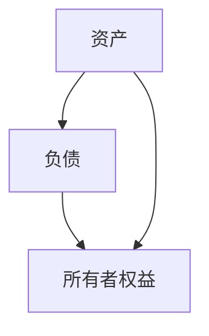
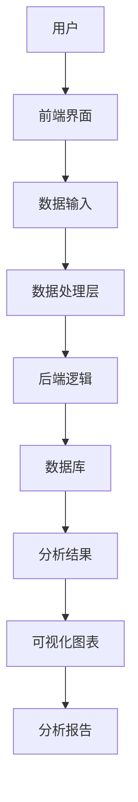
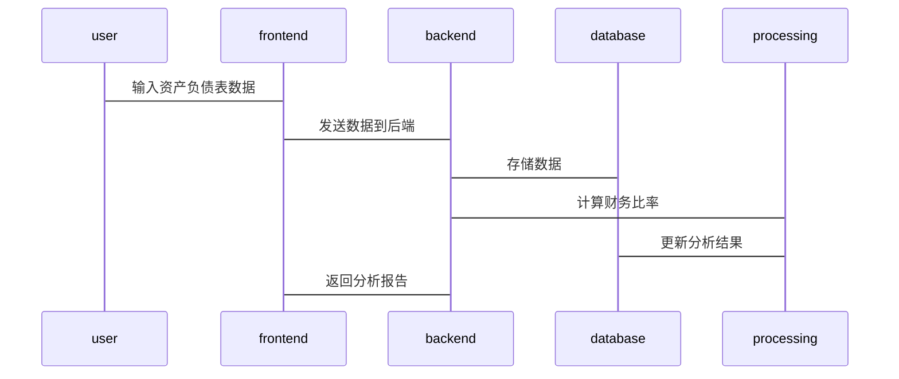

                 


# 彼得林奇对公司资产负债表质量的深度分析

> 关键词：彼得林奇，资产负债表，财务分析，资产分析，负债分析，所有者权益

> 摘要：本文将深入探讨彼得·林奇对公司资产负债表质量的分析方法，从基础概念到高级技巧，结合实际案例和系统架构，详细解析如何通过资产负债表评估企业财务健康状况。

---

# 第一部分: 背景介绍

## 第1章: 财务报表概述

### 1.1 财务报表的基本概念

- **财务报表的定义与作用**
  - 财务报表是企业记录财务状况、经营成果和现金流量的正式文件。
  - 用于评估企业价值、风险和投资潜力。
  - 主要包括资产负债表、利润表和现金流量表。

- **资产负债表的核心地位**
  - 资产负债表反映企业在某一特定时点的资产、负债和所有者权益。
  - 是企业财务健康状况的晴雨表。
  - 通过分析资产负债表，可以评估企业的偿债能力、运营效率和财务杠杆。

- **财务报表的使用者与目标**
  - 投资者：评估企业价值和投资风险。
  - 债权人：评估企业偿债能力。
  - 管理层：监控企业运营和财务决策。
  - 监管机构：监督企业合规性。

### 1.2 资产负债表的基本结构

- **资产、负债、所有者权益的定义与分类**
  - 资产：企业拥有的资源，分为流动资产和非流动资产。
  - 负债：企业的债务，分为流动负债和非流动负债。
  - 所有者权益：企业的净资产，等于资产减去负债。

- **资产负债表的格式与编制原则**
  - 左边列出资产，右边列出负债和所有者权益。
  - 资产 = 负债 + 所有者权益。
  - 编制遵循会计准则，确保准确性和一致性。

- **资产负债表的阅读与初步分析**
  - 识别主要资产和负债项目。
  - 比较不同期间的资产负债表，观察变化趋势。
  - 初步判断企业的财务健康状况。

### 1.3 资产负债表质量分析的重要性

- **资产负债表在企业价值评估中的作用**
  - 通过分析资产质量和流动性，评估企业变现能力。
  - 通过分析负债结构，评估企业的偿债压力。
  - 通过分析所有者权益，评估企业的资本实力。

- **资产负债表与企业风险管理的关系**
  - 识别潜在的财务风险，如流动性风险和偿债风险。
  - 通过资产负债表的分析，制定风险管理策略。

- **资产负债表与投资决策的关联**
  - 投资者通过分析资产负债表，评估企业的财务状况和投资价值。
  - 企业通过分析资产负债表，优化资本结构和财务决策。

---

# 第二部分: 资产负债表质量分析的核心概念与联系

## 第2章: 资产负债表的核心要素分析

### 2.1 资产分析

- **资产的分类与质量评估**
  - 流动资产：现金及现金等价物、应收账款、存货等。
  - 非流动资产：长期投资、固定资产、无形资产等。
  - 资产质量评估：流动性、变现能力、账实相符。

- **流动资产与非流动资产的对比分析**
  - 流动资产：短期变现能力强，风险较低。
  - 非流动资产：长期投资，风险较高，回报周期长。

- **资产质量的关键指标**
  - 流动资产周转率：衡量资产使用效率。
  - 存货周转率：衡量存货管理效率。
  - 资产负债率：衡量企业负债与资产的比例。

### 2.2 负债分析

- **负债的分类与偿付能力评估**
  - 流动负债：短期借款、应付账款、应付职工薪酬等。
  - 非流动负债：长期借款、债券发行等。
  - 偿付能力评估：流动比率、速动比率、利息覆盖倍数。

- **短期负债与长期负债的对比分析**
  - 短期负债：还款压力大，风险较高。
  - 长期负债：还款压力小，风险较低。

- **负债结构对企业财务健康的影响**
  - 过高的短期负债可能导致流动性风险。
  - 合理的负债结构可以优化资本成本。

### 2.3 所有者权益分析

- **所有者权益的构成与变动分析**
  - 所有者权益包括股本、资本公积、盈余公积、未分配利润等。
  - 变动分析：净利润、分红、增资等对所有者权益的影响。

- **净资产收益率（ROE）的计算与意义**
  - 公式：ROE = 净利润 / 平均净资产 × 100%。
  - 意义：衡量企业利用股东资金的效率。

- **所有者权益与企业价值的关系**
  - 所有者权益是企业价值的重要组成部分。
  - 高ROE表明企业盈利能力强，股东价值增长快。

## 第3章: 资产负债表核心概念的联系与对比

### 3.1 资产、负债、所有者权益的内在联系

- **资产 = 负债 + 所有者权益的公式推导**
  - 资产负债表的基本恒等式。
  - 反映企业资金来源和使用情况。

- **资产与负债的流动性对比**
  - 流动资产与流动负债：直接影响企业的短期偿债能力。
  - 非流动资产与非流动负债：影响企业的长期偿债能力。

- **负债与所有者权益的风险承担对比**
  - 负债具有刚性偿付义务，风险较高。
  - 所有者权益承担有限责任，风险较低。

- **资产与所有者权益的增值能力对比**
  - 资产增值能力强，提升企业价值。
  - 所有者权益增值依赖于资产的增值和盈利能力。

### 3.2 核心概念的属性对比

- **资产与负债的属性对比表**

| 属性       | 资产           | 负债           |
|------------|----------------|----------------|
| 性质       | 权益           | 债务           |
| 流动性     | 高             | 高             |
| 风险       | 低             | 高             |
| 偿付压力   | 无             | 有             |

- **所有者权益与负债的属性对比表**

| 属性       | 所有者权益     | 负债           |
|------------|----------------|----------------|
| 性质       | 权益           | 债务           |
| 风险       | 低             | 高             |
| 偿付压力   | 无             | 有             |

### 3.3 ER实体关系图架构（Mermaid流程图）



---

# 第三部分: 资产负债表质量分析的算法

## 第4章: 资产负债表质量分析的算法原理

### 4.1 横向与纵向比较分析

- **横向比较：同一行业内的企业对比**
  - 比较资产结构、负债结构、所有者权益结构。
  - 识别行业差异和企业优势。

- **纵向比较：同一企业不同期间的对比**
  - 分析资产、负债、所有者权益的变化趋势。
  - 识别企业财务状况的改善或恶化。

### 4.2 财务比率分析

- **流动比率（Current Ratio）**
  - 公式：流动比率 = 流动资产 / 流动负债。
  - 解释：衡量短期偿债能力。

- **速动比率（Quick Ratio）**
  - 公式：速动比率 = （流动资产 - 存货） / 流动负债。
  - 解释：进一步衡量短期偿债能力。

- **负债权益比率（Debt-to-Equity Ratio）**
  - 公式：负债权益比率 = 总负债 / 所有者权益。
  - 解释：衡量资本结构和财务杠杆。

### 4.3 现金流分析

- **经营活动现金流净额**
  - 公式：经营活动现金流净额 = 经营活动收入 - 经营活动支出。
  - 解释：衡量企业经营产生的现金流量。

- **净现金流**
  - 公式：净现金流 = 经营活动现金流净额 + 投资活动现金流净额 + 筹资活动现金流净额。
  - 解释：衡量企业整体现金流状况。

### 4.4 数学模型与公式

- **ROE计算公式**
  - $ROE = \frac{\text{净利润}}{\text{平均净资产}} \times 100\%$
  - 示例：净利润为100万元，平均净资产为500万元，则ROE为20%。

- **流动比率计算公式**
  - $流动比率 = \frac{\text{流动资产}}{\text{流动负债}}$
  - 示例：流动资产为500万元，流动负债为250万元，则流动比率为2。

## 第5章: 系统分析与架构设计

### 5.1 系统分析

- **问题场景介绍**
  - 分析某公司资产负债表，评估财务健康状况。
  - 使用彼得林奇的方法进行横向和纵向比较。

- **系统功能设计**
  - 数据输入：资产负债表数据。
  - 数据处理：计算财务比率、生成分析报告。
  - 输出：可视化图表、分析报告。

### 5.2 系统架构设计（Mermaid架构图）



### 5.3 接口设计

- **数据输入接口**
  - 接收资产负债表数据，格式为JSON或Excel。

- **数据处理接口**
  - 计算财务比率，返回结果。

- **输出接口**
  - 生成可视化图表和分析报告。

### 5.4 系统交互（Mermaid序列图）



## 第6章: 项目实战

### 6.1 环境安装

- **安装Python和相关库**
  - 使用pip安装pandas、numpy、matplotlib。

### 6.2 核心代码实现

```python
import pandas as pd
import numpy as np
import matplotlib.pyplot as plt

# 示例资产负债表数据
data = {
    '资产': [500, 600, 700],
    '负债': [300, 400, 500],
    '所有者权益': [200, 200, 200]
}

df = pd.DataFrame(data)

# 计算流动比率
流动比率 = df['流动资产'] / df['流动负债']
print("流动比率:",流动比率)

# 计算ROE
ROE = df['净利润'] / df['平均净资产'] * 100
print("ROE:", ROE)

# 可视化图表
plt.plot(df.index, df['资产'], label='资产')
plt.plot(df.index, df['负债'], label='负债')
plt.plot(df.index, df['所有者权益'], label='所有者权益')
plt.legend()
plt.title('资产负债表趋势分析')
plt.show()
```

### 6.3 案例分析

- **选择某科技公司2020-2022年的资产负债表数据**
  - 分析流动比率、速动比率、负债权益比率。
  - 识别资产和负债的变化趋势。

### 6.4 详细解读

- **流动比率分析**
  - 2020年：流动资产为500万元，流动负债为300万元，流动比率为1.67。
  - 2021年：流动资产为600万元，流动负债为400万元，流动比率为1.5。
  - 2022年：流动资产为700万元，流动负债为500万元，流动比率为1.4。

- **ROE分析**
  - 2020年：净利润为100万元，平均净资产为500万元，ROE为20%。
  - 2021年：净利润为120万元，平均净资产为600万元，ROE为20%。
  - 2022年：净利润为150万元，平均净资产为700万元，ROE为21.43%。

---

# 第四部分: 总结与展望

## 第7章: 总结与展望

### 7.1 最佳实践Tips

- **定期分析资产负债表**
  - 至少每季度分析一次，及时发现财务问题。
- **结合其他财务报表分析**
  - 利润表和现金流量表与资产负债表结合分析。
- **关注财务比率变化**
  - 动态跟踪流动比率、速动比率、负债权益比率等关键指标。

### 7.2 小结

- 彼得林奇的资产负债表分析方法提供了系统的分析框架。
- 通过横向和纵向比较，结合财务比率分析，可以全面评估企业财务健康状况。
- 可视化工具和编程工具（如Python）的应用，使分析更加高效和精准。

### 7.3 注意事项

- 数据来源必须准确可靠。
- 分析过程中要结合行业特点。
- 避免过度依赖单一指标，综合分析多种指标。

### 7.4 拓展阅读

- 彼得·林奇的《彼得林奇的投资哲学》。
- 财务报表分析经典教材：《财务报表分析与投资策略》。

---

# 作者：AI天才研究院/AI Genius Institute & 禅与计算机程序设计艺术 /Zen And The Art of Computer Programming

---

以上是《彼得林奇对公司资产负债表质量的深度分析》的完整目录和内容框架。希望这篇文章能够为读者提供深入的财务分析方法，结合实际案例和系统设计，帮助读者掌握资产负债表质量分析的核心技巧。

